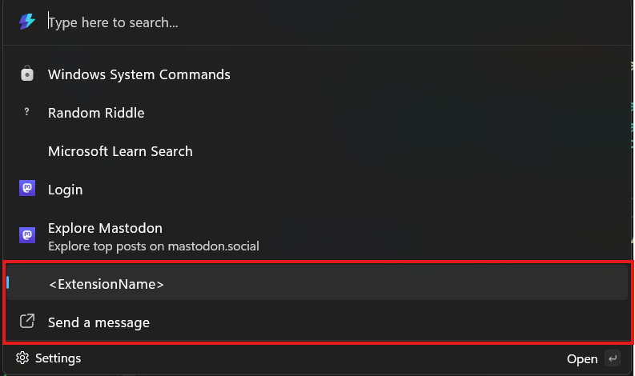

# Adding top-level commands to your extension

**Previous**: [Update a list of commands](update-a-list-of-commands.md).

So far, you've only added commands to a single page within your extension. You can also add more commands directly to the top-level list of commands too.


## Top-level commands

To add commands at the top level of the Command Palette, open the `<ExtensionName>CommandsProvider.cs` file. This is where you define the commands that will appear at the root level of the Command Palette.

Currently, the file contains only one command:

```csharp
public <ExtensionName>CommandsProvider()
{
    DisplayName = "My sample extension";
    Icon = IconHelpers.FromRelativePath("Assets\\StoreLogo.png");
    _commands = [
        new CommandItem(new <ExtensionName>Page()) { Title = DisplayName },
    ];
}

public override ICommandItem[] TopLevelCommands()
{
    return _commands;
}
```

When the extension is created, it builds a list of commands and stores them in the `_commands` field. Every time the extension is asked for its top-level commands, it simply returns this prebuilt list. This approach avoids recreating the command list on each request, which improves performance.

## Add another top level command

1. In Visual Studio, open `<ExtensionName>CommandsProvider.cs`
1. Add another `CommandItem`:

```diff
public <ExtensionName>CommandsProvider()
{
    DisplayName = "My sample extension";
    Icon = IconHelpers.FromRelativePath("Assets\\StoreLogo.png");
    _commands = [
        new CommandItem(new <ExtensionName>Page()) { Title = DisplayName },
+       new CommandItem(new ShowMessageCommand()) { Title = "Send a message" },
    ];
}
```

> [!NOTE]
> The `ShowMessageCommand()` functionality was created prior at [InvokableCommand Command](/windows/powertoys/command-palette/adding-commands#invokableCommand-command)

1. Deploy your extension
1. In Command Palette, `Reload`



Now there is an additional top-level commands to your extension.

## Add top level command dynamically

If you'd like to update the list of top-level commands dynamically, you can do so in the same way as you would update a list page. This can be useful for cases like an extension that might first require the user to log in, before showing certain commands. In that case, you can show the "log in" command at the top level initially. Then, once the user logs in successfully, you can update the list of top-level commands to include the commands that required authentication.

Once you've determined that you need to change the top level list, call [RaiseItemsChanged](./microsoft-commandpalette-extensions-toolkit/commandprovider_raiseitemschanged.md) on your `CommandProvider`. Command Palette will then request the top-level commands via **TopLevelCommands** again, and you can return the updated list.

> [!TIP]
> Create the `CommandItem` objects for the top-level commands before calling `RaiseItemsChanged`. This will ensure that the new commands are available when Command Palette requests the top-level commands. This will ensure that the work being executed in each call to **TopLevelCommands** method to a minimum.

### Next up: [Command Results](command-results.md)

## Related content

- [PowerToys Command Palette utility](overview.md)
- [Extensibility overview](extensibility-overview.md)
- [Extension samples](samples.md)
