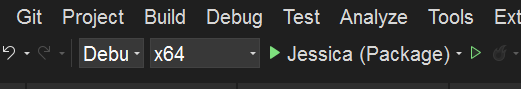
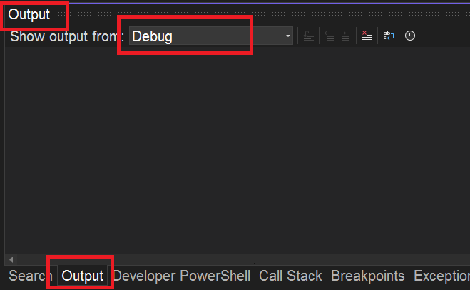
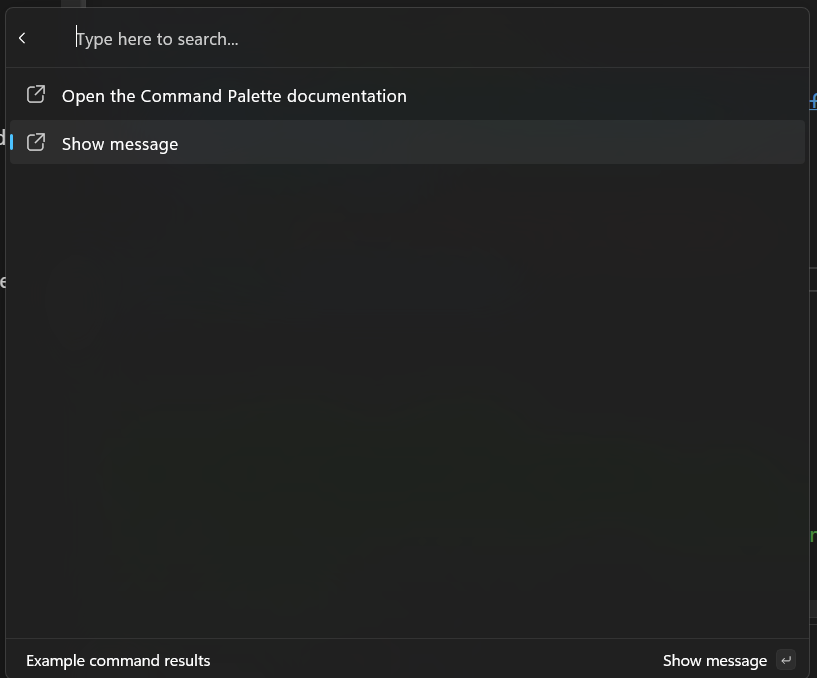
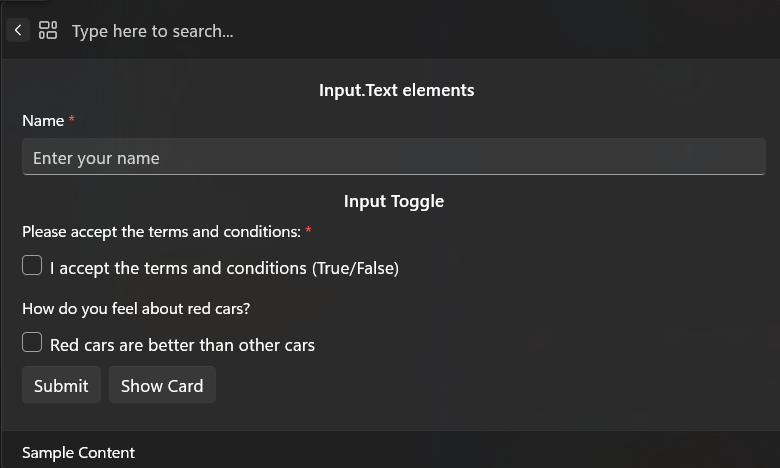

# Adding commands to your extension

**Previous**: [Creating an extension](creating-an-extension.md). We'll be starting with the project created in that article.

Now that you've created your extension, it's time to add commands to it.

## Add commands

We can start by navigating to the `/Pages/<ExtensionName>Page.cs` file. This file is the [ListPage](./microsoft-commandpalette-extensions-toolkit/listpage.md) that will be displayed when the user selects your extension. In there you should see:

```csharp
public <ExtensionName>Page()
{
    Icon = IconHelpers.FromRelativePath("Assets\\StoreLogo.png");
    Title = "My sample extension";
    Name = "Open";
}
public override IListItem[] GetItems()
{
    return [
        new ListItem(new NoOpCommand()) { Title = "TODO: Implement your extension here" }
    ];
}
```

Here you can see that we've set the icon for the page, the title, and the name that's shown at the top-level when you have the command selected. The `GetItems` method is where you'll return the list of commands that you want to show on this page. Right now, it's just returning a single command that does nothing. Let's instead try making that command open _this_ page in the user's default web browser.

1. Update `GetItems` to the following:

```csharp
public override IListItem[] GetItems()
{
    var command = new OpenUrlCommand("https://learn.microsoft.com/windows/powertoys/command-palette/adding-commands");
    return [
        new ListItem(command)
        {
            Title = "Open the Command Palette documentation",
        }
    ];
}
```

To update the extension in the Command Palette you need to:

1. Deploy your extension
1. In the Command Palette, type the "reload" command to refresh the extensions in the palette


> [!NOTE]
> There are several reload options, make sure to select the **Reload Command Palette extensions**

1. Scroll down to your extension and press `Enter`
1. Press `enter` on `Open the Command Palette documentation`
1. You should see that the command opens the Command Palette documentation

The **OpenUrlCommand** is a helper for opening a URL in the user's default web browser.

## Debugging Extension

As your building your extension, you'll most likely want to debug it.

1. Add a debug message to the `GetItems` function.

```diff
    public override IListItem[] GetItems()
    {
        var command = new OpenUrlCommand("https://learn.microsoft.com/windows/powertoys/command-palette/adding-commands");
    
+       Debug.Write("Debug message from GetItems");
    
        return [
            new ListItem(command)
            {
                Title = "Open the Command Palette documentation",
            }
        ];
    }
```

1. Deploy your extension
1. Confirm you're in Debug configuration

<details>
  <summary>Instructions to confirm debug configuration</summary>

1. Look at the toolbar at the top of Visual Studio
1. You’ll see a dropdown that says either `Debug` or `Release` (next to the green "Start" button ▶️)
1. If it says `Release`, click the dropdown and select `Debug`.



</details>

1. Run the app in debug by pressing the green "Start" button ▶️ or press `F5`
1. Ensure the Output window is set to show `Debug` output (Ctrl + Alt + O)



1. In the Command Palette, run `reload`
1. Go to your extension and select `Open the Command Palette documentation`.
1. In Visual Studio's Output window, you should see `Debug message from GetItems`

## InvokableCommand Command

Let's continue building a new command, that shows a **MessageBox**. To do that, we need to create a new class that implements `InvokableCommand`.

1. In Visual Studio, Add a New Class File to your `Pages` directory
    - Keyboard Shortcut: Press Ctrl + Shift + A
    - Or in the Solution Explorer, go to Project > Add New Item...
1. In the Add New Item dialog:
    1. Select Class from the list.
    1. Name your class file: `ShowMessageCommand.cs`
    1. Click Add.
1. Replace the default class code with:

```csharp
using System.Runtime.InteropServices;

namespace <ExtensionName>;

internal sealed partial class ShowMessageCommand : InvokableCommand
{
    public override string Name => "Show message";
    public override IconInfo Icon => new("\uE8A7");

    public override CommandResult Invoke()
    {
        // 0x00001000 is MB_SYSTEMMODAL, which will display the message box on top of other windows.
        _ = MessageBox(0, "I came from the Command Palette", "What's up?", 0x00001000);
        return CommandResult.KeepOpen();
    }


    [DllImport("user32.dll", CharSet = CharSet.Unicode)]
    public static extern int MessageBox(IntPtr hWnd, string text, string caption, uint type);
}
```

Now we can add this command to the list of commands in the `<ExtensionName>Page.cs` file:

1. In the `<ExtensionName>.cs`, update the `GetItems`:

```csharp
public override IListItem[] GetItems()
{
    var command = new OpenUrlCommand("https://learn.microsoft.com/windows/powertoys/command-palette/creating-an-extension");
    var showMessageCommand = new ShowMessageCommand();
    return [
        new ListItem(command)
        {
            Title = "Open the Command Palette documentation",
        },
        new ListItem(showMessageCommand),
    ];
}
```

1. Deploy your extension
1. In Command Palette, `Reload`

And presto - a command to show a message box!

> [!TIP]
> At about this point, you'll probably want to initialize a git repo / {other source control method of your choice} for your project. This will make it easier to track changes, and to share your extension with others.
> 
> We recommend using GitHub, as it's easy to collaborate on your extension with others, get feedback, and share it with the world.

## Types of Pages

So far, we've only worked with commands that "do something". However, you can also add commands that show additional pages within the Command Palette. There are two types of "Commands" in the Palette:

- `InvokableCommand` - These are commands that **do something**
- `IPage` - These are commands that **show something**

Because `IPage` implementations are **ICommand**'s, you can use them anywhere you can use commands. This means you can add them to the top-level list of commands, or to a list of commands on a page, the context menu on an item, etc.

There are two different kinds of pages you can show:

- [ListPage](./microsoft-commandpalette-extensions-toolkit/listpage.md) - This is a page that shows a list of commands. This is what we've been working with so far.



- [ContentPage](./microsoft-commandpalette-extensions-toolkit/contentpage.md) - This is a page that shows rich content to the user. This allows you to specify abstract content, and let Command Palette worry about rendering the content in a native experience. There are two different types of content supported so far:
  - [Markdown content](./using-markdown-content.md) - This is content that's written in Markdown, and is rendered in the Command Palette. See [MarkdownContent](./microsoft-commandpalette-extensions-toolkit/markdowncontent.md) for details.


  - [Form content](./using-form-pages.md) - This is content that shows a form to the user, and then returns the results of that form to the extension. These are powered by [Adaptive Cards](https://aka.ms/adaptive-cards) This is useful for getting user input, or displaying more complex layouts of information. See [FormContent](./microsoft-commandpalette-extensions-toolkit/formcontent.md) for details.



## Add more commands

Start by adding a new page that shows a list of commands. Create a new class that implements **ListPage**.

1. In the `Pages` folder, create a new class called `MySecondPage`
1. Update the code to:

```csharp
using Microsoft.CommandPalette.Extensions.Toolkit;
using System.Linq;

namespace <ExtensionName>;

internal sealed partial class MySecondPage : ListPage
{
    public MySecondPage()
    {
        Icon = new("\uF147"); // Dial2
        Title = "My second page";
        Name = "Open";
    }

    public override IListItem[] GetItems()
    {
        // Return 100 CopyText commands
        return Enumerable
            .Range(0, 100)
            .Select(i => new ListItem(new CopyTextCommand($"{i}")) 
            {
                Title = $"Copy text {i}" 
            }).ToArray();
    }
}
```

1.Update the `<ExtensionName>Page.cs` to include this new page:

```diff
    public override IListItem[] GetItems()
    {
        OpenUrlCommand command = new("https://learn.microsoft.com/windows/powertoys/command-palette/creating-an-extension");
        return [
            new ListItem(command)
            {
                Title = "Open the Command Palette documentation",
            },
            new ListItem(new ShowMessageCommand()),
+           new ListItem(new MySecondPage()) { Title = "My second page", Subtitle = "A second page of commands" },
        ];
    }
```

1. Deploy your extension
1. In Command Palette, `Reload`

You should now see a new page in your extension that shows 100 commands that copy a number to the clipboard.

### Next up: [Update a list of commands](update-a-list-of-commands.md)

## Related content

- [PowerToys Command Palette utility](overview.md)
- [Extensibility overview](extensibility-overview.md)
- [Extension samples](samples.md)
