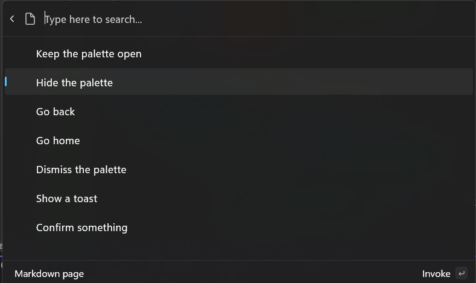

# Command results

**Previous**: [Add top-level commands to your extension](add-top-level-commands-to-your-extension.md)

An [IInvokableCommand](./microsoft-commandpalette-extensions/iinvokablecommand.md) represents a single actionable item in the Command Palette—it's what gets triggered when a user selects a command.

When your command is selected, the [Invoke](./microsoft-commandpalette-extensions/iinvokablecommand.md) method is called. This is where you implement the logic for what your extension should do. The Invoke method must return an `CommandResult`, which tells the Command Palette how to respond after the command runs—for example, whether to show a message, open a file, or do nothing.

This page explains the 7 different types of `CommandResult` you can return and what each one does:

> [!NOTE]
> There are code examples for the various CommandResult methods listed on this page.

<!-- GoToPage currently omitted from these docs, because it's not remotely implemented -->

## KeepOpen command result

The `KeepOpen` command result does nothing. It leaves the palette in its current state, with the current page stack and query. This can be useful for commands that want to keep the user in the Command Palette, to keep working with the current page.

> [!NOTE]
> Even when returning `KeepOpen`, launching a new app or window from the Command Palette will automatically hide the palette the next window receives focus. 

## Hide command result

This command result keeps the current page open, but hides the Command Palette. This can be useful for commands that want to take the user briefly out of the Command Palette, but then come back to this context.

## GoBack command result

This result takes the user back a page in the Command Palette, and keeps the window visible. This is perfect for form pages, where doing the command should take you the user back to the previous context.

## GoHome command result

This result takes the user back to the main page of the Command Palette. It will leave the Palette visible (unless the palette otherwise loses focus). Consider using this for scenarios where you've changed your top-level commands.

## Dismiss command result

This result hides the Command Palette after the action is executed, and takes it back to the home page. On the next launch, the Command Palette will start from the main page with a blank query. This is useful for commands that are one-off actions, or that don't need to keep the Command Palette open.

If you don't know what else to use, this should be your default. Ideally, users should come into the palette, find what they need, and be done with it.

## ShowToast command result

This result displays a transient desktop-level message to the user. This is especially useful for displaying confirmation that an action took place when the palette will be closed. 

Consider the [CopyTextCommand](./microsoft-commandpalette-extensions-toolkit/copytextcommand.md) in the helpers - this command will show a toast with the text "Copied to clipboard", then dismiss the palette. 

By default, [CommandResult.ShowToast(string)](./microsoft-commandpalette-extensions-toolkit/commandresult_showtoast_string.md) helper will have a **Result** of `CommandResult.Dismiss`. However, you can instead change the result to any of the other results if you want. This allows you to display a toast and keep the palette open, if you'd like. 

## Confirm command result

This result displays a confirmation dialog to the user. If the user confirms the dialog, then the `PrimaryCommand` of the `ConfirmationArgs` will be performed.

This is useful for commands that might have destructive actions, or that need to confirm user intent.

## Example

Below is a page with one command for each kind of `CommandResult`:

1. Open `/Pages/<ExtensionName>Page.cs`
1. Replace `GetItems` with the `GetItems` below:

```csharp

using Microsoft.CommandPalette.Extensions;
using Microsoft.CommandPalette.Extensions.Toolkit;

internal sealed partial class <ExtensionName>Page : ListPage
{
    public <ExtensionName>Page()
    {
        Icon = IconHelpers.FromRelativePath("Assets\\StoreLogo.png");
        Title = "Example command results";
        Name = "Open";
    }

    public override IListItem[] GetItems()
    {
        ConfirmationArgs confirmArgs = new()
        {
            PrimaryCommand = new AnonymousCommand(
                () =>
                {
                    ToastStatusMessage t = new("The dialog was confirmed");
                    t.Show();
                })
            {
                Name = "Confirm",
                Result = CommandResult.KeepOpen(),
            },
            Title = "You can set a title for the dialog",
            Description = "Are you really sure you want to do the thing?",
        };

        return
        [
            new ListItem(new AnonymousCommand(null) { Result = CommandResult.KeepOpen() }) { Title = "Keep the palette open" },
            new ListItem(new AnonymousCommand(null) { Result = CommandResult.Hide() }) { Title = "Hide the palette" },
            new ListItem(new AnonymousCommand(null) { Result = CommandResult.GoBack() }) { Title = "Go back" },
            new ListItem(new AnonymousCommand(null) { Result = CommandResult.GoHome() }) { Title = "Go home" },
            new ListItem(new AnonymousCommand(null) { Result = CommandResult.Dismiss() }) { Title = "Dismiss the palette" },
            new ListItem(new AnonymousCommand(null) { Result = CommandResult.ShowToast("What's up") }) { Title = "Show a toast" },
            new ListItem(new AnonymousCommand(null) { Result = CommandResult.Confirm(confirmArgs) }) { Title = "Confirm something" },
        ];
    }
}
```

1. Deploy your extension
1. In Command Palette, `Reload`



### Next up: [Display markdown content](using-markdown-content.md)

## Related content

- [PowerToys Command Palette utility](overview.md)
- [Extensibility overview](extensibility-overview.md)
- [Extension samples](samples.md)
