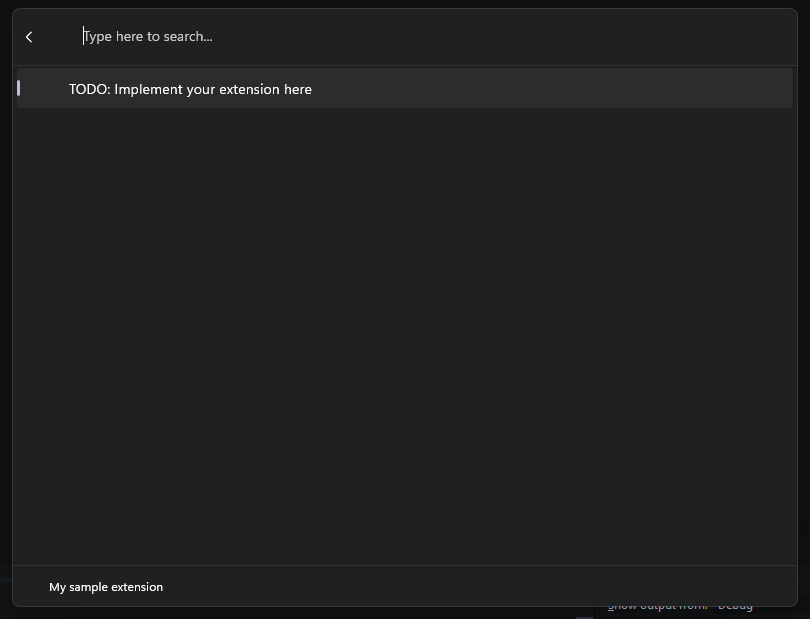

# Creating an extension

The fastest way to get started writing extensions is from the Command Palette itself. Just run the "Create a new extension" command, fill out the fields to populate the template project, and you should be ready to start.

The form will ask you for the following information:
* **ExtensionName**: The name of your extension. This will be used as the name of the project and the name of the class that implements your commands. Make sure it's a valid C# class name - it shouldn't have any spaces or special characters, and should start with a capital letter.
* **Extension Display Name**: The name of your extension as it will appear in the Command Palette. This can be a more human-readable name. 
* **Output Path**: The folder where the project will be created. 
  * The project will be created in a subdirectory of the path you provided. 
  * If this path doesn't exist, it will be created for you.


Once you submit the form, Command Palette will automatically generate the project for you. At this point, your projects structure should look like the following:

```plaintext
ExtensionName/
│   Directory.Build.props
│   Directory.Packages.props
│   nuget.config
│   ExtensionName.sln
└───ExtensionName
    │   app.manifest
    │   Package.appxmanifest
    │   Program.cs
    │   ExtensionName.cs
    │   ExtensionName.csproj
    │   ExtensionNameCommandsProvider.cs
    ├───Assets
    │   <A bunch of placeholder images>
    ├───Pages
    │   ExtensionNamePage.cs
    └───Properties
        │   launchSettings.json
        └───PublishProfiles
                win-arm64.pubxml
                win-x64.pubxml
```

(with `ExtensionName` replaced with the name you provided)

From here, you can immediately build the project and run it. Once your package is deployed and running, Command Palette will automatically discover your extension and load it into the palette. 

> [!TIP]
> Make sure you deploy your app! Just **build**ing your application won't update the package in the same way that deploying it will.

> [!WARNING]
> Running "ExtensionName (Unpackaged)" from Visual Studio will not **deploy** your app package.
> 
> If you're using `git` for source control, and you used the standard `.gitignore` file for C#, you'll want to remove the 
> ```
> **/Properties/launchSettings.json
> ```
> line from your `.gitignore` file. This file is used by WinAppSdk to deploy your app as a package. Without it, anyone who clones your repo won't be able to deploy your extension.

You should be able to see your extension in the Command Palette at the end of the list of commands. Entering that command should take you to the page for your command, and you should see a single command that says "TODO: Implement your extension here".



Congrats! You've made your first extension! Now let's go ahead and actually add some commands to it.

When you make changes to your extension, you can rebuild your project and deploy it again. Command Palette will **not** notice changes to packages that are re-ran through Visual Studio, so you'll need to manually run the "**Reload**" command to force Command Palette to re-instantiate your extension.

### Next up: [Add commands to your extension](adding-commands.md)

## Related content

- [PowerToys Command Palette utility](overview.md)
- [Extensibility overview](extensibility-overview.md)
- [Extension samples](samples.md)
