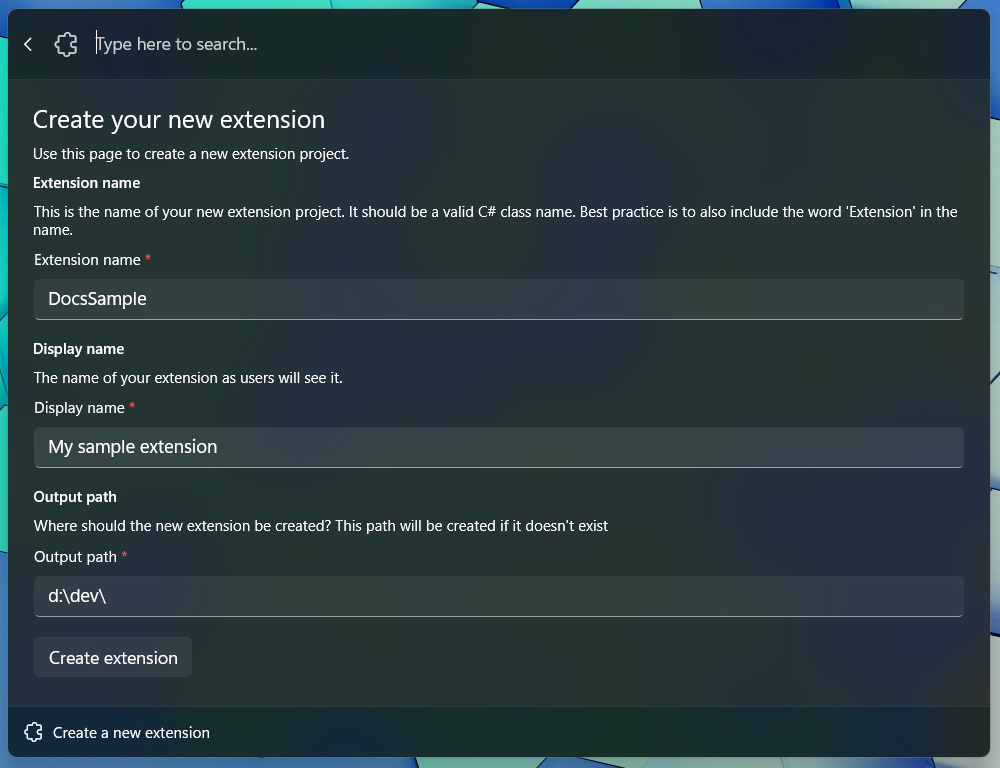
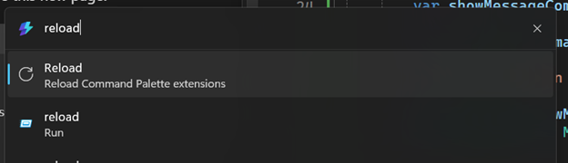

# Getting started with Command Palette extensions

Learn how to build custom extensions for the Command Palette using C#. This comprehensive guide covers everything from project setup to deployment, helping you enhance this powerful productivity tool for Windows.

## Overview

The Command Palette extension system allows developers to create custom commands and workflows that integrate seamlessly with PowerToys Command Palette. Extensions are written in C# and can be developed using the built-in template generator.

**What you'll learn:**

- How to create a new Command Palette extension project
- Understanding the extension project structure
- Deploying and testing your extension
- Best practices for extension development

**Prerequisites:**

- [Set up your Windows development environment](/windows/apps/get-started/start-here) — install Visual Studio with the required workloads for WinUI and the Windows App SDK
- Windows 11 with PowerToys installed
- Enable [Developer mode on Windows](/windows/advanced-settings/developer-mode)
- Basic knowledge of C# programming

Extensions are written in C#. The fastest way to get started writing extensions is from the Command Palette itself.

1. Open Command Palette
1. Run the `Create a new extension` command
1. Fill out the fields to populate the template project, and you should be ready to start.

## Create a new extension

The form will ask you for the following information:

- **ExtensionName**: The name of your extension. This will be used as the name of the project and the name of the class that implements your commands. Make sure it's a valid C# class name - it shouldn't have any spaces or special characters, and should start with a capital letter. Reference in docs as `<ExtensionName>`.
- **Extension Display Name**: The name of your extension as it will appear in the Command Palette. This can be a more human-readable name.
- **Output Path**: The folder where the project will be created.
  - The project will be created in a subdirectory of the path you provided.
  - If this path doesn't exist, it will be created for you.



## Understanding the extension project structure

Once you submit the form, Command Palette will automatically generate the project for you. At this point, your projects structure should look like the following:

```plaintext
<ExtensionName>/
│   Directory.Build.props
│   Directory.Packages.props
│   nuget.config
│   <ExtensionName>.sln
└───<ExtensionName>
    │   app.manifest
    │   Package.appxmanifest
    │   Program.cs
    │   <ExtensionName>.cs
    │   <ExtensionName>.csproj
    │   <ExtensionName>CommandsProvider.cs
    ├───Assets
    │   <A bunch of placeholder images>
    ├───Pages
    │   <ExtensionName>Page.cs
    └───Properties
        │   launchSettings.json
        └───PublishProfiles
                win-arm64.pubxml
                win-x64.pubxml
```

(with `<ExtensionName>` replaced with the name you provided)

You can deploy and run your extension:

- In Visual Studio, Deploy your extension
<details>
  <summary>How to Deploy your extension</summary>

1. In the navigation bar, click on `Build`
1. Click on `Deploy <ExtensionName>`

</details>

Once your package is deployed and running, Command Palette will automatically discover your extension and load it into the palette.

> [!TIP]
> Make sure you _deploy_ your app! Just **build**ing your application won't update the package in the same way that deploying it will.

> [!WARNING]
> Running "\<ExtensionName\> (Unpackaged)" from Visual Studio will not **deploy** your app package.
> 
> If you're using `git` for source control, and you used the standard `.gitignore` file for C#, you'll want to remove the following two lines from your `.gitignore` file:
> ```
> **/Properties/launchSettings.json
> *.pubxml
> ```
> These files are used by Windows App SDK to deploy your app as a package. Without it, anyone who clones your repo won't be able to deploy your extension.

1. In the Command Palette, type `Reload` and press `Enter`
    1. Make sure to select the `Reload` that has a subtitle of: `Reload Command Palette Extension`
    
1. In the Command Palette, scroll all the way down to the bottom of the list of commands
    1. or `up arrow` once to get to the end
1. Press `Enter` on your \<ExtensionName\>
1. You should see a single command that says `TODO: Implement your extension here`.


Congrats! You've made your first extension! Now let's go ahead and actually add some commands to it.

> [!TIP]
> When you make changes to your extension, you can rebuild your project and deploy it again. Command Palette will **not** notice changes to packages that are re-ran through Visual Studio, so you'll need to manually run the "**Reload**" command to force Command Palette to re-instantiate your extension.

### Next up: [Add commands to your extension](adding-commands.md)

## Related content

- [PowerToys Command Palette utility](overview.md)
- [Extensibility overview](extensibility-overview.md)
- [Extension samples](samples.md)
