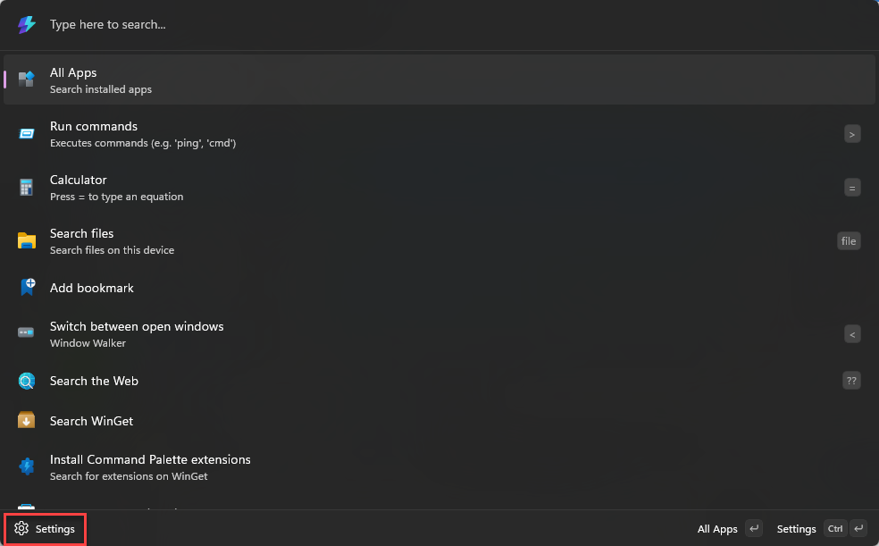

# PowerToys Command Palette utility

PowerToys Command Palette allows you to easily access all of your most frequently used commands, apps, and development tools - all from a single solution that is fast, customizable to your unique preferences, and extensible to include your favorite apps. The Command Palette is intended to be the successor of [PowerToys Run](../run.md).

To use the Command Palette, select <kbd>Win</kbd>+<kbd>Alt</kbd>+<kbd>Space</kbd> and start typing! *(Note that the keyboard shortcut can be changed in the settings window.)*

> [!IMPORTANT]
> For this utility to work, the Command Palette must be enabled and running in the background.

## Features

Command Palette features include:

- Search for applications, folders or files
- Run commands using `>` (for example, `> cmd` will launch Command prompt, or `> Shell:startup` will open the Windows startup folder)
- Switch between open windows (previously known as [Window Walker](https://github.com/betsegaw/windowwalker/))
- Do a simple calculation using calculator
- Add bookmarks for frequently visited webpages
- Execute system commands
- Open web pages or start a web search
- Rich extensions to add additional commands and features easily

## Settings

You can open the settings page by using the **Settings** button in the Command Palette:

The following general options are available on the Command Palette settings page.

| Setting | Description |
| :--- | :--- |
| Activation key | Define the keyboard shortcut to show/hide the Command Palette. |
| Go home when activated | When the Command Palette is activated it will return to the home page. |
| Highlight search on activate | The previous search text will be selected when the Command Palette is opened. |
| Preferred monitor position | Choose the preferred monitor for the Command Palette to open on. The default setting is **Monitor with mouse cursor**. |
| Show app details | App details are automatically expanded when displaying an app as a result. |
| Backspace goes back | Typing <kbd>Backspace</kbd> will take you back to the previous page. |
| Single-click activation | Activate list items with a single click. When disabled, single clicking selects the item and double clicking activates it. |

## Related content

- [PowerToys Run](../run.md)
- [Extensibility overview](extensibility-overview.md)
- [Extension samples](samples.md)
