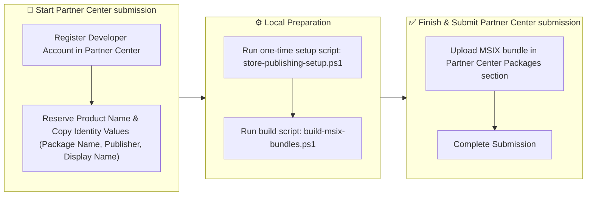
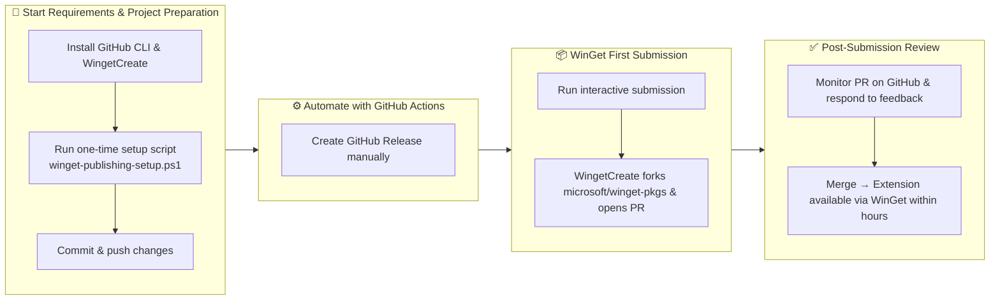

# Publish Command Palette extensions

This article provides instructions for Command Palette extensions that you create with the Command Palette template.

You can publish your Command Palette extension through the Microsoft Store, WinGet, or both. This article includes instructions for preparing and publishing your extension to both distribution platforms.

## Microsoft Store

You can publish Command Palette extensions to the Microsoft Store. The publishing process is similar to other apps or extensions. You create a new submission in Partner Center and upload your `.msix` package. Command Palette automatically discovers your extension when users install it from the Microsoft Store.

> [!NOTE]
> **MSIX packages explained**
> MSIX is Microsoft's modern app packaging format that provides secure installation, automatic updates, and clean uninstallation. It replaces older formats like MSI and ensures your extension integrates properly with Windows security and deployment features.

Command Palette can't search for or install extensions that are only listed in the Store. You can find those extensions by running the following command:

```cmd
ms-windows-store://assoc/?Tags=AppExtension-com.microsoft.commandpalette
```

You can run this command from the "Run commands" command in Command Palette, from the command line, or from the Run dialog.

## Guide to Microsoft Store publishing

Publishing to the Microsoft Store provides your extension with wide reach across Windows devices and automatic update delivery to users. This guide walks you through the complete process from setting up your Partner Center account to building MSIX packages and submitting your extension for certification. You'll learn how to prepare your extension's manifest files, create the required bundle packages, and navigate the Partner Center submission workflow to get your extension published successfully.




> [!NOTE]
> This guide provides basic Microsoft Store publishing steps specific to Command Palette extensions. For comprehensive Microsoft Store publishing guidance, including detailed submission requirements, certification processes, and best practices, see [Publish Windows apps and games](/windows/apps/publish/).

### Prerequisites

> [!IMPORTANT]
> **What is Partner Center?**
> Partner Center is Microsoft's portal for app developers to manage Microsoft Store submissions, track analytics, and handle app certification.

- [Register as a Windows app developer in Partner Center](/windows/apps/publish/partner-center/partner-center-developer-account)
- Create all required app icons and ensure they're properly sized ([Create icons using Visual Studio's asset generation tool](/windows/apps/design/style/iconography/visual-studio-asset-generation))

> [!TIP]
>
> - [List of icons and variations](/windows/apps/design/style/iconography/app-icon-construction#complete-list-of-icons-and-variations)
> - Make sure you generate the following files:
>
> | File Name                | Size       |
> |--------------------------|------------|
> | Square44x44Logo          | 44×44      |
> | SmallTile                | 71×71      |
> | Square150x150Logo        | 150×150    |
> | LargeTile                | 310×310    |
> | Wide310x150Logo          | 310×150    |
> | SplashScreen             | 620×300    |
> | StoreLogo                | 50×50      |

### Set up Microsoft Store

1. Go to the [Microsoft Partner Center](https://partner.microsoft.com/dashboard/home).
1. Under **Workspaces**, select **Apps and games**.
1. Select **+ New Product**.
1. Select **MSIX or PWA app**.
1. Create or reserve a product name.
1. Start the submission and complete as much as you can until you reach the **Packages** section.
1. In the left navigation, under **Product Management**, select **Product identity**.
1. Copy the following values for use in the next steps:

> [!IMPORTANT]
> **Copy these values from Partner Center:**
>
> - Package/Identity/Name
> - Package/Identity/Publisher
> - Package/Properties/PublisherDisplayName
>
> Use these exact values in the code examples below.

### Prepare the extension

1. Open PowerShell and navigate to the Publication folder:

   ```powershell
   cd <YourProject>\Publication
   ```

2. Run the one-time setup script:

   ```powershell
   .\one-time-store-pubishing-setup.ps1
   ```

3. Follow the prompts to enter your Microsoft Store information from Partner Center:
   - Package Identity Name
   - Publisher Certificate
   - Display Name
   - Publisher Display Name

   The script will double check you have required images, update your `Package.appxmanifest` and `<ExtensionName>.csproj` with Store-specific values.

### Build MSIX

1. Once configured, build your bundle:

   ```powershell
   .\build-msix-bundles.ps1
   ```

This script will:
    - Build either x64, ARM64 MSIX packages or Complete Bundle (x64 + ARM64 + Bundle)
    - Automatically update `microsoft-store-resources\bundle_mapping.txt` with correct paths
    - Display the bundle location when complete

2. Upload the resulting `mix` or `.msixbundle` file from `microsoft-store-resources\` to Partner Center

### Microsoft Store submission

1. Go to the [Microsoft Partner Center](https://partner.microsoft.com/dashboard/home) and open your newly created extension project.
1. In **Packages**, upload the created MSIX bundle.
1. Complete the rest of the submission. The following suggestions can help you:
   1. In **Languages supported in packages**, under your supported language (for example, English (United States)), in **Description**, make sure to include `<ExtensionName> integrates with the Windows Command Palette to...`
   1. In the left navigation, locate **Supplemental info** and select **Additional Testing Information**. Add instructions about needing PowerToys and Command Palette. Here's an [example](https://github.com/chatasweetie/CmdPalExtensions/blob/main/microsoftStoreResources/TesterInstructions.txt).
1. Submit your extension to the store.

After submission, Microsoft reviews your extension for certification. Monitor your submission status in Partner Center and check for email notifications about approval. Once approved, your extension is available in the Microsoft Store within a few hours.

## WinGet

To share your extensions with users, publish your packages to WinGet. Users can discover and install extension packages listed on WinGet directly from Command Palette.

> [!TIP]
> **What is WinGet?**
> WinGet is Microsoft's open-source command-line package manager for Windows. It's similar to package managers like npm or pip, but for Windows applications. When you publish to WinGet, users can install your extension with a simple `winget install` command. It also enables automatic discovery within Command Palette.

Before submitting your manifest to WinGet, check the following two requirements:

**Add the `windows-commandpalette-extension` tag**

Command Palette uses the special `windows-commandpalette-extension` tag to discover extensions. Make sure that your manifest includes this tag so that Command Palette can discover your extension. Add the following code to each `.locale.*.yaml` file in your manifest:

```yaml
Tags:
- windows-commandpalette-extension
```

**Ensure WindowsAppSdk is listed as a dependency**

If you're using Windows App SDK, make sure that it's listed as a dependency of your package. Add the following code to your `.installer.yaml` manifest:

```yaml
Dependencies:
  PackageDependencies:
  - PackageIdentifier: Microsoft.WindowsAppRuntime.#.#
```

## Guide to WinGet publishing

Publishing to WinGet is the recommended distribution method for Command Palette extensions. It enables automatic discovery and installation directly within Command Palette. This guide covers most of the WinGet publication process, from preparing your project and creating build scripts to setting up GitHub Actions automation and submitting your first package manifest. You'll learn how to create installer packages, configure automated builds, and navigate the WinGet submission workflow to make your extension easily discoverable and installable for users.



### Requirements

- [GitHub CLI](https://cli.github.com/)
- WingetCreate

    ```powershell
    # Install wingetcreate if not already installed
    winget install Microsoft.WingetCreate
    
    # Verify installation
    wingetcreate --version
    ```

### Prepare the project

1. Open PowerShell and navigate to the Publication folder:

   ```powershell
   cd <YourProject>\Publication
   ```

2. Run the one-time setup script:

   ```powershell
   .\one-time-winget-publishing-setup.ps1
   ```

3. Follow the prompts to enter:
   - GitHub Repository URL (where releases will be published)
   - Developer/Publisher Name

   The script will:
   - Configure `winget-resources\build-exe.ps1` with your extension details
   - Configure `winget-resources\setup-template.iss` with your extension information
   - Move `release-extension.yml` to `.github\workflows\` in your repository root

4. Add, Commit and push changes to GitHub:

   ```powershell
   git commit -m "Configure extension for WinGet publishing"
   git push
   ```

### Automate with GitHub Actions

> [!NOTE]
> **What are GitHub Actions?**
> GitHub Actions is a CI/CD platform that automates software workflows directly in your GitHub repository. For Command Palette extensions, GitHub Actions can automatically build your installer whenever you push code changes, create releases, and even submit updates to WinGet - eliminating manual build steps and ensuring consistent, reproducible builds.

1. Trigger the GitHub Action to build and release:

   ```powershell
   gh workflow run release-extension.yml --ref main -f "release_notes=**First Release of <ExtensionName> Extension for Command Palette**
   
   The inaugural release of the <ExtensionName> for Command Palette..."
   ```

   Or create a release manually through the GitHub web interface.


#### GitHub Actions validation

Verify your GitHub Actions setup by checking:

- ✅ GitHub Action workflow runs successfully without errors
- ✅ Installer EXE is created and uploaded to GitHub Release

**Typical build time**: 5-10 minutes for the GitHub Action to complete.

### WinGet submission

> [!IMPORTANT]
> You must manually submit the first version. `wingetcreate new` requires interactive input for package details

#### Manual first submission

1. Activate interactive wingetcreate:

   ```powershell
   # Use your actual GitHub release URLs 
   wingetcreate new "<PATH TO x64 .exe file>" "<PATH TO arm64 .exe file>"
   ```

   > [!TIP]
   > To get the GitHub Release URL: Go to your release page, under **Assets**, right-click the `.exe` file and select "Copy link address".

1. When `wingetcreate` prompts you, press **Enter** if the suggested response is pulled from the EXE file, for example: `PackageIdentifier`, `PackageVersion`, `Publisher`, and so on.
   - **For optional modification questions**, answer **No**:
     - "Would you like to modify the optional default locale fields?" → **No**
     - "Would you like to modify the optional installer fields?" → **No**
     - "Would you like to make changes to this manifest?" → **No**
   - **Final submission question**:
     - "Would you like to submit your manifest to the Windows Package Manager repository?" → **Yes**

After you answer "Yes" to submit:

- `wingetcreate` forks the microsoft/winget-pkgs repository to your GitHub account
- Creates a new branch with your package manifests
- Opens a pull request automatically
- Provides the PR URL for tracking

After you submit your pull request, the WinGet team reviews your manifest for compliance and accuracy. You can monitor the PR status on GitHub and respond to any feedback from reviewers. Once approved and merged, your extension will be available through WinGet within a few hours.

#### WinGet updates via GitHub Actions

You can use GitHub Actions to update your already submitted projects to WinGet.

Check out how [PowerToys](https://github.com/microsoft/PowerToys/blob/main/.github/workflows/package-submissions.yml) does this.

You can also use the following `.github\workflows\update-winget.yml`:

```yml
# To use this template for a new extension:
# 1. Copy this file to a new workflow file (e.g., update-winget.yml)
# 2. Update Environmental variables with your data:
# - GITHUB_REPO with your GitHub repo name
# - GITHUB_REPO with your github user name (e.g., chatasweetie)
# - EXTENSION_NAME with your extension name (e.g., CmdPalMyExtension)
# - YOUR_PACKAGE_IDENTITY_NAME_HERE with the AppxPackageIdentityName located in the <ExtensionName>.csproj


name: Update WinGet - EXTENSION_NAME Extension

on:
  release:
    types: [published]
  workflow_dispatch:
    inputs:
      version:
        description: 'Version number (e.g., 0.0.2.0)'
        required: false
        type: string
      release_tag:
        description: 'Release tag (e.g., EXTENSION_NAME-v0.0.2.0)'
        required: false
        type: string

# Global constants: UPDATE THESE, example; EXTENSION_NAME: ${{ vars.EXTENSION_NAME || 'CmdPalMyExtension' }}
env:
  EXTENSION_NAME: ${{ vars.EXTENSION_NAME || 'EXTENSION_NAME' }}
  GITHUB_USER_NAME: ${{ vars.GITHUB_USER_NAME || 'GITHUB_USER_NAME' }}
  GITHUB_REPO: ${{ vars.GITHUB_REPO || 'GITHUB_REPO' }}
  YOUR_PACKAGE_IDENTITY_NAME_HERE: ${{ vars.YOUR_PACKAGE_IDENTITY_NAME_HERE || 'YOUR_PACKAGE_IDENTITY_NAME_HERE' }}

jobs:
  update-winget:
    # Only run if this is a matching extension release
    if: github.event_name == 'workflow_dispatch' || startsWith(github.event.release.name, '${{ env.EXTENSION_NAME }} Extension')
    runs-on: windows-latest
    steps:
      - name: Checkout code
        uses: actions/checkout@v4
        
      - name: Get release info
        id: release
        run: |
          if ("${{ github.event_name }}" -eq "workflow_dispatch" -and "${{ inputs.version }}" -ne "") {
            # Use provided inputs for manual trigger
            echo "VERSION=${{ inputs.version }}" >> $env:GITHUB_OUTPUT
            echo "TAG=${{ inputs.release_tag }}" >> $env:GITHUB_OUTPUT
          } elseif ("${{ github.event_name }}" -eq "release") {
            # Extract from release event
            $version = "${{ github.event.release.tag_name }}" -replace "${{ env.EXTENSION_NAME }}-v", ""
            echo "VERSION=$version" >> $env:GITHUB_OUTPUT
            echo "TAG=${{ github.event.release.tag_name }}" >> $env:GITHUB_OUTPUT
          } else {
            # Get latest release
            $latestRelease = gh release list --limit 1 --json tagName,name | ConvertFrom-Json | Where-Object { $_.name -like "${{ env.EXTENSION_NAME }} Extension*" }
            $version = $latestRelease.tagName -replace "${{ env.EXTENSION_NAME }}-v", ""
            echo "VERSION=$version" >> $env:GITHUB_OUTPUT
            echo "TAG=$($latestRelease.tagName)" >> $env:GITHUB_OUTPUT
          }
        env:
          GH_TOKEN: ${{ secrets.GITHUB_TOKEN }}

      - name: Install wingetcreate
        run: |
          iwr https://aka.ms/wingetcreate/latest -OutFile wingetcreate.exe

      - name: Update WinGet manifest
        env:
          GITHUB_TOKEN: ${{ secrets.GITHUB_TOKEN }}
        run: |
          $version = "${{ steps.release.outputs.VERSION }}"
          $tag = "${{ steps.release.outputs.TAG }}"
          
          # URLs for both installers
          $x64Url = "https://github.com/${{ env.GITHUB_USER_NAME }}/${{ env.GITHUB_REPO }}/releases/download/$tag/${{ env.EXTENSION_NAME }}-Setup-$version-x64.exe"
          $arm64Url = "https://github.com/${{ env.GITHUB_USER_NAME }}/${{ env.GITHUB_REPO }}/releases/download/$tag/${{ env.EXTENSION_NAME }}-Setup-$version-arm64.exe"
          
          Write-Host "Updating WinGet manifest for version $version"
          Write-Host "x64 URL: $x64Url"
          Write-Host "ARM64 URL: $arm64Url"
          
          # Update the manifest with both architecture installers
          .\wingetcreate.exe update ${{ env.YOUR_PACKAGE_IDENTITY_NAME_HERE }} `
            --version $version `
            --urls "$x64Url|x64" "$arm64Url|arm64" `
            --token $env:GITHUB_TOKEN `
            --submit
```

## Related content

- [Extensibility overview](extensibility-overview.md)
- [Extension samples](samples.md)
- [PowerToys Command Palette utility](overview.md)
