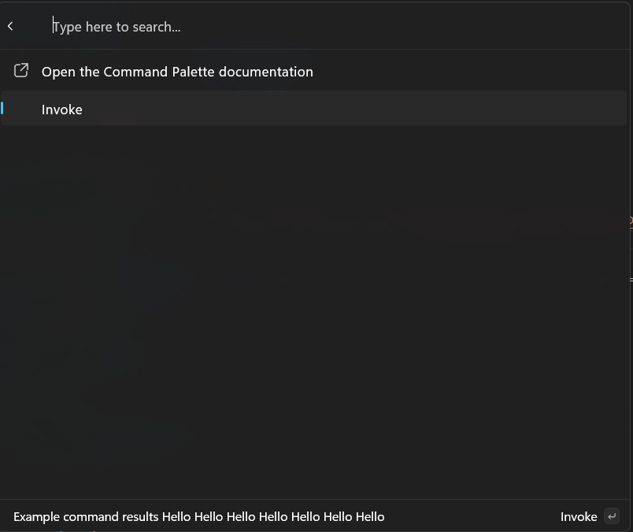

# Update a list of commands

**Previous**: [Adding commands](adding-commands.md).

So far we've shown how to return a list of static items in your extension. However, your items can also change, to show real-time data, or to reflect the state of the system. In this article, we'll show you how to update the list of commands in your extension.

Almost all extension objects in the Command Palette implement the **IPropChanged** interface. This allows them to notify the Command Palette when they've changed, and the Command Palette will update the UI to reflect those changes. By creating your extension via the Command Palette, you are using the [toolkit](/windows/powertoys/command-palette/microsoft-commandpalette-extensions-toolkit/microsoft-commandpalette-extensions-toolkit) implementations, this interface has already been implemented for you for properties that support it.

## Updating Title of Page

To demonstrate the implement the **IPropChanged** interface, you can update the title of the page.

1. In your `<ExtensionName>Page.cs`, replace the `GetItems()`.

```csharp
public override IListItem[] GetItems()
{
    OpenUrlCommand command = new("https://learn.microsoft.com/windows/powertoys/command-palette/creating-an-extension");

    AnonymousCommand updateCommand = new(action: () => { Title += " Hello"; }) { Result = CommandResult.KeepOpen() };

    return [
        new ListItem(command)
        {
            Title = "Open the Command Palette documentation",
        },
        new ListItem(updateCommand),
    ];
}
```

1. Deploy your extension
1. In command palette, `Reload`



Here, we're using ``AnonymousCommand`` to create a command that will update the title of the page. `AnonymousCommand` is a helper that's useful for creating simple, lightweight commands that don't need to be reused.

## Updating Subtitle of Page

You can create custom **ListItem** objects too:

1. In the `Pages` folder, create a new class called `IncrementingListItem`
1. Update the code to:

```csharp
internal sealed partial class IncrementingListItem : ListItem
{
    public IncrementingListItem() :
        base(new NoOpCommand())
    {
        Command = new AnonymousCommand(action: Increment) { Result = CommandResult.KeepOpen() };
        Title = "Increment";
    }

    private void Increment()
    {
        Subtitle = $"Count = {++_count}";
    }

    private int _count;
}
```

1. In `<ExtensionName>Page.cs`, add new command to ListItem:

```diff
    public override IListItem[] GetItems()
    {
        OpenUrlCommand command = new("https://learn.microsoft.com/windows/powertoys/command-palette/creating-an-extension");
        return [
            new ListItem(command)
            {
                Title = "Open the Command Palette documentation",
            },
            new ListItem(new ShowMessageCommand()),
            new ListItem(updateCommand),
+           new IncrementingListItem(),
        ];
    }
```

1. Deploy your extension
1. In command palette, `Reload`

You're on your way to creating your own idle clicker game, as a Command Palette extension.

## Updating the list of commands

You can also change the list of items on the page. This can be useful for pages that load results asynchronously, or for pages that show different commands based on the state of the app.

To do this, you can use the `RaiseItemsChanged` method on the `ListPage` object. This will notify the Command Palette that the list of items has changed, and it should re-fetch the list of items.

> [!NOTE]
> If working from prior section, do not create a new `IncrementingListItem.cs` class, use your existing one.

1. In the `Pages` folder, create a new class called `IncrementingListItem`
1. Update the code to:

```csharp
using <ExtensionName>

internal sealed partial class IncrementingListItem : ListItem
{
    public IncrementingListItem(<ExtensionName>Page page) :
        base(new NoOpCommand())
    {
        _page = page;
        Command = new AnonymousCommand(action: _page.Increment) { Result = CommandResult.KeepOpen() };
        Title = "Increment";
    }

    private <ExtensionName>Page _page;
}
```

1. In `<ExtensionName>Page.cs`, replace code inside of the class:

```cs
public <ExtensionName>Page()
{
    Icon = IconHelpers.FromRelativePath("Assets\\StoreLogo.png");
    Title = "My sample extension";
    Name = "Open";

    _items = [new IncrementingListItem(this) { Subtitle = $"Item 0" }]; 
}
public override IListItem[] GetItems()
{
    return _items.ToArray();
}
internal void Increment()
{
    _items.Add(new IncrementingListItem(this) { Subtitle = $"Item {_items.Count}" });
    RaiseItemsChanged();
}
private List<ListItem> _items;
```

1. Deploy your extension
1. In Command Palette, `Reload`

Now, every time you perform one of the `IncrementingListItem` commands, the list of items on the page will update to add another item. We're using a single **List** owned by the page to own all the items. Notably, we're creating the new items in the `Increment` method, before calling `RaiseItemsChanged`. The **Invoke** of a **InvokableCommand** can take as long as you'd like. All your code is running in a separate process from the Command Palette, so you won't block the UI. But constructing the items before calling `RaiseItemsChanged` will help keep your extension *feeling* more responsive.

## Showing a loading spinner

Everything so far has been pretty instantaneous. Many extensions however may need to do some work that takes a lot longer. In that case, you can set `Page.IsLoading` to `true` to show a loading spinner. This will help indicate that the extension is doing something in the background.

> [!NOTE]
> The following section builds on top of **Updating the list of command** section above

1. In your `<ExtensionName>Page.cs`, replace the `Increment()`.

```csharp
using System.Threading;

...

internal void Increment()
{
    this.IsLoading = true;
    Task.Run(() =>
    {
        Thread.Sleep(5000);
        _items.Add(new IncrementingListItem(this) { Subtitle = $"Item {_items.Count}" });
        RaiseItemsChanged();
        this.IsLoading = false;
    });
}
```

1. Deploy your extension
1. In Command Palette, `Reload`

Best practice is to set `IsLoading` to `true` before starting the work. Then do all the work to build all the new `ListItems` you need to display to the user. Then, once the items are ready, call `RaiseItemsChanged` and set `IsLoading` back to `false`. This will ensure that the loading spinner is shown for the entire duration of the work, and that the UI is updated as soon as the work is done (without waiting for your extension to construct new `ListItem` objects).

### Next up: [Add top-level commands to your extension](add-top-level-commands-to-your-extension.md)

## Related content

- [PowerToys Command Palette utility](overview.md)
- [Extensibility overview](extensibility-overview.md)
- [Extension samples](samples.md)
