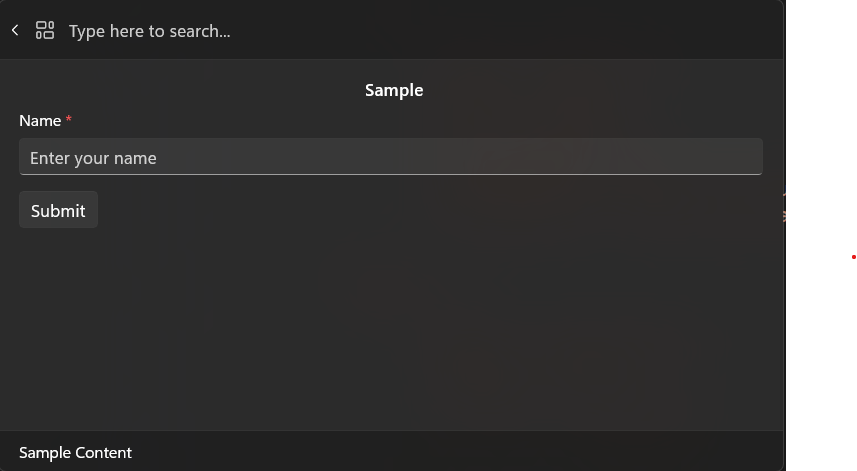
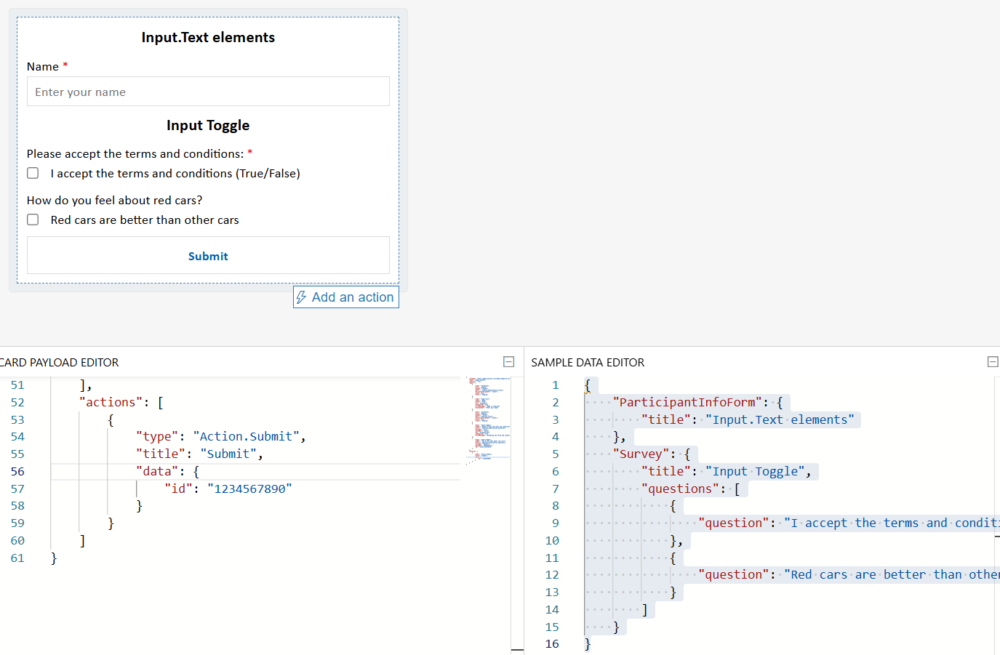

# Get user input with forms

**Previous**: [Display markdown content](using-markdown-content.md)

Now that we know how to present basic markdown content, let's try displaying something more meaningful by leveraging the power of **[Adaptive Cards](https://adaptivecards.io/)**. This is useful for creating forms, or for displaying more complex content.

## Working with forms

You can create a card in the Command Palette with the `IFormContent` interface (see [FormContent](./microsoft-commandpalette-extensions-toolkit/formcontent.md) for the toolkit implementation). This allows you to provide the Adaptive Card JSON, and the Command Palette will render it for you. When the user submits the form, Command Palette will call the `SubmitForm` method on your form, with the JSON payload and inputs from the form.

> [!TIP]
> Adaptive card payloads can be created using the [Adaptive Card Designer](https://adaptivecards.io/designer/). You can design your card there, and then copy the JSON payload into your extension.

1. In the `Pages` directory, add a new class
1. Name the class `FormPage`
1. Update the `FormPage` class:

```csharp
internal sealed partial class FormPage : ContentPage
{
    private readonly SampleContentForm sampleForm = new();

    public override IContent[] GetContent() => [sampleForm];

    public FormPage()
    {
        Name = "Open";
        Title = "Sample Content";
        Icon = new IconInfo("\uECA5"); // Tiles
    }
}
```

The FormPage is a content page that displays a form (`SampleContentForm`) to the user. It creates an instance of `SampleContentForm`, which is a form (defined later) that describes the UI and logic for a user input form.

1. At the bottom of file (under the `FormPage` class) add:

```csharp
internal sealed partial class SampleContentForm : FormContent
{
    public SampleContentForm()
    {
        TemplateJson = $$"""
{
    "$schema": "http://adaptivecards.io/schemas/adaptive-card.json",
    "type": "AdaptiveCard",
    "version": "1.6",
    "body": [
        {
            "type": "TextBlock",
            "size": "medium",
            "weight": "bolder",
            "text": " Sample",
            "horizontalAlignment": "center",
            "wrap": true,
            "style": "heading"
        },
        {
            "type": "Input.Text",
            "label": "Name",
            "style": "text",
            "id": "SimpleVal",
            "isRequired": true,
            "errorMessage": "Name is required",
            "placeholder": "Enter your name"
        }
    ],
    "actions": [
        {
            "type": "Action.Submit",
            "title": "Submit",
            "data": {
                "id": "1234567890"
            }
        }
    ]
}
""";

    }

    public override CommandResult SubmitForm(string payload)
    {
        var formInput = JsonNode.Parse(payload)?.AsObject();
        Debug.WriteLine($"Form submitted with formInput: {formInput}");
        if (formInput == null)
        {
            return CommandResult.GoHome();
        }
        ConfirmationArgs confirmArgs = new()
        {
            PrimaryCommand = new AnonymousCommand(
                () =>
                {
                    string? name = formInput["Name"]?.ToString();
                    ToastStatusMessage t = new($"Hi {name}" ?? "No name entered");
                    t.Show();
                })
            {
                Name = "Confirm",
                 Result = CommandResult.KeepOpen(),
            },
            Title = "You can set a title for the dialog",
            Description = "Are you really sure you want to do the thing?",
        };
        return CommandResult.Confirm(confirmArgs);
    }
}
```

The `SampleContentForm` contains the form and form submission logic. The `TemplateJson` contains the form structure and actions. This example only contains one text input which has the id of "Name" and has one action of submitting the form. The `SubmitForm` handles parsing the payload; if its invalid will return the command to home and otherwise will display a confirmation dialog and a toast notification.

1. Open `<ExtensionName>CommandsProvider.cs`
1. Replace the `MarkdownPage` for  `FormPage`:

```diff
public <ExtensionName>CommandsProvider()
{
    DisplayName = "My sample extension";
    Icon = IconHelpers.FromRelativePath("Assets\\StoreLogo.png");
    _commands = [
+       new CommandItem(new FormPage()) { Title = DisplayName },
    ];
}
```

1. Deploy your extension
1. In Command Palette, `Reload`



Adaptive Cards can do more complex forms, including using another json object to dynamically create custom forms. You'll first set up your form with the [Adaptive Card Designer](https://adaptivecards.io/designer/) and then update your command.

1. Open https://adaptivecards.io/designer/ 
1. In the `CARD PAYLOAD EDITOR` replace the json with:

```json
{
    "$schema": "http://adaptivecards.io/schemas/adaptive-card.json",
    "type": "AdaptiveCard",
    "version": "1.6",
    "body": [
        {
            "type": "TextBlock",
            "size": "medium",
            "weight": "bolder",
            "text": " ${ParticipantInfoForm.title}",
            "horizontalAlignment": "center",
            "wrap": true,
            "style": "heading"
        },
        {
            "type": "Input.Text",
            "label": "Name",
            "style": "text",
            "id": "Name",
            "isRequired": true,
            "errorMessage": "Name is required",
            "placeholder": "Enter your name"
        },
        {
            "type": "TextBlock",
            "size": "medium",
            "weight": "bolder",
            "text": "${Survey.title} ",
            "horizontalAlignment": "center",
            "wrap": true,
            "style": "heading"
        },
        {
            "type": "Input.Toggle",
            "label": "Please accept the terms and conditions:",
            "title": "${Survey.questions[0].question}",
            "valueOn": "true",
            "valueOff": "false",
            "id": "AcceptsTerms",
            "isRequired": true,
            "errorMessage": "Accepting the terms and conditions is required"
        },
        {
            "type": "Input.Toggle",
            "label": "How do you feel about red cars?",
            "title": "${Survey.questions[1].question}",
            "valueOn": "RedCars",
            "valueOff": "NotRedCars",
            "id": "ColorPreference"
        }
    ],
    "actions": [
        {
            "type": "Action.Submit",
            "title": "Submit",
            "data": {
                "id": "1234567890"
            }
        }
    ]
}
```

1. In the `SAMPLE DATA EDITOR` replace the json with:

```json
{
    "ParticipantInfoForm": {
        "title": "Input.Text elements"
    },
    "Survey": {
        "title": "Input Toggle",
        "questions": [
            {
                "question": "I accept the terms and conditions (True/False)"
            },
            {
                "question": "Red cars are better than other cars"
            }
        ]
    }
}
```

The Designer tool should look something like this:



To add this content to your extension:

1. Update `TemplateJson` with `CARD PAYLOAD EDITOR` content
1. Under `TemplateJson`, add:

```csharp
        DataJson = $$"""
{
    "ParticipantInfoForm": {
        "title": "Input.Text elements"
    },
    "Survey": {
        "title": "Input Toggle",
        "questions": [
            {
                "question": "I accept the terms and conditions (True/False)"
            },
            {
                "question": "Red cars are better than other cars"
            }
        ]
    }
}
""";
```

1. Deploy your extension
1. In Command Palette, `Reload`


`TemplateJson` and `DataJson` work together to create dynamic, data-driven forms. `TemplateJson` can act as fhe Form Blueprint and `DataJson` as the Dynamic Content Source.

## Full Sample

For a full example of using Forms and Content pages, head on over to [`SamplePagesExtension/Pages/SampleContentPage.cs`](https://github.com/microsoft/PowerToys/blob/main/src/modules/cmdpal/ext/SamplePagesExtension/Pages/SampleContentPage.cs).

## Key Items

- Define your form layout using the `TemplateJson` property of your `FormContent`. This is the JSON payload from the CARD PAYLOAD EDITOR in the https://adaptivecards.io/designer/. It describes the structure and UI of your form.

- Optionally bind dynamic data using the `DataJson` property. This is the JSON from the SAMPLE DATA EDITOR in the Adaptive Card Designer. It allows you to inject dynamic values into your card using ${...} placeholders, making your forms easier to localize and maintain.

- Handle form submissions by implementing the `SubmitForm` method. This method is called when the user submits the form. You’ll receive the form’s payload as a JSON string, which you can parse and use to trigger actions, show confirmation dialogs, or return navigation results.

```csharp
public override CommandResult SubmitForm(string payload)
{
    var formInput = JsonNode.Parse(payload)?.AsObject();
    if (formInput == null)
    {
        return CommandResult.GoHome();
    }

    // retrieve the value of the input field with the id "name"
    var name = formInput["name"]?.AsString();
        
    // do something with the data

    // and eventually
    return CommandResult.GoBack();
}
```

> [!NOTE]
> You can mix and match different `IContent` types in your extension. For example, you might use a `MarkdownContent` block to display a post, followed by a `FormContent` block to collect a reply.

## Related content

- [PowerToys Command Palette utility](overview.md)
- [Extensibility overview](extensibility-overview.md)
- [Extension samples](samples.md)
