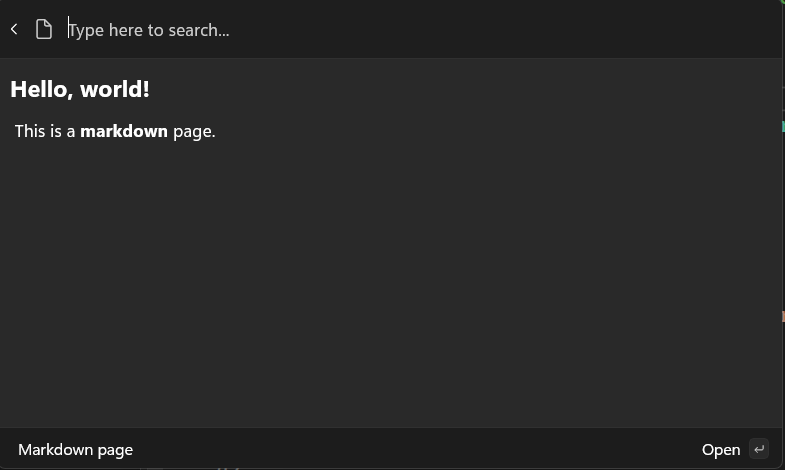
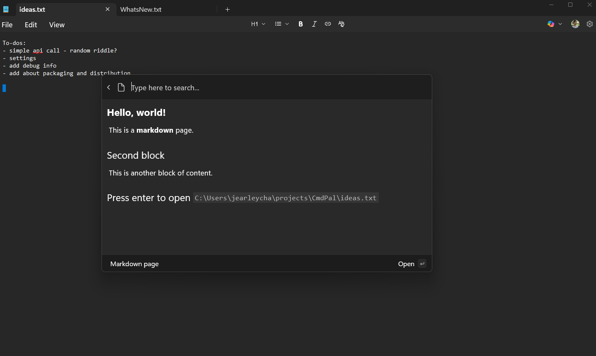

# Display markdown content

**Previous**: [Command Results](command-results.md)

So far, we've only shown how to display a list of commands in a **ListPage**. However, you can also display rich content in your extension, such as markdown. This can be useful for showing documentation, or a preview of a document.

## Working with markdown content

[IContentPage](./microsoft-commandpalette-extensions/icontentpage.md) (and its toolkit implementation, [ContentPage](microsoft-commandpalette-extensions-toolkit/contentpage.md)) is the base for displaying all types of rich content in the Command Palette. To display markdown content, you can use the [MarkdownContent](microsoft-commandpalette-extensions-toolkit/markdowncontent.md) class.

1. In the `Pages` directory, add a new class
1. Name the class `MarkdownPage.cs`
1. Update the file to:

```csharp
using Microsoft.CommandPalette.Extensions;
using Microsoft.CommandPalette.Extensions.Toolkit;
using System.Text.Json.Nodes;

internal sealed partial class MarkdownPage : ContentPage
{
    public MarkdownPage()
    {
        Icon = new("\uE8A5"); // Document icon
        Title = "Markdown page";
        Name = "Preview file";
    }

    public override IContent[] GetContent()
    {
        return [
            new MarkdownContent("# Hello, world!\n This is a **markdown** page."),
        ];
    }
}
```

1. Open `<ExtensionName>CommandsProvider.cs`
1. Replace the `CommandItem`s for the `MarkdownPage`:

```diff
public <ExtensionName>CommandsProvider()
{
    DisplayName = "My sample extension";
    Icon = IconHelpers.FromRelativePath("Assets\\StoreLogo.png");
    _commands = [
+       new CommandItem(new MarkdownPage()) { Title = DisplayName },
    ];
}
```

1. Deploy your extension
1. In Command Palette, `Reload`

In this example, a new `ContentPage` that displays a simple markdown string is created. The 'MarkdownContent' class takes a string of markdown content and renders it in the Command Palette.



You can also add multiple blocks of content to a page. For example, you can add two blocks of markdown content.

1. Update `GetContent`:

```diff
public override IContent[] GetContent()
{
    return [
        new MarkdownContent("# Hello, world!\n This is a **markdown** page."),
+       new MarkdownContent("## Second block\n This is another block of content."),
    ];
}
```

1. Deploy your extension
1. In command palette, `Reload`

This allows you to mix-and-match different types of content on a single page.

## Adding CommandContextItem

You can also add commands to a `ContentPage`. This allows you to add additional commands to be invoked by the user, while in the context of the content. For example, if you had a page that displayed a document, you could add a command to open the document in File Explorer:

1. In your \<ExtensionName\>Page.cs, add `doc_path`, `Commands` and `MarkdownContent`:

```diff

public class <ExtensionName>Page : ContentPage
{
+   private string doc_path = "C:\\Path\\to\\file.txt";
    public <ExtensionName>Page()
    {
        Icon = new("\uE8A5"); // Document icon
        Title = "Markdown page";
        Name = "Preview file";
        path = 

+       Commands = [
+           new CommandContextItem(new OpenUrlCommand(doc_path)) { Title = "Open in File Explorer" },
+       ];
    }
    public override IContent[] GetContent()
    {
        return [
            new MarkdownContent("# Hello, world!\n This is a **markdown** document."),
            new MarkdownContent("## Second block\n This is another block of content."),
+           new MarkdownContent($"## Press enter to open `{doc_path}`"),
        ];
    }
}
```

1. Update the path in the `doc_path` to a .txt file on your local machine
1. Deploy your extension
1. In Command Palette, `Reload`
1. Select \<ExtensionName\>
1. Press `Enter` key, the docs should open



### Next up: [Get user input with forms](using-form-pages.md)

## Related content

- [PowerToys Command Palette utility](overview.md)
- [Extensibility overview](extensibility-overview.md)
- [Extension samples](samples.md)
