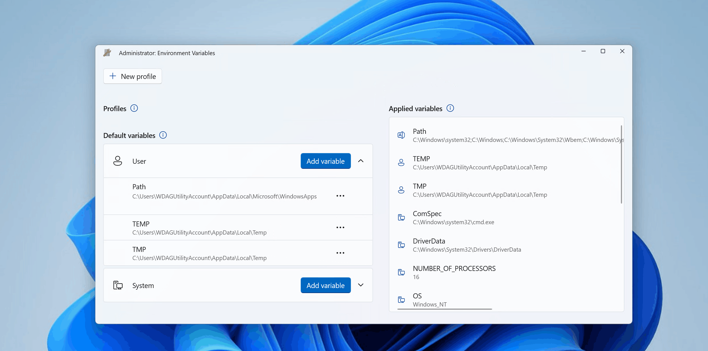
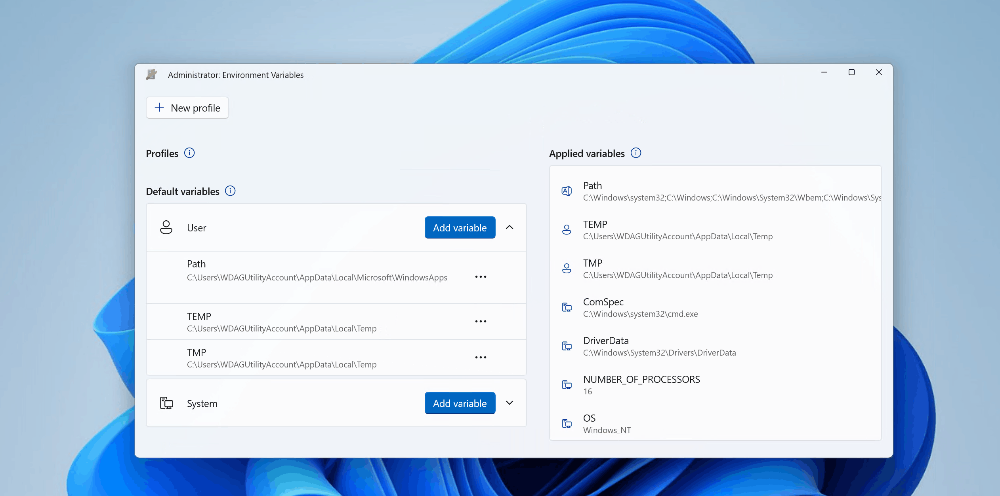
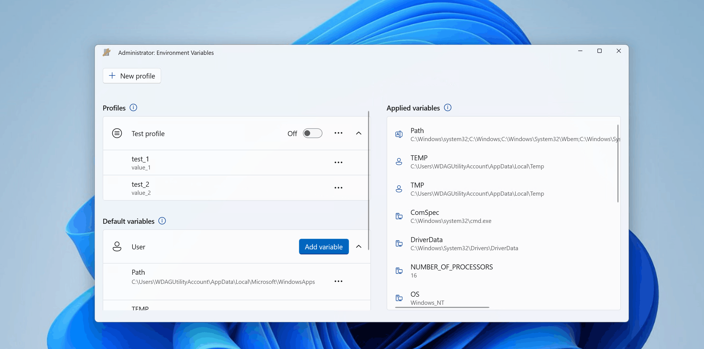

# Environment Variables

Environment Variables offers an easy and convenient way to manage environment variables. It also allows you to create profiles for managing a set of variables together. Profile variables have precedence over User and System variables. Applying the profile adds variables to User environment variables in the background. When a profile is applied, if there is an existing User variable with the same name, a backup variable is created in User variables which will be reverted to the original value on profile un-apply.

Applied variables list shows the current state of the environment, respecting the order of evaluation of environment variables (Profile -> User -> System). Evaluated Path variable value is shown at the top of the list. 

## Edit/Remove variable

To edit or remove a variable (profile, User or System), select the more options button (**•••**) on the desired variable:

## Add profile

To add a new profile:

 - Select **New profile**
 - Enter profile name
 - Set Enabled toggle to On to apply the profile right after creation
 - Select **Add variable** to add variables to profile (either new variable or existing User/System variables).
 - Select **Save**

To edit or remove a profile, select the more options button (**•••**) on the desired profile.

## Apply profile

To apply a profile, set the profile toggle to On. Only one profile can be applied at a time. The Applied variables list will show applied profile variables at the top (below Path variable):

## Settings

From the Settings menu, the following options can be configured:

| Setting | Description |
| :--- | :--- |
| Launch as administrator | Launch as administrator allow management of System variables. If disabled, only profile and User variables can be modified. Environment Variables is started as administrator by default. |
