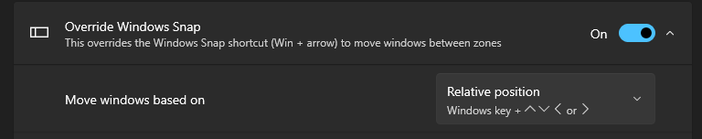
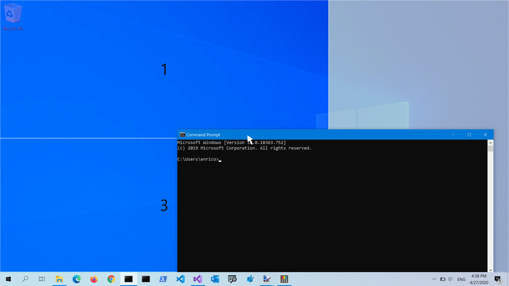
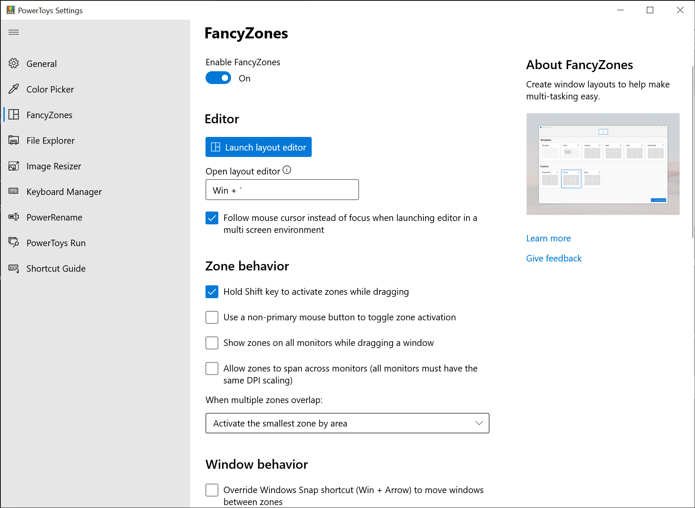
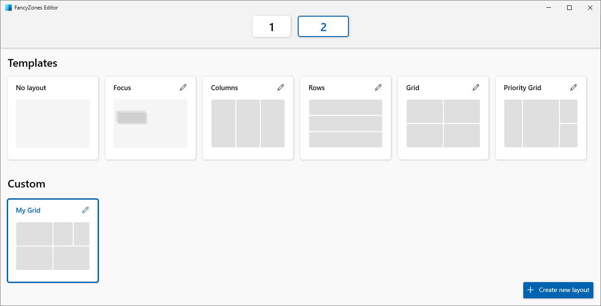
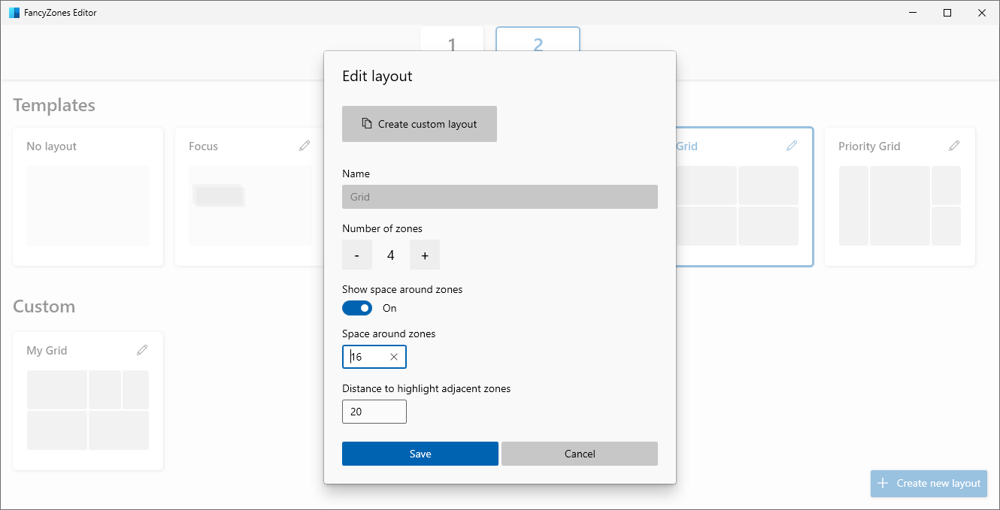
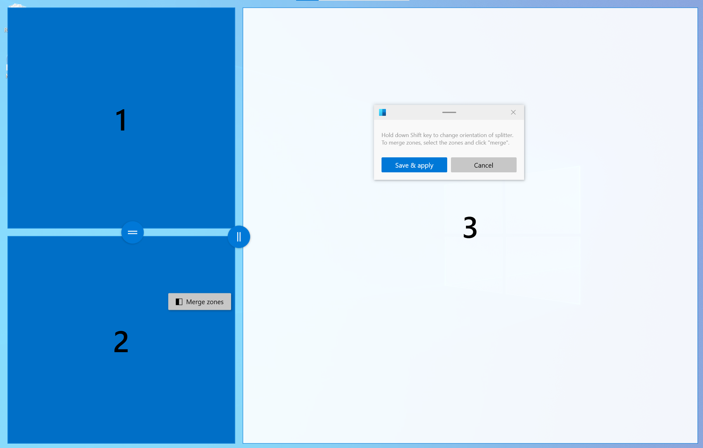
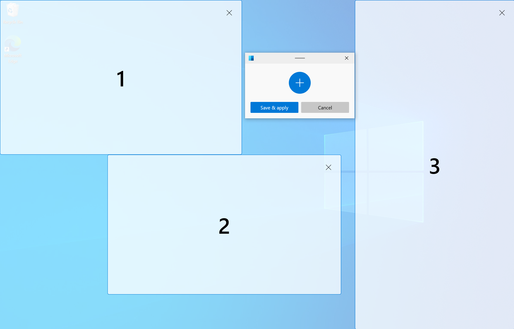
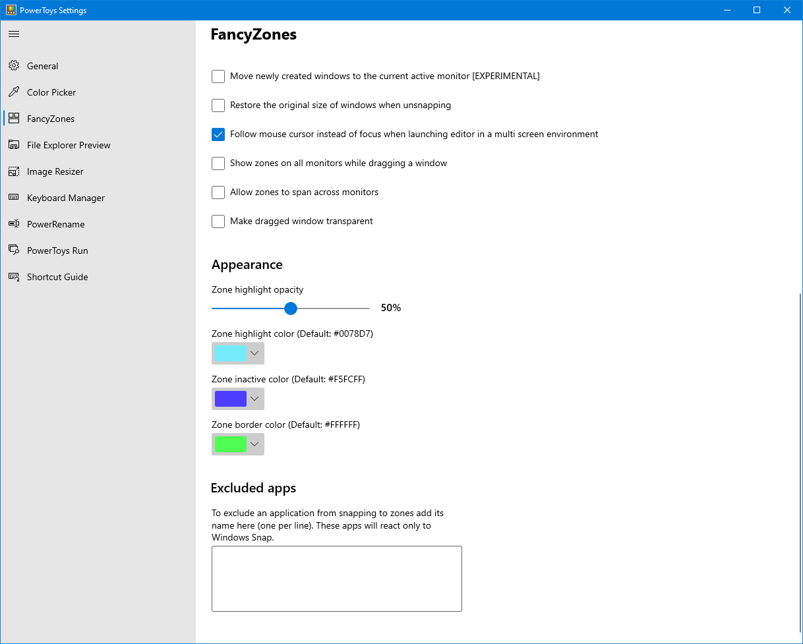

# FancyZones utility

FancyZones is a window manager utility for arranging and snapping windows into efficient layouts to improve your workflow and restore layouts quickly.
You can define a set of zone locations to use as targets for windows on your desktop. When you drag a window into a zone or use the associated keyboard shortcut, the window is resized and repositioned to fill that zone.

## Snapping to a single zone with mouse

Drag the window. By default, you'll also need to select and hold <kbd>Shift</kbd>. You'll see the zones appear. As you move your mouse, hovering over a zone will highlight that zone.

You can also trigger zone selection mode by using a non-primary mouse button if **Use non-primary mouse button to toggle zone activation** is selected.

If both **Hold Shift key to activate zones while dragging** and **Use non-primary mouse button to toggle zone activation** are cleared, zones will appear immediately after you start dragging the window.

## Snapping to a single zone with keyboard

Select **Override Windows Snap** in the FancyZones settings. Use <kbd>Win</kbd>+[arrow keys] to snap a window to a zone. Use **Move windows based on** to choose whether to move windows based the zone index or a window's relative position.

## Snapping to multiple zones

A window can be snapped to more than one zone in the following ways.

### Snapping to two zones by hovering the edges

If two zones are adjacent, you can snap a window to the sum of their area (rounded to the minimum rectangle that contains both). When the mouse cursor is near the common edge of two zones, both zones are activated simultaneously, allowing you to drop the window into both zones.

### Snapping to multiple zones with the mouse and keyboard

Drag the window until one zone is activated, then hold <kbd>Ctrl</kbd> while dragging the window to select multiple zones.

### Snapping to multiple zones with only the keyboard

Turn on the **Override Windows Snap** toggle and select **Move windows based on: Relative position**. Use <kbd>Win</kbd>+<kbd>Ctrl</kbd>+<kbd>Alt</kbd>+[arrow keys] to expand the window to multiple zones.

### Window switching

When two or more windows are snapped in the same zone, cycle between the snapped windows in that zone by using the shortcut <kbd>Win</kbd>+<kbd>PgUp/PgDn</kbd>.

### Shortcut keys

| Shortcut | Action |
| --- | --- |
| <kbd>⊞ Win</kbd>+<kbd>Shift</kbd>+<kbd>\`</kbd> | Opens the editor (this shortcut can be changed in the Settings window) |
| <kbd>⊞ Win</kbd>+<kbd>Left/Right</kbd> | Move focused window between zones (only if **Override Windows Snap hotkeys** is selected and **Zone index** is chosen; in that case only the <kbd>⊞ Win</kbd>+<kbd>Left</kbd> and <kbd>⊞ Win</kbd>+<kbd>Right</kbd> are overridden, while the <kbd>⊞ Win</kbd>+<kbd>Up</kbd> and <kbd>⊞ Win</kbd>+<kbd>Down</kbd> keep working as usual) |
| <kbd>⊞ Win</kbd>+<kbd>Left/Right/Up/Down</kbd> | Move focused window between zones (only if **Override Windows Snap hotkeys** is selected and **Relative position** is chosen; in that case all the <kbd>⊞ Win</kbd>+<kbd>Left</kbd>, <kbd>⊞ Win</kbd>+<kbd>Right</kbd>, <kbd>⊞ Win</kbd>+<kbd>Up</kbd> and <kbd>⊞ Win</kbd>+<kbd>Down</kbd> are overridden) |
| <kbd>⊞ Win</kbd>+<kbd>PgUp/PgDn</kbd> | Cycle between windows snapped to the same zone |
| <kbd>⊞ Win</kbd>+<kbd>Ctrl</kbd>+<kbd>Alt</kbd>+[number] | Quickly apply custom layout (you need to assign number to the custom layout in the editor first) |

FancyZones doesn't override the Windows <kbd>⊞ Win</kbd>+<kbd>Shift</kbd>+[arrow keys] to quickly move a window to an adjacent monitor.

### Snapping apps with elevated permission

To snap applications that are elevated (such as Windows Terminal or Task Manager), run PowerToys in administrator mode. Read [Running as administrator](administrator.md) for more information.

## Getting started with the editor

FancyZones includes an editor for layouts that can be accessed in PowerToys Settings.

### Open the layout editor

Open the layout editor by selecting **Open layout editor** or with <kbd>Win</kbd>+<kbd>Shift</kbd>+<kbd>`</kbd> ("back-tick" or "accent grave"). You can change the FancyZones layout editor shortcut in PowerToys Settings.

### Layout Editor: Choose your layout

When you first open the layout editor, you'll see a list of layouts that can be adjusted by how many windows are on the monitor. Selecting a layout shows a preview of that layout on the screen. The selected layout is applied automatically. Double-clicking a layout will apply it and close the editor. Select a monitor, and it becomes the target of the selected layout.

#### Space around zones

**Show space around zones** sets the size of margin around each FancyZone window. Enter a custom width of the margin in **Space around zones**. With the layout editor open, change **Show space around zones** after changing the values to see the new value applied.

**Distance to highlight adjacent zones** sets a custom value for the amount of space between zones until they snap together, or before both are highlighted enabling them to merge together.

**Default layout for horizontal monitor orientation** and **Default layout for vertical monitor orientation** set which layout to use as the default when the display configuration is changed in the system (for example, if you add a new display).

### Creating a custom layout

Select **Create new layout** at the bottom.

There are two styles of custom zone layouts: **Grid** and **Canvas**.

The **Grid** model starts with a three column grid and allows zones to be created by splitting and merging zones, moving the gutter between zones as desired. This is a relative layout and will resize with different screen sizes. You can edit the layout using mouse or keyboard.

#### Mouse

- To divide a zone: click your mouse. To rotate the divider: hold down <kbd>Shift</kbd>.
- To move a divider: click on the thumb and drag or select the thumb by focusing the layout.
- To merge/delete zones: select a zone, hold the left mouse button and drag the mouse until multiple zones are selected. Release the button and a popup menu will show up. Select **Merge** and they will become one zone. This is how a zone should be deleted, by merging it into another zone.

#### Keyboard

- First, focus the layout by pressing <kbd>Ctrl</kbd>+<kbd>Tab</kbd>. All zones and dividers can be focused by pressing <kbd>Tab</kbd>.
- To divide a zone: focus the zone you want to divide and press <kbd>S</kbd> or <kbd>Shift</kbd>+<kbd>S</kbd> to divide it.
- To move a divider: focus the divider and press arrow keys to move it.
- To merge/delete zones: focus the divider between zones and press <kbd>Delete</kbd>. All zones adjacent to deleted divider will be merged into one zone.

The **Canvas** model starts with one zone and supports adding zones that can be moved and resized, similar to windows. Zones in the canvas model may be overlapping.

Canvas layout also has keyboard support for zone editing. Use the arrow keys (Left, Right, Up, Down) to move a zone by 10 pixels, or <kbd>Ctrl</kbd>+arrow to move a zone by 1 pixel. Use <kbd>Shift</kbd>+arrow to resize a zone by 10 pixels (5 per edge), or <kbd>Ctrl</kbd>+<kbd>Shift</kbd>+arrow to resize a zone by 2 pixels (1 per edge). To switch between the editor and dialog, press <kbd>Ctrl</kbd>+<kbd>Tab</kbd>.

### Quickly changing between custom layouts

> [!NOTE]
> Select **Enable quick layout switch** to use this feature.

A custom layout can be configured to have a user-defined hotkey to quickly apply it to the active screen. The hotkey can be set by opening the custom layout's edit dialog. Once set, the custom layout can be applied by pressing the <kbd>Win</kbd>+<kbd>Ctrl</kbd>+<kbd>Alt</kbd>+[number] binding. The layout can also be applied by pressing the hotkey when dragging a window.

In the demo below, we start with a default template applied to the screen and two custom layouts that we assign hotkeys for. We then use the <kbd>Win</kbd>+<kbd>Ctrl</kbd>+<kbd>Alt</kbd>+[number] binding to apply the first custom layout and snap a window to it. Finally, we apply the second custom layout while dragging a window and snap the window to it.

> [!TIP]
> The settings for custom zone layouts are saved in the file `%LocalAppData%\Microsoft\PowerToys\FancyZones\custom-layouts.json`. This file can be manually changed to tweak zones, and exported to share layouts across devices. Other json files in the same directory can be modified to alter settings for monitors, layout hotkeys, etc. Be warned that editing these files is not recommended as it may cause other issues with FancyZones functionality.

## Settings

| Setting | Description |
| :-- | :-- |
| Activation shortcut | To change the default hotkey, click on the control and enter the desired key combination. |
| Open editor on the display | Select where the Editor will show. |
| Hold Shift key to activate zones while dragging | Toggles between auto-snap mode with the <kbd>Shift</kbd> key (disabling snapping during a drag) and manual snap mode where pressing the <kbd>Shift</kbd> key during a drag enables snapping. |
| Use a non-primary mouse button to toggle zone activation | Clicking a non-primary mouse button toggles the zones activation |
| Use middle mouse button to toggle multiple zones spanning | Use the middle mouse button to select multiple zones |
| Show zones on all monitors while dragging a window | By default, FancyZones shows only the zones available on the focused monitor. (This feature may have a performance impact when selected) |
| Allow zones to span across monitors (all monitors must have the same DPI scaling) | Treat all connected monitors as one large screen. To work correctly, it requires all monitors to have the same DPI scaling factor. (There might be unexpected effects when using monitors in different orientations) |
| When multiple zones overlap | Choose how to deal with overlapping zones. |
| Zone appearance | Choose system or custom colors for the layouts |
| Show zone number | Should the number of the zone be visible when layout is shown |
| Opacity (%) | The percentage of opacity of active and inactive zones. (default: 50%) |
| Highlight color | The color of a zone when it is the active drop target during the dragging of a window. |
| Inactive color | The color of zones when they are not an active drop during the dragging of a window. |
| Border color | The color of the border of active and inactive zones. |
| Number color | The color of the number of the zone |
| Keep windows in their zones when the screen resolution changes | FancyZones will resize and reposition windows into the zones they were previously in, after a screen resolution change. |
| During zone layout changes, windows assigned to a zone will match new size/position | FancyZones will resize and position windows into the new zone layout by maintaining the previous zone number location of each window. |
| Move newly created windows to the last known zone | Automatically move a newly opened window into the last zone location that application was in. |
| Move newly created windows to the current active monitor | When this option is selected, and **Move newly created windows to the last known zone** is cleared or the application doesn't have a last known zone, it moves the application on the current active monitor. |
| Restore the original size of windows when unsnapping | Unsnapping a window will restore its size as before it was snapped. |
| Make dragged window transparent | When the zones are activated, the window being dragged is made transparent to improve the layout visibility. |
| Allow popup windows snapping | Popup windows couldn't be snapped by default. However, this could be the reason why some windows don't trigger FancyZones when dragging. This setting affects all popup windows including notifications. |
| Allow child windows snapping | Child windows couldn't be snapped by default. However, this could be the reason why some windows don't trigger FancyZones when dragging. |
| Disable round corners when window is snapped | Only for Windows 11. |
| Switch between windows in the current zone | Allows cycling activation between windows in the same zone. |
| Next window | To change the default hotkey, click on the control and then enter the desired key combination. |
| Previous window | To change the default hotkey, click on the control and then enter the desired key combination. |
| Override Windows Snap hotkeys (Win + arrow) to move between zones | When this option is checked and FancyZones is running, it overrides the Windows Snap keys: <kbd>⊞ Win</kbd>+<kbd>Left</kbd>, <kbd>⊞ Win</kbd>+<kbd>Right</kbd>, <kbd>⊞ Win</kbd>+<kbd>Up</kbd> and <kbd>⊞ Win</kbd>+<kbd>Down</kbd>. |
| Move windows based on | **Zone index** allows to use <kbd>⊞ Win</kbd>+<kbd>Left</kbd> and <kbd>⊞ Win</kbd>+<kbd>Right</kbd> to snap a window based on its index. <kbd>⊞ Win</kbd>+<kbd>Up</kbd>, <kbd>⊞ Win</kbd>+<kbd>Down</kbd> are not overridden.  **Relative position** overwrites all <kbd>⊞ Win</kbd>+[arrow keys] and chooses zone to snap relative to the zone layout |
| Move windows between zones across all monitors | Cleared: snapping with <kbd>⊞ Win</kbd>+[arrow keys] cycles the window through the zones on the current monitor. Selected: it cycles the window through all the zones on all monitors. |
| Enable quick layout switch | Enables hotkeys to quickly changes layouts - see individual layout settings. |
| Flash zones when switching layout | The zones will flash when a layout is selected via the shortcut. |
| Exclude applications from snapping to zones | Add an application's name, or part of the name, one per line (e.g. adding `Notepad` will match both `Notepad.exe` and `Notepad++.exe`; to match only `Notepad.exe` add the `.exe` extension) |

[!INCLUDE [install-powertoys.md](../includes/install-powertoys.md)]
