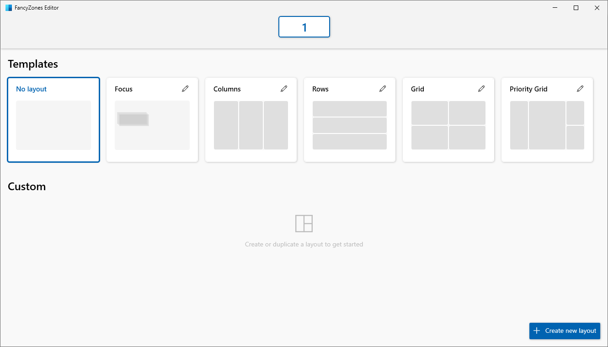

# FancyZones utility

FancyZones is a window manager utility for arranging and snapping windows into efficient layouts to improve the speed of your workflow and restore layouts quickly. FancyZones allows the user to define a set of window locations for a desktop that are drag targets for windows.  When the user drags a window into a zone, the window is resized and repositioned to fill that zone.  

## Getting started

### Enable

To get started using FancyZones, you need to enable the utility in PowerToys settings and then invoke the FancyZones editor UI.  

### Launch zones editor

Launch the zones editor using the button in the PowerToys Settings menu or by pressing <kbd>Win</kbd>+<kbd>`</kbd> (note that this shortcut can be changed in the settings dialog).  

 

### Elevated permission admin apps

If you have applications that are elevated, run in administrator mode, read [PowerToys and running as administrator](administrator.md) for more information.

## Choose your layout (Layout Editor)

When first launched, the zones editor presents a list of layouts that can be adjusted by how many windows are on the monitor. Choosing a layout shows a preview of that layout on the monitor. The selected layout is applied automatically. Double-clicking the layout will apply it and automatically dismiss the editor.

If multiple displays are in use, the editor will detect the available monitors and display them for the user to choose between. The chosen monitor will then be the target of the selected layout.

### Space around zones

The **Show space around zones** toggle enables you to determine what sort of border or margin will surround each FancyZone window. The **Space around zones** field enables you to set a custom value for how wide the border will be.

The **Distance to highlight adjacent zones** enables you to set a custom value for the amount of space between FancyZone windows until they snap together, or before both are highlighted enabling them to merge together.

With the Zones Editor open, check and uncheck the **Show space around zones** box after changing the values to see the new value applied.

### Creating a custom layout

The zones editor also supports creating and saving custom layouts. Select the **+ Create new layout** button at the bottom-right.
  
There are two ways to create custom zone layouts: **Grid** layout and **Canvas** layout. These can also be thought of as subtractive and additive models.  

The subtractive **Grid** model starts with a three column grid and allows zones to be created by splitting and merging zones, resizing the gutter between zones as desired.

To merge two zones, select and hold the left mouse button and drag the mouse until a second zone is selected, then release the button and a popup menu will show up.

The additive **Canvas** model starts with a blank layout and supports adding zones that can be dragged and resized similar to windows.

Canvas layout also has keyboard support for zone editing. Use the `Arrows` keys to move a zone by 10 pixels, or `Ctrl + Arrows` to move a zone by 1 pixel. Use the `Shift + Arrows` keys to resize a zone by 10 pixels (5 per edge), or `Ctrl + Shift + Arrows` to resize a zone by 2 pixels (1 per edge). To switch between the editor and dialog, press the `Ctrl + Tab` keys.

### Quickly changing between layouts

With a custom layout, this layout can be configured to a user-defined hotkey to quickly apply it to the desired desktop. The hotkey can be set by opening the custom layout's edit menu. Once set, the custom layout can be applied by pressing the `Win ⊞ + Ctrl + Alt + [hotkey]` binding. The layout can also be applied by pressing the hotkey when dragging a window.

In the demo below, we start with a default template applied to the screen and 2 custom layouts that we assign hotkeys for. We then use the `Win ⊞ + Ctrl + Alt + [hotkey]` binding to apply the first custom layout and bind a window to it. Finally, we apply the second custom layout while dragging a window and bind the window to it.

 

## Snapping a window to two or more zones

If two zones are adjacent, a window can be snapped to the sum of their area (rounded to the minimum rectangle that contains both). When the mouse cursor is near the common edge of two zones, both zones are activated simultaneously, allowing you to drop the window into both zones.  

It's also possible to snap to any number of zones: first drag the window until one zone is activated, then press and hold the `Control` key while dragging the window to select multiple zones.

To snap a window to multiple zone using only the keyboard, first turn on the two options `Override Windows Snap hotkeys (Win+Arrow) to move between zones` and `Move windows based on their position`. After snapping a window to one zone, use <kbd>Win</kbd> + <kbd>Control</kbd> + <kbd>Alt</kbd> + arrows to expand the window to multiple zones.

## Shortcut Keys

| Shortcut      | Action |
| ----------- | ----------- |
| Win ⊞ + \` | The Windows key + backtick (⊞ + \` ) launches the editor (this shortcut is editable in the settings dialog) |
| Win ⊞ + Left/Right Arrow | Move focused window between zones (only if `Override Windows Snap hotkeys` setting is turned on, in that case only the `Windows ⊞ key + Left Arrow` and `Windows key ⊞ + Right Arrow` are overridden, while the `Win ⊞ + Up Arrow` and `Win ⊞ + Down Arrow` keep working as usual) |

FancyZones doesn't override the Windows 10 `Win ⊞ + Shift + Arrow` to quickly move a window to an adjacent monitor.

## Settings

| Setting | Description |
| --------- | ------------- |
| Configure the zone editor hotkey | To change the default hotkey, click on the textbox (it's not necessary to select or delete the text) and then press on the keyboard the desired key combination |
| Hold Shift key to activate zones while dragging | Toggles between auto-snap mode with the shift key disabling snapping during a drag and manual snap mode where pressing the shift key during a drag enables snapping |
| Use a non-primary mouse button to toggle zone activation | When this option is on, clicking a non-primary mouse button toggles the zones activation |
| Override Windows Snap hotkeys (Win ⊞ +Arrow) to move between zones | When this option is on and FancyZones is running, it overrides two Windows Snap keys: `Win ⊞ + Left Arrow` and `Win ⊞ + Right Arrow` |
| Move windows based on their position | Allows to use Win ⊞ + Up/Down/Right/Left arrows to snap a window based on its position relatively to the zone layout |
| Move windows between zones across all monitors | When this option is off, snapping with Win ⊞ + Arrow cycles the window through the zones on the current monitor, when is on, it cycles the window through all the zones on all monitors |
| Keep windows in their zones when the screen resolution changes | After a screen resolution change, if this setting is enabled, FancyZones will resize and reposition windows into the zones they were previously in |
| During zone layout changes, windows assigned to a zone will match new size/positions | When this option is on, FancyZones will resize and position windows into the new zone layout by maintaining the previous zone number location of each window |
| Move newly created windows to the last known zone | Automatically move a newly opened window into the last zone location that application was in |
| Move newly created windows to the current active monitor [EXPERIMENTAL] | When this option is on, and "Move newly created windows to the last known zone" is off or the application doesn't have a last known zone, it keeps the application on the current active monitor |
| Restore the original size of windows when unsnapping | When this option is on, unsnapping a window will restore its size as before it was snapped |
| Follow mouse cursor instead of focus when launching editor in a multi-monitor  environment | When this option is on, the editor hotkey will launch the editor on the monitor where the mouse cursor is, when this option is off, the editor hotkey will launch the editor on monitor where the current active window is  |
| Show zones on all monitors while dragging a window | By default FancyZones shows only the zones available on the current monitor, this feature may have performance impact when turned on |
| Allow zones to span across monitors (all monitors must have the same DPI scaling) | This option allows to treat all connected monitors as one large screen. To work correctly it requires all monitors to have the same DPI scaling factor |
| Make dragged window transparent | When the zones are activated, the dragged window is made transparent to improve the zones visibility |
| Zone highlight color (Default #008CFF) | The color that a zone becomes when it is the active drop target during a window drag |
| Zone Inactive color (Default #F5FCFF) | The color that zones become when they are not an active drop during a window drag |
| Zone border color (Default #FFFFFF) | The color of the border of active and inactive zones |
| Zone opacity (%) (Default 50%) | The percentage of opacity of active and inactive zones |
| Exclude applications from snapping to zones | Add the applications name, or part of the name, one per line (e.g., adding `Notepad` will match both `Notepad.exe` and `Notepad++.exe`, to match only `Notepad.exe` add the `.exe` extension) |

