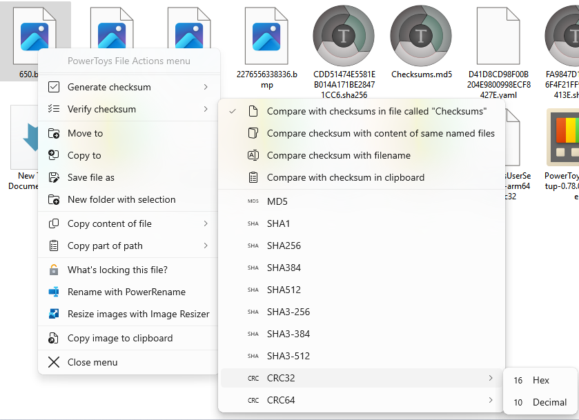

# File Actions menu

The PowerToys File Action Menu is a menu, which is invoked by a shortcut and allows you to perform certain actions on your selected files.

There are different constraints that can define when a menu entry is shown and when not:

1. Only one file has to be selected
1. Multiple files have to be selected
1. The selected file(s) have to be of type image
1. The selected file(s) need to be an executable or a dynamic link library
1. One of the selected files needs to be considered blocked by Windows
1. The selected file(s) has/have to be dicitionairy/-ies
1. Your clipboard must contain an image
1. File Actions Menu must be able to find an uninstaller associated with the selected file

|Title|Description|Shows when|
|-----|-----------|----------|
| Generate hashes | Generates a specified hash/checksum of a file. You can choose between 3 modes: **Multiple files**: Saves hashes in files with the name of the original file appended by the hash type. For example the sha256 hash of the file `setup.exe` will be saved as `setup.exe.sha256` **Single file**: Saves all the hashes in a single file called `hashe` with the hash type as extension. **Replace filename**: Replaces the filename of the selected file(s) with the hash of the files | Always |
| Verify hashes | Verifies all hashes against the selected verification method (Explanation can be found under Generate hashes). | Always |
| Copy paths seperated by ... | Allows you to copy the paths of the file separated by a comma, a semicolon, a space, a newline or a custom delimiter to the clipboard. | 2 |
| Copy path | Allows you to copy the path of the selected item in different ways: **Copy full path**: You can copy the path with a choosen path delimiter. You can choose between double backslash (`\\`), backslash (`\`) and forward slash (`/`). **Copy containing directory path**: Allows you to copy the path of the directory containing the item. **Copy file name**: Copies the name of the selected item **Copy containing directory path for WSL** and **Copy full path for WSL**: The same as their non-WSL equivalents, but the path can be used in WSL (ex. `C:/windows` will become `/mnt/c/windows`). | 1 |
| PowerRename | Launches the [PowerRename utility](./powerrename.md). | Always |
| ImageResizer | Launches the [ImageResizer utility](./image-resizer.md). | 3 |
| File Locksmith | Launches the [File Locksmith utility](./file-locksmith.md). | Always |
| Unblock | Unblocks from the web downloaded files | 5 |
| Copy image from clipboard to folder | Copies the image from the clipboard into the selected folder | 1, 6, 7 |
| Copy image to clipboard | Copies the currently selected image to the clipboard (as image type and not as a file). | 1, 3 |
| Copy to | Copy the selected files to another location, selectable via a folder browser dalog. | Always |
| Move to | Move the selected files to another location, selectable via a folder browser dalog. | Always |
| Save as | Saves the selected file to a new location, selectable via a save as dialog. | 1 |
| New folder with selection | Creates a new folder with the selected files. | Always |
| Uninstall | Uninstalls the selected application/the application to which this file belongs. | 4, 8 |
| Extract images | Extract images from the dll or the exe file into a folder of the same name. | 1, 4 |
| Merge contents | Merges the contents of the selected files into a new file | 2 |
| Copy content to clipboard | Copies the content of the selected file into the clipboard. If it is a directory the tree of the directory will be copied into the clipboard. | 1 |
| Collapse folder structure | Collapses the whole folder structure inside the selected folder | 1, 6 |
| Copy file content | Copies the file content into the clipboard in a certain way. **As plaintext**: Copies the whole file as normal text. **As base64 data link**: Copies the file content as a data url with base64 encoded content. For more information you can read the [specification](https://www.rfc-editor.org/rfc/rfc2397). **C escaped**: Copies the file content as a C escaped string (`\` → `\\`, newline → `\n\r`, etc.). **XML escaped**: Copies the content of the file with XML escape sequences (ex. `<` → `&#x3C;`) **C byte escaped**: Copies the file content, where every character is replaced with the ascii byte sequence (ex. `<` → `\0x3C`). **URI escaped**: Copies the file content ready to use for an URI (ex. `<` → `%3C`), | 1 |

## Supported hash types

> [!WARNING]
> Certain hash types are nowadays considered unsafe (like md5 or SHA1). Please inform yourself about the insecurities of the hash types you use.

Following types of hashes are supported.

- CRC32 Decimal
- CRC32 Hex
- CRC64 Decimal
- CRC64 Hex
- MD5
- SHA1
- SHA256
- SHA384
- SHA512
- SHA3-256
- SHA3-384
- SHA3-512

## Resolve shortcut

Some actions allow the option to resolve shortcuts. This will target the files that the shortcuts point to instead of the `.ink`-file itsself.
