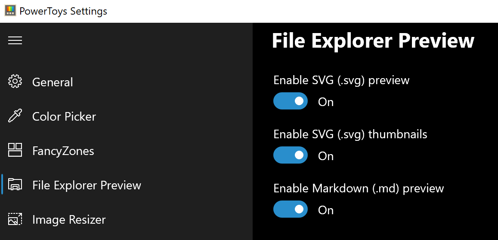
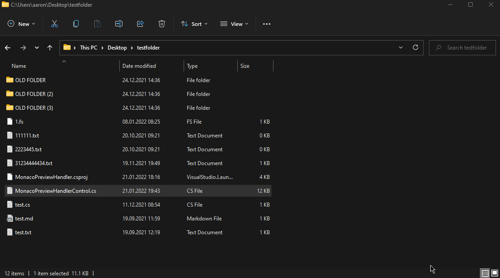
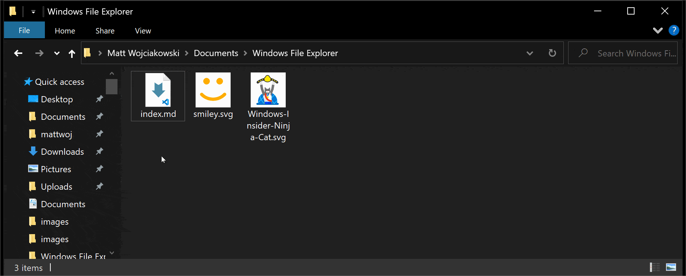

# File Explorer add-ons utility

> [!WARNING]
> Enabling the preview handlers will override other preview handlers already installed - there have been reports of incompatibility between Outlook and the PDF Preview Handler.

File Explorer add-ons currently include:

- Preview Pane rendering for:
  - SVG icons (.svg)
  - Markdown files (.md)
  - Source code files (.cs, .cpp, .rs, ...)
  - PDF files (.pdf)
  - G-code files (.gcode)

- Thumbnail preview for:
  - SVG icons (.svg)
  - PDF files (.pdf)
  - G-code files (.gcode)
  - STL files (.stl)

## Enable PowerToys Thumbnail Previews

> [!NOTE]
> A reboot may be required after enabling the thumbnail previewer for the settings to take effect.
> Thumbnails might not appear on paths managed by cloud storage solutions like OneDrive, since these solutions may get their thumbnails from the cloud instead of generating them locally.
Showing thumbnails is a built-in Windows feature. For thumbnail preview, PowerToys adds multiple extensions: SVG, PDF, G-code and STL.

To enable preview support, set the extension to **On**.

### Settings for Stereolithography (.stl) files

You can expand the **STL** section to change the background color.

## Preview Pane previewers in PowerToys

Preview Pane is an existing feature in the Windows File Explorer which allows you to see a preview of the file's contents in the view's reading pane. PowerToys adds multiple extensions: Markdown, SVG, PDF, and G-code. In addition to those, PowerToys also adds support for source code files (for more than 150 file extensions).

### Settings for Source code files previewer

You can expand the **Source code files (Monaco)** section to change the following settings.

| Setting | Description |
| :-- | :-- |
| Wrap text | Enable or disable word wrapping. |
| Try to format the source for preview | Enable or disable formatting of the source code for json and xml files. The original file stays unchanged. |
| Maximum file size to preview | Maximum file size in kilobytes to preview. |

### Enabling PowerToys Preview Pane

To enable preview support, set the extension to **On**.

If the preview pane does not appear to work after setting the extension to **On**, there is an advanced setting in Windows that may be blocking the preview handler. Open the **Options** menu in Windows File Explorer and select the **View** tab. Under the **View** tab, you will see a list of **Advanced settings**. Ensure that **Show preview handlers in preview pane** has a check next to it in order for the preview pane to display.

### Enabling in Windows 11

Open Windows File Explorer, select the **View** menu in the File Explorer ribbon. Hover over **Show**, and then select **Preview pane**.

### Enabling in Windows 10

Open Windows File Explorer, select the **View** tab in the File Explorer ribbon, and then select **Preview Pane**.

> [!NOTE]
> It is not possible to change the background color of the preview pane, so if you are working with transparent SVG images with white shapes, you may not be able to see them in the preview.
