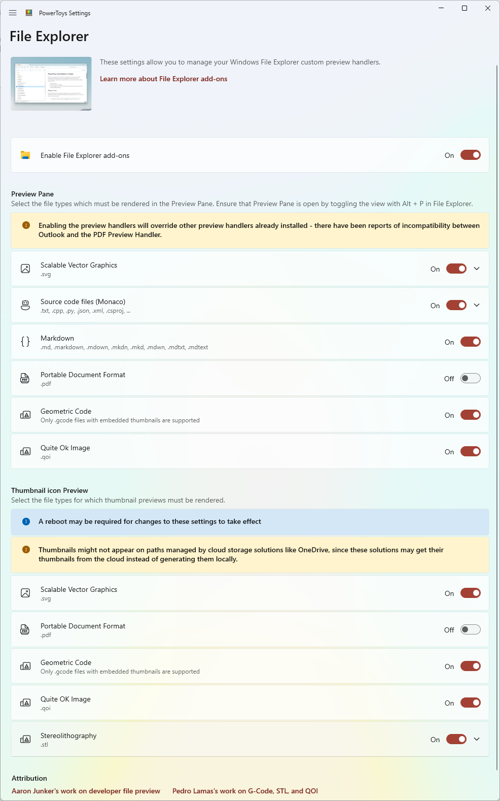

# File Explorer add-ons utility

File Explorer add-ons currently includes:

- Preview Pane rendering for:
  - SVG icons (.svg)
  - Markdown files (.md)
  - Source code files (.cs, .cpp, .rs, ...)
  - PDF files (.pdf)
  - G-code files (.gcode)
- Thumbnail preview for:
  - SVG icons (.svg)
  - PDF files (.pdf)
  - G-code files (.gcode)
  - STL files (.stl)

## Preview Pane

Preview Pane is an existing feature in the Windows File Explorer which shows a lightweight, rich, read-only preview of the file's contents in the view's reading pane. PowerToys adds four extensions: Markdown, SVG, PDF and G-Code. Additionally, PowerToys adds support for source code files (for over 150 file extensions).

### Enabling Preview Pane

To enable, first ensure that in the PowerToys Settings all are set to **On**.

> [!NOTE]
> Windows Explorer has an additional setting that needs to be checked in order for preview handlers to work. Open Explorer's Folder options, go to tab "View", under "Advanced settings" check **Show preview handlers in preview pane**.

**Windows 10:**

Next, open Windows File Explorer, select the **View** tab in the File Explorer ribbon, then select **Preview Pane**.

**Windows 11:**

Next, open Windows File Explorer, open the **View** menu in the File Explorer ribbon, then hover **Show**, then select **Preview pane**.

## Thumbnail preview

Showing thumbnails is a built-in Windows feature. PowerToys adds three extensions: SVG, PDF and G-Code.