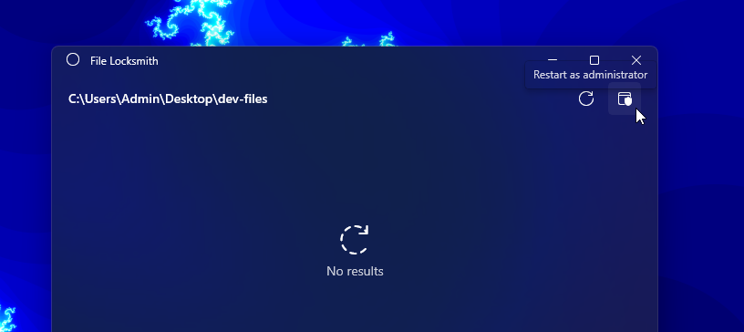

# File Locksmith utility

File Locksmith is a Windows shell extension for checking which files are in use and by which processes.

## Activating and using File Locksmith

To activate File Locksmith, open PowerToys and turn on the **Enable File Locksmith** toggle. Select one or more files or directories in Windows File Explorer. If a directory is selected, all of its files and subdirectories will be scanned as well. Right-click on the selected file(s), select **Show more options** from the menu to expand your list of menu options, then select **What's using this file?** to open File Locksmith and see which processes are using the file(s).

When File Locksmith is activated, it will scan all of the running processes that it can access, checking which files the processes are using. Processes that are being run by a different user cannot be accessed and may be missing from the list of results. To scan all processes, select **Restart as administrator**.

After scanning, a list of processes will be displayed. Select **End task** to terminate the process, or select the expander to show more information.
File Locksmith will automatically remove terminated processes from the list, whether or not this action was done via File Locksmith. To manually refresh the list of processes, select **Reload**.

## See also

- [PowerToys overview](index.md)
- [Installing PowerToys](install.md)
