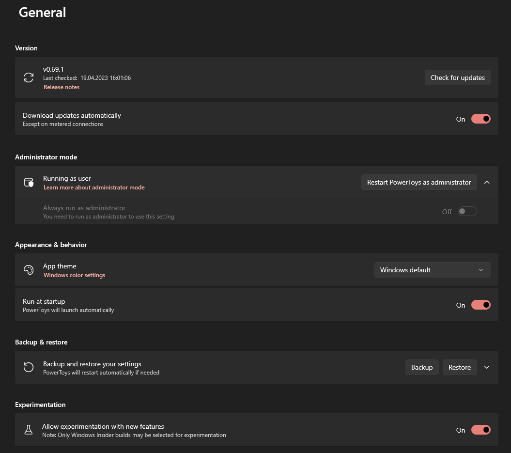

# General settings for PowerToys

The general section of Microsoft PowerToys contains the following settings:

## Version

Here you can check for new updates and if one is available, you can download and install it. You can set if updates should be downloaded automatically.

## Administrator mode

Read more about the administrator mode in the [PowerToys running with administrator permissions](./administrator.md) section of the documentation.

## Appearance & behavior

### App theme

Here you can set the theme of the PowerToys settings app and the PowerToys flyout: **Dark**, **Light**, or **Windows default**.

### Run at startup

If activated, PowerToys will start automatically when you log in to Windows.

## Backup & restore

Set a location where you want to save your PowerToys settings. You can also restore your settings from a backup.

## Experimentation

Will activate experimentation with new features on Windows Insider builds, if availabe.
