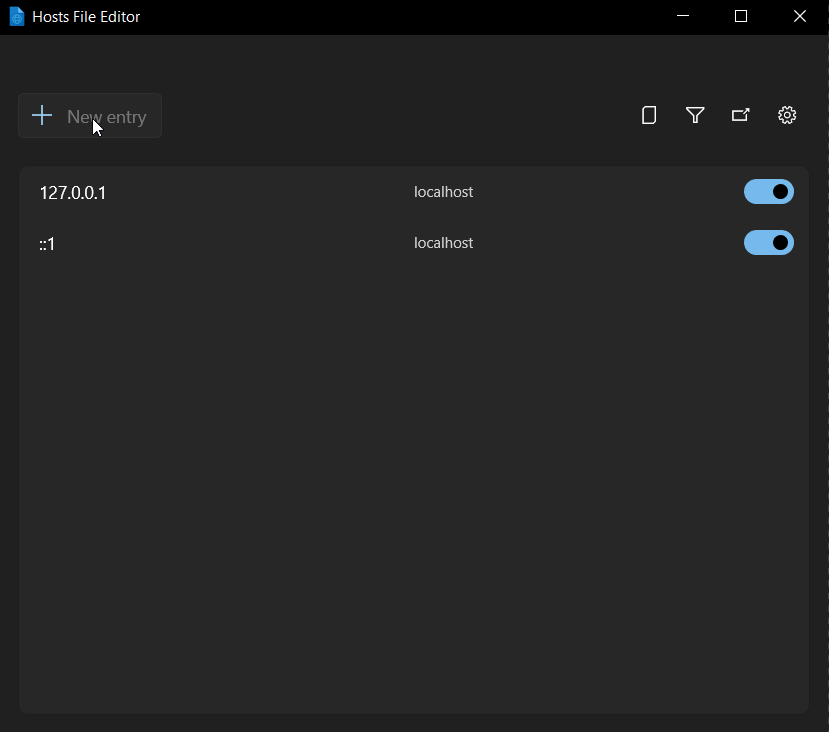
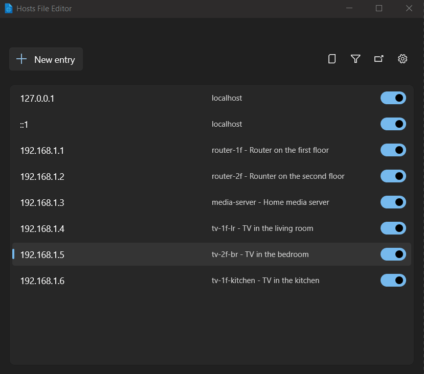
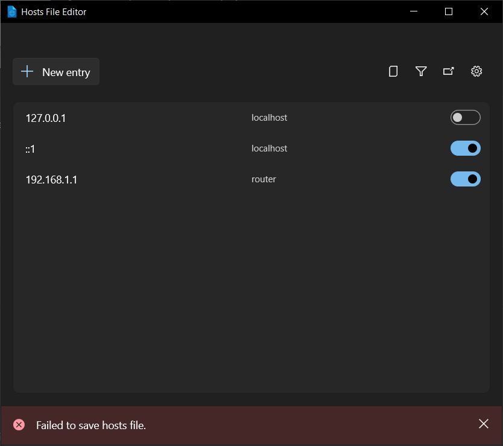

# Hosts File Editor utility

Windows includes a local "Hosts" file that contains domain names and matching IP addresses, acting as a map to identify and locate hosts on IP networks. Every time you visit a website, your computer will check the hosts file first to see which IP address it connects to. If the information is not there, your internet service provider will look into the <abbr title="Domain Name Server">DNS</abbr> for the resources to load the site.

The Hosts File Editor provides a convenient way to edit the hosts file configuration. This can be useful for scenarios like migrating a website to a new hosting provider or domain name, which may take a 24-48 hour period of downtime. Creating a custom IP address to associate with your domain using the hosts file can enable you to see how it will look on the new server.

## Adding a new entry

Ensure that the Hosts File Editor is set to **On** in the PowerToys Settings.

To add a new entry using the Hosts File Editor:

- Select **New entry**
- Enter the IP address
- Enter the Host name
- Enter any comments that may be helpful in identifying the purpose of the entry
- Turn on the **Active** toggle and select **Add**

## Filtering host file entries

To filter host file entries, select the filter icon and then enter characters in either the Address, Hosts, or Comment field to narrow the scope of results.

## Backing up the hosts file

Hosts File Editor creates a backup of the hosts file before editing session. The backup files are located near the hosts file in `%SystemRoot%/System32/drivers/etc` named `hosts_PowerToysBackup_YYYYMMDDHHMMSS`.

## Settings

From the Settings menu, the following options can be configured:

| Setting | Description |
| :--- | :--- |
| Launch as administrator | Launch as administrator to be able edit the hosts file. If disabled, the editor is run in read-only mode. Hosts File Editor is started as administrator by default. |
| Show a warning at startup | Warns that editing hosts can change DNS names resolution. Enabled by default. |
| Additional lines position | Default value is **Top**. If **Bottom** is selected, the file header is moved below hosts settings to the bottom. |
| Consider loopback addresses as duplicates | Loopback addresses (like 127.0.0.1 and ::1) are considered as duplicates. |

## Troubleshooting Hosts File Editor

A "Failed to save hosts file" error appears if a change is made without administrator permissions:

Select **Launch as administrator** in settings to fix the error.
