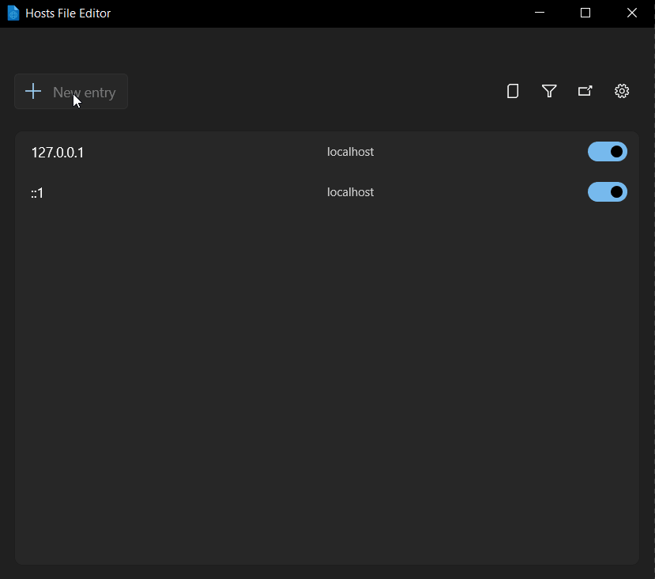
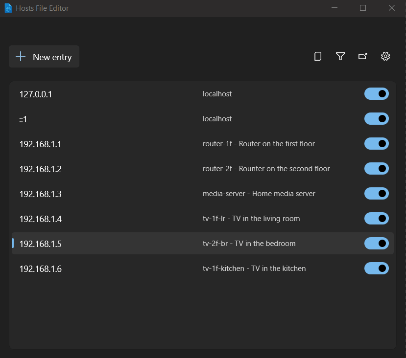
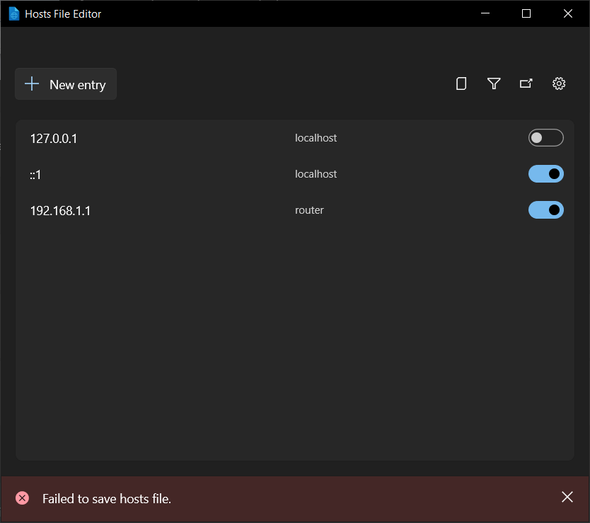

# Hosts File Editor utility

The PowerToys Hosts File Editor utility provides a convenient way to edit Windows hosts files. Windows includes a local "Hosts" file that contains domain names and matching IP addresses. This file acts as a map to identify and locate hosts on IP networks. Every time you visit a website, your computer will check the hosts file first to see which IP address it connects to. If the information isn't there, your internet service provider (ISP) will look into the Domain Name Server (DNS) for the resources to load the site.

This utility is useful for scenarios like migrating a website to a new hosting provider or domain name, which may take a 24-48 hour period of downtime. Creating a custom IP address to associate with your domain using the hosts file can allow you to see how it will look on the new server.

## Adding a new entry

Ensure that the Hosts File Editor is set to **On** in the PowerToys Settings.

To add a new entry using the Hosts File Editor:

- Select **New entry**
- Enter the IP address
- Enter the Host name
- Enter any comments that may be helpful in identifying the purpose of the entry
- Turn on the **Active** toggle and select **Add**

## Filtering host file entries

To filter host file entries, select the filter icon and enter data in either the Address, Hosts, or Comment field to narrow the scope of results.

## Back up Hosts file

Hosts File Editor creates a backup of the hosts file before editing session. By default backup files are located near the hosts file in `%SystemRoot%\System32\drivers\etc` named `hosts_PowerToysBackup_YYYYMMDDHHMMSS`.

Backups are deleted after 15 days, but the most recent 5 are always kept. This behavior can be configured in the PowerToys Settings.

## Settings

From the Settings menu, the following options can be configured:

| Setting | Description |
| :--- | :--- |
| Open as administrator | Open as administrator to be able edit the hosts file. If disabled, the editor is run in read-only mode. Hosts File Editor is started as administrator by default. |
| Show a warning at startup | Warns that editing hosts can change DNS names resolution. Enabled by default. |
| Placement of additional content | Determines where new host entries are added in the hosts file. Default value is **Top** (new entries are added near the top of the file after the default Windows header comments). If **Bottom** is selected, new entries are added at the end of the file. This affects the organization of your hosts file and can impact which entries take precedence if there are conflicts. |
| Consider loopback addresses as duplicates | When enabled, multiple loopback addresses (127.0.0.1, ::1) pointing to the same hostname are treated as duplicates. This prevents adding redundant entries and helps avoid conflicts. When disabled, you can add multiple loopback entries for the same hostname, which may be useful for testing different network configurations but could lead to unexpected behavior. |
| Encoding | Default value is **UTF-8**. If **UTF-8 with BOM** is selected, a Byte Order Mark (BOM) is included at the start of the file. |
| Backups hosts file | If enabled, a backup of the hosts file is created when you save for the first time in a session. |
| Location | Specify where backups are created. Default `%SystemRoot%\System32\drivers\etc`. |
| Automatically delete backups | Choose **Never**, **Based on count** or **Based on age and count**. |
| Backup count | When **Automatically delete backups** is **Based on count**, determine the number of backups to keep. Older backups will be deleted once the limit is reached. |
| Days | When **Automatically delete backups** is **Based on age and count**, determine the number of days to keep backups. Older backups will be deleted once the limit is reached. An optional count of backups can be configured to always keep a fixed number of backups despite their age. |

**Note:** The Hosts File Editor can't be launched with a shortcut key. To open the Hosts File Editor, select the PowerToys icon in the system tray and select **Hosts File Editor**.

## Troubleshooting

A "Failed to save hosts file" message appears if a change is made without administrator permissions:

Select **Open as administrator** in settings to fix the error.

[!INCLUDE [install-powertoys.md](../includes/install-powertoys.md)]
