# PowerToys: Utilities to customize Windows

:::image type="content" border="false" source="../images/pt-header.png" alt-text="Hero image of PowerToys with app icons of all its utilities":::

Microsoft PowerToys is a set of utilities to tune and streamline your Windows experience for greater productivity. These utilities and shell enhancement tools are designed to help you customize Windows to suit your needs.

> [!div class="nextstepaction"]
> [Install PowerToys](install.md)

PowerToys is an open-source project. Visit GitHub to explore the codebase, report issues, contribute, and stay up to date with what’s new in each release.

    <a href="https://github.com/microsoft/PowerToys"
       class="button button-sm">
        
        View on GitHub
    </a>
    <a href="https://github.com/microsoft/PowerToys/releases"
       class="button button-sm">
        What's new
    </a>

## Utilities

The currently available utilities include:

:::row:::
    :::column:::
        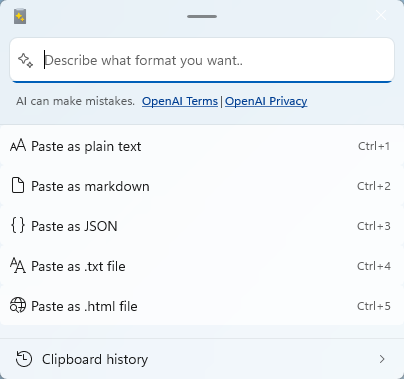
    :::column-end:::
    :::column:::
        **[Advanced Paste](advanced-paste.md)**
    :::column-end:::
    :::column:::
        A tool that enables you to paste the text from your clipboard into any format needed. It can be enhanced with an AI-powered option that is 100% opt-in and requires an OpenAI key.
    :::column-end:::
:::row-end:::

:::row:::
    :::column:::
        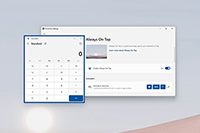
    :::column-end:::
    :::column:::
        **[Always On Top](always-on-top.md)**
    :::column-end:::
    :::column:::
        Enables you to pin windows above other windows with a quick key shortcut (<kbd>⊞ Win</kbd>+<kbd>Ctrl</kbd>+<kbd>T</kbd>).
    :::column-end:::
:::row-end:::

:::row:::
    :::column:::
        
    :::column-end:::
    :::column:::
        **[PowerToys Awake](awake.md)**
    :::column-end:::
    :::column:::
        Designed to keep a computer awake without having to manage its power & sleep settings. This behavior can be helpful when running time-consuming tasks, ensuring that the computer doesn't go to sleep or turn off its displays.
    :::column-end:::
:::row-end:::

:::row:::
    :::column:::
        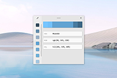
    :::column-end:::
    :::column:::
        **[Color Picker](color-picker.md)**
    :::column-end:::
    :::column:::
        A system-wide color picking utility activated with <kbd>⊞ Win</kbd>+<kbd>Shift</kbd>+<kbd>C</kbd>. It allows you to pick colors from anywhere on the screen, and the picker automatically copies the color to your clipboard in a specified format. Color Picker contains an editor that shows a history of previously picked colors and allows you to fine-tune the selected color and to copy different string representations. The code for this utility is based on [Martin Chrzan's Color Picker](https://github.com/martinchrzan/ColorPicker).
    :::column-end:::
:::row-end:::

:::row:::
    :::column:::
        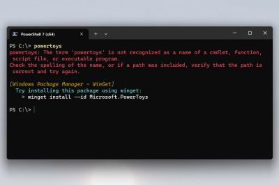
    :::column-end:::
    :::column:::
        **[Command Not Found](cmd-not-found.md)**
    :::column-end:::
    :::column:::
        A PowerShell 7 module that detects an error thrown by a command and suggests a relevant WinGet package to install, if one is available.
    :::column-end:::
:::row-end:::

:::row:::
    :::column:::
        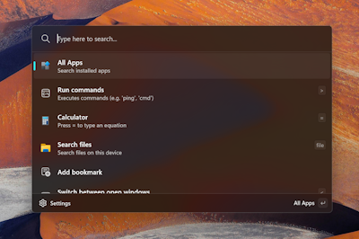
    :::column-end:::
    :::column:::
        **[Command Palette](command-palette/overview.md)**
    :::column-end:::
    :::column:::
        Allows you to easily access all of your most frequently used commands, apps, and development tools - all from a single solution that is fast, customizable to your unique preferences, and extensible to include your favorite apps. The Command Palette is intended to be the successor of [PowerToys Run](run.md).
    :::column-end:::
:::row-end:::

:::row:::
    :::column:::
        
    :::column-end:::
    :::column:::
        **[Crop And Lock](crop-and-lock.md)**
    :::column-end:::
    :::column:::
        A utility that creates a new, fully-interactive window that's a crop or a thumbnail of another window.
    :::column-end:::
:::row-end:::

:::row:::
    :::column:::
        
    :::column-end:::
    :::column:::
        **[Environment Variables](environment-variables.md)**
    :::column-end:::
    :::column:::
        Offers an easy and convenient way to manage environment variables. You can create profiles to manage a set of variables together.
    :::column-end:::
:::row-end:::

:::row:::
    :::column:::
        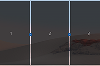
    :::column-end:::
    :::column:::
        **[FancyZones](fancyzones.md)**
    :::column-end:::
    :::column:::
        A window manager that makes it easy to create complex window layouts and quickly position windows into those layouts.
    :::column-end:::
:::row-end:::

:::row:::
    :::column:::
        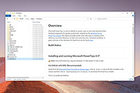
    :::column-end:::
    :::column:::
        **[File Explorer add-ons](file-explorer.md)**
    :::column-end:::
    :::column:::
        Enable Preview pane and thumbnail rendering in File Explorer to display a variety of file types. To open the Preview pane, go to **View** in File Explorer and select **Preview Pane**.
    :::column-end:::
:::row-end:::

:::row:::
    :::column:::
        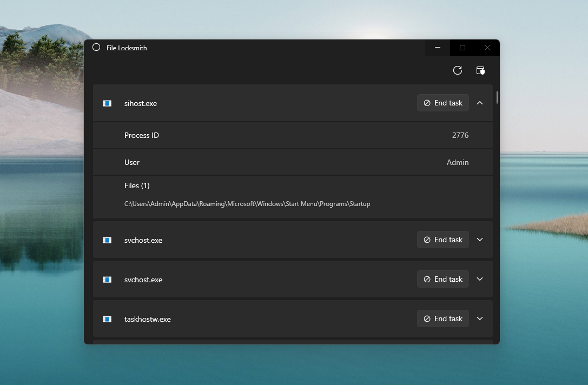
    :::column-end:::
    :::column:::
        **[File Locksmith](file-locksmith.md)**
    :::column-end:::
    :::column:::
        A Windows shell extension to check which files are in use and by which processes. Right-click on one or more selected files in File Explorer and select **Unlock with File Locksmith**.
    :::column-end:::
:::row-end:::

:::row:::
    :::column:::
        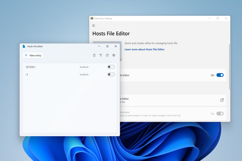
    :::column-end:::
    :::column:::
        **[Hosts File Editor](hosts-file-editor.md)**
    :::column-end:::
    :::column:::
        A utility that provides a convenient way to edit the 'Hosts' file in Windows that contains domain names and matching IP addresses, acting as a map to identify and locate hosts on IP networks.
    :::column-end:::
:::row-end:::

:::row:::
    :::column:::
        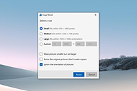
    :::column-end:::
    :::column:::
        **[Image Resizer](image-resizer.md)**
    :::column-end:::
    :::column:::
        A Windows Shell extension for quickly resizing images. With a right-click in File Explorer, instantly resize one or many images. The code in this extension is based on [Brice Lambson's Image Resizer](https://github.com/bricelam/ImageResizer).
    :::column-end:::
:::row-end:::

:::row:::
    :::column:::
        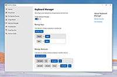
    :::column-end:::
    :::column:::
        **[Keyboard Manager](keyboard-manager.md)**
    :::column-end:::
    :::column:::
        Allows you to customize the keyboard to be more productive by remapping keys and creating your own keyboard shortcuts.
    :::column-end:::
:::row-end:::

:::row:::
    :::column:::
        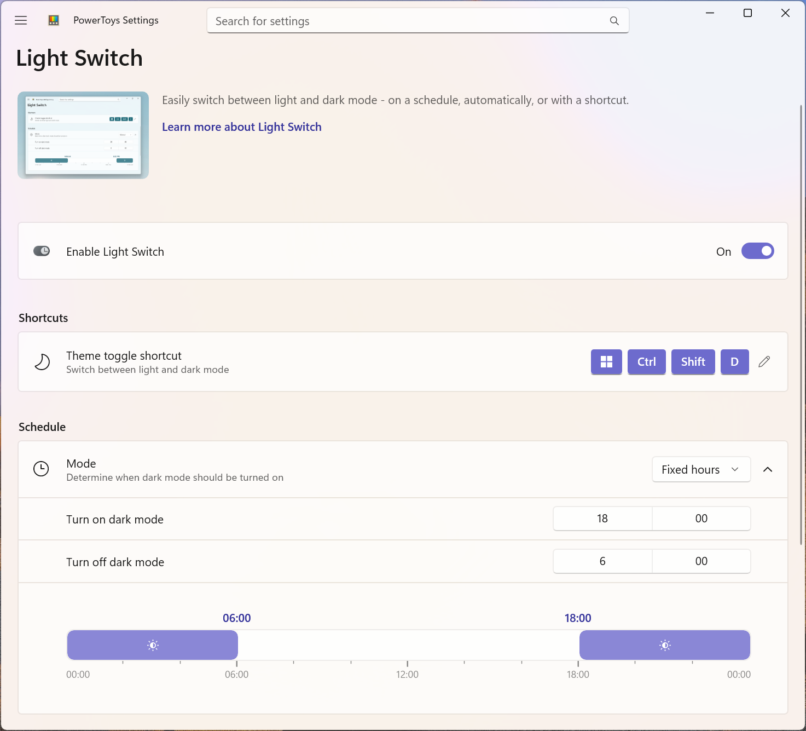
    :::column-end:::
    :::column:::
        **[Light Switch](light-switch.md)**
    :::column-end:::
    :::column:::
        Allows you to automatically switch between light and dark themes in Windows based on the time of day.
    :::column-end:::
:::row-end:::

:::row:::
    :::column:::
        
    :::column-end:::
    :::column:::
        **[Mouse utilities](mouse-utilities.md)**
    :::column-end:::
    :::column:::
        Add functionality to enhance your mouse and cursor. **Find My Mouse**: Quickly locate your mouse pointer with a spotlight that focuses on its current position. This feature is based on source code developed by [Raymond Chen](https://github.com/oldnewthing). **Mouse Highlighter**: Displays visual indicators when basic mouse buttons are clicked. **Mouse Jump**: Allows a quick jump on large displays. **Mouse Pointer Crosshairs**: Draws crosshairs centered on the mouse pointer.
    :::column-end:::
:::row-end:::

:::row:::
    :::column:::
        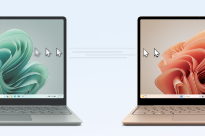
    :::column-end:::
    :::column:::
        **[Mouse Without Borders](mouse-without-borders.md)**
    :::column-end:::
    :::column:::
        Interact with multiple computers from the same keyboard and mouse, while seamlessly sharing clipboard contents and files between the machines.
    :::column-end:::
:::row-end:::

:::row:::
    :::column:::
        
    :::column-end:::
    :::column:::
        **[New+](newplus.md)**
    :::column-end:::
    :::column:::
        Enables you to create files and folders from a personalized set of templates in File Explorer.
    :::column-end:::
:::row-end:::

:::row:::
    :::column:::
        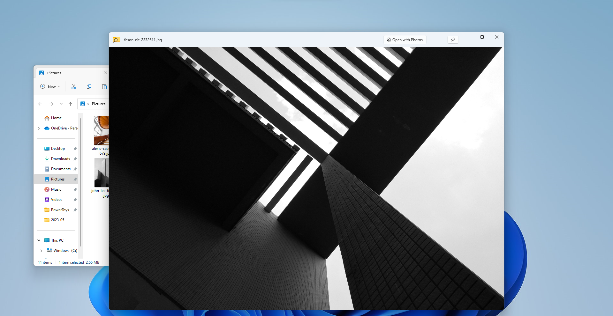
    :::column-end:::
    :::column:::
        **[Peek](peek.md)**
    :::column-end:::
    :::column:::
        Allows you to preview file content without the need to open multiple applications or interrupt your workflow. You can simply select a file and use the shortcut (<kbd>Ctrl</kbd>+<kbd>Space</kbd>).
    :::column-end:::
:::row-end:::

:::row:::
    :::column:::
        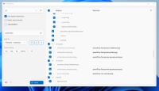
    :::column-end:::
    :::column:::
        **[PowerRename](powerrename.md)**
    :::column-end:::
    :::column:::
        Perform bulk renaming; searching and replacing file names. It includes advanced features, such as using regular expressions, targeting specific file types, previewing expected results, and the ability to undo changes. The code in this utility is based on [Chris Davis's SmartRename](https://github.com/chrdavis/SmartRename).
    :::column-end:::
:::row-end:::

:::row:::
    :::column:::
        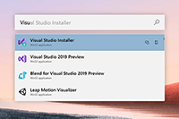
    :::column-end:::
    :::column:::
        **[PowerToys Run](run.md)**
    :::column-end:::
    :::column:::
        Search and open your apps instantly. To open Run, use the shortcut <kbd>Alt</kbd>+<kbd>Space</kbd> and start typing. It's open source and modular, and it supports additional plugins.
    :::column-end:::
:::row-end:::

:::row:::
    :::column:::
        
    :::column-end:::
    :::column:::
        **[Quick Accent](Quick-accent.md)**
    :::column-end:::
    :::column:::
        Provides an alternative way to type accented characters. It's useful when a keyboard doesn't support a specific character with a quick key combo.
    :::column-end:::
:::row-end:::

:::row:::
    :::column:::
        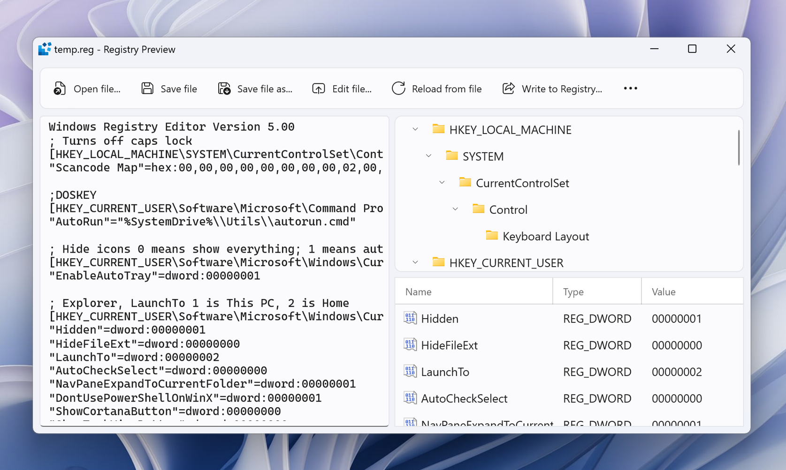
    :::column-end:::
    :::column:::
        **[Registry Preview](registry-preview.md)**
    :::column-end:::
    :::column:::
        A utility to visualize and edit Windows Registry files.
    :::column-end:::
:::row-end:::

:::row:::
    :::column:::
        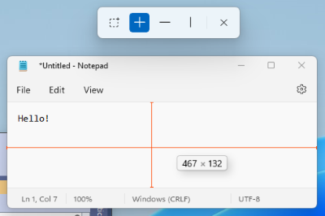
    :::column-end:::
    :::column:::
        **[Screen Ruler](screen-ruler.md)**
    :::column-end:::
    :::column:::
        Quickly measure pixels on your screen based on image edge detection. To activate, use the shortcut <kbd>⊞ Win</kbd>+<kbd>Shift</kbd>+<kbd>M</kbd>. This tool was inspired by [Pete Blois's Rooler](https://github.com/peteblois/rooler).
    :::column-end:::
:::row-end:::

:::row:::
    :::column:::
        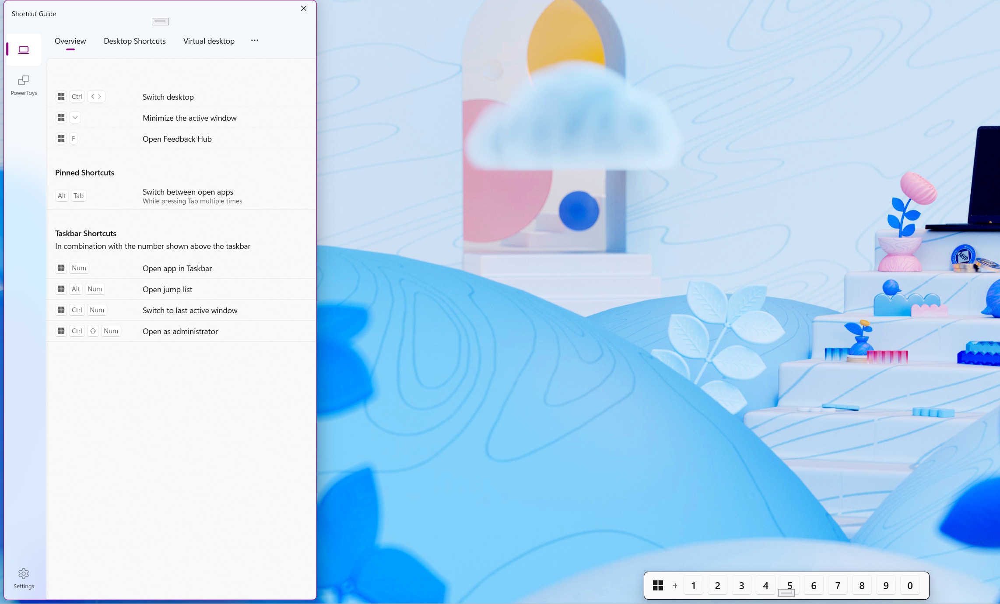
    :::column-end:::
    :::column:::
        **[Shortcut Guide](shortcut-guide.md)**
    :::column-end:::
    :::column:::
        Appears when you press <kbd>⊞ Win</kbd>+<kbd>Shift</kbd>+<kbd>/</kbd> (or as we like to think, <kbd>⊞ Win</kbd>+<kbd>?</kbd>) and shows the available shortcuts for the current state of the desktop. You can also use it by pressing and holding <kbd>⊞ Win</kbd>.
    :::column-end:::
:::row-end:::

:::row:::
    :::column:::
        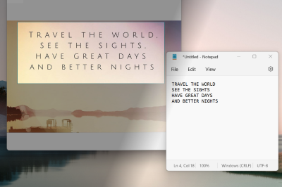
    :::column-end:::
    :::column:::
        **[Text Extractor](text-extractor.md)**
    :::column-end:::
    :::column:::
        A convenient way to copy text from anywhere on your screen. To activate, use the shortcut <kbd>⊞ Win</kbd>+<kbd>Shift</kbd>+<kbd>T</kbd>. This code is based on [Joe Finney's Text Grab](https://github.com/TheJoeFin/Text-Grab).
    :::column-end:::
:::row-end:::

:::row:::
    :::column:::
        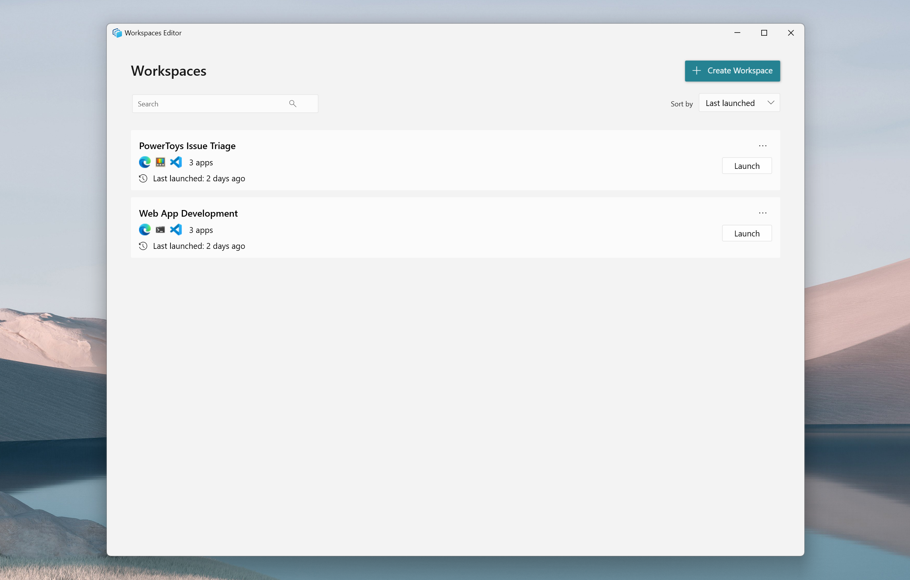
    :::column-end:::
    :::column:::
        **[Workspaces](workspaces.md)**
    :::column-end:::
    :::column:::
        A desktop manager utility for launching a set of applications to custom positions and configurations with a single click. Open the editor by selecting "Launch editor" from settings or by using the shortcut <kbd>⊞ Win</kbd>+<kbd>Ctrl</kbd>+<kbd>`</kbd>.
    :::column-end:::
:::row-end:::

:::row:::
    :::column:::
        
    :::column-end:::
    :::column:::
        **[ZoomIt](zoomit.md)**
    :::column-end:::
    :::column:::
        A screen zoom, annotation, and recording tool for technical presentations and demos. It's one of the most popular [Sysinternals](/sysinternals/) utilities, and it's now available in PowerToys.
    :::column-end:::
:::row-end:::

## How to contribute to PowerToys

PowerToys welcomes your contributions! The PowerToys development team is excited to partner with the power user community to build the best Windows utilities that help users get the most out of their workflows. There are a variety of ways to contribute:

- Write a [tech spec](https://codeburst.io/on-writing-tech-specs-6404c9791159)
- Submit a [design concept or recommendation](https://www.microsoft.com/design/inclusive/)
- [Contribute to documentation](/contribute/)
- Identify and fix bugs in the [source code](https://github.com/microsoft/PowerToys/tree/main/src)
- [Code new features and PowerToy utilities](https://github.com/microsoft/PowerToys/tree/main/doc/devdocs)

Before starting work on a feature that you would like to contribute, **read the [Contributor's Guide](https://github.com/microsoft/PowerToys/blob/main/CONTRIBUTING.md)**. The PowerToys team will be happy to work with you to figure out the best approach, provide guidance and mentorship throughout feature development, and help avoid any wasted or duplicate effort.

You can consult the [PowerToys Developer Documentation](https://github.com/microsoft/PowerToys/tree/main/doc/devdocs) for more information on how to get started with PowerToys development and work through any issues you may encounter. These docs have recently been updated to provide development and debugging guidance for the various PowerToys utilities, including how to set up your development environment, build the code, and run the utilities.

## Issues and troubleshooting

You can search known issues or file a new issue in the [Issues](https://github.com/microsoft/PowerToys/issues) tab of the PowerToys repository on GitHub. If you don't find the issue you are experiencing, you can [Report a Bug](https://github.com/microsoft/PowerToys/issues/new/choose) on the PowerToys product repo.