# PowerToys: Utilities to customize Windows

:::image type="content" border="false" source="images/index/header.png" alt-text="Hero image of PowerToys with app icons of all its utilities":::

Microsoft PowerToys is a set of free, open-source utilities designed to help power users and developers get more out of Windows. It builds on familiar Windows experiences and adds thoughtful tools that boost productivity, streamline workflows, and unlock customization options that don’t exist out of the box. From managing window layouts and remapping keys to launching commands instantly and automating everyday tasks, PowerToys is all about removing friction and letting you focus on what you want to get done—faster, smarter, and with more control.

> [!div class="nextstepaction"]
> [Install PowerToys](install.md)

PowerToys is an open-source project. Visit GitHub to explore the codebase, report issues, contribute, and stay up to date with what’s new in each release.

    <a href="https://github.com/microsoft/PowerToys"
       class="button button-sm">
        
        View on GitHub
    </a>
    <a href="https://github.com/microsoft/PowerToys/releases"
       class="button button-sm">
        What's new
    </a>

## Utilities

The currently available utilities include:

:::row:::
    :::column:::
       [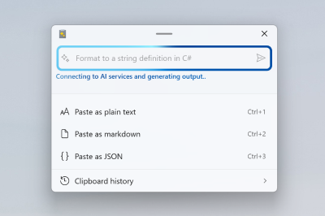](advanced-paste.md) 
        **[Advanced Paste](advanced-paste.md)** 
        Paste text from your clipboard into any format needed. Includes an optional AI-powered feature.
    :::column-end:::
    :::column:::
        
        **[Always On Top](always-on-top.md)** 
        Pin windows above other windows with a quick key shortcut.
    :::column-end:::
    :::column:::
       [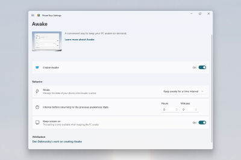](awake.md) 
        **[Awake](awake.md)** 
        Keep a computer awake without managing power & sleep settings.
    :::column-end:::
:::row-end:::

:::row:::
    :::column:::
       [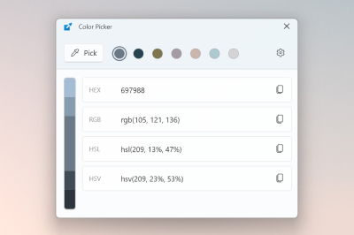](color-picker.md) 
        **[Color Picker](color-picker.md)** 
        A system-wide color picking utility to pick colors from anywhere on the screen.
    :::column-end:::
    :::column:::
        
        **[Command Not Found](cmd-not-found.md)** 
        A PowerShell 7 module that suggests WinGet packages when a command fails.
    :::column-end:::
    :::column:::
       [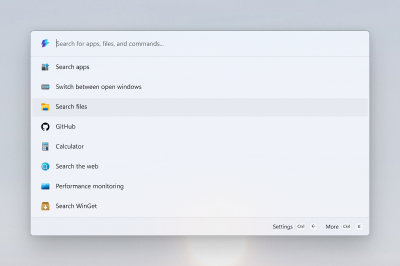](command-palette/overview.md) 
        **[Command Palette](command-palette/overview.md)** 
        Access frequently used commands, apps, and tools from a single, fast, customizable interface.
    :::column-end:::
:::row-end:::

:::row:::
    :::column:::
       [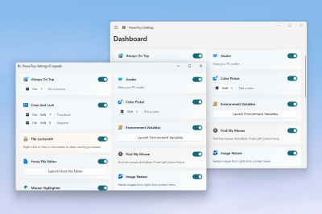](crop-and-lock.md) 
        **[Crop And Lock](crop-and-lock.md)** 
        Create a cropped or thumbnail window of another window that stays interactive.
    :::column-end:::
    :::column:::
       [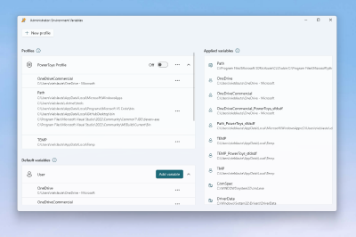](environment-variables.md) 
        **[Environment Variables](environment-variables.md)** 
        Manage environment variables with profiles to group variables together.
    :::column-end:::
    :::column:::
       [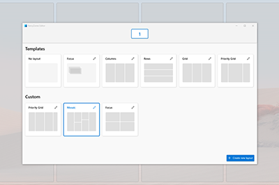](fancyzones.md) 
        **[FancyZones](fancyzones.md)** 
        A window manager for creating complex window layouts and positioning windows quickly.
    :::column-end:::
:::row-end:::

:::row:::
    :::column:::
       [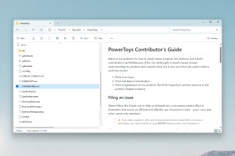](file-explorer.md) 
        **[File Explorer add-ons](file-explorer.md)** 
        Enable Preview pane and thumbnail rendering for various file types in File Explorer.
    :::column-end:::
    :::column:::
       [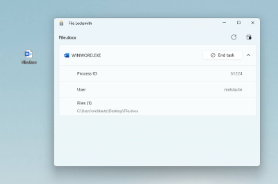](file-locksmith.md) 
        **[File Locksmith](file-locksmith.md)** 
        Check which files are in use and by which processes from the File Explorer context menu.
    :::column-end:::
    :::column:::
       [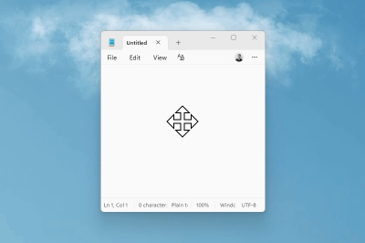](grab-and-move.md) 
        **[Grab And Move](grab-and-move.md)** 
        Move and resize windows by holding a modifier key and dragging anywhere inside the window.
    :::column-end:::
:::row-end:::

:::row:::
    :::column:::
       [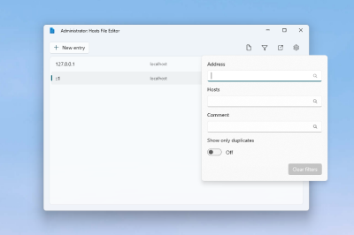](hosts-file-editor.md) 
        **[Hosts File Editor](hosts-file-editor.md)** 
        Edit the Windows Hosts file containing domain names and IP addresses.
    :::column-end:::
    :::column:::
       [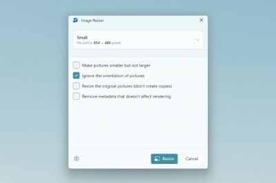](image-resizer.md) 
        **[Image Resizer](image-resizer.md)** 
        Quickly resize images with a right-click in File Explorer.
    :::column-end:::
    :::column:::
       [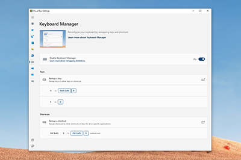](keyboard-manager.md) 
        **[Keyboard Manager](keyboard-manager.md)** 
        Customize the keyboard by remapping keys and creating custom shortcuts.
    :::column-end:::
:::row-end:::

:::row:::
    :::column:::
       [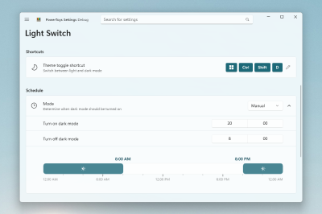](light-switch.md) 
        **[Light Switch](light-switch.md)** 
        Automatically switch between light and dark themes based on time of day.
    :::column-end:::
    :::column:::
        
        **[Mouse utilities](mouse-utilities.md)** 
        Add functionality to enhance your mouse and cursor with Find My Mouse, Highlighter, Jump, and Crosshairs.
    :::column-end:::
    :::column:::
        
        **[Mouse Without Borders](mouse-without-borders.md)** 
        Control multiple computers with a single keyboard and mouse.
    :::column-end:::
:::row-end:::

:::row:::
    :::column:::
       [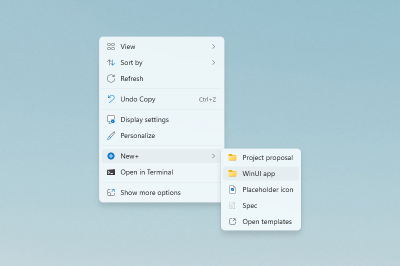](newplus.md) 
        **[New+](newplus.md)** 
        Create files and folders from a personalized set of templates in File Explorer.
    :::column-end:::
    :::column:::
       [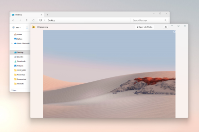](peek.md) 
        **[Peek](peek.md)** 
        Preview file content without opening applications or interrupting your workflow.
    :::column-end:::
    :::column:::
       [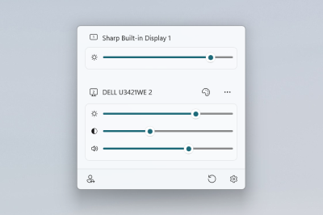](power-display.md) 
        **[Power Display](power-display.md)** 
        Control external monitor brightness, contrast, volume, input source, and color temperature from a single flyout.
    :::column-end:::
:::row-end:::

:::row:::
    :::column:::
       [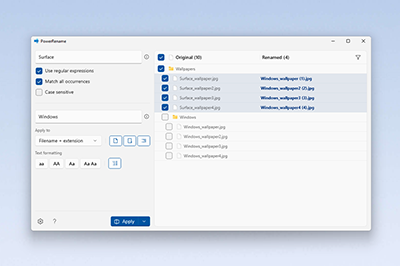](powerrename.md) 
        **[PowerRename](powerrename.md)** 
        Perform bulk renaming with search/replace, regex, and undo support.
    :::column-end:::
    :::column:::
       [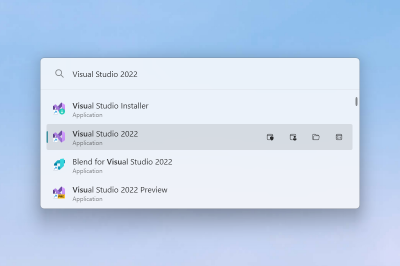](run.md) 
        **[PowerToys Run](run.md)** 
        Search and open apps instantly with a quick launcher that supports plugins.
    :::column-end:::
    :::column:::
       [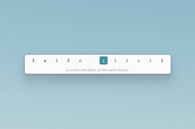](Quick-accent.md) 
        **[Quick Accent](Quick-accent.md)** 
        An alternative way to type accented characters when your keyboard doesn't support them.
    :::column-end:::
:::row-end:::

:::row:::
    :::column:::
       [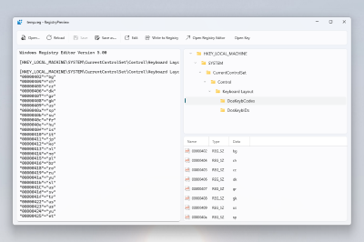](registry-preview.md) 
        **[Registry Preview](registry-preview.md)** 
        Visualize and edit Windows Registry files.
    :::column-end:::
    :::column:::
       [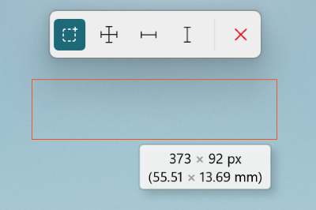](screen-ruler.md) 
        **[Screen Ruler](screen-ruler.md)** 
        Quickly measure pixels on your screen based on image edge detection.
    :::column-end:::
    :::column:::
       [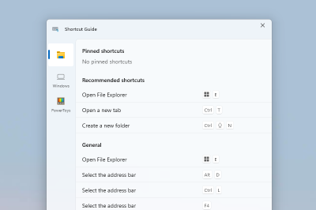](shortcut-guide.md) 
        **[Shortcut Guide](shortcut-guide.md)** 
        Display available Windows key shortcuts for the current desktop state.
    :::column-end:::
:::row-end:::

:::row:::
    :::column:::
       [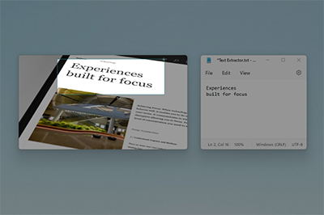](text-extractor.md) 
        **[Text Extractor](text-extractor.md)** 
        Copy text from anywhere on your screen using OCR.
    :::column-end:::
    :::column:::
        
        **[Workspaces](workspaces.md)** 
        Launch a set of applications to custom positions with a single click.
    :::column-end:::
    :::column:::
       [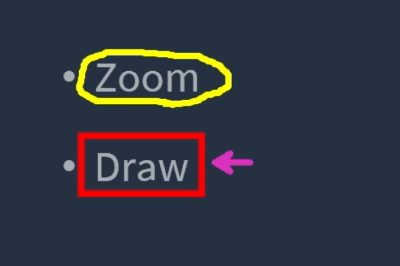](zoomit.md) 
        **[ZoomIt](zoomit.md)** 
        A screen zoom, annotation, and recording tool for technical presentations.
    :::column-end:::
:::row-end:::

## How to contribute to PowerToys

PowerToys welcomes your contributions! The PowerToys development team is excited to partner with the power user community to build the best Windows utilities that help users get the most out of their workflows. There are a variety of ways to contribute:

- Write a [tech spec](https://codeburst.io/on-writing-tech-specs-6404c9791159)
- Submit a [design concept or recommendation](https://www.microsoft.com/design/inclusive/)
- [Contribute to documentation](/contribute/)
- Identify and fix bugs in the [source code](https://github.com/microsoft/PowerToys/tree/main/src)
- [Code new features and PowerToy utilities](https://github.com/microsoft/PowerToys/tree/main/doc/devdocs)

Before starting work on a feature that you would like to contribute, **read the [Contributor's Guide](https://github.com/microsoft/PowerToys/blob/main/CONTRIBUTING.md)**. The PowerToys team will be happy to work with you to figure out the best approach, provide guidance and mentorship throughout feature development, and help avoid any wasted or duplicate effort.

You can consult the [PowerToys Developer Documentation](https://github.com/microsoft/PowerToys/tree/main/doc/devdocs) for more information on how to get started with PowerToys development and work through any issues you may encounter. These docs have recently been updated to provide development and debugging guidance for the various PowerToys utilities, including how to set up your development environment, build the code, and run the utilities.

## Issues and troubleshooting

You can search known issues or file a new issue in the [Issues](https://github.com/microsoft/PowerToys/issues) tab of the PowerToys repository on GitHub. If you don't find the issue you are experiencing, you can [Report a Bug](https://github.com/microsoft/PowerToys/issues/new/choose) on the PowerToys product repo.