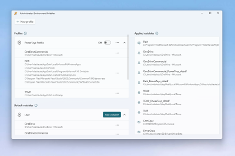
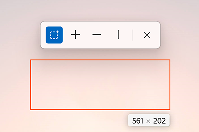

# Microsoft PowerToys: Utilities to customize Windows

Microsoft PowerToys is a set of utilities for power users to tune and streamline their Windows experience for greater productivity.

> [!div class="nextstepaction"]
> [Install PowerToys](install.md)

## Processor architecture support

- **x64**: Supported
- **ARM64**: Supported

## Current PowerToy utilities

The currently available utilities include:

### Advanced Paste

:::row:::
    :::column:::
        
    :::column-end:::
    :::column span="2":::
        [Advanced Paste](advanced-paste.md) is a tool that enables you to paste the text from your clipboard into any format needed. It can be enhanced with an AI-powered option that is 100% opt-in and requires an OpenAI key.
    :::column-end:::
:::row-end:::

### Always On Top

:::row:::
    :::column:::
        
    :::column-end:::
    :::column span="2":::
        [Always On Top](always-on-top.md) enables you to pin windows above other windows with a quick key shortcut (<kbd>⊞ Win</kbd>+<kbd>Ctrl</kbd>+<kbd>T</kbd>).
    :::column-end:::
:::row-end:::

### PowerToys Awake

:::row:::
    :::column:::
        
    :::column-end:::
    :::column span="2":::
        [PowerToys Awake](awake.md) is designed to keep a computer awake without having to manage its power & sleep settings. This behavior can be helpful when running time-consuming tasks, ensuring that the computer does not go to sleep or turns off its displays.
    :::column-end:::
:::row-end:::

### Color Picker

:::row:::
    :::column:::
        
    :::column-end:::
    :::column span="2":::
        [Color Picker](color-picker.md) is a system-wide color picking utility activated with <kbd>⊞ Win</kbd>+<kbd>Shift</kbd>+<kbd>C</kbd>. Pick colors from anywhere on the screen, the picker automatically copies the color to your clipboard in a set format.
        Color Picker contains an editor that shows a history of previously picked colors, allows you to fine-tune the selected color and to copy different string representations. This code is based on [Martin Chrzan's Color Picker](https://github.com/martinchrzan/ColorPicker).
            :::column-end:::
:::row-end:::

### Command Not Found

:::row:::
    :::column:::
        
    :::column-end:::
    :::column span="2":::
        [Command Not Found](cmd-not-found.md) is a PowerShell 7 module that detects an error thrown by a command and suggests a relevant WinGet package to install, if available.
            :::column-end:::
:::row-end:::

### Crop And Lock

:::row:::
    :::column:::
        
    :::column-end:::
    :::column span="2":::
        [Crop And Lock](crop-and-lock.md) is a utility that creates a new window that's a crop or a thumbnail of another window.
    :::column-end:::
:::row-end:::

### Environment Variables

:::row:::
    :::column:::
        
    :::column-end:::
    :::column span="2":::
        [Environment Variables](environment-variables.md) offers an easy and convenient way to manage environment variables. You can create profiles for managing a set of variables together.
    :::column-end:::
:::row-end:::

### FancyZones

:::row:::
    :::column:::
        
    :::column-end:::
    :::column span="2":::
        [FancyZones](fancyzones.md) is a window manager that makes it easy to create complex window layouts and quickly position windows into those layouts.
    :::column-end:::
:::row-end:::

### File Explorer add-ons

:::row:::
    :::column:::
        
    :::column-end:::
    :::column span="2":::
        [File Explorer add-ons](file-explorer.md) enable Preview pane and thumbnail rendering in File Explorer to display a variety of file types. To open the Preview pane, go to **View** in File Explorer and select **Preview Pane**.
    :::column-end:::
:::row-end:::

### File Locksmith

:::row:::
    :::column:::
        
    :::column-end:::
    :::column span="2":::
        [File Locksmith](file-locksmith.md) is a Windows shell extension to check which files are in use and by which processes. Right-click on one or more selected files in File Explorer and select **Unlock with File Locksmith**.
    :::column-end:::
:::row-end:::

### Hosts File Editor

:::row:::
    :::column:::
        
    :::column-end:::
    :::column span="2":::
        [Hosts File Editor](hosts-file-editor.md) is a convenient way to edit the 'Hosts' file that contains domain names and matching IP addresses, acting as a map to identify and locate hosts on IP networks.
    :::column-end:::
:::row-end:::

### Image Resizer

:::row:::
    :::column:::
        
    :::column-end:::
    :::column span="2":::
        [Image Resizer](image-resizer.md) is a Windows Shell extension for quickly resizing images. With a right click from File Explorer, instantly resize one or many images. This code is based on [Brice Lambson's Image Resizer](https://github.com/bricelam/ImageResizer).
    :::column-end:::
:::row-end:::

### Keyboard Manager

:::row:::
    :::column:::
        
    :::column-end:::
    :::column span="2":::
        [Keyboard Manager](keyboard-manager.md) allows you to customize the keyboard to be more productive by remapping keys and creating your own keyboard shortcuts.
    :::column-end:::
:::row-end:::

### Mouse utilities

:::row:::
    :::column:::
        
    :::column-end:::
    :::column span="2":::
        [Mouse utilities](mouse-utilities.md) add functionality to enhance your mouse and cursor.
        With Find My Mouse, quickly locate your mouse's position with a spotlight that focuses on your cursor. This feature is based on source code developed by [Raymond Chen](https://github.com/oldnewthing).
        Mouse Highlighter displays visual indicators when basic mouse buttons are clicked.
        Mouse Jump allows a quick jump on large displays.
        Mouse Pointer Crosshairs draws crosshairs centered on the mouse pointer.
    :::column-end:::
:::row-end:::

### Mouse Without Borders

:::row:::
    :::column:::
        
    :::column-end:::
    :::column span="2":::
        Use [Mouse Without Borders](mouse-without-borders.md) to interact with multiple computers from the same keyboard and mouse, sharing clipboard contents and files between the machines seamlessly.
    :::column-end:::
:::row-end:::

### Peek

:::row:::
    :::column:::
        
    :::column-end:::
    :::column span="2":::
        [Peek](peek.md) allows you to preview file content without the need to open multiple applications or interrupt your workflow. Select the file and use the shortcut (<kbd>Ctrl</kbd>+<kbd>Space</kbd>)
    :::column-end:::
:::row-end:::

### PowerRename

:::row:::
    :::column:::
        
    :::column-end:::
    :::column span="2":::
        Use [PowerRename](powerrename.md) to perform bulk renaming; searching and replacing file names. It includes advanced features, such as using regular expressions, targeting specific file types, previewing expected results, and the ability to undo changes. This code is based on [Chris Davis's SmartRename](https://github.com/chrdavis/SmartRename).
    :::column-end:::
:::row-end:::

### PowerToys Run

:::row:::
    :::column:::
        
    :::column-end:::
    :::column span="2":::
        [PowerToys Run](run.md) can help you search and open your app instantly. To open, use the shortcut <kbd>Alt</kbd>+<kbd>Space</kbd> and start typing. It is open source and modular for additional plugins.
    :::column-end:::
:::row-end:::

### Quick Accent

:::row:::
    :::column:::
        
    :::column-end:::
    :::column span="2":::
        [Quick Accent](Quick-accent.md) is an alternative way to type accented characters, useful for when a keyboard doesn't support that specific character with a quick key combo.
    :::column-end:::
:::row-end:::

### Registry Preview

:::row:::
    :::column:::
        
    :::column-end:::
    :::column span="2":::
        [Registry Preview](registry-preview.md) is a utility to visualize and edit Windows Registry files.
    :::column-end:::
:::row-end:::

### Screen Ruler

:::row:::
    :::column:::
        
    :::column-end:::
    :::column span="2":::
        Use [Screen Ruler](screen-ruler.md) to quickly measure pixels on your screen based with image edge detection. To activate, use the shortcut <kbd>⊞ Win</kbd>+<kbd>Shift</kbd>+<kbd>M</kbd>. This was inspired by [Pete Blois's Rooler](https://github.com/peteblois/rooler).
    :::column-end:::
:::row-end:::

### Shortcut Guide

:::row:::
    :::column:::
        
    :::column-end:::
    :::column span="2":::
        [Windows key shortcut guide](shortcut-guide.md) appears when you press <kbd>⊞ Win</kbd>+<kbd>Shift</kbd>+<kbd>/</kbd> (or as we like to think, <kbd>⊞ Win</kbd>+<kbd>?</kbd>) and shows the available shortcuts for the current state of the desktop. You can also use press and hold <kbd>⊞ Win</kbd>.
    :::column-end:::
:::row-end:::

### Text Extractor

:::row:::
    :::column:::
        
    :::column-end:::
    :::column span="2":::
        [Text Extractor](text-extractor.md) is a convenient way to copy text from anywhere on your screen. To activate, use the shortcut <kbd>⊞ Win</kbd>+<kbd>Shift</kbd>+<kbd>T</kbd>. This code is based on [Joe Finney's Text Grab](https://github.com/TheJoeFin/Text-Grab).
    :::column-end:::
:::row-end:::

### Video Conference Mute

:::row:::
    :::column:::
        
    :::column-end:::
    :::column span="2":::
        [Video Conference Mute](video-conference-mute.md) is a quick way to globally "mute" both your microphone and camera using <kbd>⊞ Win</kbd>+<kbd>Shift</kbd>+<kbd>Q</kbd> while on a conference call, regardless of the application that currently has focus.
    :::column-end:::
:::row-end:::

## Languages

Currently, PowerToys is available in the following languages: Arabic (Saudi Arabia), Chinese (simplified), Chinese (traditional), Czech, Dutch, English, French, German, Hebrew, Hungarian, Italian, Japanese, Korean, Persian, Polish, Portuguese, Portuguese (Brazil), Russian, Spanish, Turkish, Ukrainian.

## PowerToys video walk-through

In this video, Clint Rutkas (PM for PowerToys) walks through how to install and use the various utilities available, in addition to sharing some tips, info on how to contribute, and more.

[!VIDEO https://learn.microsoft.com/shows/Tabs-vs-Spaces/PowerToys-Utilities-to-customize-Windows-10/player?format=ny]

## Known issues

Search known issues or file a new issue in the [Issues](https://github.com/microsoft/PowerToys/issues) tab of the PowerToys repository on GitHub. If you don't find the issue you are experiencing, you can [Report a Bug](https://github.com/microsoft/PowerToys/issues/new/choose) on the PowerToys product repo.

## Contribute to PowerToys (Open Source)

PowerToys welcomes your contributions! The PowerToys development team is excited to partner with the power user community to build tools that help users get the most out of Windows. There are a variety of ways to contribute:

- Write a [tech spec](https://codeburst.io/on-writing-tech-specs-6404c9791159)
- Submit a [design concept or recommendation](https://www.microsoft.com/design/inclusive/)
- [Contribute to documentation](/contribute/)
- Identify and fix bugs in the [source code](https://github.com/microsoft/PowerToys/tree/main/src)
- [Code new features and PowerToy utilities](https://github.com/microsoft/PowerToys/tree/main/doc/devdocs)

Before starting work on a feature that you would like to contribute, **read the [Contributor's Guide](https://github.com/microsoft/PowerToys/blob/main/CONTRIBUTING.md)**. The PowerToys team will be happy to work with you to figure out the best approach, provide guidance and mentorship throughout feature development, and help avoid any wasted or duplicate effort.

## PowerToys release notes

PowerToys [release notes](https://github.com/microsoft/PowerToys/releases/) are listed on the install page of the GitHub repo. For reference, you can also find the [Release checklist](https://github.com/microsoft/PowerToys/wiki/Release-check-list) on the PowerToys wiki.

## PowerToys history

Inspired by the [Windows 95 era PowerToys project](https://wikipedia.org/wiki/Microsoft_PowerToys), this reboot provides power users with ways to squeeze more efficiency out of the Windows shell and customize it for individual workflows. An overview of the original PowerToys can be found here: [Using Windows 95 PowerToys](https://socket3.wordpress.com/2016/10/22/using-windows-95-powertoys/).

## PowerToys roadmap

PowerToys is a rapid-incubation, open source team aimed at providing power users ways to squeeze more efficiency out of the Windows shell and customize it for individual workflows. Work priorities will consistently be examined, reassessed, and adjusted with the aim of improving our users productivity.

- [New specs for possible PowerToys](https://github.com/microsoft/PowerToys/wiki/Specs)
- [Backlog priority list](https://github.com/microsoft/PowerToys/wiki/Roadmap#backlog-priority-list-in-order)
