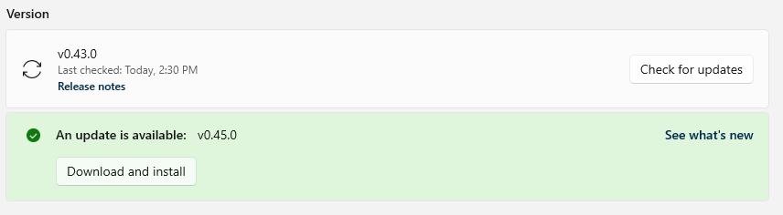

# Installing PowerToys

We recommend installing PowerToys via GitHub or Microsoft Store, but alternative install methods are also listed if you prefer using a package manager.

## Requirements

- Supported Operating Systems:
  - Windows 11 (all versions)
  - Windows 10 v2004 (19041) or newer
- System architecture
  - x64 and Arm64 architectures are currently supported.
- Our installer will install the following runtimes:
  - [Microsoft Edge WebView2 Runtime](https://go.microsoft.com/fwlink/p/?LinkId=2124703) bootstrapper (this will always install the latest version available)

To ensure that your machine meets these requirements, check your Windows version and build number by pressing <kbd>⊞ Win</kbd>+<kbd>R</kbd>, then type `winver` and press <kbd>OK</kbd>. Or enter the `ver` command in Windows Command Prompt. You can [update to the latest Windows version](ms-settings:windowsupdate) in the **Windows Settings**.

## Installing with Windows executable file via GitHub

> [!div class="nextstepaction"]
> [Install PowerToys](https://aka.ms/installpowertoys)

To install PowerToys using a Windows executable file:

1. Visit the [Microsoft PowerToys GitHub releases page](https://aka.ms/installpowertoys).
2. Select the **Assets** drop-down menu to display the files for the release.
3. Select the `PowerToysSetup-0.##.#-x64.exe` or `PowerToysSetup-0.##.#-arm64.exe` file to download the PowerToys executable installer.
4. Once downloaded, open the executable file and follow the installation prompts.

## Installing with Microsoft Store

Install from the [Microsoft Store's PowerToys page](https://aka.ms/getPowertoys).

## Installing with Windows Package Manager

To install PowerToys using the [Windows Package Manager](../package-manager/winget/index.md), it is as simple as running the following command from the command line / PowerShell:

```powershell
winget install Microsoft.PowerToys --source winget
```

PowerToys supports configuring through `winget configure` using [Desired State Configuration](dsc-configure.md).

## Installer arguments

The installer executable accepts the [Microsoft Standard Installer command-line options](/windows/win32/msi/standard-installer-command-line-options).

Here are the common commands you may want:

| Command  | Abbreviation | Function     |
|----------|--------------| ------------ |
| **/quiet**   | **/q**       | Silent install |
| **/silent**  | **/s**       | Silent install |
| **/passive** |              | progress bar only install |
| **/layout**  |              | create a local image of the bootstrapper |
| **/log**     | **/l**       | log to a specific file |

### Extracting the MSI from the bundle

Make sure to have [WiX Toolset v3](https://wixtoolset.org/docs/wix3) installed. The command doesn't work with WiX Toolset v4.

This PowerShell example assumes the default install location for WiX Toolset and the PowerToys installer downloaded to the desktop.

```powershell
cd $Env:WIX\"bin"

# dark.exe -x OUTPUT_FOLDER INSTALLER_PATH
.\dark.exe -x ${Env:\USERPROFILE}"\Desktop\extractedPath" ${Env:\USERPROFILE}"\Desktop\PowerToysSetup-0.53.0-x64.exe"
```

### Fixes for uninstalling 0.51 and earlier builds issues

If you have an issue where the MSI is not accessible, you can download the installer, that corresponds with the installed version, via the [PowerToys release page](https://github.com/microsoft/PowerToys/releases) and then run the following command. You'll want to change EXECUTABLE_INSTALLER_NAME to what the file name actually is.

In PowerShell, run `.\EXECUTABLE_INSTALLER_NAME.exe --extract_msi` and this will extract the MSI to your desktop.

### Clean-up scripts

In case there are problems with uninstalling a version, there are cleanup scripts available:

- <github.com/microsoft/PowerToys/tree/main/tools/CleanUp_tool>
- <github.com/microsoft/PowerToys/tree/main/tools/CleanUp_tool_powershell_script>

## Community-driven install tools

These community-driven alternative install methods are not officially supported and the PowerToys team does not update or manage these packages.

### Installing with Chocolatey

To install [PowerToys](https://community.chocolatey.org/packages/powertoys) using [Chocolatey](https://chocolatey.org/), run the following command from your command line / PowerShell:

```powershell
choco install powertoys
```

To upgrade PowerToys, run:

```powershell
choco upgrade powertoys
```

If you have issues when installing/upgrading, create an issue at the [maintainers GitHub repository](https://github.com/mkevenaar/chocolatey-packages/issues) or follow the [Chocolatey triage process](https://docs.chocolatey.org/en-us/community-repository/users/package-triage-process).

### Installing with Scoop

To install PowerToys using [Scoop](https://scoop.sh/), run the following command from the command line / PowerShell:

```powershell
scoop bucket add extras
scoop install powertoys
```

To update PowerToys, run the following command from the command line / PowerShell:

```powershell
scoop update powertoys
```

If you have issues when installing/updating, file an issue in the [Scoop repo on GitHub](https://github.com/lukesampson/scoop/issues).

## After installation

After successfully installing PowerToys, an overview window will display with introductory guidance on each of the available utilities.

## Updates

PowerToys uses an auto-updater that checks for new versions when the app is running. If enabled, a toast notification will appear when an update is available. Updates can also be checked for manually from the PowerToys Settings, under the General page.


