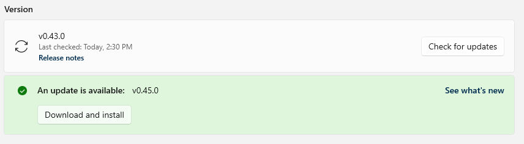

# Install PowerToys

PowerToys is a set of utilities for customizing Windows that you can install using multiple methods. This article explains how to install PowerToys on Windows 11 and Windows 10 using an executable file, Microsoft Store, or package managers like WinGet, Chocolatey, and Scoop.

We recommend installing PowerToys via [GitHub](https://aka.ms/installpowertoys) or [Microsoft Store](https://aka.ms/getPowertoys), but alternative install methods are also listed if you prefer using a package manager.

### System requirements

The following are the minimum requirements to install and run PowerToys:

- Windows 11 or Windows 10 version 2004 (20H1 / build 19041) or newer
- 64-bit processor: x64 or ARM64
- Latest stable version of Microsoft Edge WebView2 Runtime is installed via the bootstrapper during setup

### Installation methods

#### [GitHub](#tab/gh)

To install PowerToys using a Windows executable file:

1. Visit the [Microsoft PowerToys GitHub releases page](https://aka.ms/installpowertoys).
2. Select the **Assets** drop-down menu to display the files for the release.
3. Select the `PowerToysSetup-0.##.#-x64.exe` or `PowerToysSetup-0.##.#-arm64.exe` file to download the PowerToys executable installer.
4. Once downloaded, open the executable file and follow the installation prompts.

Notes: There're two kinds of installers you could choose.
1.The "Per User"  channel means you will install this app for currect user, while other users on this computer couldn't access and use. The installation path of this method is located in "%userprofile%\AppData\Local\Programs".
2.The "Machine wide" channel means this app will be installed for all users on your computer, which means all of them could access and use this app. The path of the app is located in "%ProgramFiles%". For the majority of x86-64 and ARM64 Windows devices, this EnvVar commonly points to "C:\Program Files" path.
3.Whatever the kind of the installer you choose, you will receive app updates normally and enjoy every new features.

#### [Microsoft Store](#tab/store)

You can install PowerToys from the [Microsoft Store's PowerToys page](https://aka.ms/getPowertoys).

#### [WinGet](#tab/winget)

To install PowerToys using the [Windows Package Manager](../package-manager/winget/index.md), it's as simple as running the following command from the command line / PowerShell:

```powershell
winget install --id Microsoft.PowerToys --source winget
```

PowerToys supports configuring through `winget configure` using [Desired State Configuration](dsc-configure.md).

The installer executable accepts the [Microsoft Standard Installer command-line options](/windows/win32/msi/standard-installer-command-line-options).

Here are some common commands you may want to use:

| Command  | Abbreviation | Function                                 |
|----------|--------------|------------------------------------------|
| /quiet   | /q           | Silent install                           |
| /silent  | /s           | Silent install                           |
| /passive |              | progress bar only install                |
| /layout  |              | create a local image of the bootstrapper |
| /log     | /l           | log to a specific file                   |

#### Ask Copilot for help with command-line arguments

You can get AI assistance from [Copilot](https://copilot.microsoft.com/) to generate a `winget` command with the arguments you need. You can customize the prompt to generate a string per your requirements.

The following text shows an example prompt for Copilot:

```copilot-prompt
Generate a `winget` command to install Microsoft PowerToys with arguments to install silently and log the output to a file at the following path: C:\temp\install.log
```

Copilot is powered by AI, so surprises and mistakes are possible. For more information, see [Copilot FAQs](https://www.microsoft.com/microsoft-copilot/learn/).

#### [Other methods](#tab/other)

There are community driven install methods such as Chocolatey and Scoop to install PowerToys.

##### Chocolatey
To install [PowerToys](https://community.chocolatey.org/packages/powertoys) using [Chocolatey](https://chocolatey.org/), run the following command from your command line / PowerShell:

```powershell
choco install powertoys
```

To upgrade PowerToys, run:

```powershell
choco upgrade powertoys
```

If you have issues when installing/upgrading, create an issue at the [maintainers GitHub repository](https://github.com/mkevenaar/chocolatey-packages/issues) or follow the [Chocolatey triage process](https://docs.chocolatey.org/en-us/community-repository/users/package-triage-process).

##### Scoop

To install PowerToys using [Scoop](https://scoop.sh/), run the following command from the command line / PowerShell:

```powershell
scoop bucket add extras
scoop install powertoys
```

To update PowerToys using Scoop, run the following command from the command line / PowerShell:

```powershell
scoop update powertoys
```

If you have issues when installing/updating, file an issue in the [Scoop repo on GitHub](https://github.com/lukesampson/scoop/issues).

---

### After installation

After successfully installing PowerToys, an overview window will display with introductory guidance for each of the available utilities.

If you view the Home view of the PowerToys settings, you can get quick access to some of the utilities, see an overview of the available shortcuts, and enable or disable individual utilities.

:::image type="content" source="images/general/settings-home.png" alt-text="A screenshot of the Home page of the PowerToys settings.":::

### Updates

PowerToys uses an automatic update checker that checks for new versions when the app is running. If enabled, a toast notification will appear when an update is available. You can also check for updates manually from the PowerToys Settings.



### Extracting the MSI from the bundle
#### [0.94 and later](#tab/extract-094)

Make sure to have the [.NET SDK](https://dotnet.microsoft.com/download/) installed.

In PowerShell, run `dotnet tool install wix --global` to install the latest version of WiX Toolset.

This PowerShell example assumes that the PowerToys installer has been downloaded to the Windows desktop.

```powershell
wix burn extract ${Env:\USERPROFILE}"\Desktop\PowerToysSetup-0.94.0-x64.exe" -out ${Env:\USERPROFILE}"\Desktop\extractedPath" -oba ${Env:\USERPROFILE}"\Desktop\extractedPath"
```

#### [0.93 and earlier](#tab/extract-093)

Make sure to have [WiX Toolset v3](https://docs.firegiant.com/wix/wix3/) installed. The command doesn't work with WiX Toolset v4 and later versions.

This PowerShell example assumes the default install location for WiX Toolset and that the PowerToys installer has been downloaded to the Windows desktop.

```powershell
cd $Env:WIX\"bin"

# dark.exe -x OUTPUT_FOLDER INSTALLER_PATH
.\dark.exe -x ${Env:\USERPROFILE}"\Desktop\extractedPath" ${Env:\USERPROFILE}"\Desktop\PowerToysSetup-0.53.0-x64.exe"
```
---

### Troubeshooting
#### Fixes for uninstalling 0.51 and earlier builds issues

If you have an issue with the MSI being inaccessible, you can download the installer that corresponds with the installed version via the [PowerToys releases page](https://github.com/microsoft/PowerToys/releases) and run the following command. You'll need to change EXECUTABLE_INSTALLER_NAME to the actual file name.

In PowerShell, run `.\EXECUTABLE_INSTALLER_NAME.exe --extract_msi` and this will extract the MSI to your desktop.

#### Clean-up scripts

If there are problems while uninstalling a version, there are cleanup scripts available:

- <github.com/microsoft/PowerToys/tree/main/tools/CleanUp_tool>
- <github.com/microsoft/PowerToys/tree/main/tools/CleanUp_tool_powershell_script>

### Related content

[Microsoft PowerToys: Utilities to customize Windows](index.md)

[General settings for PowerToys](general.md)

[PowerToys on GitHub](https://github.com/microsoft/PowerToys)
