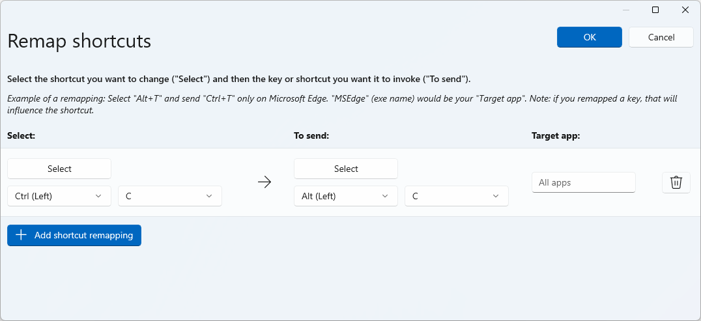

# Keyboard Manager utility

The PowerToys Keyboard Manager enables you to redefine keys on your keyboard.

For example, you can exchange the letter <kbd>A</kbd> for the letter <kbd>B</kbd> on your keyboard. When you press the <kbd>A</kbd> key, a `B` will be inserted.

You can exchange shortcut key combinations. For example: The shortcut key <kbd>Ctrl</kbd>+<kbd>C</kbd> will copy text in many applications. With PowerToys Keyboard Manager utility, you can swap that shortcut for <kbd>⊞ Win</kbd>+<kbd>C</kbd>. Now, <kbd>⊞ Win</kbd>+<kbd>C</kbd> will copy text. If you do not specify a targeted application in PowerToys Keyboard Manager, the shortcut exchange will be applied globally across Windows.

PowerToys Keyboard Manager must be enabled (with PowerToys running in the background) for remapped keys and shortcuts to be applied. If PowerToys is not running, key remapping will no longer be applied.

> [!IMPORTANT]
> There are some shortcut keys that are reserved for the operating system or cannot be replaced. Keys that cannot be remapped include:
>
> - <kbd>⊞ Win</kbd>+<kbd>L</kbd> and <kbd>Ctrl</kbd>+<kbd>Alt</kbd>+<kbd>Del</kbd> cannot be remapped as they are reserved by the Windows OS.
> - The <kbd>Fn</kbd> (function) key cannot be remapped (in most cases). The <kbd>F1</kbd> ~ <kbd>F12</kbd> (and F13 ~ F24) keys can be mapped.
> - <kbd>Pause</kbd> will only send a single keydown event. So mapping it against the backspace key, for instance, and pressing and holding will only delete a single character.
> - <kbd>⊞ Win</kbd>+<kbd>G</kbd> often opens the Xbox Game Bar, even when reassigned. Game Bar can be disabled in [Windows Settings](ms-settings:gaming-gamebar).

## Settings

To create mappings with Keyboard Manager, open the PowerToys Settings. Inside PowerToys Settings, on the Keyboard Manager tab, you will see options to:

- Launch the Remap Keys settings window by selecting **Remap a key**
- Launch the Remap Shortcuts settings window by selecting **Remap a shortcut**

### Remapping keys

To remap a key, changing it to a new value, launch the Remap Keyboard settings window with the **Remap a Key** button. When first launched, no predefined mappings will be displayed. Select the **+** button to add a new remap.

Once a new remap row appears, select the input key whose output you want to _change_ in the “Physical Key” column. Select the new key value to assign in the “Mapped To” column.

For example, to press <kbd>A</kbd> and have `B` appear:

| Physical Key: | Mapped To: |
| :--- | :--- |
| `A` | `B` |

To swap key positions between the <kbd>A</kbd> and <kbd>B</kbd> keys, add another remapping with:

| Physical Key: | Mapped To: |
| :--- | :--- |
| `B` | `A` |

### Remapping a key to a shortcut

To remap a key to a shortcut (combination of keys), enter the shortcut key combination in the "Mapped To" column.

For example, to press the <kbd>Ctrl</kbd> key and have it result in `⊞ Win` + `←` (left arrow):

| Physical Key: | Mapped To: |
| :--- | :--- |
| `Ctrl` | `⊞ Win` + `←` |

> [!IMPORTANT]
> Key remapping will be maintained even if the remapped key is used inside another shortcut. The order of key press matters in this scenario as the action is executed during key-down, not key-up. For example, pressing <kbd>Ctrl</kbd>+<kbd>C</kbd> would result as `⊞ Win` + `left arrow` + `C`. Pressing the <kbd>Ctrl</kbd> key will first execute `⊞ Win` + `left arrow`. Pressing the <kbd>C</kbd> key first will execute `C` + `⊞ Win` + `left arrow`.

### Remapping shortcuts

To remap a shortcut key combination, like <kbd>Ctrl</kbd>+<kbd>C</kbd>, select **Remap a shortcut** to launch the Remap Shortcuts settings window.

When first launched, no predefined mappings will be displayed. Select **+** to add a new remap.

Once a new remap row appears, select the input keys whose output you want to _change_ in the “Physical Shortcut” column. Select the new shortcut value to assign in the “Mapped To” column.

For example, the shortcut <kbd>Ctrl</kbd>+<kbd>C</kbd> copies selected text. To remap that shortcut to use the <kbd>Alt</kbd> key, rather than the <kbd>Ctrl</kbd> key:

| Physical Shortcut: | Mapped To: |
| :--- | :--- |
| `Alt` + `C` | `Ctrl` + `C` |

There are a few rules to follow when remapping shortcuts. These rules only apply to the "Shortcut" column.

- Shortcuts must begin with a modifier key: <kbd>Ctrl</kbd>, <kbd>Shift</kbd>, <kbd>Alt</kbd>, or <kbd>⊞ Win</kbd>
- Shortcuts must end with an action key (all non-modifier keys): A, B, C, 1, 2, 3, etc.
- Shortcuts cannot be longer than four keys

### Remap a shortcut to a single key

It is possible to remap a shortcut (key combination) to a single key press by selecting **Remap a shortcut** in PowerToys Settings.

For example, to replace the shortcut <kbd>⊞ Win</kbd>+<kbd>←</kbd> (left arrow) with a single key press **Alt**:

| Shortcut: | Mapped To: |
| :--- | :--- |
| `⊞ Win` + `←` | `Alt` |

> [!IMPORTANT]
> Shortcut remapping will be maintained even if the remapped key is used inside another shortcut. The order of key press matters in this scenario as the action is executed during key-down, not key-up. For example: pressing <kbd>⊞ Win</kbd>+<kbd>←</kbd>+<kbd>Shift</kbd> would result in `Alt` + `Shift`.

### App-specific shortcuts

Keyboard Manager enables you to remap shortcuts for only specific apps (rather than globally across Windows).

For example, in the Outlook email app the shortcut <kbd>Ctrl</kbd>+<kbd>E</kbd> is set by default to search for an email. If you prefer instead to set <kbd>Ctrl</kbd>+<kbd>F</kbd> to search your email (rather than forward an email as set by default), you can remap the shortcut with "Outlook" set as your "Target app".

Keyboard Manager uses process-names (not application names) to target apps. For example, Microsoft Edge is set as "msedge" (process name), not "Microsoft Edge" (application name). To find an application's process name, open PowerShell and enter the command `get-process` or open Command Prompt and enter the command `tasklist`. This will result in a list of process names for all applications you currently have open. Below is a list of a few popular application process names.

| Application     | Process name  |
| :---            | :---          |
| Microsoft Edge  | msedge.exe    |
| OneNote         | onenote.exe   |
| Outlook         | outlook.exe   |
| Teams           | Teams.exe     |
| Adobe Photoshop | Photoshop.exe |
| File Explorer   | explorer.exe  |
| Spotify Music   | spotify.exe   |
| Google Chrome   | chrome.exe    |
| Excel           | excel.exe     |
| Word            | winword.exe   |
| Powerpoint      | powerpnt.exe  |

## How to select a key

To select a key or shortcut to remap:

- Select **Type Key** or **Type Shortcut**.
- Use the drop-down menu.

Once you select **Type Key** or **Type Shortcut**, a dialogue window will pop up in which you can enter the key or shortcut, using your keyboard. Once you’re satisfied with the output, hold <kbd>Enter</kbd> to continue. If you’d like to leave the dialogue, hold <kbd>Esc</kbd>.

Using the drop-down menu, you can search with the key name and additional drop-down values will appear as you progress. However, you can not use the type-key feature while the drop-down menu is open.

## Orphaning Keys

Orphaning a key means that you mapped it to another key and no longer have anything mapped to it.

For example, if the key is remapped from `A` to `B`, then a key no longer exists on your keyboard that results in `A`. To ensure this does not happen by accident, a warning will display for any orphaned keys. To fix this, use **+** to create another remapped key that is mapped to result in `A`.

## Frequently asked questions

### I remapped the wrong keys, how can I stop it quickly?

For key remapping to work, PowerToys must be running in the background and Keyboard Manager must be enabled. To stop remapped keys, close PowerToys or disable Keyboard Manager in the PowerToys settings.

### Can I use Keyboard Manager at my log-in screen?

No, Keyboard Manager is only available when PowerToys is running and doesn’t work on any password screen, including while Run As Admin.

### Do I have to restart my computer or PowerToys for the remapping to take effect?

No, remapping should occur immediately upon pressing **OK**.

### Where are the Mac/Linux profiles?

Currently Mac and Linux profiles are not included.

### Will this work on video games?

We suggest that you avoid using Keyboard Manager when playing games as it may affect the game's performance. It will also depend on how the game accesses your keys. Certain keyboard APIs do not work with Keyboard Manager.

### Will remapping work if I change my input language?

Yes it will. Right now if you remap <kbd>A</kbd> to <kbd>B</kbd> on English (US) keyboard and then change the language setting to French, typing <kbd>A</kbd> on the French keyboard (<kbd>Q</kbd> on the English US physical keyboard) would result in `B`, this is consistent with how Windows handles multilingual input.

### Can I have different key mappings across multiple keyboards?

Currently no. We are not aware of an API where we can see the input and which device it came from. The typical use case here is a laptop with an external keyboard connected.

### I see keys listed in the drop down menus that don't work. Why is that?

Keyboard Manager lists mappings for all known physical keyboard keys. Some of these mappings may not be available on your keyboard as there may not be a physical key that it corresponds to. For instance: the <kbd>Start App 1</kbd> option shown below is only available on keyboards that physically have a <kbd>Start App 1</kbd> key. Trying to map to and from this key on a keyboard that does not support the <kbd>Start App 1</kbd> key will result in undefined behavior.

## Troubleshooting

If you have tried to remap a key or shortcut and are having trouble, it could be one of the following issues:

- **Run As Admin:** Remapping will not work on an app or window if that window is running in administrator (elevated) mode and PowerToys is not running as administrator. Try [running PowerToys as an administrator](administrator.md).
- **Not Intercepting Keys:** Keyboard Manager intercepts keyboard hooks to remap your keys. Some apps that also do this can interfere with Keyboard Manager. To fix this, go to the settings, disable and enable Keyboard Manager.

## Known Issues

- Keyboard Manager should not be used when playing video games. Keyboard Manager interception of key presses currently will impact the FPS.
- [Remapping keys like Win, Ctrl, Alt or Shift may break gestures and some special keys](https://github.com/microsoft/PowerToys/issues/3703)
- AltGr and Ctrl+Alt gives issues, since AltGr behaves as (L)Ctrl + (R)Alt and remapping one of these keys can break the function.

See the list of all [open keyboard manager issues](https://github.com/microsoft/PowerToys/issues?q=is%3Aopen+is%3Aissue+label%3A%22Product-Keyboard+Shortcut+Manager%22).
