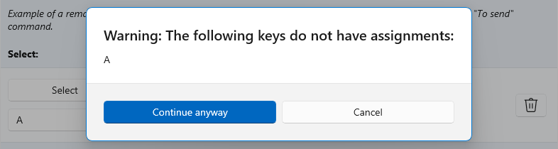

# Keyboard Manager utility

The PowerToys Keyboard Manager enables you to redefine keys on your keyboard.

For example, you can exchange the letter <kbd>A</kbd> for the letter <kbd>D</kbd> on your keyboard. When you select the <kbd>A</kbd> key, a <kbd>D</kbd> will display.

You can also exchange shortcut key combinations. For example, the shortcut key, <kbd>Ctrl</kbd>+<kbd>C</kbd>, will copy text in Microsoft Word. With PowerToys Keyboard Manager utility, you can exchange that shortcut for <kbd>⊞ Win</kbd>+<kbd>C</kbd>). Now, <kbd>⊞ Win</kbd>+<kbd>C</kbd>) will copy text. If you do not specify a targeted application in PowerToys Keyboard Manager, the shortcut exchange will be applied globally across Windows.

PowerToys Keyboard Manager must be enabled (with PowerToys running in the background) for remapped keys and shortcuts to be applied. If PowerToys is not running, key remapping will no longer be applied.

> [!NOTE]
> There are some shortcut keys that are reserved for the operating system and cannot be replaced. Keys that cannot be remapped include:
> - `⊞ Win`+`L` and `Ctrl` + `Alt` + `Del` cannot be remapped as they are reserved by the Windows OS.
> - The `Fn` (function) key cannot be remapped (in most cases). The `F1`-`F12` (and `F13`-`F24`) keys can be mapped.
> - `Pause` will only send a single keydown event. So mapping it against the backspace key, for instance, and pressing + holding will only delete a single character.

## Settings

To create mappings with Keyboard Manager, you will need to open the PowerToys Settings (search for the PowerToys app in your Windows Start menu, selecting it will open the PowerToys Settings window). Inside PowerToys Settings, on the Keyboard Manager tab, you will see the options to:

- Launch the Remap Keyboard settings window by selecting <kbd>Remap a Key</kbd>
- Launch the Remap Shortcuts settings window by selecting the <kbd>Remap a shortcut</kbd>

## Remap Keys

To remap a key, changing it to new value, launch the Remap Keyboard settings window with the <kbd>Remap a Key</kbd> button. When first launched, no predefined mappings will be displayed. You must select the <kbd>+</kbd> button to add a new remap.

Once a new remap row appears, select the key whose output you want to ***change*** in the “Key” column. Select the new key value to assign in the “Mapped To” column.

For example, if you want to press <kbd>A</kbd> and have <kbd>B</kbd>  appear:

- Key: "A"
- Mapped To: "B"

To swap key positions between the "A" and "B" keys, add another remapping with:

- Key: "B"
- Mapped To: "A"

## Key to Shortcut

To remap a key to a shortcut (combination of keys), enter the shortcut key combination in the "Mapped To" column.

For example, if you want to select the "C" key and have it result in "Ctrl + V":

- Key: "C"
- Mapped To: "Ctrl + V"

> [!NOTE]
> Key remapping will be maintained even if the remapped key is used in another shortcut. For example, entering the shortcut "Alt + C" would result as "Alt + Ctrl + V", since the C key has been remapped to "Ctrl + V".

## Remap Shortcuts

To remap a shortcut key combination, like "Ctrl + v", select <kbd>Remap a shortcut</kbd> to launch the Remap Shortcuts settings window.

When first launched, no predefined mappings will be displayed. You must select the <kbd>+</kbd> button to add a new remap.

Once a new remap row appears, select the key whose output you want to ***change*** in the “Shortcut” column. Select the new shortcut value to assign in the “Mapped To” column.

For example, the shortcut <kbd>Ctrl</kbd>+<kbd>C</kbd> copies your selected text. To remap that shortcuts to use the <kbd>Alt</kbd> key, rather than the <kbd>Ctrl</kbd> key:

- Shortcut: "Ctrl" + "C"
- Mapped To: "Alt" + "C"

There are a few rules to follow when remapping shortcuts (these rules only apply on the "Shortcut" column):

- Shortcuts must begin with a modifier key: <kbd>Ctrl</kbd>, <kbd>Shift</kbd>, <kbd>Alt</kbd>, or <kbd>⊞ Win</kbd>
- Shortcuts must end with an action key (all non-modifier keys): A, B, C, 1, 2, 3, etc.
- Shortcuts cannot be longer than 3 keys  

## Remap a shortcut to a single key

It is possible to remap a shortcut (key combination) to a single key press by selecting the **Remap a Key** button in PowerToys Settings. 

For example, to replace the shortcut key <kbd>⊞ Win</kbd> + <kbd><</kbd> (left arrow) with a single key press, <kbd>Alt</kbd>:

- Key: "Alt"
- Mapped To: "⊞ Win" (Windows key) + <kbd><</kbd> (left arrow)

> [!NOTE]
> Shortcut remapping will be maintained even if the remapped key is used in another shortcut. For example, entering the shortcut "Alt" + "Shift", after remapping the "Alt" key as above, would result in "⊞ Win" + <kbd><</kbd> (left arrow) + "Shift". The order of keypress matters in this scenario as the action is executed during keydown, not keyup. Pressing the <kbd>Alt</kbd> key will first execute <kbd>⊞ Win</kbd> + <kbd>Left Arrow</kbd>. Pressing the <kbd>Shift</kbd> key first will execute <kbd>Shift</kbd> + <kbd>⊞ Win</kbd> + <kbd>Left Arrow</kbd>.

## App-specific shortcuts

Keyboard Manager enables you to remap shortcuts for only specific apps (rather than globally across Windows).

For example, in the Outlook email app the shortcut "Ctrl + E" is set by default to search for an email. If you prefer instead to set "Ctrl + F" to search your email (rather than forward an email as set by default), you can remap the shortcut with "Outlook" set as your "Target app."

Keyboard Manager uses the process-names (not application names) to target apps. For example, Microsoft Edge is set as "msedge" (process name), not "Microsoft Edge" (application name). To find an application's process name, open PowerShell and enter the command `get-process` or open Command Prompt and enter the command `tasklist`. This will result in a list of process names for all applications you currently have open. Below is a list of a few popular application process names.

  | **Application**   | **Process name**|
  | ------------------| --------------|
  | Microsoft Edge    |  msedge.exe   |
  | OneNote           |  onenote.exe  |
  | Outlook           |  outlook.exe  |
  | Teams             |  Teams.exe    |
  | Adobe Photoshop   |  Photoshop.exe|
  | File Explorer     |  explorer.exe |
  | Spotify Music     |  spotify.exe  |
  | Google Chrome     |  chrome.exe   |
  | Excel             |  excel.exe    |
  | Word              |  winword.exe  |
  | Powerpoint        |  powerpnt.exe |

### Keys that cannot be remapped

There are certain shortcut keys that are not allowed for remapping. These include:

- <kbd>Ctrl</kbd>+<kbd>Alt</kbd>+ <kbd>Del</kbd> (interupt command)
- <kbd>⊞ Win</kbd>+<kbd>L</kbd> (locking your computer)
- The function key, <kbd>Fn</kbd>, cannot be remapped (in most cases) but the <kbd>F1</kbd>-<kbd>F12</kbd> can be mapped.

## How to select a key

To select a key or shortcut to remap, you can:

- Use the <kbd>Type Key</kbd> button.
- Use the drop-down menu.

Once you select the <kbd>Type Key / Shortcut</kbd> button, a dialogue will pop up in which you can enter the key or shortcut using your keyboard. Once you’re satisfied with the output, hold <kbd>Enter</kbd> to continue. If you’d like to leave the dialogue, hold the <kbd>Esc</kbd> button.

Using the drop-down menu, you can search with the key name and additional drop-down values will appear as you progress. However, you can not use the type-key feature while the drop-down menu is open.

## Orphaning Keys

Orphaning a key means that you mapped it to another key and no longer have anything mapped to it.

For example, if the key is remapped from A -> B, then a key no longer exists on your keyboard that results in A.

To fix this, use + to create another remapped key that is mapped to result in A. To ensure this does not happen by accident, a warning will display for any orphaned keys.

## Frequently asked questions

### I remapped the wrong keys, how can I stop it quickly?

For key remapping to work, PowerToys must be running in the background and Keyboard Manager must be enabled. To stop remapped keys, close PowerToys or disable Keyboard Manger in the PowerToys settings.

### Can I use Keyboard Manager at my log-in screen?

No, Keyboard Manager is only available when PowerToys is running and doesn’t work on any password screen, including Run As Admin.

### Do I have to turn off my computer for the remapping to take effect?

No, remapping should occur immediately upon pressing **Apply**.

### Where are the Mac/Linux profiles?

Currently Mac and Linux profiles are not included.

### Will this work on video games?

It depends on how the game accesses your keys. Certain keyboard APIs do not work with Keyboard Manager.

### Will remapping work if I change my input language?

Yes it will. Right now if you remap <kbd>A</kbd> to <kbd>B</kbd> on English (US) keyboard and then change the language setting to French, typing <kbd>A</kbd> on the French keyboard (<kbd>Q</kbd> on the English US physical keyboard) would result in <kbd>B</kbd>, this is consistent with how Windows handles multilingual input.

## Troubleshooting

If you have tried to remap a key or shortcut and are having trouble, it could be one of the following issues:

- **Run As Admin:** Remapping will not work on an app / window if that window is running in administrator (elevated) mode and PowerToys is not running as administrator. Try running PowerToys as an administrator.

- **Not Intercepting Keys:** Keyboard Manger intercepts keyboard hooks to remap your keys. Some apps that also do this and can interfere with Keyboard Manager. To fix this, go to the settings and disable then re-enable Keyboard Manager.

## Known Issues

- [Caps light indicator not toggling correctly](https://github.com/microsoft/PowerToys/issues/1692)

- [Remaps not working for FancyZones and Shortcut Guide](https://github.com/microsoft/PowerToys/issues/3079)

- [Remapping keys like Win, Ctrl, Alt or Shift may break gestures and some special buttons](https://github.com/microsoft/PowerToys/issues/3703)

See the list of [open keyboard manager issues](https://github.com/microsoft/PowerToys/issues?q=is%3Aopen+is%3Aissue+label%3A%22Product-Keyboard+Shortcut+Manager%22).
