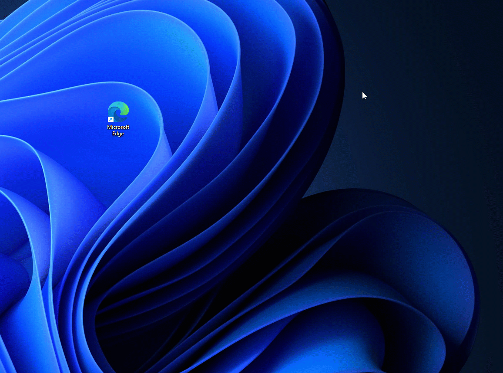
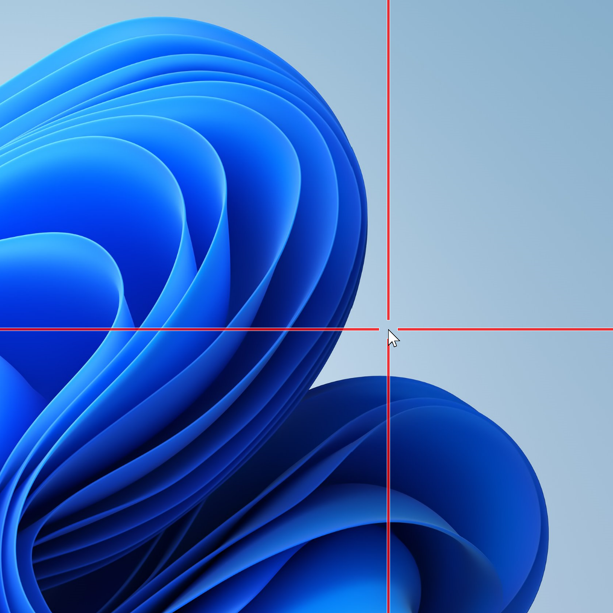

# Mouse utilities

Mouse utilities is a collection of features that enhance mouse and cursor functionality on Windows. Currently, the collection consists of:

- [Find My Mouse](find-my-mouse)
- Mouse Highlighter
- Mouse Pointer Crosshairs

## Find my mouse

Double press the left <kbd>Ctrl</kbd> key or shake the mouse to activate a spotlight that focuses on the cursor's position. Click the mouse or press any keyboard key to dismiss it. If you move the mouse while the spotlight is active, the spotlight will dismiss on its own shortly after the mouse stops moving.

### Settings

From the settings menu, the following options can be configured:

| Setting | Description |
| :--- | :--- |
| Activation method | Choose between "Press left Ctrl twice" or "Shake mouse". |
| Minimum distace to shake | Adjust sensitivity. |
| Do not activate when Game Mode is on | Prevents the spotlight from being used when actively playing a game on the system. |
| Overlay opacity | The opacity of the spotlight backdrop. (default: 50%) |
| Background color | The color of the spotlight backdrop. (default: #000000) |
| Spotlight color | The color of the circle that centers on the cursor. (default: #FFFFFF) |
| Spotlight radius | The radius of the circle that centers on the cursor. (default: 100px) |
| Spotlight initial zoom | The spotlight animation's zoom factor. Higher values result in more pronounced zoom animation as the spotlight closes in on the cursor position. |
| Animation duration | Time for the spotlight animation. (default: 500ms) |

## Mouse highlighter

Display visual indicators when the left or right mouse buttons are clicked. By default, mouse highlighting can be turned on and off with the <kbd>Win</kbd>+<kbd>Shift</kbd>+<kbd>H</kbd> shortcut.

### Settings

From the settings menu, the following options can be configured:

| Setting | Description |
| :--- | :--- |
| Activation shortcut | The customizable keyboard command to turn on or off mouse highlighting. |
| Left button highlight color | The highlighter color for the left mouse button. |
| Right button highlight color | The highlighter color for the right mouse button. |
| Overlay opacity | The opacity of the highlighter. |
| Radius | The radius of the highlighter - Measured in pixels. |
| Fade delay | How long it takes before a highlight starts to disappear - Measured in milliseconds. |
| Fade duration | Duration of the disappear animation - Measured in milliseconds. |

## Mouse pointer Crosshairs

Mouse Pointer Crosshairs draws crosshairs centered on the mouse pointer.

| Setting | Description |
| :--- | :--- |
| Activation shortcut | The customizable keyboard command to turn on or off mouse crosshairs. |
| Color | The color for the crosshairs. |
| Opacity | (default: 75%) |
| Center radius | (default: 20px) |
| Crosshairs thickness | (default: 5px) |
| Border color | |
| Border size | in pixels |
