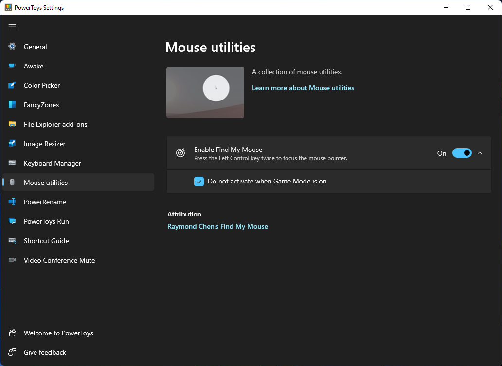

# Mouse utilities

Mouse utilities are a collection of features that enhance mouse and cursor functionality on Windows. Currently, the collection consists of:

- Find My Mouse

## Find My Mouse

Double press the left <kbd>ctrl</kbd> key to activate a spotlight that focuses on the cursor's position. Click the mouse or press any keyboard key to dismiss it. If you move the mouse while the spotlight is active, the spotlight will dismiss on its own shortly after the mouse stops moving.

From the PowerToys settings, users can enable/disable Find My Mouse, and optionally prevent the functionality from activating when playing games on the system.

