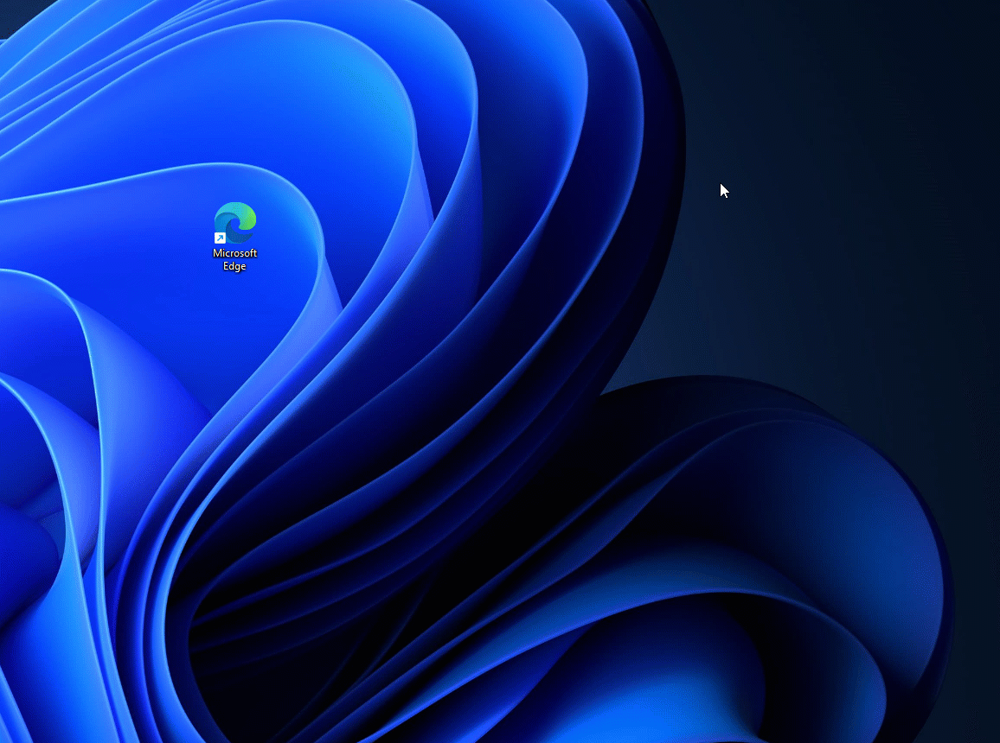
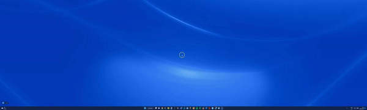
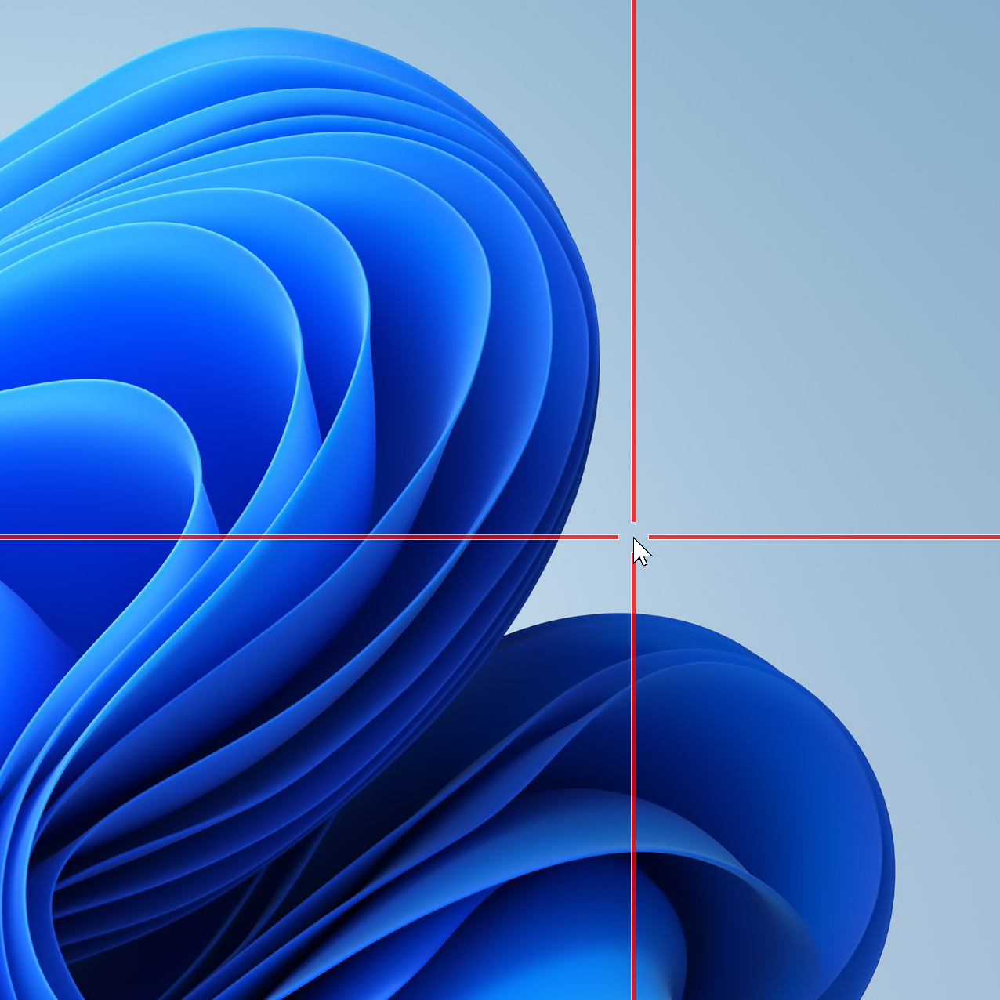

# Mouse utilities

Mouse utilities in PowerToys is a collection of features that enhance mouse and cursor functionality on Windows. These utilities help you locate your cursor, highlight mouse clicks, jump across screens, and display crosshairs for improved precision and productivity.

:::image type="content" source="images/pt-mouse-utilities-cursorwrap.gif" alt-text="An animated gif of the PowerToys Cursor Wrap feature of its Mouse Utilities.":::

## CursorWrap
CursorWrap helps you move your mouse faster by allowing the cursor to seamlessly wrap around the edges of the screen. When enabled, moving past the top, bottom, left, or right edge instantly brings the cursor back on the opposite side, reducing long mouse travel and making navigation smoother on both single- and multi-monitor setups.

### Settings

From the settings page, you can configure the following options:

| Setting | Description |
| :--- | :--- |
| Enable CursorWrap | Toggle to enable or disable CursorWrap. |
| Activation shortcut | The customizable keyboard command to toggle CursorWrap on or off. |
| Automatically activate on utility startup | When enabled, CursorWrap activates automatically when the utility starts. |
| Disable wrapping while dragging | Prevents the cursor from wrapping while dragging items. |
| Wrap mode | Choose between **Vertical and horizontal**, **Vertical only**, or **Horizontal only**. |
| Wrapping activation | Control when cursor wrapping occurs as the pointer reaches the screen edge. Options: **Always**, **Holding Ctrl**, or **Holding Shift**. |
| Disable wrapping when using a single monitor | Prevents the cursor from wrapping when only one monitor is connected. |

## Find My Mouse

Activate a spotlight that focuses on the cursor's position by pressing the <kbd>Ctrl</kbd> key twice, using a custom shortcut, or by shaking the mouse. Click the mouse or press any keyboard key to dismiss it. If you move the mouse while the spotlight is active, the spotlight dismisses on its own shortly after the mouse stops moving. It has an option to use a transparent spotlight with independent backdrop and spotlight opacities, boosting focus and accessibility.

:::image type="content" source="images/pt-mouse-utilities-find-my-mouse.gif" alt-text="An animated gif of the PowerToys Find my mouse feature of its Mouse Utilities.":::

### Settings

From the settings page, you can configure the following options:

| Setting | Description |
| :--- | :--- |
| Activation method | Choose between **Press Left Ctrl twice**, **Press Right Ctrl twice**, **Shake mouse**, or **Custom shortcut**. |
| Only activate while holding the Windows key | When using the Press Left Ctrl twice or Press Right Ctrl twice activation method, requires also holding the Windows key. |
| Minimum distance to shake | Adjust sensitivity. |
| Shake detection interval (ms) | Time window used to monitor mouse movement for shake detection. Shorter intervals may detect quicker shakes. (default: 1000ms) |
| Shake sensitivity factor (percent) | Determines how far the pointer must move, relative to the screen diagonal, to count as a shake. Lower values make it more sensitive. (default: 2000) |
| Activation shortcut | The custom shortcut used to activate the spotlight. |
| Do not activate when Game Mode is on | Prevents the spotlight from being used when actively playing a game on the system. |
| Background color | The color of the spotlight backdrop. (default: #000000) Support for transparency is available, with the alpha channel controlling the backdrop opacity. |
| Spotlight color | The color of the circle that centers on the cursor. (default: #FFFFFF) Support for transparency is available. |
| Spotlight radius | The radius of the circle that centers on the cursor. (default: 100px) |
| Spotlight initial zoom | The spotlight animation's zoom factor. Higher values result in more pronounced zoom animation as the spotlight closes in on the cursor position. |
| Animation duration | Time for the spotlight animation. (default: 500ms) |
| Excluded apps | Add an application's name, or part of the name, one per line (for example, adding `Notepad` matches both `Notepad.exe` and `Notepad++.exe`; to match only `Notepad.exe` add the `.exe` extension). |

## Mouse Highlighter

Display visual indicators when the left or right mouse buttons are clicked. By default, you can turn mouse highlighting on and off with the <kbd>Win</kbd>+<kbd>Shift</kbd>+<kbd>H</kbd> shortcut.

### Settings

From the settings page, you can configure the following options:

| Setting | Description |
| :--- | :--- |
| Activation shortcut | The customizable keyboard command to turn mouse highlighting on or off. |
| Automatically activate on utility startup | When enabled, Mouse Highlighter activates automatically when the utility starts. |
| Primary button highlight color | The highlighter color for the primary mouse button. |
| Secondary button highlight color | The highlighter color for the secondary mouse button. |
| Always highlight color | The highlighter color for the mouse pointer. |
| Highlight mode | Determines how the cursor is highlighted. **Spotlight** dims the screen to spotlight the cursor. **Circle highlight** highlights the cursor with a circle, while keeping the rest of the screen unaffected. |
| Radius | The radius of the highlighter, measured in pixels. |
| Fade delay | How long it takes before a highlight starts to disappear, measured in milliseconds. |
| Fade duration | Duration of the disappear animation, measured in milliseconds. |

## Mouse jump

Mouse jump allows moving the mouse pointer long distances on a single screen or across multiple screens.

| Setting | Description |
| :--- | :--- |
| Activation shortcut | The customizable keyboard command to activate the mouse jump. |
| Thumbnail Size | Constrains the thumbnail image to a maximum size. The default size is 1600x1200 pixels. |
| Appearance | Expand this section to adjust the popup appearance by customizing the colors, borders, spacing, and more. |

## Mouse pointer crosshairs

Mouse Pointer Crosshairs draws crosshairs centered on the mouse pointer. This feature is particularly useful for users with visual impairments or those who need enhanced cursor visibility for precision tasks.

The gliding cursor option is an accessibility feature that lets you control the mouse with a single button by using guided horizontal and vertical lines. Use the <kbd>Win</kbd>+<kbd>Alt</kbd>+<kbd>.</kbd> keyboard key combination to activate the gliding cursor, then move the mouse to control its position. Cancel the gliding cursor with the <kbd>Esc</kbd> key or by clicking the mouse.

:::image type="content" source="images/pt-mouse-utilities-gliding-cursor.png" lightbox="images/pt-mouse-utilities-gliding-cursor.gif" alt-text="An animated gif of the PowerToys gliding cursor feature of its Mouse Utilities.":::

| Setting | Description |
| :--- | :--- |
| Activation shortcut | The customizable keyboard command to turn mouse crosshairs on or off. |
| Automatically activate on utility startup | When enabled, Mouse Pointer Crosshairs activates automatically when the utility starts. |
| Color | The color for the crosshairs. |
| Opacity | (default: 75%) |
| Center radius | (default: 20px) |
| Crosshairs thickness | (default: 5px) |
| Border color | The color for the crosshair borders. |
| Border size | Size of the border, in pixels. |
| Orientation | Choose between **Horizontal**, **Vertical**, or **Vertical and Horizontal** (default). |
| Automatically hide crosshairs when the mouse pointer is hidden | |
| Fix crosshairs length | |
| Crosshairs fixed length (px) | |
| Gliding cursor | This activation shortcut is the customizable keyboard command to turn the gliding cursor on or off. |
| Gliding cursor: Travel speed | Provides a slider to adjust the speed at which the gliding cursor moves across the screen. |
| Gliding cursor: Delay speed | Provides a slider to adjust the delay before the gliding cursor starts moving. |

[!INCLUDE [install-powertoys.md](../includes/install-powertoys.md)]
