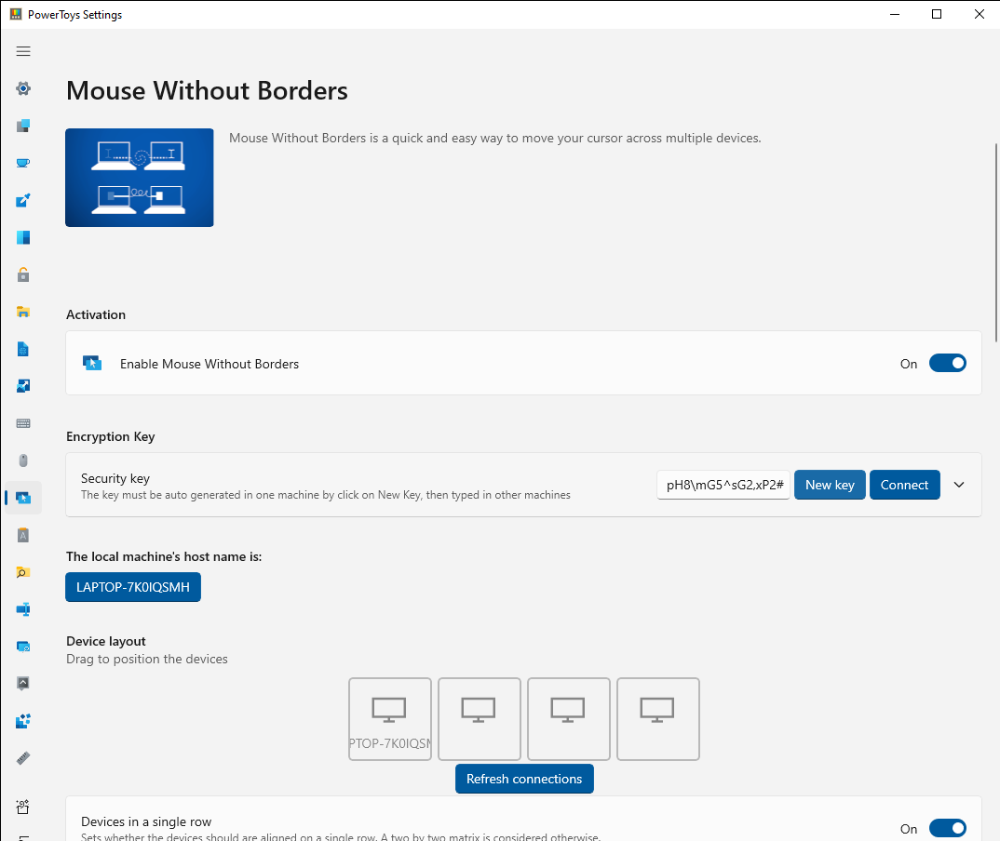
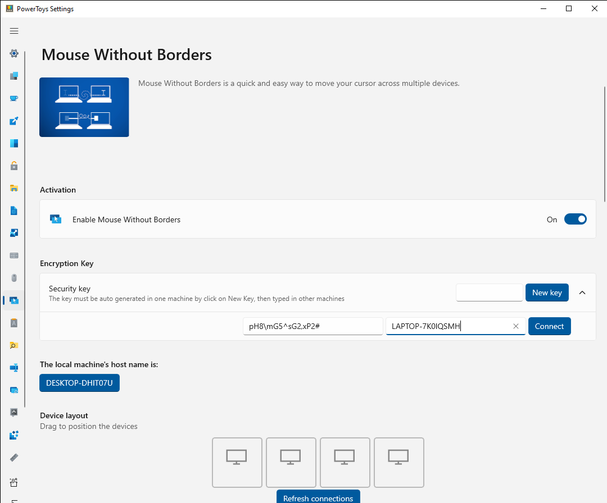
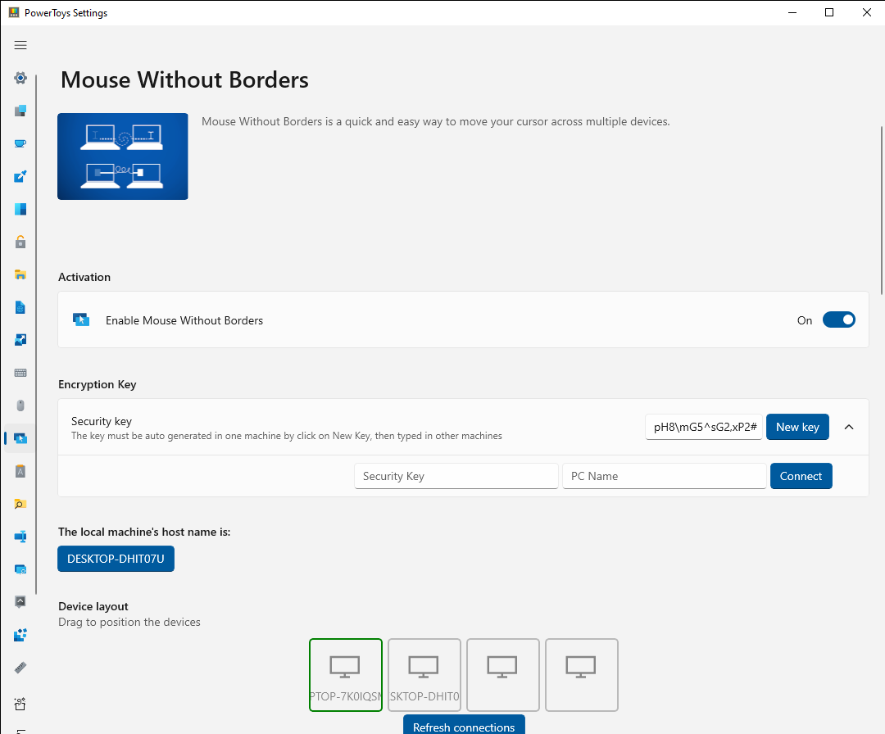
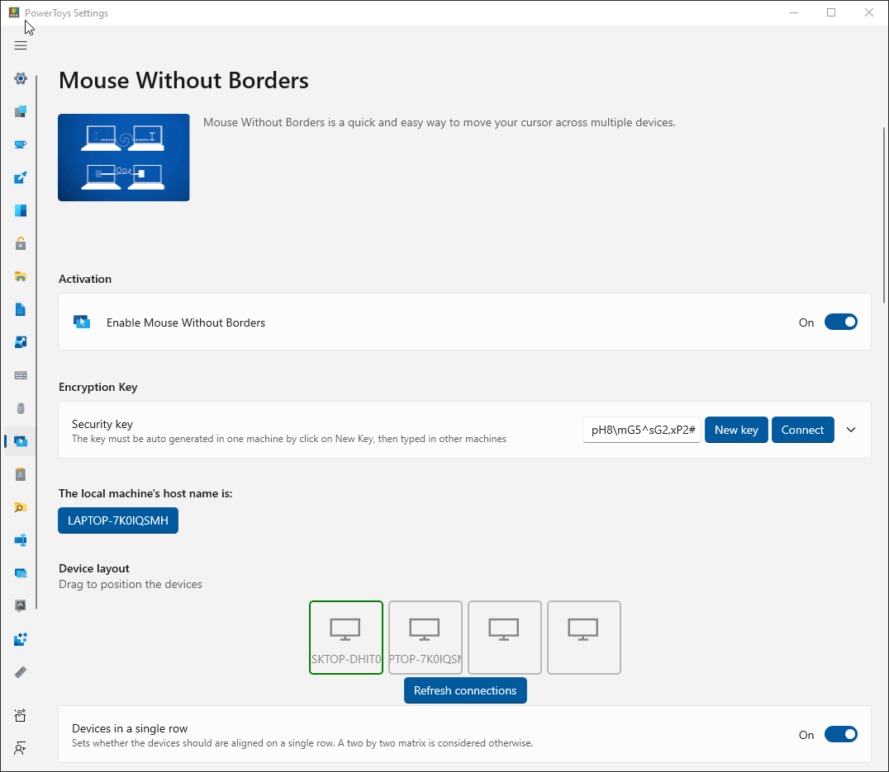
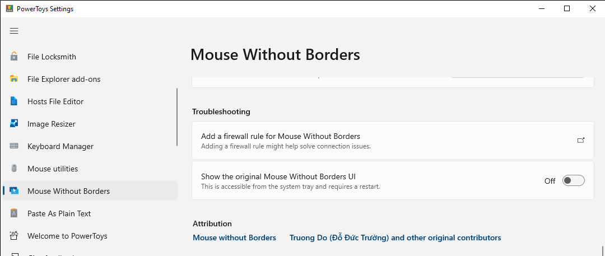

# Mouse Without Borders

**Mouse Without Borders** enables you to control up to 4 computers from the same machine.

Features:

- Control a set of machines using the same keyboard/mouse.
- Share clipboard between the machines.
- Transfer files between the machines.

## How to use Mouse Without Borders

With the latest version of PowerToys installed, you will see Mouse Without Borders listed in the PowerToys Settings, where you will need to do some initial configuration.

### Initial configuration

1. Open Mouse Without borders in PowerToys Settings to configure your connections.

2. On the first computer, select **New Key** to generate a security key for connecting.

    

3. On the second computer, enter the security key that was generated on the first computer and the name of the first computer. Then select **Connect**.

    

4. Once the computers are connected, you will be able to switch between them by moving your mouse cursor beyond the edge of the screen, transitioning between computers.

    

It's possible to switch the order of the devices by dragging the device icon to a new position in the layout.

   

### Install Mouse Without Borders as a service

To allow Mouse Without Borders to control elevated applications or the lock screen from another computer, it's possible to run Mouse Without Borders as a service under the System account.

To enable the service mode, run PowerToys in administrator mode and turn on the **Use Service** toggle.

> [!WARNING]
> Running Mouse Without Borders as a service account brings added control and ease of use to the controlled machines, but this also brings some additional security risks in case someone wants to use Mouse Without Borders as an attack vector. Be mindful of your risk tolerance.

## Mouse Without Borders settings

| Setting | Description |
| :-- | :-- |
| New key | Generate a new key for the machine and resets current connections. |
| Security key | Represents the security key used between the connected machines. Can only be changed by generating a new key. |
| Connect | Connect to other machines knowing the other machine's name and security key. |
| Local machine's host name | Show the current machine's host name. |
| Device layout | Allows arranging the machine's position relative to each other by dragging the machines in the layout. |
| Refresh connections | Select this button to refresh the connections this machine has to the other machines.
| Devices in a single row | Arrange the devices in a single row or in a 2x2 matrix. |
| Use Service | Install Mouse Without Borders as a service to allow controlling the lock screen and elevated applications. |
| Uninstall Service | Uninstall the service from the computer. |
| Wrap mouse | Wraps the mouse around to the first machine, after passing the edge of the last machine and vice-versa. |
| Share clipboard |  |
| Transfer file | Files can be copied via the clipboard. Limit is 100 MB. |
| Hide mouse at the screen's edge | Position the mouse cursor of one machine at the top edge of the screen when switching to another machine. |
| Draw mouse cursor | Attempt to draw the mouse cursor on machines that have no physical peripheral attached. |
| Validate remote machine IP | Use reverse DNS lookup to validate remote machines IP addresses. |
| Same subnet only | Only connect to machines in the same intranet. |
| Block screen saver on other machines | Prevent the screen saver from starting on other machines. |
| Move mouse relatively | May help in solving issues when the machine's resolutions are different or there are multiple screen scenarios. |
| Block mouse at screen corners | Avoid accidentally switching machines when the mouse pointer is at screen corners. |
| Show clipboard and network status messages | Show clipboard activities and network status in system tray notifications. |
| Easy Mouse | Use the mouse pointer to switch between machines at screen edges. Can also be configured to need to select **Shift** or **Control** to switch between machines. |
| Shortcut to toggle Easy Mouse | Set a <kbd>Ctrl</kbd>+<kbd>Alt</kbd>+\<letter> shortcut to toggle Easy Mouse. |
| Shortcut to lock all machines | Set a <kbd>Ctrl</kbd>+<kbd>Alt</kbd>+\<letter> shortcut to press twice to lock all machines. Only works in the machines that have the same setting. |
| Shortcut to try reconnecting | Set a <kbd>Ctrl</kbd>+<kbd>Alt</kbd>+\<letter> shortcut to try reconnecting. |
| Shortcut to switch to multiple machine mode | Set a <kbd>Ctrl</kbd>+<kbd>Alt</kbd>+\<letter> shortcut to start sending the same input to all machines at the same time. |
| Shortcut to switch between machines | Set a <kbd>Ctrl</kbd>+<kbd>Alt</kbd>+\<number> shortcut to switch to a specific machine. <kbd>Ctrl</kbd>+<kbd>Alt</kbd>+<kbd>3</kbd> switches to the third machine and so on. <kbd>F1</kbd>,<kbd>F2</kbd>,<kbd>F3</kbd> and <kbd>F4</kbd> can also be used. |
| Add a firewall rule for Mouse Without Borders | Install a firewall rule for Mouse Without Borders. |
| Show the original Mouse Without Borders UI | Show the original UI from Mouse Without Borders through the original tray icon. Mouse Without Borders needs to be restarted for it to take effect. |

## Status Colors
The following colors are used to indicate the connection status to the user when trying to connect to another computer:

| Connection Status | Color    | Hex Code    |
| :-----: | :---: | :---: |
| NA | Dark Grey   | #00717171  |
| Resolving | Yellow   | #FFFFFF00   |
| Connecting | Orange   | #FFFFA500   |
| Handshaking | Blue   | #FF0000FF   |
| Error | Red  | #FFFF0000   |
| ForceClosed | Purple   | #FF800080   |
| InvalidKey | Brown   | #FFA52A2A   |
| Timeout | Pink   | #FFFFC0CB   |
| SendError | Maroon   | #FF800000   |
| Connected | Green   | #FF008000   |

## Troubleshooting

If you can't setup the initial connection:

- Make sure all machines are connected on the same network.
- Check if the security key and computer host name are correctly inserted.
- Check if the Firewall is blocking connections. Select **Add a firewall rule for Mouse Without Borders** to make adjustments.

If the connection is lost:

- Make sure the machines are still connected.
- Select **Refresh connections** in Settings (or use the Refresh shortcut).

## Known Issues

- Copy/Paste between machines only works with a single file and the size limit is 100MB.
- Drag/Drop between machines works with single file only and it does not work with network files.
- Copy/Paste, Drag/Drop does not work with folder and multiple files, the workaround is to zip them first.
- If the host machine has a full-screen focused Remote Desktop/virtual machine window (or some kind of simulator window), the keyboard might not follow the mouse to another machine. The workaround is to enable the option "Hide mouse at screen edge" in the Settings or switch the focus to another window first.
- The mouse pointer might be invisible if there is no physical mouse attached to the machine. Plug in an unused mouse or turn on **Mouse Keys** in Control Panel.
- Some settings may not sync correctly and may need to be manually changed to be the same on all machines.
