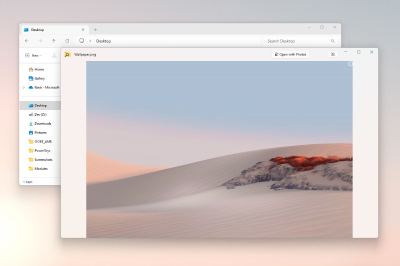

# Peek utility

A system-wide utility for Windows to preview file content without the need to open multiple applications or interrupt your workflow. It offers a seamless and quick file preview experience for various file types, including images, Office documents, videos, web pages, Markdown files, text files, and developer files. Peek also lets you see summary information about folders.

## Preview a file

Select a file in File Explorer and open the Peek preview using the activation / deactivation shortcut (default: <kbd>Ctrl</kbd>+<kbd>Space</kbd>).

Using <kbd>Left</kbd> and <kbd>Right</kbd> or <kbd>Up</kbd> and <kbd>Down</kbd>, you can scroll between all files in the current folder. Select multiple files in File Explorer for previewing to scroll only between selected ones.

## Pin preview window position and size

The Peek window adjusts its size based on the dimensions of the images being previewed. However, if you prefer to keep the window's size and position, you can use the pinning feature.
By selecting the pinning button, the window will preserve the current size and position. Selecting the pinning button again will unpin the window. When unpinned, the Peek window will return to the default position and size when previewing the next file.

## Open file with the default program

Select **Open with** or <kbd>Enter</kbd> to open the current file with the default program.

## See extra information about the current file

Hover over the preview to see extra information about the file, including its size, type, and when it was last modified.

## Delete files

Press the <kbd>Delete</kbd> key to send the current file to the Recycle Bin. Peek will automatically preview the next file. If there are no more files to preview, a message will be displayed.

Note: only files may be deleted. Folders may not be deleted, even if they are empty.

## Settings

From the settings page, the following options can be configured:

| Setting | Description |
| :--- | :--- |
| Activation shortcut | The customizable keyboard command to open Peek for the selected file(s). |
| Always run not elevated, even when PowerToys is elevated | Tries to run Peek without elevated permissions, to fix access to network shares. |
| Automatically close the Peek window after it loses focus |  |

[!INCLUDE [install-powertoys.md](../includes/install-powertoys.md)]
