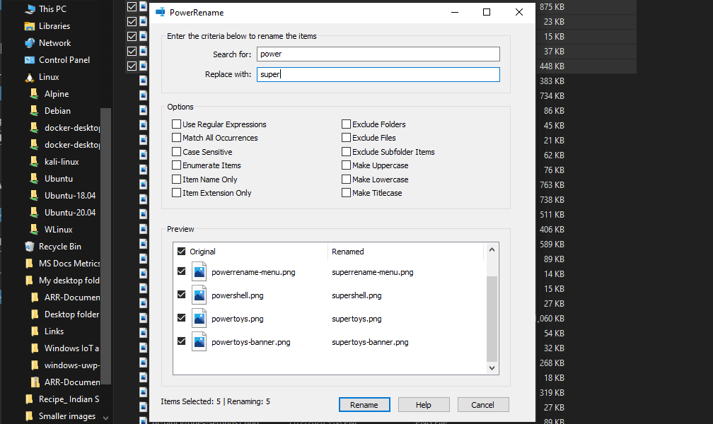
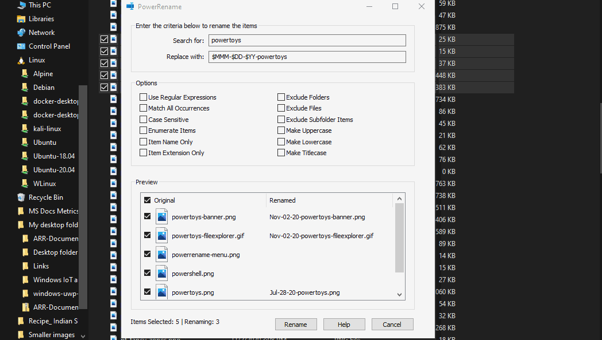

# PowerRename utility

PowerRename is a bulk renaming tool that enables you to:

- Modify the file names of a large number of files, without giving all of the files the same name.
- Perform a search and replace on a targeted section of file names.
- Perform a regular expression rename on multiple files.
- Check expected rename results in a preview window before finalizing a bulk rename.
- Undo a rename operation after it is completed.

## Demo

In this demo, all instances of the file name "foo" are replaced with "foobar". Since all of the files are uniquely named, this would have taken a long time to complete manually one-by-one. PowerRename enables a single bulk rename. Notice that the Explorer's "Undo Rename" (Ctrl+Z) command makes it possible to undo the last change.

## PowerRename window

After selecting files in Windows File Explorer, right-click and select **Resize with PowerRename** (which will appear only if enabled in PowerToys). The selected items will be displayed, along with search and replace values, a list of options, and a preview pane displaying results of the search and replace values entered.

### Search for

Enter text or a [regular expression](https://wikipedia.org/wiki/Regular_expression) to find the files in your selection that contain the criteria matching your entry. You will see the matching items in the _Preview_ pane.

### Replace with

Enter text to replace the _Search for_ value entered previously. You can see the original file name and renamed file name in the _Preview_ pane.

### Use regular expressions

If selected, the Search value will be interpreted as a [regular expression](https://wikipedia.org/wiki/Regular_expression) (regex). The Replace value can also contain regex variables (see [examples below](#regular-expressions)). If cleared, the Search value will be interpreted as plain text to be replaced with the text in the Replace field.

For more information regarding the **Use Boost library** option in the settings menu for extended regex functionalities, see the [regular expressions section](#regular-expressions).

### Match all occurrences

If selected, all matches of text in the _Search_ field will be replaced with the Replace text. Otherwise, only the first instance of the _Search for_ text in the file name will be replaced.

For example, given the file name: `powertoys-powerrename.txt`:

- Search for: `power`
- Rename with: `super`

The value of the renamed file would result in:

- Match all occurrences cleared: `supertoys-powerrename.txt`
- Match all occurrences selected: `supertoys-superrename.txt`

### Case sensitive

If selected, the text specified in the _Search_ field will only match text in the items if the text is the same case. Case matching will be insensitive by default.

### Apply to: Filename only

Only the file name is modified by the operation. For example: `txt.txt` → `NewName.txt`.

### Apply to: Extension only

Only the file extension is modified by the operation. For example: `txt.txt` → `txt.NewExtension`.

### Include files

Clearing causes files to not be included in the operation.

### Include folders

Clearing causes folders to not be included in the operation.

### Include subfolders

Clearing causes files within folders to not be included in the operation. By default, all subfolder items are included.

### Text formatting

Choose between four options to either convert items to be all lowercase, all uppercase, title case (first character of sentence is capitalized), or capitalize every word.

### Enumerate items

If selected, you can use the following patterns as part of the _Replace with_ text:

| Variable pattern | Explanation                                                            |
|:-----------------|:-----------------------------------------------------------------------|
| `${}`            | A simple counter that will start from zero for the first renamed file. |
| `${increment=X}` | A counter with a customized incrementer value.                         |
| `${padding=X}`   | A counter with a specified number of leading zeroes for the number.    |
| `${start=X}`     | A counter with a customized initial value.                             |

You can also use multiple counters in the same replace string and combine customizations.

For example, given a _Search_ text `a` and a set of files:

- a.jpg
- ab.jpg
- abc.jpg

A _Replace with_ text `Image_${padding=4;increment=2;start=10}_` would produce the following:

- Image_0010_.jpg
- Image_0012_b.jpg
- Image_0014_bc.jpg

## Replace using file creation date and time

The creation date and time attributes of a file can be used in the _Replace with_ text by entering a variable pattern according to the table below. Selecting the tool-tip in the _Replace with_ field allows you to view and select from the supported patterns.

| Variable pattern | Explanation |
| :---             | :--- |
| `$YYYY`          | Year, represented by a full four or five digits, depending on the calendar used. |
| `$YY`            | Year, represented only by the last two digits. A leading zero is added for single-digit years. |
| `$Y`             | Year, represented only by the last digit. |
| `$MMMM`          | Name of the month. |
| `$MMM`           | Abbreviated name of the month. |
| `$MM`            | Month, as digits with leading zeros for single-digit months. |
| `$M`             | Month, as digits without leading zeros for single-digit months. |
| `$DDDD`          | Name of the day of the week. |
| `$DDD`           | Abbreviated name of the day of the week. |
| `$DD`            | Day of the month, as digits with leading zeros for single-digit days. |
| `$D`             | Day of the month, as digits without leading zeros for single-digit days. |
| `$hh`            | Hours, with leading zeros for single-digit hours. |
| `$h`             | Hours, without leading zeros for single-digit hours. |
| `$mm`            | Minutes, with leading zeros for single-digit minutes. |
| `$m`             | Minutes, without leading zeros for single-digit minutes. |
| `$ss`            | Seconds, with leading zeros for single-digit seconds. |
| `$s`             | Seconds, without leading zeros for single-digit seconds. |
| `$fff`           | Milliseconds, represented by full three digits. |
| `$ff`            | Milliseconds, represented only by the first two digits. |
| `$f`             | Milliseconds, represented only by the first digit. |

For example, given the file names:

- `powertoys.png`, created on 11/02/2020 _(november second)_
- `powertoys-menu.png`, created on 11/03/2020 _(november third)_

Enter the criteria to rename the items:

- Search for: `powertoys`
- Rename with: `$MMM-$DD-$YY-powertoys`

The value of the renamed file would result in:

- `Nov-02-20-powertoys.png`
- `Nov-03-20-powertoys-menu.png`

## Regular expressions

For most use cases, a simple search and replace is sufficient. There may be occasions, however, in which complicated renaming tasks require more control. [Regular Expressions](https://wikipedia.org/wiki/Regular_expression) can help.

Regular Expressions define a search pattern for text. They can be used to search, edit and manipulate text. The pattern defined by the regular expression may match once, several times, or not at all for a given string. PowerRename uses the [ECMAScript](https://wikipedia.org/wiki/ECMAScript) grammar, which is common amongst modern programming languages.

To enable regular expressions, select **Use Regular Expressions**.

**Note:** You will likely want to select **Match all occurrences** while using regular expressions.

To use the [Boost library](https://www.boost.org/doc/libs/1_74_0/libs/regex/doc/html/boost_regex/syntax/perl_syntax.html) instead of the standard library, select the **Use Boost library** option in the PowerToys settings. It enables extended features, like [lookbehind](https://www.boost.org/doc/libs/1_74_0/libs/regex/doc/html/boost_regex/syntax/perl_syntax.html#boost_regex.syntax.perl_syntax.lookbehind), which are not supported by the standard library.

### Examples of regular expressions

Simple matching examples.

| Search for      | Description                                            |
|:----------------|:-------------------------------------------------------|
| `^`             | Match the beginning of the filename (zero size)        |
| `$`             | Match the end of the filename (zero size)              |
| `.*`            | Match all the text in the name                         |
| `^foo`          | Match text that begins with "foo"                      |
| `bar$`          | Match text that ends with "bar"                        |
| `^foo.*bar$`    | Match text that begins with "foo" and ends with "bar"  |
| `.+?(?=bar)`    | Match everything up to "bar"                           |
| `foo[\s\S]*bar` | Match everything between and including "foo" and "bar" |

Matching and variable examples. Capturing groups are defined in parentheses `()`. To refer to them, use `$` followed by a number: `$1` will refer to the first group, `$2` to the second etc.

_When using the variables, "Match all occurrences" must be selected._

| Search for                                              | Replace with | Description                                                                          |
|:--------------------------------------------------------|:-------------|:-------------------------------------------------------------------------------------|
| `(.*).png`                                              | `foo_$1.png` | Prepends "foo\_" to the existing file name for PNG files                             |
| `(.*).png`                                              | `$1_foo.png` | Appends "\_foo" to the existing file name for PNG files                              |
| `(.*)`                                                  | `$1.txt`     | Appends ".txt" extension to existing file                                            |
| `(^\w+\.$)\|(^\w+$)`                                    | `$2.txt`     | Appends ".txt" extension to existing file name only if it does not have an extension |
| `(\d\d)-(\d\d)-(\d\d\d\d)` or `(\d{2})-(\d{2})-(\d{4})` | `$3-$2-$1`   | Move parts in the filename: "29-03-2020" becomes "2020-03-29"                      |
| `^(.{n})(.*)` or `(.*)(.{n})$`                          | `$1foo$2`    | Insert "foo" _n_ characters from the beginning or the end, respectively              |
| `^.{n}` or `.{n}$`                                      | nothing      | Trim _n_ characters from the beginning or the end, respectively                      |

### Additional resources for learning regular expressions

There are great examples/cheatsheets available online to help you:

[Regular Expression Tutorial](https://www.regular-expressions.info/tutorial.html)

[JavaScript Regular Expressions Tutorial with Examples](https://o7planning.org/12219/javascript-regular-expression)

## File list filters

Filters can be used in PowerRename to narrow the results of the rename. Use the _Preview_ pane to check expected results.

- **Original**, the first column in the _Preview_ pane switches between:
  - Selected: The file is selected to be renamed
  - Cleared: The file is not selected to be renamed (even though it fits the value entered in the search criteria)

- **Renamed**, the second column in the _Preview_ pane can be toggled:
  - The default preview will show all selected files, with only files matching the _Search for_ criteria displaying the updated rename value.
  - Selecting the _Renamed_ header will toggle the preview to only display files that will be renamed. Other selected files from your original selection will not be visible.

## Settings

Additional options can be configured from the **PowerRename** tab in the Settings, as described below:

| Setting | Description |
| :--- | :--- |
| Show PowerRename in | PowerRename appears as one of the default options or only in the extended context menu |
| Hide icon in context menu | Hides the PowerRename icon in the context menu |
| Enable auto-complete for the search and replace fields | Automatically suggest terms to use in the search and replace fields based on prior uses of PowerRename |
| Maximum number of items | The largest number of search and replace suggestions to display |
| Show recently used strings | When opening PowerRename, populate the search and replace fields with the last values used |
| Use Boost library | Enable extended RegEx functionality. See [Regular Expressions](#regular-expressions) for more details |
