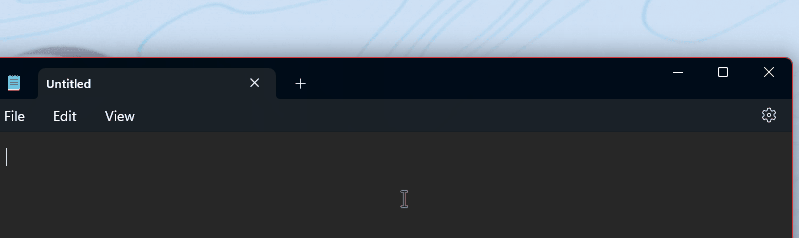

# Quick Accent utility

Quick Accent is an alternative way to type accented characters, useful when a keyboard doesn't support that specific accent with a quick key combo. This tool is based on [Damien Leroy's PowerAccent](https://github.com/damienleroy/PowerAccent).

In order to use the Quick Accent utility, open PowerToys Settings, select the **Quick Accent** tab, and turn the **Enable** toggle on.

## How to activate

Activate by holding the key for the character you want to add an accent to, then (while held down) press the activation key (Space key or Left / Right arrow keys). If you continue to hold, an overlay to choose the accented character will appear.

For example: If you want "à", press and hold <kbd>A</kbd> and press <kbd>Space</kbd>.

With the dialog enabled, keep pressing your activation key.

## Character sets

You can limit the available characters by selecting a character set from the settings menu. Available character sets are:

* Catalan
* Currency
* Croatian
* Czech
* Gaeilge
* Gàidhlig
* Dutch
* Estonian
* French
* German
* Hebrew
* Hungarian
* Icelandic
* Italian
* Kurdish
* Lithuanian
* Macedonian
* Maori
* Norwegian
* Pinyin
* Polish
* Portuguese
* Romanian
* Slovakian
* Spanish
* Serbian
* Swedish
* Turkish
* Welsh

## Settings

From the Settings menu, the following options can be configured:

| Setting | Description |
| :--- | :--- |
| Activation key | Choose **Left/Right Arrow**, **Space** or **Left, Right or Space**. |
| Character set | Show only characters that are in the chosen set. |
| Toolbar location | Position of the toolbar. |
| Show the Unicode code and name of the currently selected character | Shows the Unicode code (in hexadecimal) and name of the currently selected character under the selector. |
| Sort characters by usage frequency | |
| Start selection from the left | Starts the selection from the leftmost character for all activation keys (including Left/Right arrow). |
| Input delay | The delay in milliseconds before the dialog appears. |
| Excluded apps | Add an application's name, or part of the name, one per line (e.g. adding `Notepad` will match both `Notepad.exe` and `Notepad++.exe`; to match only `Notepad.exe` add the `.exe` extension). |
