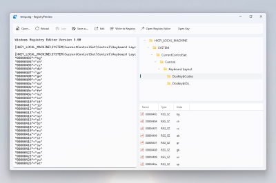

# Registry Preview

PowerToys **Registry Preview** simplifies the process of visualizing and editing complex Windows Registry files. It also can write changes to the Windows Registry.

## Getting started

### Enable

To start using Registry Preview, enable it in the PowerToys Settings (Registry Preview tab).

### How to activate

Select one or more .reg files in Windows File Explorer. Right-click on the selected file(s), choose **Show more options** from the menu to expand the list of menu options, then select **Preview** to open Registry Preview. **Registry Preview** can also be launched from PowerToys Settings' Registry Preview tab.

**Note:** Currently, there is a 10MB file limit for opening Windows Registry files with Registry Preview. Registry Preview will show a message if a file contains invalid content.

## How to use

After opening a Windows Registry file, the file content is shown on the left side of the Registry Preview. This content can be updated at any time.

In top-right area of the Registry Preview window there is a visual tree representation of the registry keys listed in the file. This visual tree will be automatically updated on each file content change inside the app.

Select a specific registry key in the visual tree for the values of that registry key to display in the bottom-right area of the Registry Preview window.

Select **Edit** to open the file in Notepad.

Select **Reload** to reload file content if the file is changed outside of the Registry Preview.

Select **Write to Registry** to save any changes listed in the Preview to the Windows Registry. The Windows Registry Editor will open and ask for confirmation before writing data.

Select **Open key** to open the Windows Registry Editor with whatever key you have highlighted in the right side of the application as the initial starting point.
