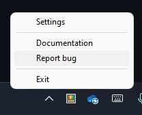

# Reporting a Bug on PowerToys

When using PowerToys, users may occasionally experience quirks or issues with one or more of the utilities. To help the development team identify and resolve these issues, we recommend submitting a bug report on the [PowerToys repository](https://github.com/microsoft/PowerToys/issues/new/choose).

> [!NOTE]
> To reduce the number of duplicate reports filed and increase the priority given to an issue, we encourage users to search the [existing entries](https://github.com/microsoft/PowerToys/issues) for that issue first, and if found, submit information, comment, and up-vote that report instead.

## Bug Report Form

Selecting `Bug report` from the available templates opens the below page for submitting details about an issue.

The more information provided in each section, the better chance the development team will have in identifying the cause of the issue. The **Steps to reproduce** section should provide enough details so that the problem can be consistently duplicated from the information given.

Visual aids like screenshots and recordings (encoded as GIFs) can also be attached to provide more insight into the bug. Simply drag and drop the screenshot/recording into the relevant section to attach it. 

PowerToys also generates helpful diagnostic logs about the app's activities which can be added to the bug report to further help identify the issue. Right clicking the PowerToys icon in the system tray and selecting `Report Bug` as shown below will generate a PowerToysReport.zip file on the desktop which can then be drag and dropped into the **Steps to reproduce** section of the bug report.

