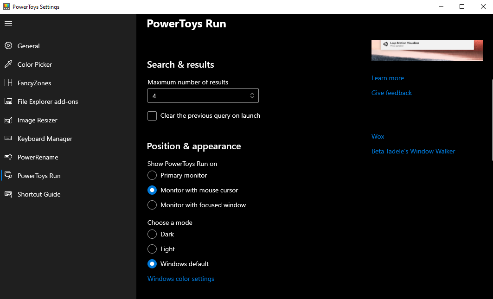
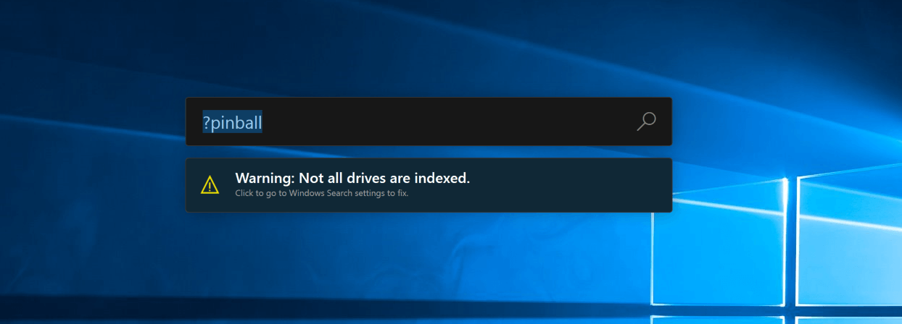

# PowerToys Run utility

PowerToys Run is a quick launcher for power users that contains some additional features without sacrificing performance. It is open source and modular for additional plugins.

To use PowerToys Run, select <kbd>Alt</kbd>+<kbd>Space</kbd> and start typing!

*If that shortcut isn't what you like, don't worry, it is fully configurable in the settings.*

## Requirements

- Windows 10 version 1903 or higher
- After installing, PowerToys must be enabled and running in the background for this utility to work

## Features

PowerToys Run features include:

- Search for applications, folders, or files

- Search for running processes (previously known as [WindowWalker](https://github.com/betsegaw/windowwalker/))

- Clickable buttons with keyboard shortcuts (such as *Open as administrator* or *Open containing folder*)

- Invoke Shell Plugin using `>`  (for example, `> Shell:startup` will open the Windows startup folder)

- Do a simple calculation using calculator

## Settings

The following Run options are available in the PowerToys settings menu.

  | **Settings** |**Action** |
  | --- | --- |
  | Open PowerToys Run | Define the keyboard shortcut to open/hide PowerToys Run |
  | Ignore shortcuts in Fullscreen mode |  When in full-screen (F11), Run won't be engaged with the shortcut |
  | Maximum number of results |  Maximum number of results shown without scrolling |
  | Clear the previous query on launch | When launched, previous searches will not be highlighted |
  | Disable drive detection warning | The warning, if all of your drives aren't indexed, will no longer be visible. |

## Keyboard shortcuts

  | **Shortcuts** | **Action** |
  | --- | --- |
  | Alt+Space | Open or hide PowerToys Run |
  | Esc | Hide PowerToys Run |
  | Ctrl+Shift+Enter | (Only applicable to applications) Open the selected application as administrator |
  | Ctrl+Shift+E | (Only applicable to applications and files) Open containing folder in File Explorer |
  | Ctrl+C | (Only applicable to folders and files) Copy path location |
  | Tab | Navigate through the search result and context menu buttons |

## Action keys

These default activation phrases will force PowerToys run into only targeted plugins.

  | **Action key** | **Action** |
  | --- | --- |
  | `=` | Calculator only. Example `=2+2`. |
  | `?` | File searching only. Example `?road` to find `roadmap.txt`. |
  | `.` | Installed programs only. Example `.code` to get Visual Studio Code. See [Program parameters](#program-parameters) for options on adding parameters to a program's startup. |
  | `//` | URLs only. Example `//` to launch your default browser, or `//docs.microsoft.com` to have your default browser go to https://docs.microsoft.com.  |
  | `<` | Running processes only. Example `<outlook` to find all processes that contain outlook. |
  | `>` | Shell command only. Example `>ping localhost` to do a ping query. |
  | `:` | Registry keys only. Example `:hkcu` to search for the HKEY_CURRENT_USER registry key. |
  | `!` | Windows services only. Example `!alg` to search for the Application Layer Gateway service to be started or stopped. |
  | `{` | Visual Studio Code previously opened workspaces, remote machines (SSH or Codespaces) and containers. Example `{powertoys` to search for workspaces that contain 'powertoys' in their paths. This plugin is off by default.
  | `%%` | Unit converter only. Example `%% 10 ft in m` to calculate the number of meters in 10 feet.
  | `$` | Windows settings only. Example `$ Add/Remove Programs` to launch the Windows settings menu for managing installed programs. To list all settings of an area category, type `:` after the category name. Ex: `$ Device:` to view all available Device settings.

## System commands

PowerToys Run enables a set of system level actions that can be executed.

  | **Action key**   |   **Action** |
  | ------------------ | ---------------------------------------------------------------------------------|
  | `Shutdown` | Shuts down the computer |
  | `Restart` | Restarts the computer |
  | `Sign Out` | Signs current user out |
  | `Lock` | Locks the computer |
  | `Sleep` | Sleeps the computer |
  | `Hibernate` | Hibernates the computer |
  | `Empty Recycle Bin` | Empties the recycle bin |

## Plugin manager

The PowerToys Run settings menu includes a plugin manager that allows you to enable/disable the various plugins currently available. By selecting and expanding the sections, you can customize the activation phrases used by each plugin. In addition, you can select whether a plugin appears in global results, as well as set additional plugin options where available. 

## Program parameters

The PowerToys Run program plugin allows for program arguments to be added when launching an application. The program arguments must follow the expected format as defined by the program's command line interface.

For example, when launching Visual Studio Code, you can specify the folder to be opened with:

`Visual Studio Code -- C:\myFolder`

Visual Studio Code also supports a set of [command line parameters](https://code.visualstudio.com/docs/editor/command-line), which can be utilized with their corresponding arguments in PowerToys Run to, for instance, view the difference between files:

`Visual Studio Code -d C:\foo.txt C:\bar.txt` 

If the program plugin's option "Include in global result" is not selected, be sure to include the activation phrase, `.` by default, to invoke the plugin's behavior:

`.Visual Studio Code -- C:\myFolder`

## Monitor Positioning

If multiple monitors are in use, PowerToys Run can be launched on the desired monitor by configuring the appropriate launch behavior in the Settings menu. Options include opening on:

- Primary monitor
- Monitor with mouse cursor
- Monitor with focused window

## Windows Search settings

If the Windows Search plugin is not set to cover all drives, you will receive the following warning:

You can turn off the warning in the PowerToys Run plugin manager options for Windows Search, or select the warning to expand which drives are being indexed. After selecting the warning, the Windows 10 settings "Searching Windows" options menu will open.

In this "Searching Windows" menu, you can:

- Select "Enhanced" mode to enable indexing across all of the drives on your Windows 10 machine.
- Specify folder paths to exclude.
- Select the "Advanced Search Indexer Settings" (near the bottom of the menu options) to set advanced index settings, add or remove search locations, index encrypted files, etc.

## Known issues

For a list of all known issues and suggestions, see the [PowerToys product repo issues on GitHub](https://github.com/microsoft/PowerToys/issues?q=is%3Aopen+is%3Aissue+label%3A%22Product-PowerToys+Run%22).

## Attribution

- [Wox](https://github.com/Wox-launcher/Wox/)

- [Beta Tadele's Window Walker](https://github.com/betsegaw/windowwalker)
