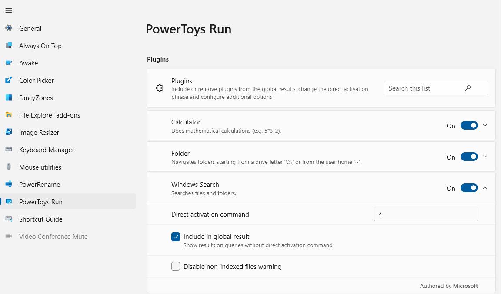
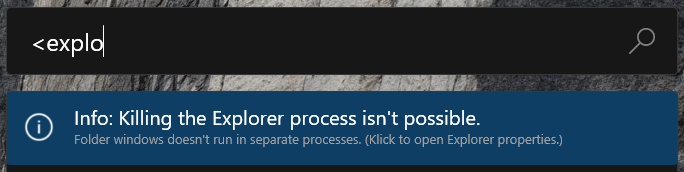
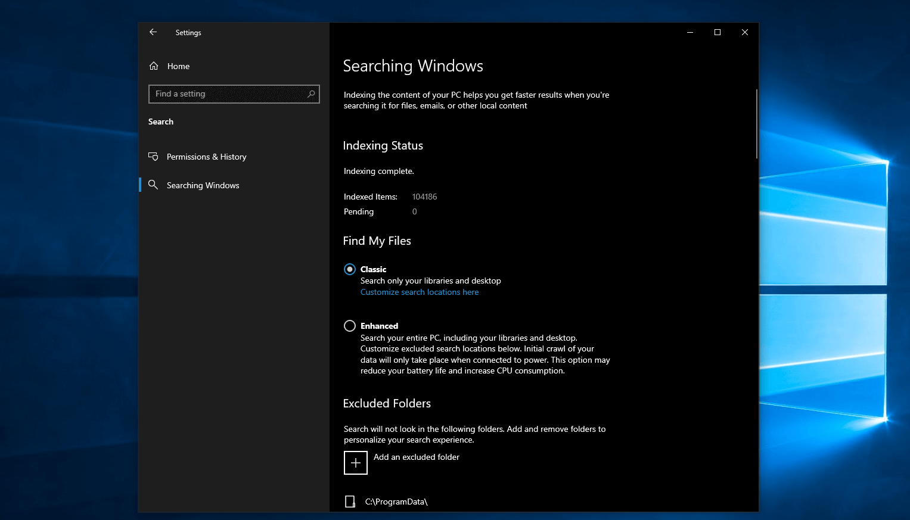
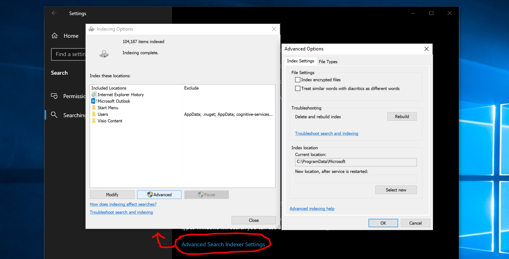

# PowerToys Run utility

PowerToys Run is a quick launcher for power users that contains additional features without sacrificing performance. It is open source and modular for additional plugins.

To use PowerToys Run, select <kbd>Alt</kbd>+<kbd>Space</kbd> and start typing! _(Note that this shortcut can be changed in the settings window.)_

> [!IMPORTANT]
> PowerToys must be running in the background and Run must be enabled for this utility to work.

## Features

PowerToys Run features include:

- Search for applications, folders or files
- Search for running processes (previously known as [Window Walker](https://github.com/betsegaw/windowwalker/))
- Clickable buttons with keyboard shortcuts (such as _Open as administrator_ or _Open containing folder_)
- Invoke Shell Plugin using `>` (for example, `> Shell:startup` will open the Windows startup folder)
- Do a simple calculation using calculator
- Execute system commands
- Get time and date information
- Convert units
- Calculate hashes
- Generate GUIDs
- Open web pages or start a web search

## Settings

The following general options are available on the PowerToys Run settings page.

| Setting | Description |
| :--- | :--- |
| Activation shortcut | Define the keyboard shortcut to show/hide PowerToys Run |
| Use centralized keyboard hook | Try this setting if there are issues with the shortcut (PowerToys Run might not get focus when triggered from an elevated window) |
| Ignore shortcuts in full-screen mode | When in full-screen (F11), PowerToys Run won't be engaged with the shortcut |
| Input smoothing | Add a delay to wait for more input before executing a search |
| Immediate plugins | How many milliseconds a plugin that makes the UI wait should wait before showing results |
| Background execution plugins | How many milliseconds a plugin that executes in the background should wait before showing results |
| Maximum number of results before scrolling | Maximum number of results shown without scrolling |
| Clear the previous query on launch | When launched, previous searches will not be highlighted |
| Results order tuning | Fine tunes the ordering of the displayed results |
| Selected item weight | Use a higher number to get selected results to rise faster (Default: 5, 0 to disable) |
| Wait for slower plugin results before selecting top item in results | Selecting this can help preselect the top, more relevant result, but at the risk of jumpiness |
| Tab through context buttons | When enabled, you can tab through the context buttons before tabbing to the next result |
| Generate thumbnails for files | When enabled, thumbnails will be generated for files in the results list (Disabling this can increase speed and stability) |
| Preferred monitor position | If multiple displays are in use, PowerToys Run can be launched on: • Primary display • Display with mouse cursor • Display with focused window |
| App theme | Change the color theme used by PowerToys Run |

### Plugin manager

PowerToys Run uses a plugin system to provide different types of results. The settings page includes a plugin manager that allows you to enable/disable the various available plugins. By selecting and expanding the sections, you can customize the direct activation commands used by each plugin. In addition, you can select whether a plugin appears in global results and set additional plugin options where available.

#### Direct activation commands

The plugins can be activated with a direct activation command so that PowerToys Run will only use the targeted plugin. The following table shows the direct activation commands assigned by default.

> [!TIP]
> You can change commands to fit your personal needs in the [plugin manager](#plugin-manager).

> [!IMPORTANT]
> Some characters and phrases may conflict with global queries of other plugins if you use them as activation commands. For example, using `(` breaks global calculation queries starting with an opening brace.
>
> Currently known conflicting character sequences:
>
> - Characters used in paths like `\`, `\\`, `/`, `~`, `%`.
> - Characters used in mathematical operations like `.`, `,`, `+`, `-`, `(`.
> - Names of [mathematical operations](#calculator-plugin).

| Plug-in | Direct activation command | Example |
| :--- | :--- | :--- |
| [Calculator](#calculator-plugin) | `=` | `= 2+2` |
| [Windows search](#windows-search-plugin) | `?` | `? road` to find 'roadmap.txt' |
| [History](#history-plugin) | `!!` | `!! car` to find any results that have been selected in the past, from any enabled plugin, that matches 'car'. |
| [Installed programs](#program-plugin) | `.` | `. code` to get Visual Studio Code. (See [Program parameters](#program-parameters) for options on adding parameters to a program's startup.) |
| OneNote | `o:` | `o: powertoys` to search your local OneNote notebooks for pages containing "powertoys" |
| Registry keys | `:` | `: hkcu` to search for the 'HKEY_CURRENT_USER' registry key. |
| [Windows services](#service-plugin) | `!` | `! alg` to search for the 'Application Layer Gateway' service to be started or stopped `!startup:auto` to search all services that start automatically `!status:running` to show all running services |
| Shell command | `>` | `> ping localhost` to do a ping query. |
| [Time and date](#time-and-date-plugin) | `)` | `) time and date` shows the current time and date in different formats. `) calendar week::04/01/2022` shows the calendar week for the date '04/01/2022'. |
| [Unit converter](#unit-converter-plugin) | `%%` | `%% 10 ft in m` to calculate the number of meters in 10 feet. |
| [Value Generator](#value-generator-plugin) | `#` | `# guid3 ns:URL www.microsoft.com` to generate the GUIDv3 for the URL namespace using the URL namespace.  `# sha1 abc` to calculate the SHA1 hash for the string 'abc'.  `# base64 abc` to encode the string 'abc' to base64.  |
| URI-handler | `//` | `//` to launch your default browser. `// learn.microsoft.com` to have your default browser go to Microsoft Learn. `mailto:` and `ms-settings:` links are supported. |
| Visual Studio Code | `{` | `{ powertoys` to search for previously opened workspaces, remote machines and containers that contain 'powertoys' in their paths. |
| Web search | `??` | `??` to launch your default browser's search page. `?? What is the answer to life` to search with your default browser's search engine. |
| [Windows settings](#windows-settings-plugin) | `$` | `$ Add/Remove Programs` to launch the Windows settings page for managing installed programs. `$ Device:` to list all settings with 'device' in their area/category name. `$ control>system>admin` shows all settings of the path 'Control Panel > System and Security > Administrative Tools'. |
| Windows Terminal profiles | `_` | `_ powershell` to list all profiles that contains 'powershell' in their name. |
| [Window Walker](#window-walker-plugin) | `<` | `< outlook` to find all open windows that contain 'outlook' in their name or the name of their process. |

## Using PowerToys Run

### General keyboard shortcuts

| Shortcut | Action |
| :--- | :--- |
| <kbd>Alt</kbd>+<kbd>Space</kbd> (default) | Show or hide PowerToys Run |
| <kbd>Esc</kbd> | Hide PowerToys Run |
| <kbd>Ctrl</kbd>+<kbd>Shift</kbd>+<kbd>Enter</kbd> | Open the selected application as administrator (only applicable to applications) |
| <kbd>Ctrl</kbd>+<kbd>Shift</kbd>+<kbd>U</kbd> | Open the selected application as different user (only applicable to applications) |
| <kbd>Ctrl</kbd>+<kbd>Shift</kbd>+<kbd>E</kbd> | Open containing folder in File Explorer (only applicable to applications and files) |
| <kbd>Ctrl</kbd>+<kbd>C</kbd> | Copy path location (only applicable to folders and files) |
| <kbd>Tab</kbd> | Navigate through the search results and context menu buttons |

### System commands

The Windows System Commands plugin provides a set of system level actions that can be executed.

> [!TIP]
> If your system language is supported by PowerToys, the system commands will be localized. If you prefer English commands, clear the **Use localized system commands instead of English ones** checkbox in the [plugin manager](#plugin-manager).

| Command | Action | Note |
| :--- | :--- | :--- |
| `Shutdown` | Shuts down the computer | |
| `Restart` | Restarts the computer | |
| `Sign Out` | Signs current user out | |
| `Lock` | Locks the computer | |
| `Sleep` | Puts the computer to sleep | |
| `Hibernate` | Hibernates the computer | |
| `Recycle Bin` | **Result:** Opens the recycle bin **Context menu:** Empties the Recycle Bin | The query `Empty Recycle Bin` shows the result too. |
| `UEFI Firmware Settings` | Reboots the computer into UEFI Firmware Settings | Only available on systems with UEFI firmware. Requires administrative permissions. |
| `IP address` * | Shows the ip addresses from the network connections of your computer. | The search query has to start with the word `IP` or the word `address`. |
| `MAC address` * | Shows the mac addresses from the network adapters in your computer. | The search query has to start with the word `MAC` or the word `address`. |

_*) This command may take some time to provide the results._

### Program plugin

The **Program** plugin can launch software applications (such as Win32 or packaged programs). The plugin works by scanning common install locations, like the start menu and desktops that you have access to, looking for executable files (.exe) or shortcut files (such as `.lnk` or `.url`). On occasion, a program may not be found by the program plugin scan and you may want to manually create a shortcut in the directory containing the program you want to access.

#### Program parameters

The Program plugin allows for program arguments to be added when launching an application. The program arguments must follow the expected format as defined by the program's command line interface.

> [!NOTE]
> To input valid search queries, the first element after the program name has to be one of the following possibilities:
>
> - The characters sequence `--`.
> - A parameter that starts with `-`.
> - A parameter that starts with `--`.
> - A parameter that starts with `/`.

For example, when launching Visual Studio Code, you can specify the folder to be opened with:

`Visual Studio Code -- C:\myFolder`

Visual Studio Code also supports a set of [command line parameters](https://code.visualstudio.com/docs/editor/command-line), which can be utilized with their corresponding arguments in PowerToys Run to, for instance, view the difference between files:

`Visual Studio Code -d C:\foo.txt C:\bar.txt`

If the program plugin's option "Include in global result" is not selected, include the activation phrase, `.` by default, to invoke the plugin's behavior:

`.Visual Studio Code -- C:\myFolder`

### Calculator plugin

> [!IMPORTANT]
> Please be aware of the different decimal and thousand delimiters in different locals.
> The Calculator plugin respects the number format settings of your system. If you prefer the English (United States) number format, you can change the behavior for the query input and the result output in the [plugin manager](#plugin-manager).
> If your system's number format uses the comma (`,`) as the decimal delimiter, you have to write a space between the number(s) and comma(s) on operations with multiple parameters. The input has to look like this: `min( 1,2 , 3 , 5,7)` or `min( 1.2 , 3 , 5.7)`.

> [!TIP]
> The Calculator plugin can handle some implied multiplications like `2(3+4)` and `(1+2)(3+4)` by inserting the multiplication operator where appropriate.

The Calculator plugin supports the following operations:

| Operation | Operator Syntax | Description |
| :--- | :--- | :--- |
| Addition | a + b | |
| Subtraction | a - b | |
| Multiplication | a * b | |
| Division | a / b | |
| Modulo/Remainder | a % b | |
| Exponentiation | a ^ b | |
| Ceiling function | ceil( x.y ) | Rounds a number up to the next larger integer. |
| Floor function | floor( x.y ) | Rounds a number down to the next smaller integer. |
| Rounding | round( x.abcd ) | Rounds to the nearest integer. |
| Exponential function | exp( x ) | Returns e raised to the specified power. |
| Maximum | max( x, y, z ) | |
| Minimum | min( x, y, z ) | |
| Absolute | abs( -x ) | Absolute value of a number. |
| Logarithm base 10 | log( x ) | |
| Logarithm base e | ln( x ) | |
| Square root | sqrt( x ) | |
| Power of x | pow( x, y ) | Calculate a number (x) raised to the power of some other number (y). |
| Factorial | x! | |
| Sign | sign( -x ) | A number that indicates the sign of value: • `-1` if number is less than zero. • `0` if number is zero. • `1` if number is greater than zero. |
| Random number | rand() | Returns a fractional number between 0 and 1. |
| Pi | pi | Returns the number pi. |
| Sine | sin( x ) | |
| Cosine | cos( x ) | |
| Tangent | tan( x ) | |
| Arc Sine | arcsin( x ) | |
| Arc Cosine | arccos( x ) | |
| Arc Tangent | arctan( x ) | |
| Hyperbolic Sine | sinh( x ) | |
| Hyperbolic Cosine | cosh( x ) | |
| Hyperbolic Tangent | tanh( x ) | |
| Hyperbolic Arc Sine | arsinh( x ) | |
| Hyperbolic Arc Cosine | arcosh( x ) | |
| Hyperbolic Arc Tangent | artanh( x ) | |

### History plugin

The History plugin allows quick access to previously selected results from other plugins. You can access and remove them using the direct activation command. To remove them from history, select the **Remove this from history** context menu item.

#### History plugin examples

- If you paste in a URL like `https://github.com/microsoft/PowerToys/pull/123333`, then you can later quickly access this with just `!! 123333` or even `!! 333`. This works just as well for file paths, registry paths, and other things where later you can only remember part of the path. Any place you navigate to using PowerToys run can be quickly found in the history.
- If you recently did some math like `= 1245+6789`, and you need to recall it, it will be in the history. You can find it with `!! 678` or even `!! 8034`.
- If you can't remember what you searched for to find that app/folder/setting, you can just view them all with just `!!`.

### Time and date plugin

The Time and date plugin provides the current time and date or a custom one in different formats. You can enter the format or a custom time/date or both when searching.

> [!NOTE]
> The Time and Date plugin respects the date and time format settings of your system. Please be aware of the different notations in different locals.

> [!IMPORTANT]
> For global queries the first word of the query has to be a complete match.

Examples:

- `time` or `) time` to show the time.
- `) 3/27/2022` to show all available formats for a date value.
- `) calendar week::3/27/2022` to show the calendar week for a date value.
- `) unix epoch::3/27/2022 10:30:45 AM` to convert the given time and date value into a Unix epoch timestamp.

### Unit converter plugin

> [!NOTE]
> The Unit Converter plugin respects the number format settings of your system. Please be aware of the different decimal and thousand delimiters in different locals. The names and abbreviations of the units aren't localized yet.

The Unit Converter plugin supports the following unit types:

- Acceleration
- Angle
- Area
- Duration
- Energy
- Information technology
- Length
- Mass
- Power
- Pressure
- Speed
- Temperature
- Volume

### Value Generator plugin

The Value Generator plugin can generate GUIDs/UUIDs, calculate hashes, and encode/decode strings to base64.

#### UUIDs

It supports the following GUID versions:

- v1 - Time based
- v3 - Namespace and name based, using MD5
- v4 - Random value
- v5 - Namespace and name based, using SHA1

> [!NOTE]
> For versions 3 and 5 there are some predefined namespaces: DNS, URL, OID and X500. You can use the following predefined namespaces:
>
> - `ns:DNS`
> - `ns:URL`
> - `ns:OID`
> - `ns:X500`

Examples:

| Command | Result |
| :--- | :--- |
| `# guid`  `# uuid`  `# uuidv4` | Generate a random GUID. |
| `# guidv1`  `# uuidv1` | Generate a version 1 GUID. |
| `# guidv3 ns:DNS www.microsoft.com`  `# uuidv3 ns:DNS www.microsoft.com` | Generate the GUID version 3 for `www.microsoft.com` using the DNS namespace.   The namespace parameter can be any valid GUID, and the name parameter can be any string. |

> [!TIP]
> The `guid` and `uuid` keywords are interchangeable and the `v` is optional. I.e. `guid5` and `guidv5` are the same.

#### Hashing

It supports the following hashing algorithms:

- MD5
- SHA1
- SHA256
- SHA384
- SHA512

Usage:

- `# md5 abc`

#### Base64

Usage for encoding a string:

- `# base64 abc`

Usage for decoding a string:

- `# base64d SGVsbG8gV29ybGQ=`

#### URL

Usage for encoding an URL:

- `# url https://bing.com/?q=My Test query`

> [!NOTE]
> The whole URL including the `/` and the protocol identifier gets encoded. If you only like to encode the query part of the URL you should only enter this part.

Usage for decoding an URL:

- `# urld https://bing.com/?q=My+Test+query`

#### Escaped data string

Usage for escaping a data string:

- `# esc:data C:\Program Files\PowerToys\PowerToys.exe`

Usage for unescaping a data string:

- `# uesc:data C%3A%5CProgram%20Files%5CPowerToys%5CPowerToys.exe`

#### Escaped hex character

Usage for escaping a single character:

- `# esc:hex z`

Usage for decoding an URL:

- `# uesc:hex %7A`

> [!NOTE]
> Only the first hexadecimal character of your input is converted. The rest of the input is ignored.

### Folder plugin

With the folder plugin you can navigate through your directories.

#### Search filter

In the Folder plugin you can filter the results by using some special characters.

| Character sequence | Result | Example |
| :--- | :--- | :--- |
| `>` | Search inside the folder. | `C:\Users\tom\Documents\>` |
| `*` | Search files by mask. | `C:\Users\tom\Documents\*.doc` |
| `>*` | Search files inside the folder by mask. | `C:\Users\tom\Documents\>*.doc` |

### Windows Settings plugin

The Windows Settings plugin allows you to search for Windows settings. You can search the settings by their name or by their location.

To search by location you can use the following syntax:

- `$ device:` to list all settings with 'device' in the area name.
- `$ control>system>admin` shows all settings of the path Control Panel > System and Security > Administrative Tools.

### Service plugin

The Service plugin lets you search, start, stop and restart Windows services directly from the PowerToys Run search screen.

To search for Windows services, [enable the plugin](#plugin-manager), open PowerToys Run and enter the name of the service.
Additionally, you can use the following syntax:

- `!startup:automatic` to list all services with start type 'automatic'.
- `!status:running` to list all currently running services.

### Window Walker plugin

With the Window Walker plugin you can switch to other windows, close them or kill the window process.

#### Kill a window process

With the Window Walker plugin you can kill the process of a window if it stops responding.

> [!NOTE]
> There are some limitations for the "kill process" feature:
>
> - Killing the Explorer process is only allowed if each folder window is running in its own process.
> - You can only kill elevated processes if you have admin permissions (UAC).
> - Windows of UWP apps don't know their process until they are searched in non-minimized state.

> [!WARNING]
> If you kill the process of an UWP app window, you kill all instances of the app. All windows are assigned to the same process.

##### File Explorer setting

If the File Explorer settings in Windows are not set to open each window in a separate process, you will see the following message when searching for open Explorer windows:

You can turn off the message in the PowerToys Run plugin manager options for Window Walker, or select the message to change the File Explorer settings. On the **Folder options** window, select **Launch folder windows in a separate process**.

### Windows Search plugin

With the Windows Search plugin you can search for files and folders that are index by the `Windows Search Index` service.

#### Windows Search settings

If the indexing settings for Windows Search are not set to cover all drives, you will see the following warning when using the Windows Search plugin:

You can turn off the warning in the PowerToys Run plugin manager options for Windows Search, or select the warning to expand which drives are being indexed. After selecting the warning, the Windows settings page with the "Searching Windows" options will open.

On the "Searching Windows" page, you can:

- Select **Enhanced** mode to enable indexing across all of the drives on your Windows machine.
- Specify folder paths to exclude.
- Select the **Advanced Search Indexer Settings** (near the bottom of the menu options) to set advanced index settings, add or remove search locations, index encrypted files, etc.

## Known issues

For a list of all known issues and suggestions, see the [PowerToys product repository issues on GitHub](https://github.com/microsoft/PowerToys/issues?q=is%3Aopen+is%3Aissue+label%3A%22Product-PowerToys+Run%22).

## Attribution

- [Wox](https://github.com/Wox-launcher/Wox/)
- [Beta Tadele's Window Walker](https://github.com/betsegaw/windowwalker)
