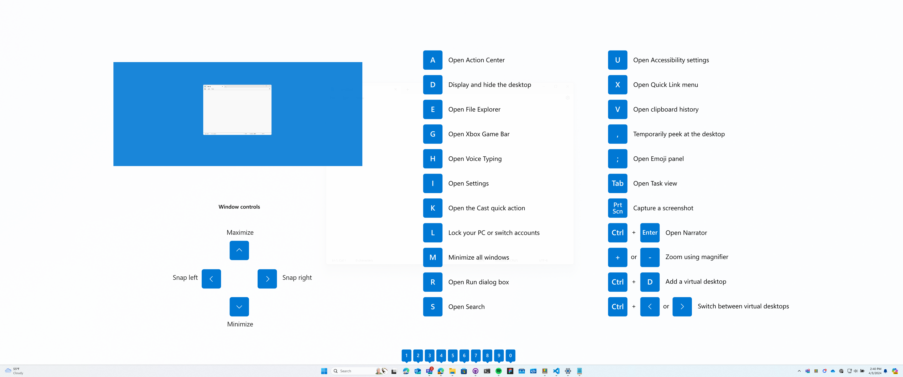
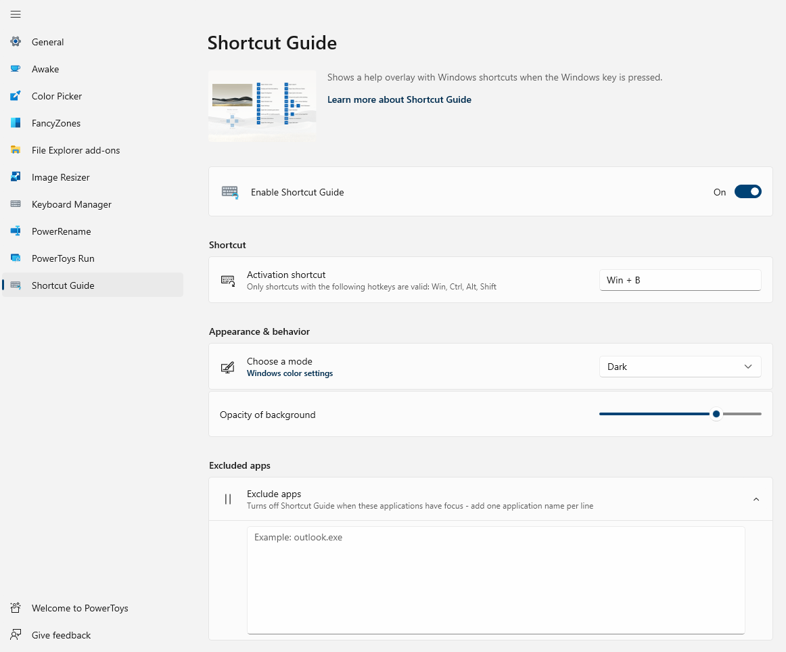

# Windows key shortcut guide

This guide displays common keyboard shortcuts that use the Windows key.

## Getting started

Open the shortcut guide with the shortcut key combination: <kbd>⊞ Win</kbd>+<kbd>Shift</kbd>+<kbd>/</kbd> (or as we like to think, <kbd>⊞ Win</kbd>+<kbd>?</kbd>) or hold down the <kbd>⊞ Win</kbd> for the time as set in the Settings. An overlay will appear showing keyboard shortcuts that use the Windows key, including:

- common Windows shortcuts
- shortcuts for changing the position of the active window
- taskbar shortcuts

Keyboard shortcuts using the Windows key <kbd>⊞ Win</kbd> can be used while the guide is displayed. The result of those shortcuts (active window moved, arrow shortcut behavior changes etc.) will be displayed in the guide.

Pressing the shortcut key combination again will dismiss the overlay.

Tapping the Windows key will display the Windows Start menu.

> [!IMPORTANT]
> The PowerToys app must be running and Shortcut Guide must be enabled in the PowerToys settings for this feature to be used.

## Settings

These configurations can be edited from the PowerToys Settings:

| Setting | Description |
| :--- | :--- |
| Activation method | Choose your own shortcut or use the <kbd>⊞ Win</kbd> key |
| Activation shortcut | The custom shortcut used to open the shortcut guide |
| Press duration | Time (in milliseconds) to hold down the <kbd>⊞ Win</kbd> key in order to open global Windows shortcuts or taskbar icon shortcuts |
| App theme | **Light**, **Dark** or **Windows theme** |
| Opacity of background | Opacity of the Shortcut Guide overlay |
| Excluded apps | Ignores Shortcut Guide when these apps are in focus. Add an application's name, or part of the name, one per line (e.g. adding `Notepad` will match both `Notepad.exe` and `Notepad++.exe`; to match only `Notepad.exe` add the `.exe` extension). |

