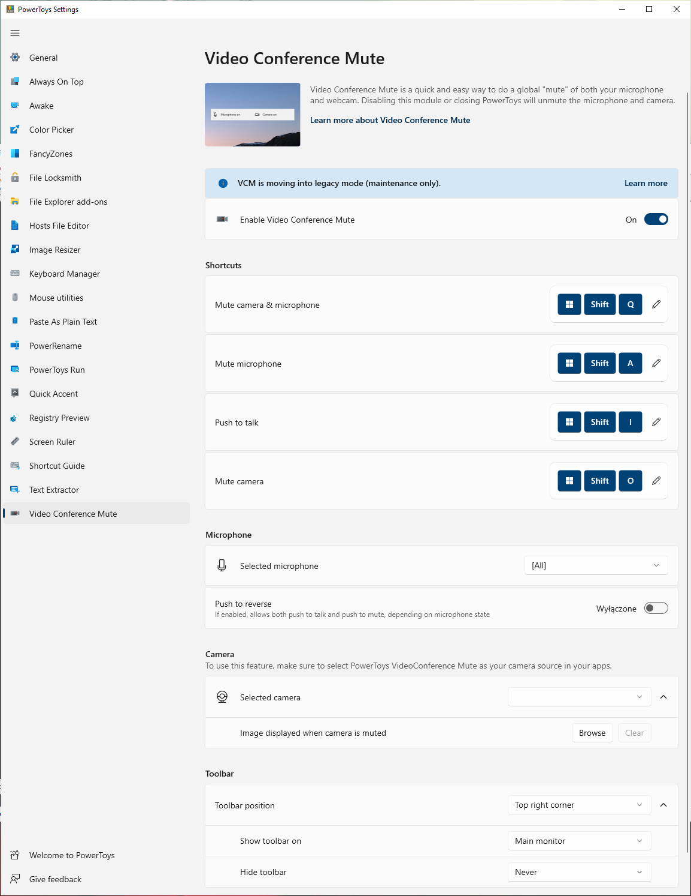

# Video Conference Mute

> [!NOTE]
> VCM is moving into legacy mode. Please find more about what this means [in our dedicated issue](https://github.com/microsoft/PowerToys/issues/21473).

Quickly mute your microphone (audio) and turn off your camera (video) with a single keystroke while on a conference call, regardless of what application has focus on your computer.

## Getting started

The default shortcuts to use Video Conference Mute are:

- <kbd>⊞ Win</kbd>+<kbd>Shift</kbd>+<kbd>Q</kbd> to toggle both audio and video at the same time
- <kbd>⊞ Win</kbd>+<kbd>Shift</kbd>+<kbd>A</kbd> to toggle microphone
- <kbd>⊞ Win</kbd>+<kbd>Shift</kbd>+<kbd>I</kbd> to toggle microphone until key release
- <kbd>⊞ Win</kbd>+<kbd>Shift</kbd>+<kbd>O</kbd> to toggle camera

When using the microphone and/or camera toggle shortcut keys, you'll see a small toolbar letting you know whether your microphone and camera are set to on, off, or not in use. Set the position of this toolbar in PowerToys settings.

To use this module, it must be selected as the _source_ in the apps that are using camera and/or microphone. Go to the settings and select PowerToys VCM.

## Settings

The settings provide the following options:

| Setting | Description |
| :--- | :--- |
| Shortcuts | Change the shortcut key used to mute your microphone, camera, or both combined. |
| Selected microphone | Select the microphone on your machine that this utility will use. |
| Push to reverse | If enabled, allows both push to talk and push to mute, depending on microphone state. |
| Selected camera | Select the camera on your machine that this utility will use. |
| Camera overlay image | Select an image to that will be used as a placeholder when your camera is turned off. By default, a black screen will appear when your camera is turned off with this utility. |
| Toolbar | Set the position where the _Microphone On, Camera On_ toolbar displays when toggled (default: top right corner). |
| Show toolbar on | Select whether you prefer the toolbar to be displayed on the main monitor only (default) or on all monitors. |
| Hide toolbar when both camera and microphone are unmuted | |

## How this works under the hood

Applications interact with audio and video in different ways. If a camera stops working, the application using it tends not to recover until the API does a full reset. To toggle the global privacy camera on and off while using the camera in an application, typically it will crash and not recover.

So, how does PowerToys handle this so you can keep streaming?

- **Audio:** PowerToys uses the global microphone mute API in Windows. Apps should recover when this is toggled on and off.
- **Video:** PowerToys has a virtual driver for the camera. The video is routed _through_ the driver and then to the application. Selecting the Video Conference Mute shortcut key stops video from streaming, but the application still thinks it is receiving video. The video is just replaced with black or the image placeholder you've saved in the settings.

### Debug the camera driver

To debug the camera driver, open this file on your machine: `C:\Windows\ServiceProfiles\LocalService\AppData\Local\Temp\PowerToysVideoConference.log`

You can create an empty `PowerToysVideoConferenceVerbose.flag` in the same directory to enable verbose logging mode in the driver.

[!INCLUDE [install-powertoys.md](../includes/install-powertoys.md)]
