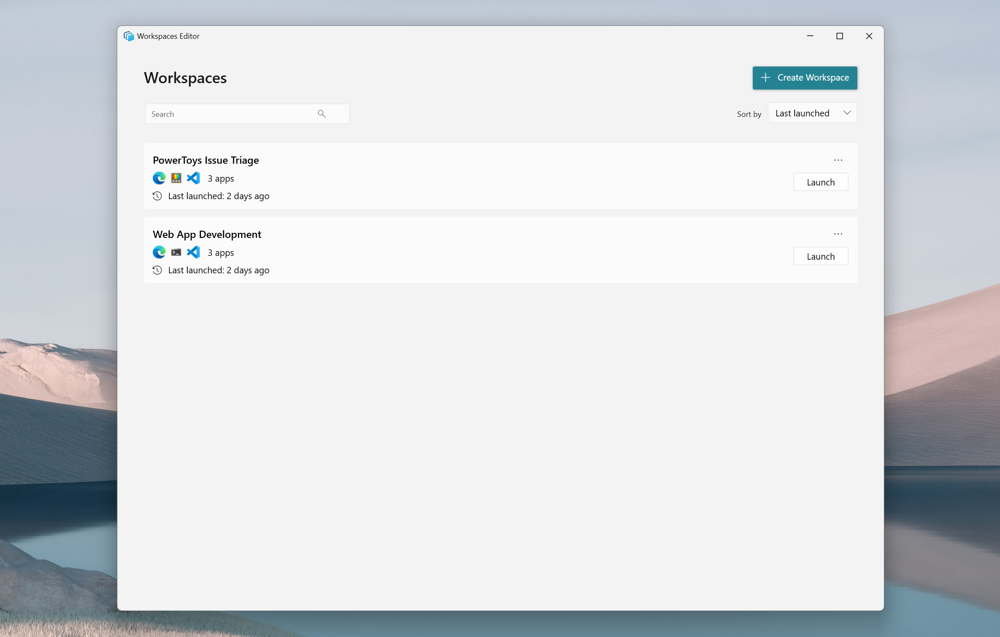
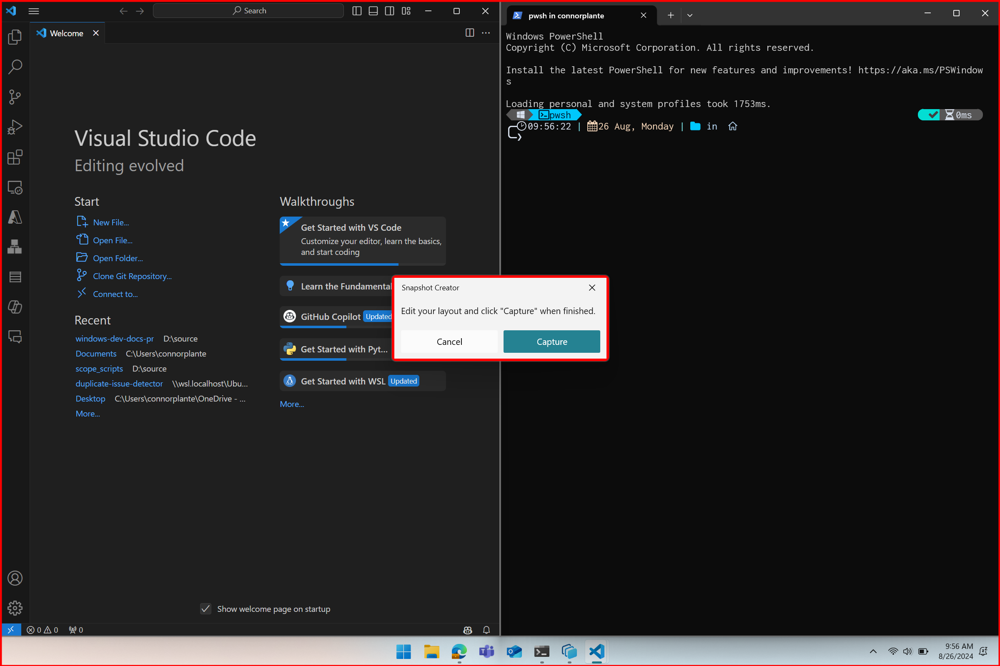
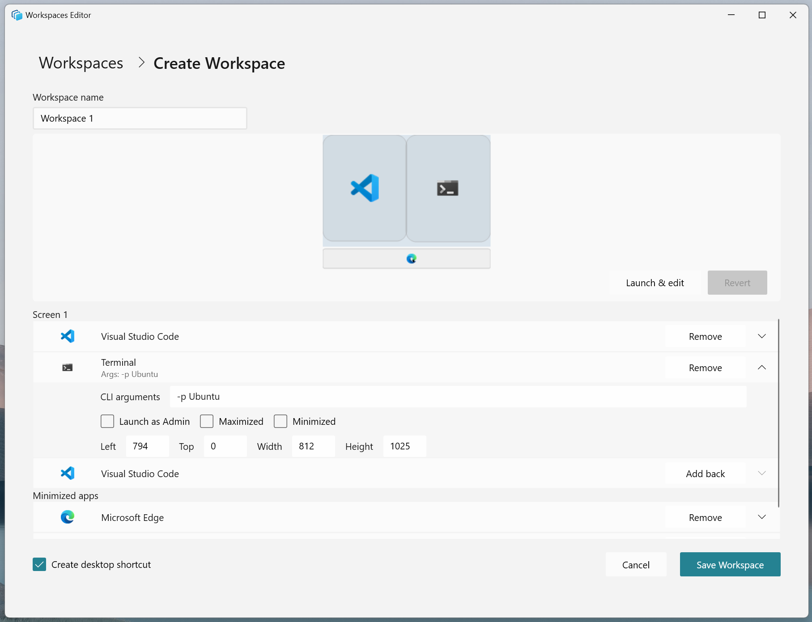
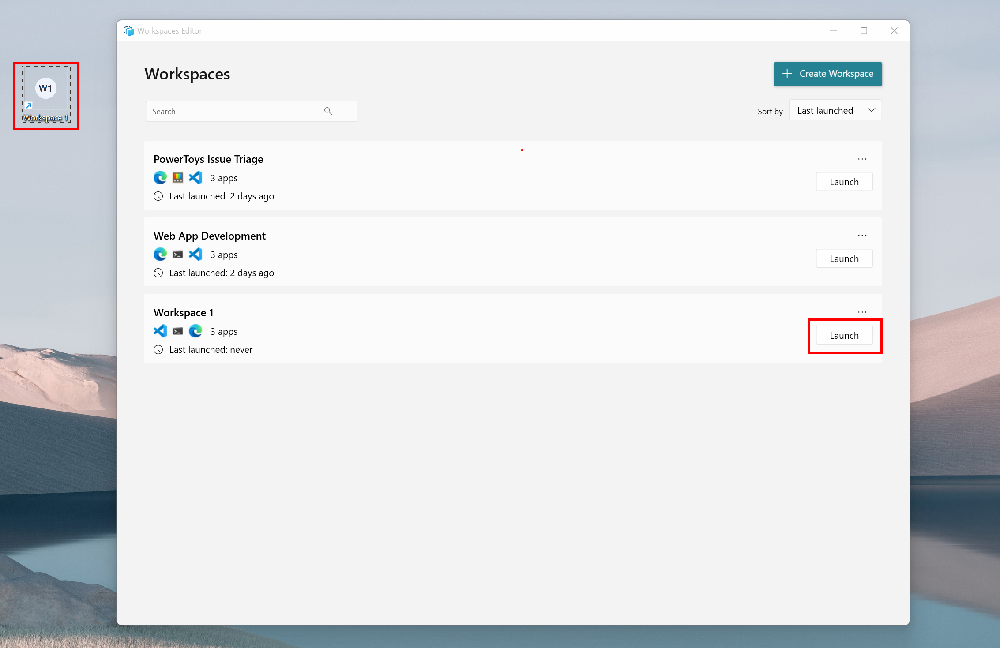
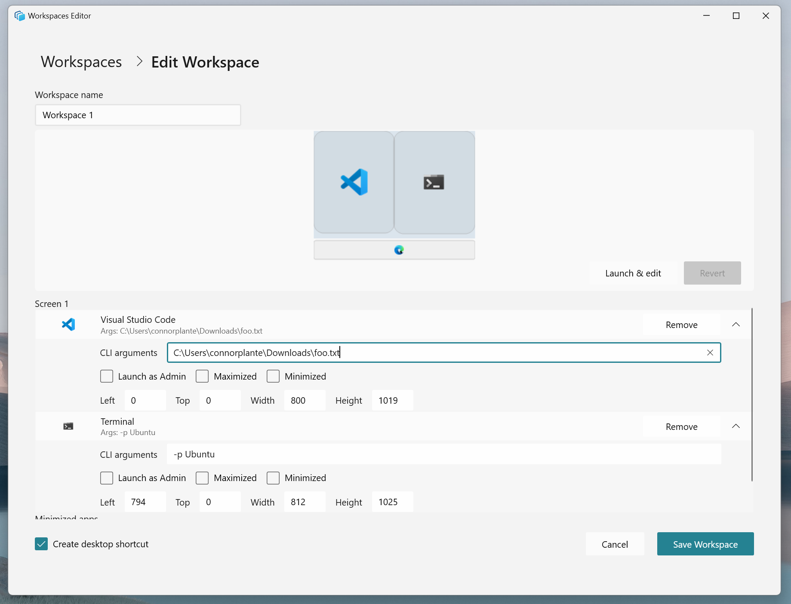

# Workspaces utility

PowerToys Workspaces is a desktop manager utility for launching a set of applications to custom positions and configurations with one-click, getting you into your ideal desktop state for any project or activity faster. You can capture your desktop state as a new workspace using the editor, add arguments to apps to configure their state on launch, and pin the workspace as a desktop shortcut for quick-launching. Launching the workspace will launch all apps to their assigned positions.

## Enabling

To start using Workspaces, enable it in the PowerToys Settings.

## Creating a new workspace

Open the editor using by selecting "Launch editor" from PowerToys Workspaces settings or by using the shortcut <kbd>⊞ Win</kbd>+<kbd>Ctrl</kbd>+<kbd>`</kbd>.

 Click "+ Create workspace" to invoke the Capture experience - in this view, the desktop is fully functional and you are able to open, close, and reposition apps to get your apps into the desired layout. Once you have arranged the apps how you would like, select "Capture". 

After capturing, you will enter the editor where you can name the workspace, adjust window sizes, add CLI arguments, remove apps, and create a desktop shortcut before finally saving the workspace. 

## Launching a workspace

Launch a workspace by either selecting "Launch" from the list of workspaces in the editor, or by using a desktop shortcut if you chose to create one when saving the workspace originally. Shortcuts can also be pinned to the taskbar for convenient launching.

While the workspace launches, PowerToys will display a dialogue box presenting the status of each app. Each app will have one of the following statuses:

| Symbol      | Status    |
|-------------|-----------|
|  | The app has successfully launched and repositioned. |
|  | The app is in the process of launching and moving to the correct position. |
|  | The app has failed to launch. |

## Editing a workspace

Start by launching the editor and selecting the workspace you would like to edit. Once in the edit view for that layout, you can remove apps, modify the window positions manually via each app's dropdown menu, or select "Launch & Edit" to launch the layout and re-enter the same Capture experience as when it was first created. 

> [!NOTE] 
> Capturing the adjusted workspace will perform a clean re-capture, and all previous CLI arguments and settings will be removed. The re-capture can be reverted to return to the original workspace if necessary.

## Adding command line (CLI) arguments to applications

To launch apps in a desired state, CLI arguments can be added to each app in their respective dropdown menus. These arguments are specific to the app itself and are called alongside the app when launched. In the below example, VS Code is launched to the file provided at the path and Terminal is launched to the "Ubuntu" profile. 

You can find more information on VS Code and Terminal CLI arguments can be found below:
- [VS Code CLI Docs](https://code.visualstudio.com/docs/editor/command-line)
- [Terminal CLI Docs](/windows/terminal/command-line-arguments?tabs=windows)

> [!TIP]
> Each app will have its own set of command line arguments that can be used to modify the launch behaviour, but many apps use similar patterns. For example, try passing a comma-separated list of URLs to Edge and other browsers to launch the browser with those tabs open, or pass a filepath to an Office application, text editor or IDE to launch directly to that file. 

## Launching apps as admin 

To launch apps as admin, select the "Launch as Admin" box in the respective app's dropdown menu. On launch, a UAC dialogue will be shown for each app that has been set to launch as admin. 

> [!IMPORTANT] 
> There is a known issue where apps that launch as admin are unable to be repositioned to the desired layout. The team is actively working on a fix for an upcoming release.

## Opening new windows vs. repositioning existing windows

Different apps may behave differently on launch if there is already an existing instance of the application open on the desktop - some apps will reposition the existing instance, whereas others may launch a new instance by default. For tailoring to user preference, the recommendation is to handle launch behaviour via available CLI arguments.

For example, VS Code will launch a new window by default, but should a user prefer to move the existing window, the `--reuse-window` CLI argument can be added to VS Code's CLI arguments. 

> [!NOTE] 
> Some apps are "single-instance" applications, meaning that there may only be one active instance of the app open at a time. One example of this is the Windows Settings app. These apps, if already active, will be repositioned by default, and new instances cannot be launched.  

## Frequently Asked Questions

**Why do app windows launch and then jump to the positions I saved them in?**

PowerToys cannot tell an app to launch to a specific position. What we can do is launch an app first, and then give an instruction to move and resize it to a certain position. However, this results in the user visibly seeing the process on-screen. To help with this, we added the dialogue box during launch to display the launch status of each app.

**My windows were snapped when I saved my workspace, but when I launch the workspace from a clean state they are not snapped. Why is this?**

PowerToys uses publicly available APIs and the [FancyZones](fancyzones.md) engine under the hood for positioning apps. Unfortunately, this does not include snapping capabilities.  

**How can I pin to taskbar?**

You can create a desktop shortcut for your workspace first, and then pin it to the taskbar. Pinning a workspace to the taskbar directly is not currently supported. 

## Settings

| Setting | Description |
| :-- | :-- |
| Activation shortcut | To change the default hotkey, click on the control and enter the desired key combination. |

[!INCLUDE [install-powertoys.md](../includes/install-powertoys.md)]

