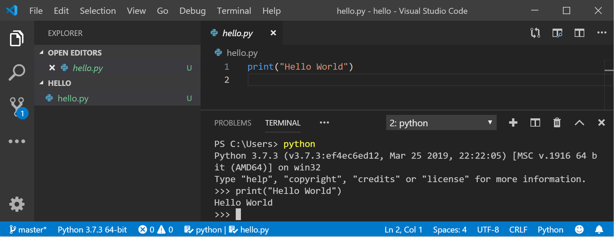
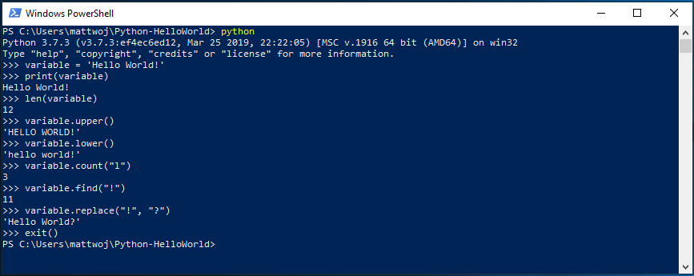
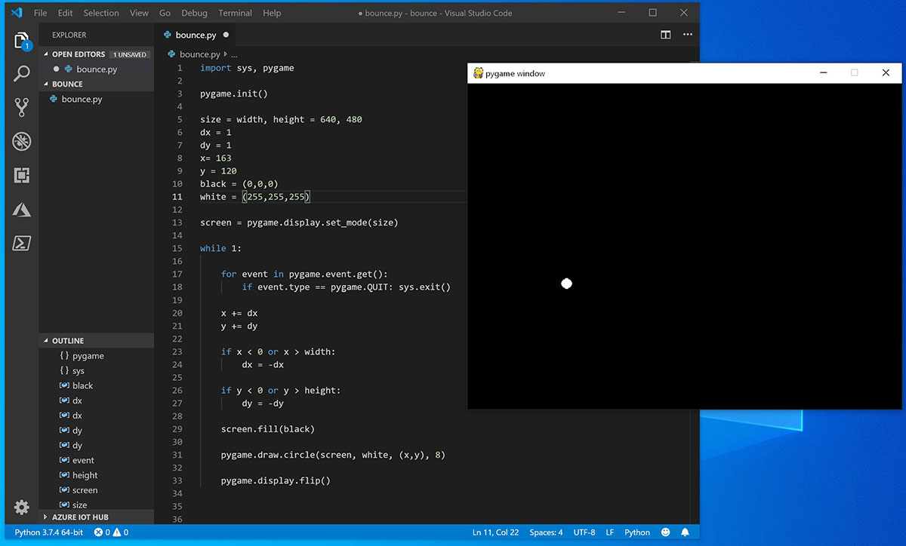

# Get started using Python on Windows for beginners

The following is a step-by-step guide for beginners interested in learning Python using Windows.

## Set up your development environment

For beginners who are new to Python, we recommend you [install Python from the Microsoft Store](https://www.microsoft.com/p/python-37/9nj46sx7x90p?activetab=pivot:overviewtab). Installing via the Microsoft Store uses the basic Python3 interpreter, but handles set up of your PATH settings for the current user (avoiding the need for admin access), in addition to providing automatic updates. This is especially helpful if you are in an educational environment or a part of an organization that restricts permissions or administrative access on your machine.

If you are using Python on Windows for **web development**, we recommend a different set up for your development environment. Rather than installing directly on Windows, we recommend installing and using Python via the Windows Subsystem for Linux. For help, see: [Get started using Python for web development on Windows](./web-frameworks.md). If you're interested in automating common tasks on your operating system, see our guide: [Get started using Python on Windows for scripting and automation](./scripting.md). For some advanced scenarios (like needing to access/modify Python's installed files, make copies of binaries, or use Python DLLs directly), you may want to consider downloading a specific Python release directly from [python.org](https://www.python.org/downloads/) or consider installing an [alternative](https://www.python.org/download/alternatives), such as Anaconda, Jython, PyPy, WinPython, IronPython, etc. We only recommend this if you are a more advanced Python programmer with a specific reason for choosing an alternative implementation.

## Install Python

To install Python using the Microsoft Store:

1. Go to your **Start** menu (lower left Windows icon), type "Microsoft Store", select the link to open the store.

2. Once the store is open, select **Search** from the upper-right menu and enter "Python". Select which version of Python you would like to use from the results under Apps. We recommend using the most recent unless you have a reason not to (such as aligning with the version used on a pre-existing project that you plan to work on). Once you've determined which version you would like to install, select **Get**.

3. Once Python has completed the downloading and installation process, open Windows PowerShell using the **Start** menu (lower left Windows icon). Once PowerShell is open, enter `Python --version` to confirm that Python3 has installed on your machine.

4. The Microsoft Store installation of Python includes **pip**, the standard package manager. Pip allows you to install and manage additional packages that are not part of the Python standard library. To confirm that you also have pip available to install and manage packages, enter `pip --version`.

## Install Visual Studio Code

By using VS Code as your text editor / integrated development environment (IDE), you can take advantage of [IntelliSense](https://code.visualstudio.com/docs/editor/intellisense) (a code completion aid), [Linting](https://code.visualstudio.com/docs/python/linting) (helps avoid making errors in your code), [Debug support](https://code.visualstudio.com/docs/python/debugging) (helps you find errors in your code after you run it), [Code snippets](https://code.visualstudio.com/docs/editor/userdefinedsnippets) (templates for small reusable code blocks), and [Unit testing](https://code.visualstudio.com/docs/python/unit-testing) (testing your code's interface with different types of input).

VS Code also contains a [built-in terminal](https://code.visualstudio.com/docs/editor/integrated-terminal) that enables you to open a Python command line with Windows Command prompt, PowerShell, or whatever you prefer, establishing a seamless workflow between your code editor and command line.

1. To install VS Code, download VS Code for Windows: [https://code.visualstudio.com](https://code.visualstudio.com).

2. Once VS Code has been installed, you must also install the Python extension. To install the Python extension, you can select the [VS Code Marketplace link](https://marketplace.visualstudio.com/items?itemName=ms-python.python) or open VS Code and search for **Python** in the extensions menu (Ctrl+Shift+X).

3. Python is an interpreted language, and in order to run Python code, you must tell VS Code which interpreter to use. We recommend using the most recent version of Python unless you have a specific reason for choosing something different. Once you've installed the Python extension, select a Python 3 interpreter by opening the **Command Palette** (Ctrl+Shift+P), start typing the command **Python: Select Interpreter** to search, then select the command. You can also use the **Select Python Environment** option on the bottom Status Bar if available (it may already show a selected interpreter). The command presents a list of available interpreters that VS Code can find automatically, including virtual environments. If you don't see the desired interpreter, see [Configuring Python environments](https://code.visualstudio.com/docs/python/environments).

    

4. To open the terminal in VS Code, select **View** > **Terminal**, or alternatively use the shortcut **Ctrl+`** (using the backtick character). The default terminal is PowerShell.

5. Inside your VS Code terminal, open Python by simply entering the command: `python`

6. Try the Python interpreter out by entering: `print("Hello World")`. Python will return your statement "Hello World".

    

## Install Git (optional)

If you plan to collaborate with others on your Python code, or host your project on an open-source site (like GitHub), VS Code supports [version control with Git](https://code.visualstudio.com/docs/editor/versioncontrol#_git-support). The Source Control tab in VS Code tracks all of your changes and has common Git commands (add, commit, push, pull) built right into the UI. You first need to install Git to power the Source Control panel.

1. Download and install Git for Windows from [the git-scm website](https://git-scm.com/download/win).

2. An Install Wizard is included that will ask you a series of questions about settings for your Git installation. We recommend using all of the default settings, unless you have a specific reason for changing something.

3. If you've never worked with Git before, [GitHub Guides](https://guides.github.com/) can help you get started.

## Hello World tutorial for some Python basics

Python, according to its creator Guido van Rossum, is a “high-level programming language, and its core design philosophy is all about code readability and a syntax which allows programmers to express concepts in a few lines of code.”

Python is an interpreted language. In contrast to compiled languages, in which the code you write needs to be translated into machine code in order to be run by your computer's processor, Python code is passed straight to an interpreter and run directly. You just type in your code and run it. Let's try it!

1. With your PowerShell command line open, enter `python` to run the Python 3 interpreter. (Some instructions prefer to use the command `py` or `python3`, these should also work). You will know that you're successful because a >>> prompt with three greater-than symbols will display.

2. There are several built-in methods that allow you to make modifications to strings in Python. Create a variable, with: `variable = 'Hello World!'`. Press Enter for a new line.

3. Print your variable with: `print(variable)`. This will display the text "Hello World!".

4. Find out the length, how many characters are used, of your string variable with: `len(variable)`. This will display that there are 12 characters used. (Note that the blank space it counted as a character in the total length.)

5. Convert your string variable to upper-case letters: `variable.upper()`. Now convert your string variable to lower-case letters: `variable.lower()`.

6. Count how many times the letter "l" is used in your string variable: `variable.count("l")`.

7. Search for a specific character in your string variable, let's find the exclamation point, with: `variable.find("!")`. This will display that the exclamation point is found in the 11th position character of the string.

8. Replace the exclamation point with a question mark: `variable.replace("!", "?")`.

9. To exit Python, you can enter `exit()`, `quit()`, or select Ctrl-Z.



Hope you had fun using some of Python's built-in string modification methods. Now try creating a Python program file and running it with VS Code.

## Hello World tutorial for using Python with VS Code

The VS Code team has put together a great [Getting Started with Python](https://code.visualstudio.com/docs/python/python-tutorial#_start-vs-code-in-a-project-workspace-folder) tutorial walking through how to create a Hello World program with Python, run the program file, configure and run the debugger, and install packages like *matplotlib* and *numpy* to create a graphical plot inside a virtual environment.

1. Open PowerShell and create an empty folder called "hello", navigate into this folder, and open it in VS Code:

    ```console
    mkdir hello
    cd hello
    code .
    ```

2. Once VS Code opens, displaying your new *hello* folder in the left-side **Explorer** window, open a command line window in the bottom panel of VS Code by pressing **Ctrl+`** (using the backtick character) or selecting  **View** > **Terminal**. By starting VS Code in a folder, that folder becomes your "workspace". VS Code stores settings that are specific to that workspace in .vscode/settings.json, which are separate from user settings that are stored globally.

3. Continue the tutorial in the VS Code docs: [Create a Python Hello World source code file](https://code.visualstudio.com/docs/python/python-tutorial#_create-a-python-hello-world-source-code-file).

## Create a simple game with Pygame


Pygame is a popular Python package for writing games - encouraging students to learn programming while creating something fun. Pygame displays graphics in a new window, and so it will not work under the command-line-only approach of WSL. However, if you installed Python via the Microsoft Store as detailed in this tutorial, it will work fine.

1. Once you have Python installed, install pygame from the command line (or the terminal from within VS Code) by typing `python -m pip install -U pygame --user`.

2. Test the installation by running a sample game : `python -m pygame.examples.aliens`

3. All being well, the game will open a window. Close the window when you are done playing.

Here's how to start writing your own game.

1. Open PowerShell (or Windows Command Prompt) and create an empty folder called "bounce". Navigate to this folder and create a file named "bounce.py". Open the folder in VS Code:

    ```powershell
    mkdir bounce
    cd bounce
    new-item bounce.py
    code .
    ```

2. Using VS Code, enter the following Python code (or copy and paste it):

    ```python
    import sys, pygame

    pygame.init()

    size = width, height = 640, 480
    dx = 1
    dy = 1
    x= 163
    y = 120
    black = (0,0,0)
    white = (255,255,255)

    screen = pygame.display.set_mode(size)

    while 1:

        for event in pygame.event.get():
            if event.type == pygame.QUIT: sys.exit()

        x += dx
        y += dy

        if x < 0 or x > width:   
            dx = -dx

        if y < 0 or y > height:
            dy = -dy

        screen.fill(black)

        pygame.draw.circle(screen, white, (x,y), 8)

        pygame.display.flip()
    ```

3. Save it as: `bounce.py`.

4. From the PowerShell terminal, run it by entering: `python bounce.py`.

    

Try adjusting some of the numbers to see what effect they have on your bouncing ball.

Read more about writing games with pygame at [pygame.org](http://www.pygame.org).

## Resources for continued learning

We recommend the following resources to support you in continuing to learn about Python development on Windows.

- [Microsoft Dev Blogs: Python](https://devblogs.microsoft.com/python/): Read the latest updates about all things Python at Microsoft.

### Working with Python in VS Code

- [Editing Python in VS Code](https://code.visualstudio.com/docs/python/editing): Learn more about how to take advantage of VS Code's autocomplete and IntelliSense support for Python, including how to customize their behavior... or just turn them off.

- [Linting Python](https://code.visualstudio.com/docs/python/linting): Linting is the process of running a program that will analyse code for potential errors. Learn about the different forms of linting support VS Code provides for Python and how to set it up.

- [Debugging Python](https://code.visualstudio.com/docs/python/debugging): Debugging is the process of identifying and removing errors from a computer program. This article covers how to initialize and configure debugging for Python with VS Code, how to set and validate breakpoints, attach a local script, perform debugging for different app types or on a remote computer, and some basic troubleshooting.

- [Unit testing Python](https://code.visualstudio.com/docs/python/unit-testing): Covers some background explaining what unit testing means, an example walkthrough, enabling a test framework, creating and running your tests, debugging tests, and test configuration settings.
