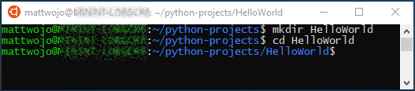
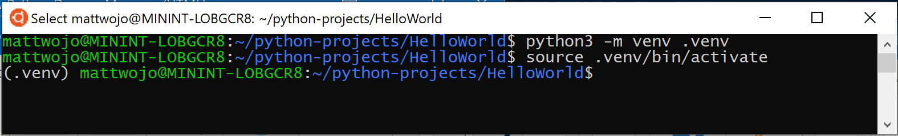
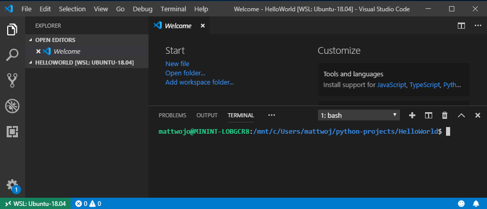
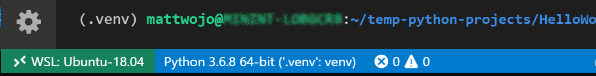
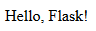

# Get started using Python for web development on Windows

The following is a step-by-step guide to get you started using Python for web development on Windows, using the Windows Subsystem for Linux (WSL).

## Set up your development environment

We recommend installing Python on WSL when building web applications. Many of the tutorials and instructions for Python web development are written for Linux users and use Linux-based packaging and installation tools. Most web apps are also deployed on Linux, so this will ensure you have consistency between your development and production environments.

If you are using Python for something other than web development, we recommend you install Python directly on Windows using the Microsoft Store. WSL does not support GUI desktops or applications (like PyGame, Gnome, KDE, etc). Install and use Python directly on Windows for these cases. If you're new to Python, see our guide: [Get started using Python on Windows for beginners](./beginners.md). If you're interested in automating common tasks on your operating system, see our guide: [Get started using Python on Windows for scripting and automation](./scripting.md). For some advanced scenarios, you may want to consider downloading a specific Python release directly from [python.org](https://www.python.org/downloads/windows/) or consider installing an [alternative](https://www.python.org/download/alternatives), such as Anaconda, Jython, PyPy, WinPython, IronPython, etc. We only recommend this if you are a more advanced Python programmer with a specific reason for choosing an alternative implementation.

## Install Windows Subsystem for Linux

WSL lets you run a GNU/Linux command line environment integrated directly with Windows and your favorite tools, like Visual Studio Code, Outlook, etc. We generally recommend using WSL 2 for Python web development work.

To enable and install WSL 2, see the [WSL install documentation](/windows/wsl/install). These steps will include choosing a Linux distribution (for example, Ubuntu).

Once you have installed WSL and a Linux distribution, open the Linux distribution (it can be found in your Windows start menu) and check the version and codename using the command: `lsb_release -dc`.

We recommend updating your Linux distribution regularly, including immediately after you install, to ensure you have the most recent packages. Windows doesn't automatically handle this update. To update your distribution, use the command: `sudo apt update && sudo apt upgrade`.  

> [!TIP]
> Consider [installing the new Windows Terminal from the Microsoft Store](https://www.microsoft.com/store/apps/9n0dx20hk701) to enable multiple tabs (quickly switch between multiple Linux command lines, Windows Command Prompt, PowerShell, Azure CLI, etc), create custom key bindings (shortcut keys for opening or closing tabs, copy+paste, etc.), use the search feature, and set up custom themes (color schemes, font styles and sizes, background image/blur/transparency). [Learn more](/windows/terminal).

## Set up Visual Studio Code

Take advantage of [IntelliSense](https://code.visualstudio.com/docs/editor/intellisense), [Linting](https://code.visualstudio.com/docs/python/linting), [Debug support](https://code.visualstudio.com/docs/python/debugging), [Code snippets](https://code.visualstudio.com/docs/editor/userdefinedsnippets), and [Unit testing](https://code.visualstudio.com/docs/python/unit-testing) by using VS Code. VS Code integrates nicely with the Windows Subsystem for Linux, providing a [built-in terminal](https://code.visualstudio.com/docs/editor/integrated-terminal) to establish a seamless workflow between your code editor and your command line, in addition to supporting [Git for version control](https://code.visualstudio.com/docs/editor/versioncontrol#_git-support) with common Git commands (add, commit, push, pull) built right into the UI.

1. [Download and install VS Code for Windows](https://code.visualstudio.com). VS Code is also available for Linux, but Windows Subsystem for Linux does not support GUI apps, so we need to install it on Windows. Not to worry, you'll still be able to integrate with your Linux command line and tools using the Remote - WSL Extension.

2. Install the [Remote - WSL Extension](https://marketplace.visualstudio.com/items?itemName=ms-vscode-remote.remote-wsl) on VS Code. This allows you to use WSL as your integrated development environment and will handle compatibility and pathing for you. [Learn more](https://code.visualstudio.com/docs/remote/remote-overview).

> [!IMPORTANT]
> If you already have VS Code installed, you need to ensure that you have the [1.35 May release](https://code.visualstudio.com/updates/v1_35) or later in order to install the [Remote - WSL Extension](https://marketplace.visualstudio.com/items?itemName=ms-vscode-remote.remote-wsl). We do not recommend using WSL in VS Code without the Remote-WSL extension as you will lose support for auto-complete, debugging, linting, etc. Fun fact: This WSL extension is installed in $HOME/.vscode-server/extensions.

## Create a new project

Let's create a new project directory on our Linux (Ubuntu) file system that we will then work on with Linux apps and tools using VS Code.

1. Close VS Code and open Ubuntu 18.04 (your WSL command line) by going to your **Start** menu (lower left Windows icon) and typing: "Ubuntu 18.04".

2. In your Ubuntu command line, navigate to where you want to put your project, and create a directory for it: `mkdir HelloWorld`.



> [!TIP]
> An important thing to remember when using Windows Subsystem for Linux (WSL) is that **you are now working between two different file systems**: 1) your Windows file system, and 2) your Linux file system (WSL), which is Ubuntu for our example. You will need to pay attention to where you install packages and store files. You can install one version of a tool or package in the Windows file system and a completely different version in the Linux file system. Updating the tool in the Windows file system will have no effect on the tool in the Linux file system, and vice-versa. WSL mounts the fixed drives on your computer under the `/mnt/<drive>` folder in your Linux distribution. For example, your Windows C: drive is mounted under `/mnt/c/`. You can access your Windows files from the Ubuntu terminal and use Linux apps and tools on those files and vice-versa. We recommend working in the Linux file system for Python web development given that much of the web tooling is originally written for Linux and deployed in a Linux production environment. It also avoids mixing file system semantics (like Windows being case-insensitive regarding file names). That said, WSL now supports jumping between the Linux and Windows files systems, so you can host your files on either one. [Learn more](https://devblogs.microsoft.com/commandline/do-not-change-linux-files-using-windows-apps-and-tools/).

## Install Python, pip, and venv

Ubuntu 18.04 LTS comes with Python 3.6 already installed, but it does not come with some of the modules that you may expect to get with other Python installations. We will still need to install **pip**, the standard package manager for Python, and **venv**, the standard module used to create and manage lightweight virtual environments. *Remember that you may need to update your Linux distribution so that it has the latest version using the command: `sudo apt update && sudo apt upgrade`.*

1. Confirm that Python3 is already installed by opening your Ubuntu terminal and entering: `python3 --version`. This should return your Python version number. If you need to update your version of Python, first update your Ubuntu version by entering: `sudo apt update && sudo apt upgrade`, then update Python using `sudo apt upgrade python3`.

2. Install **pip** by entering: `sudo apt install python3-pip`. Pip allows you to install and manage additional packages that are not part of the Python standard library.

3. Install **venv** by entering: `sudo apt install python3-venv`.

## Create a virtual environment

Using virtual environments is a recommended best practice for Python development projects. By creating a virtual environment, you can isolate your project tools and avoid versioning conflicts with tools for your other projects. For example, you may be maintaining an older web project that requires the Django 1.2 web framework, but then an exciting new project comes along using Django 2.2. If you update Django globally, outside of a virtual environment, you could run into some versioning issues later on. In addition to preventing accidental versioning conflicts, virtual environments let you install and manage packages without administrative privileges.

1. Open your terminal and, inside your *HelloWorld* project folder, use the following command to create a virtual environment named **.venv**:  `python3 -m venv .venv`.

2. To activate the virtual environment, enter: `source .venv/bin/activate`. If it worked, you should see **(.venv)** before the command prompt. You now have a self-contained environment ready for writing code and installing packages. When you're finished with your virtual environment, enter the following command to deactivate it: `deactivate`.

    

> [!TIP]
> We recommend creating the virtual environment inside the directory in which you plan to have your project. Since each project should have its own separate directory, each will have its own virtual environment, so there is not a need for unique naming. Our suggestion is to use the name **.venv** to follow the Python convention. Some tools (like pipenv) also default to this name if you install into your project directory. You don't want to use **.env** as that conflicts with environment variable definition files. We generally do not recommend non-dot-leading names, as you don't need `ls` constantly reminding you that the directory exists. We also recommend adding **.venv** to your .gitignore file. (Here is [GitHub's default gitignore template for Python](https://github.com/github/gitignore/blob/50e42aa1064d004a5c99eaa72a2d8054a0d8de55/Python.gitignore#L99-L106) for reference.) For more information about working with virtual environments in VS Code, see [Using Python environments in VS Code](https://code.visualstudio.com/docs/python/environments).

## Open a WSL - Remote window

VS Code uses the Remote - WSL Extension (installed previously) to treat your Linux subsystem as a remote server. This allows you to use WSL as your integrated development environment. [Learn more](https://code.visualstudio.com/docs/remote/wsl).

1. Open your project folder in VS Code from your Ubuntu terminal by entering: `code .` (the "." tells VS Code to open the current folder).

2. A Security Alert will pop-up from Windows Defender, select "Allow access". Once VS Code opens, you should see the Remote Connection Host indicator, in the bottom-left corner, letting you know that you are editing on **WSL: Ubuntu-18.04**.

    

3. Close your Ubuntu terminal. Moving forward we will use the WSL terminal integrated into VS Code.

4. Open the WSL terminal in VS Code by pressing **Ctrl+`** (using the backtick character) or selecting  **View** > **Terminal**. This will open a bash (WSL) command-line opened to the project folder path that you created in your Ubuntu terminal.

    

## Install the Microsoft Python extension

You will need to install any VS Code extensions for your Remote - WSL. Extensions already installed locally on VS Code will not automatically be available. [Learn more](https://code.visualstudio.com/docs/remote/wsl#_managing-extensions).

1. Open the VS Code Extensions window by entering **Ctrl+Shift+X** (or use the menu to navigate to **View** > **Extensions**).

2. In the top **Search Extensions in Marketplace** box, enter:  **Python**.

3. Find the **Python (ms-python.python) by Microsoft** extension and select the green **Install** button.

4. Once the extension is finished installing, you will need to select the blue **Reload Required** button. This will reload VS Code and display a **WSL: UBUNTU-18.04 - Installed** section in your VS Code Extensions window showing that you've installed the Python extension.

## Run a simple Python program

Python is an interpreted language and supports different types of interpreters (Python2, Anaconda, PyPy, etc). VS Code should default to the interpreter associated with your project. If you have a reason to change it, select the interpreter currently displayed in blue bar on the bottom of your VS Code window or open the **Command Palette** (Ctrl+Shift+P) and enter the command **Python: Select Interpreter**. This will display a list of the Python interpreters that you currently have installed. [Learn more about configuring Python environments](https://code.visualstudio.com/docs/python/environments).

Let's create and run a simple Python program as a test and ensure that we have the correct Python interpreter selected.

1. Open the VS Code File Explorer window by entering **Ctrl+Shift+E** (or use the menu to navigate to **View** > **Explorer**).

2. If it's not already open, open your integrated WSL terminal by entering **Ctrl+Shift+`** and ensure that your **HelloWorld** python project folder is selected.

3. Create a python file by entering: `touch test.py`. You should see the file you just created appear in your Explorer window under the .venv and .vscode folders already in your project directory.

4. Select the **test.py** file that you just created in your Explorer window to open it in VS Code. Because the .py in our file name tells VS Code that this is a Python file, the Python extension you loaded previously will automatically choose and load a Python interpreter that you will see displayed on the bottom of your VS Code window.

    

5. Paste this Python code into your test.py file and then save the file (Ctrl+S): 

    ```python
    print("Hello World")
    ```

6. To run the Python "Hello World" program that we just created, select the **test.py** file in the VS Code Explorer window, then right-click the file to display a menu of options. Select **Run Python File in Terminal**. Alternatively, in your integrated WSL terminal window, enter: `python test.py` to run your "Hello World" program. The Python interpreter will print "Hello World" in your terminal window.

Congratulations. You're all set up to create and run Python programs! Now let's try creating a Hello World app with two of the most popular Python web frameworks: Flask and Django.

## Hello World tutorial for Flask

[Flask](https://flask.palletsprojects.com/) is a web application framework for Python. The Flask documentation offers guidance on getting started and a [more detailed tutorial](https://flask.palletsprojects.com/tutorial/) about how to create a small but complete application.

Following the steps below, you can create a small "Hello World" Flask app using VS Code and WSL.

1. Open Ubuntu 18.04 (your WSL command line) by going to your **Start** menu (lower left Windows icon) and typing: "Ubuntu 18.04".

2. Create a directory for your project: `mkdir HelloWorld-Flask`, then `cd HelloWorld-Flask` to enter the directory.

3. Create a virtual environment to install your project tools: `python3 -m venv .venv`

4. Open your **HelloWorld-Flask** project in VS Code by entering the command: `code .`

5. Inside VS Code, open your integrated WSL terminal (aka Bash) by entering **Ctrl+Shift+`** (your **HelloWorld-Flask** project folder should already be selected). *Close your Ubuntu command line as we will be working in the WSL terminal integrated with VS Code moving forward.*

6. Activate the virtual environment that you created in step #3 using your Bash terminal in VS Code: `source .venv/bin/activate`. If it worked, you should see (.venv) before the command prompt.

7. Install Flask in the virtual environment by entering: `python3 -m pip install flask`. Verify that it's installed by entering: `python3 -m flask --version`.

8. Create a new file for your Python code: `touch app.py`

9. Open your **app.py** file in VS Code's File Explorer (`Ctrl+Shift+E`, then select your app.py file). This will activate the Python Extension to choose an interpreter. It should default to **Python 3.6.8 64-bit ('.venv': venv)**. Notice that it also detected your virtual environment.

    

10. In **app.py**, add code to import Flask and create an instance of the Flask object:

    ```python
    from flask import Flask
    app = Flask(__name__)
    ```

11. Also in **app.py**, add a function that returns content, in this case a simple string. Use Flask's **app.route** decorator to map the URL route "/" to that function:

    ```python
    @app.route("/")
    def home():
        return "Hello World! I'm using Flask."
    ```

    > [!TIP]
    > You can use multiple decorators on the same function, one per line, depending on how many different routes you want to map to the same function.

12. Save the **app.py** file (**Ctrl+S**).

13. In the terminal, run the app by entering the following command:

    ```python
    python3 -m flask run
    ```

    This runs the Flask development server. The development server looks for **app.py** by default. When you run Flask, you should see output similar to the following:

    ```bash
    (env) user@USER:/mnt/c/Projects/HelloWorld$ python3 -m flask run
     * Environment: production
       WARNING: This is a development server. Do not use it in a production deployment.
       Use a production WSGI server instead.
     * Debug mode: off
     * Running on http://127.0.0.1:5000/ (Press CTRL+C to quit)
    ```

14. Open your default web browser to the rendered page, **Ctrl+Click** the http://127.0.0.1:5000/ URL in the terminal. You should see the following message in your browser:

    

15. Observe that when you visit a URL like "/", a message appears in the debug terminal showing the HTTP request:

    ```bash
    127.0.0.1 - - [19/Jun/2019 13:36:56] "GET / HTTP/1.1" 200 -
    ```

16. Stop the app by using **Ctrl+C** in the terminal.

> [!TIP]
> If you want to use a different filename than **app.py**, such as **program.py**, define an environment variable named **FLASK_APP** and set its value to your chosen file. Flask's development server then uses the value of **FLASK_APP** instead of the default file **app.py**. For more information, see the [Flask documentation](https://flask.palletsprojects.com/).

Congratulations, you've created a Flask web application using Visual Studio Code and Windows Subsystem for Linux! For a more in-depth tutorial using VS Code and Flask, see [Flask Tutorial in Visual Studio Code](https://code.visualstudio.com/docs/python/tutorial-flask).

## Hello World tutorial for Django

[Django](https://www.djangoproject.com) is a web application framework for Python. In this brief tutorial, you'll create a small "Hello World" Django app using VS Code and WSL.

1. Open Ubuntu 18.04 (your WSL command line) by going to your **Start** menu (lower left Windows icon) and typing: "Ubuntu 18.04".

2. Create a directory for your project: `mkdir HelloWorld-Django`, then `cd HelloWorld-Django` to enter the directory.

3. Create a virtual environment to install your project tools: `python3 -m venv .venv`

4. Open your **HelloWorld-Django** project in VS Code by entering the command: `code .`

5. Inside VS Code, open your integrated WSL terminal (aka Bash) by entering **Ctrl+Shift+`** (your **HelloWorld-Django** project folder should already be selected). *Close your Ubuntu command line as we will be working in the WSL terminal integrated with VS Code moving forward.*

6. Activate the virtual environment that you created in step #3 using your Bash terminal in VS Code: `source .venv/bin/activate`. If it worked, you should see (.venv) before the command prompt.

7. Install Django in the virtual environment with the command: `python3 -m pip install django`. Verify that it's installed by entering: `python3 -m django --version`.

8. Next, run the following command to create the Django project:

    ```bash
    django-admin startproject web_project .
    ```

    The `startproject` command assumes (by use of `.` at the end) that the current folder is your project folder, and creates the following within it:

    - `manage.py`: The Django command-line administrative utility for the project. You run administrative commands for the project using `python manage.py <command> [options]`.

    - A subfolder named `web_project`, which contains the following files:
        - `__init__.py`: an empty file that tells Python that this folder is a Python package.
        - `wsgi.py`: an entry point for WSGI-compatible web servers to serve your project. You typically leave this file as-is as it provides the hooks for production web servers.
        - `settings.py`: contains settings for Django project, which you modify in the course of developing a web app.
        - `urls.py`: contains a table of contents for the Django project, which you also modify in the course of development.

9. To verify the Django project, start Django's development server using the command `python3 manage.py runserver`. The server runs on the default port 8000, and you should see output like the following output in the terminal window:

    ```output
    Performing system checks...

    System check identified no issues (0 silenced).

    June 20, 2019 - 22:57:59
    Django version 2.2.2, using settings 'web_project.settings'
    Starting development server at http://127.0.0.1:8000/
    Quit the server with CONTROL-C.
    ```

    When you run the server the first time, it creates a default SQLite database in the file `db.sqlite3`, which is intended for development purposes, but can be used in production for low-volume web apps. Also, Django's built-in web server is intended *only* for local development purposes. When you deploy to a web host, however, Django uses the host's web server instead. The `wsgi.py` module in the Django project takes care of hooking into the production servers.

    If you want to use a different port than the default 8000, specify the port number on the command line, such as `python3 manage.py runserver 5000`.

10. `Ctrl+click` the `http://127.0.0.1:8000/` URL in the terminal output window to open your default browser to that address. If Django is installed correctly and the project is valid, you'll see a default page. The VS Code terminal output window also shows the server log.

11. When you're done, close the browser window and stop the server in VS Code using `Ctrl+C` as indicated in the terminal output window.

12. Now, to create a Django app, run the administrative utility's `startapp` command in your project folder (where `manage.py` resides):

    ```bash
    python3 manage.py startapp hello
    ```

    The command creates a folder called `hello` that contains a number of code files and one subfolder. Of these, you frequently work with `views.py` (that contains the functions that define pages in your web app) and `models.py` (that contains classes defining your data objects). The `migrations` folder is used by Django's administrative utility to manage database versions as discussed later in this tutorial. There are also the files `apps.py` (app configuration), `admin.py` (for creating an administrative interface), and `tests.py` (for tests), which are not covered here.

13. Modify `hello/views.py` to match the following code, which creates a single view for the app's home page:

    ```python
    from django.http import HttpResponse

    def home(request):
        return HttpResponse("Hello, Django!")
    ```

14. Create a file, `hello/urls.py`, with the contents below. The `urls.py` file is where you specify patterns to route different URLs to their appropriate views. The code below contains one route to map root URL of the app (`""`) to the `views.home` function that you just added to `hello/views.py`:

    ```python
    from django.urls import path
    from hello import views

    urlpatterns = [
        path("", views.home, name="home"),
    ]
    ```

15. The `web_project` folder also contains a `urls.py` file, which is where URL routing is actually handled. Open `web_project/urls.py` and modify it to match the following code (you can retain the instructive comments if you like). This code pulls in the app's `hello/urls.py` using `django.urls.include`, which keeps the app's routes contained within the app. This separation is helpful when a project contains multiple apps.

    ```python
    from django.contrib import admin
    from django.urls import include, path

    urlpatterns = [
        path("", include("hello.urls")),
    ]
    ```

16. Save all modified files.

17. In the VS Code Terminal, run the development server with `python3 manage.py runserver` and open a browser to  `http://127.0.0.1:8000/` to see a page that renders "Hello, Django".

Congratulations, you've created a Django web application using VS Code and Windows Subsystem for Linux! For a more in-depth tutorial using VS Code and Django, see [Django Tutorial in Visual Studio Code](https://code.visualstudio.com/docs/python/tutorial-django).

## Additional resources

- [Microsoft Dev Blogs: Python](https://devblogs.microsoft.com/python/): Read the latest updates about all things Python at Microsoft.
- [Python Tutorial with VS Code](https://code.visualstudio.com/docs/python/python-tutorial): An intro tutorial to VS Code as a Python environment, primarily how to edit, run, and debug code.
- [Git support in VS Code](https://code.visualstudio.com/docs/editor/versioncontrol#_git-support): Learn how to use Git version control basics in VS Code.  
- [Learn about updates coming soon with WSL 2!](/windows/wsl/wsl2-index): This new version changes how Linux distributions interact with Windows, increasing file system performance and adding full system call compatibility.
- [Working with multiple Linux distributions on Windows](/windows/wsl/wsl-config): Learn how to manage multiple different Linux distributions on your Windows machine.
