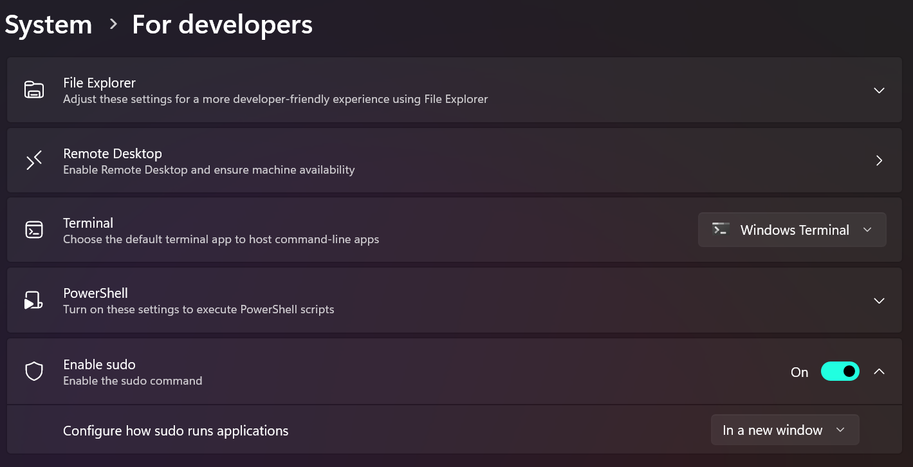

# Sudo for Windows

**Sudo for Windows** is a new way for users to run elevated commands (as an administrator) directly from an unelevated console session on Windows.

## Prerequisites

You must be running Windows 11 Insider Preview Build 26052 or higher to use the Sudo for Windows command. ([Check for Windows updates](ms-settings:windowsupdate)). [Join Windows Insider Program](https://www.microsoft.com/windowsinsider/).

> [!NOTE]
> Sudo for Windows is not yet available for Windows 10, but may be in the future.

## How to enable Sudo for Windows

To enable Sudo for Windows, open `Settings > For Developers` and set **Enable sudo** to **On**.

>[!WARNING]
> Sudo for Windows can be used as a potential escalation of privilege vector when enabled in certain configurations. You should make sure to be aware of the [security considerations](#security-considerations) when enabling the sudo command on your machine.

## How to configure Sudo for Windows

Sudo for Windows currently supports three different configuration options. The configuration can be set from the `Settings > For Developers` menu or programmatically, using the command line. The configuration options include:

- **In a new window** (`forceNewWindow`): The `forceNewWindow` configuration option is the default configuration option for Sudo for Windows. Use `sudo` in this configuration to run the command in a new window. This is similar to the behavior of the `runas /user:admin` command.

- **Input closed** (`disableInput`): The `disableInput` configuration option will run the elevated process in the current window, but with the input handle closed. This means that the elevated process will not be able to receive input from the current console window. This is useful for scenarios where you want to run a command as an administrator, but do not want to allow the command to receive input from the current console window. This configuration option provides some of the convenience of the `inline` configuration option while mitigating some of the associated [security risks](#security-considerations).

- **Inline** (`normal`): The `normal` configuration option is most similar to how sudo behaves on other operating systems. This configuration will run the elevated process in the current window and the process will be able to receive input from the current console session. This is useful for scenarios where you want to run a command as an administrator and want to allow the command to receive input from the current console window. This configuration option provides the most convenience, but you should only choose this option if you are familiar with the associated [security risks](#security-considerations).

You can select among these configurations from the `Settings > For Developers` menu or change the configuration programmatically, in an elevated command line (admin console), using:

- `sudo config --enable <configuration_option>`

Update `<configuration_option>` to either `forceNewWindow`, `disableInput`, or `normal`.

## How to use Sudo for Windows

To use Sudo for Windows, simply prepend `sudo` to the command you want to run as an administrator. For example, to run `netstat -ab` as an administrator, you would run `sudo netstat -ab` in your console window.

Because `sudo` elevates the targeted process to run with administrator-level permission, a prompt will open asking you to verify that you want to continue.

## Security Considerations

There are risks associated with running sudo in the **Input closed** (`inputClosed`) or **Inline** (`normal`) configurations. It is possible for malicious processes to attempt to drive the elevated process using the connection established by the unelevated sudo.exe and the elevated sudo.exe process.

The `inputClosed` configuration option mitigates risk by closing the input handle. Disconnecting the input handle from the current console window means that unelevated processes cannot send input to the elevated process.

The `inline` configuration option runs the elevated process in the current window and the process is able to receive input from the current console session. An unelevated process can send input to the elevated process within the same console windows or get information from the output in the current windows in this configuration.

## FAQ

### How is Sudo for Windows different from the existing `runas` command?

 The `sudo` command offers a way to quickly elevate a command as administrator from your current unelevated command line context and is familiar to some users coming from other operating systems. The `runas` command offers a way to run programs as any user, including administrator if you so choose. At this point in time, the `sudo` command on Windows does not support running programs as other users. Other key differences between `sudo` and `runas` include:

- `runas` allows you to run programs as other users, including but not limited to as administrator. This funtionality is on the roadmap for the sudo command, but does not yet exist.

- `sudo` allows you to quickly elevate a process (as administrator):
  - You can choose to do so in a new window, which resembles the `runas` administrator flow.
  - You can choose to connect the elevated process to the current console window with the `disableInput` and `normal` configuration options. This is not supported with `runas`.

- `runas` can prompt users for a password in the command-line.
  
- `sudo` can only be elevated via the User Account Control (UAC) security feature designed to protect the operating system from unauthorized changes using verification prompt.
  
You should consider your particular use-case and plan to use the command that best meets your needs. You should also consider the security implications of running sudo in the `inputClosed` and `normal` modes. The default `forceNewWindow` configuration option is recommended unless you are familiar and comfortable with the risks associated with the other `sudo` configurations.

## Sudo for Windows open source repository

Sudo for Windows is open source and welcomes your contributions and feedback. You can find the source code for Sudo for Windows on [GitHub](https://github.com/microsoft/sudo).

## Additional functionality

If you’re looking for additional functionality that Sudo for Windows does not provide, check out [Gerardo Grignoli’s gsudo](https://github.com/gerardog/gsudo) which has a number of additional features and configuration options or check out other solutions from the community.
