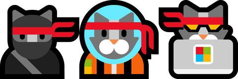
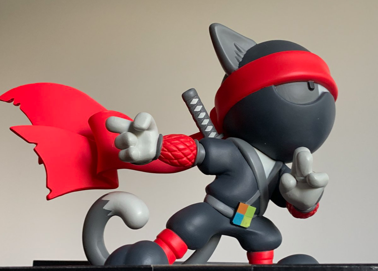

# Contribute to Windows docs and be entered to win some swag

If you use the Windows documentation, please consider becoming a part of our community of contributors.

Here's what you need to do:

1. Set up an [account with GitHub](https://github.com/join), if you don't already have one, and then read our [docs contributor guide](/contribute/).
2. Read the following docs content, looking for content that could be better:
    - **Build Desktop apps** - [UWP](/windows/uwp/), [Win32](/windows/win32/), [WPF](/dotnet/framework/wpf/), [Windows Forms](/dotnet/framework/winforms/)
    - **Windows UI Library** - [Controls for UWP apps](/windows/uwp/design/controls-and-patterns/), [Controls API reference](/uwp/api/microsoft.ui.xaml.controls?view=winui-2.3)
    - **Build with Windows** - [Windows Subsystem for Linux](/windows/wsl/about), [Python](./python/index.yml), [NodeJS](./nodejs/index.yml), [Mac to Windows guide](./dev-environment/mac-to-windows.md)
    - **Windows Hardware Developer** - [Tools and Drivers](/windows-hardware/drivers/)
3. Make corrections to a docs page by selecting the **Edit** button at the top of the page. This will take you to the markdown source file in GitHub.
4. Once your changes are complete. File your Pull Request (PR).
5. Reply to the [@WindowsDocs contest post](https://twitter.com/WindowsDocs/status/1242088720209268736) with a link to your PR.

Thank you to our community of contributors!

:)