# Web development on Windows

Microsoft offers a variety of resources for web developers, including new tools and features supporting web development using Windows. This guide covers many of the tools available to make Windows your ideal environment to develop on for the web. For a list of APIs, see [APIs for web development](./apis.md).

> [!div class="nextstepaction"]
> [Set up your development environment on Windows](../dev-environment/index.md)

## WebView, DevTools, PWAs

:::row:::
    :::column:::
        [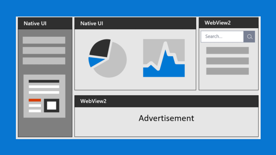](https://developer.microsoft.com/microsoft-edge/webview2/) 
        **[WebView 2](https://developer.microsoft.com/microsoft-edge/webview2/)** 
        Embed web content (HTML, CSS, and JavaScript) in your native applications with Microsoft Edge WebView2.
        [Download WebView 2](https://developer.microsoft.com/microsoft-edge/webview2/#download-section)
    :::column-end:::
    :::column:::
        [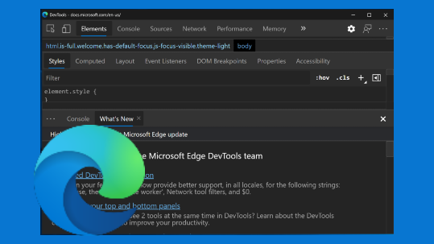](/microsoft-edge/devtools-guide-chromium/landing/) 
        **[Microsoft Edge DevTools](/microsoft-edge/devtools-guide-chromium/)** 
        Microsoft Edge Developer Tools are a set of inspection and debugging tools built directly into the Microsoft Edge browser.
        To open DevTools, with Microsoft Edge in focus:
        - Right-click then Inspect
        - Select the `F12` key
        - `Ctrl` + `Shift` + `i`
    :::column-end:::
    :::column:::
       [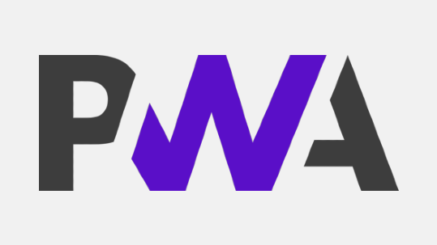](/microsoft-edge/progressive-web-apps-chromium/) 
        **[Progressive Web Apps on Windows](/microsoft-edge/progressive-web-apps-chromium/)** 
        Progressive Web Apps (PWAs) provide your users with a native, app-like experience customized for their devices. They are websites that are progressively enhanced to function like native apps on supporting platforms. 
        [Get started with PWAs](/microsoft-edge/progressive-web-apps-chromium/get-started)
    :::column-end:::
:::row-end:::

## Microsoft Edge browser

:::row:::
    :::column:::
       [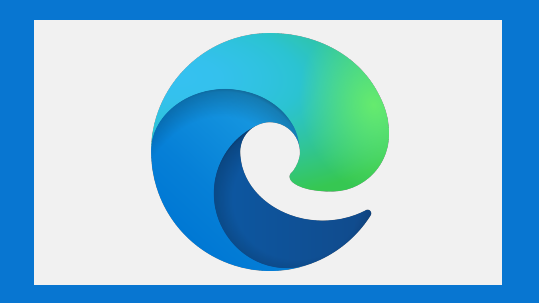](https://www.microsoft.com/edge) 
        **[Microsoft Edge for Developers](https://developer.microsoft.com/microsoft-edge/)** 
        The new Microsoft Edge  is based on Chromium to create better web compatibility and less fragmentation of underlying web platforms. Released January 15, 2020, it is supported on Windows, macOS, iOS, and Android.  
        [Install the new Microsoft Edge](https://www.microsoft.com/edge)
    :::column-end:::
    :::column:::
        [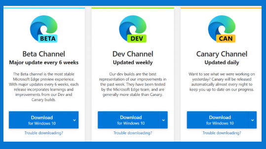](/deployedge/) 
        **[Microsoft Edge for Business](/deployedge/)** 
        Microsoft Edge is based on Chromium and offers enterprise support. Get step-by-step guidance on how to configure and deploy the multiple channels available. 
        [Download Microsoft Edge channel](https://www.microsoft.com/edge/business/download)
    :::column-end:::
    :::column:::
        [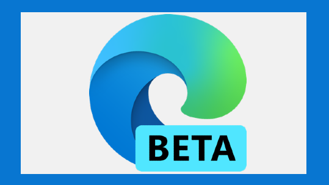](https://www.microsoftedgeinsider.com/whats-new) 
        **[Microsoft Edge Insider](https://www.microsoftedgeinsider.com/whats-new)** 
        We're building something new for Microsoft Edge every day. Learn about our recent progress and how you can get involved.
        [Download Microsoft Edge Beta version](https://www.microsoftedgeinsider.com/)
    :::column-end:::
    :::column:::
        [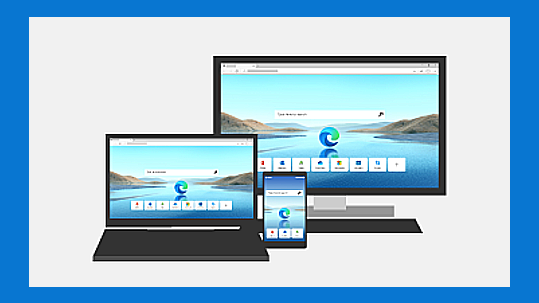](https://support.microsoft.com/microsoft-edge) 
        **[Microsoft Edge Support](https://support.microsoft.com/microsoft-edge)** 
        Get help with customizing your browser, adding extensions, tracking prevention, troubleshooting, and more.
        [Get help with Microsoft Edge](https://support.microsoft.com/microsoft-edge)
    :::column-end:::
:::row-end:::

## Debugging, Testing and Accessibility

:::row:::
    :::column:::
       [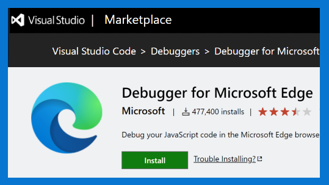](/microsoft-edge/visual-studio-code/microsoft-edge-devtools-extension) 
        **[Microsoft Edge Tools for VS Code](/microsoft-edge/visual-studio-code/microsoft-edge-devtools-extension)** 
        Without leaving Visual Studio Code, use Microsoft Edge DevTools to connect to an instance and view the runtime HTML structure, change layouts, styles (CSS), read console messages, and view network requests. 
        [Install Microsoft Edge Tools for VS Code](https://marketplace.visualstudio.com/items?itemName=ms-edgedevtools.vscode-edge-devtools)
    :::column-end:::
    :::column:::
       [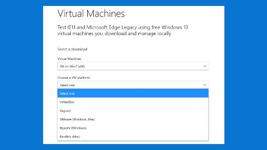](https://developer.microsoft.com/microsoft-edge/tools/vms/) 
        **[Virtual Machines for Testing](https://developer.microsoft.com/microsoft-edge/tools/vms/)** 
        Test IE11 and Microsoft Edge Legacy using free Windows virtual machines you download and manage locally. 
        [Download a Virtual Machine](https://developer.microsoft.com/microsoft-edge/tools/vms/)
    :::column-end:::
    :::column:::
       [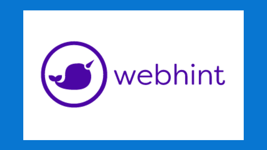](https://webhint.io/) 
        **[WebHint for Accessibility](https://webhint.io/)** 
        A customizable linting tool that helps you improve your site's accessibility, speed, cross-browser compatibility, and more by checking your code for best practices and common errors. 
        [Install VS Code extension](https://webhint.io/docs/user-guide/extensions/vscode-webhint/) 
        [Install browser extension](https://webhint.io/docs/user-guide/extensions/extension-browser/) 
        [Install CLI](https://webhint.io/docs/user-guide/)
    :::column-end:::
    :::column:::
       [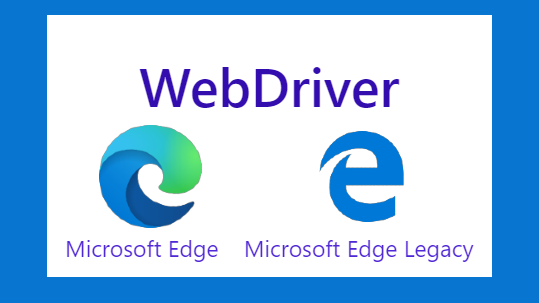](/microsoft-edge/webdriver-chromium/) 
        **[WebDriver](/microsoft-edge/webdriver-chromium/)** 
        Close the loop on your developer cycle by automating testing of your website in Microsoft Edge with Microsoft WebDriver. 
        [Install WebDriver](https://developer.microsoft.com/microsoft-edge/tools/webdriver/)
    :::column-end:::
:::row-end:::

## Visual Studio code editors

:::row:::
    :::column:::
        
        **[VS Code](https://code.visualstudio.com/docs)** 
        A lightweight source code editor with built-in support for JavaScript, TypeScript, Node.js, a rich ecosystem of extensions (C++, C#, Java, Python, PHP, Go) and runtimes (such as .NET and Unity). 
        [Install VS Code](https://code.visualstudio.com/download)
    :::column-end:::
    :::column:::
        
        **[Visual Studio (IDE)](/visualstudio/windows/)** 
        An integrated development environment that you can use to edit, debug, build code, and publish apps, including compilers, intellisense code completion, and many more features. 
        [Install Visual Studio](/visualstudio/install/install-visual-studio)
    :::column-end:::
    :::column:::
       [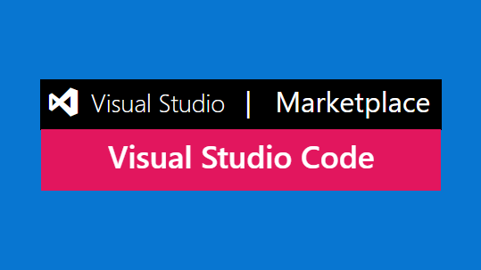](https://marketplace.visualstudio.com/vscode) 
        **[VS Code Marketplace for Extensions](https://marketplace.visualstudio.com/vscode)** 
        Explore the many different extensions available to customize your Visual Studio Code editor. 
        [Install Extensions](https://marketplace.visualstudio.com/vscode)
    :::column-end:::
    :::column:::
       [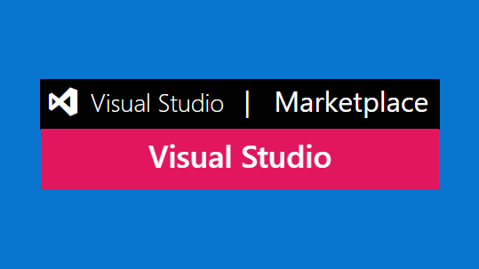](https://marketplace.visualstudio.com/vs/) 
        **[Visual Studio Marketplace for Extensions](https://marketplace.visualstudio.com/vs)** 
        Explore the many different extensions available to customize your Visual Studio integrated development environment. 
        [Install Extensions](https://marketplace.visualstudio.com/vs)
    :::column-end:::
:::row-end:::

## WSL, Terminal, Package Manager, Docker Desktop

:::row:::
    :::column:::
       [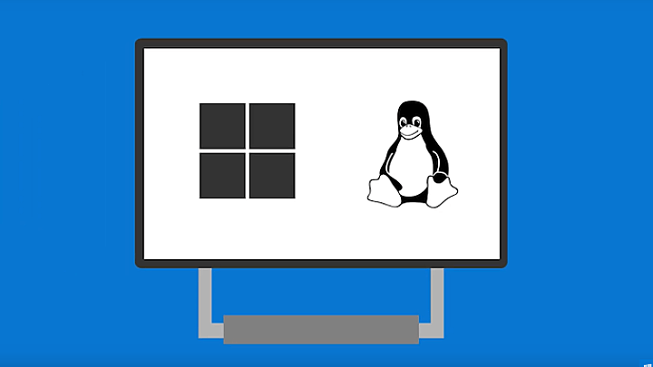](/windows/wsl/) 
        **[Windows Subsystem for Linux](/windows/wsl/)** 
        Use your favorite Linux distribution fully integrated with Windows (no more need for dual-boot). 
        [Install WSL](/windows/wsl/install)
    :::column-end:::
    :::column:::
        
        **[Windows Terminal](/windows/terminal/)** 
        Customize your terminal environment to work with multiple command line shells.
         
        [Install Terminal](https://www.microsoft.com/p/windows-terminal/9n0dx20hk701?rtc=1&activetab=pivot:overviewtab)
    :::column-end:::
    :::column:::
        
        **[Windows Package Manager](../package-manager/index.md)** 
        Use the winget.exe client with your command line to install apps on Windows or [submit your own packages to Windows Package Manager](../package-manager/package/index.md). 
        [Install Windows Package Manager winget client](../package-manager/winget/index.md)
    :::column-end:::
    :::column:::
       [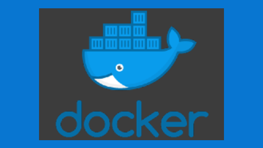](../dev-environment/docker/overview.md) 
        **[Docker Desktop for Windows](../dev-environment/docker/overview.md)** 
        Create remote development containers with support from Visual Studio, VS Code, .NET, Windows Subsystem for Linux, or a variety of Azure services. 
        [Install Docker Desktop for Windows](https://docs.docker.com/docker-for-windows/install/)
    :::column-end:::
:::row-end:::

## ASP.NET, Typescript, Xamarin

:::row:::
    :::column:::
       [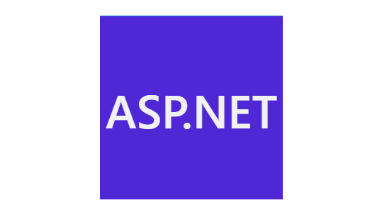](https://dotnet.microsoft.com/apps/aspnet) 
        **[ASP.NET](/aspnet/)** 
        A cross-platform framework for building web apps and services, Internet of Things (IoT) apps, or mobile backends with .NET and C#. Build rich interactive web UI with [Blazor](/aspnet/core/blazor/). Use your favorite dev tools on Windows, macOS, and Linux. Deploy to the cloud or on-premises. Run on .NET. 
        [Install ASP.NET](https://dotnet.microsoft.com/download)
    :::column-end:::
    :::column:::
       [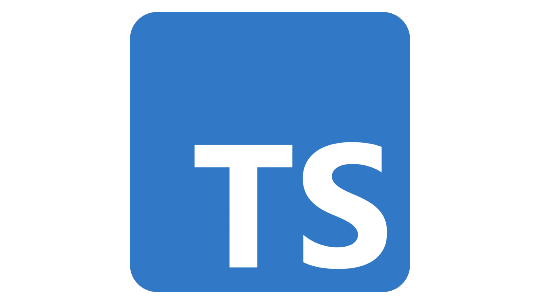](https://www.typescriptlang.org/) 
        **[Typescript](https://www.typescriptlang.org/)** 
        TypeScript extends JavaScript by adding types to the language. For example, JavaScript provides language primitives like string, number, and object, but it doesn’t check that you’ve consistently assigned these. TypeScript does. 
        [Try in your browser](https://www.typescriptlang.org/play/)
        [Install locally](https://www.typescriptlang.org/#installation)
    :::column-end:::
    :::column:::
       [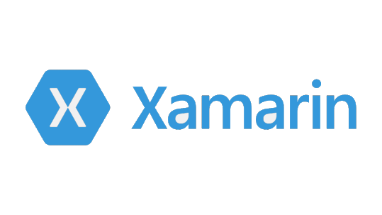](/xamarin/) 
        **[Xamarin](/xamarin/)** 
        Xamarin lets you build native apps for Android, iOS, and macOS using .NET code and platform-specific user interfaces. Xamarin.Forms allows you to build native apps, with shared UI code written in C# or XAML.
         
        [Install Xamarin](/xamarin/get-started/installation/)
    :::column-end:::
:::row-end:::

## Open Source contributions

:::row:::
    :::column:::
        
        **[Open Source at Microsoft](https://opensource.microsoft.com/)** 
        Thousands of Microsoft engineers use, contribute to and release open source every day. Popular projects include Visual Studio Code, TypeScript, .NET, and ChakraCore. 
        [Get involved](https://opensource.microsoft.com/collaborate)
    :::column-end:::
    :::column:::
       [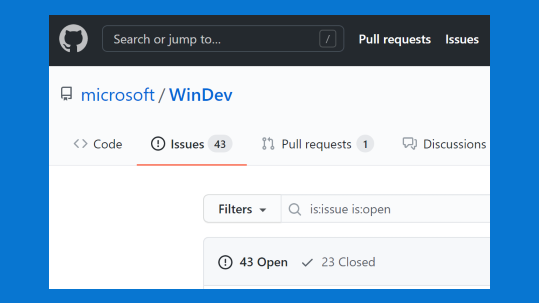](https://github.com/microsoft/WinDev) 
        **[Windows Developer Performance Issues repo](https://github.com/microsoft/WinDev)** 
        Whether you're developing FOR Windows or ON Windows, using it as your cross-platform dev machine, we want to hear about any performance issues causing you trouble.
         
        [File a Performance Issue](https://github.com/microsoft/WinDev/issues)
    :::column-end:::
    :::column:::
       [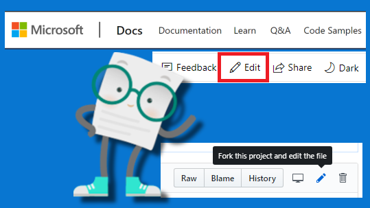](/contribute/) 
        **[Contribute to the docs](/contribute/)** 
        Most of the documentation sets at Microsoft are open source and hosted on GitHub. Contribute by filing issues or authoring pull requests.
         
        [Learn how](/contribute/)
    :::column-end:::
:::row-end:::

## Cloud development with Azure

:::row:::
    :::column:::
        
        **[Azure](/azure/guides/developer/azure-developer-guide)** 
        A complete cloud platform to host your existing apps and streamline new development. Azure services integrate everything you need to develop, test, deploy, and manage your apps. 
        [Set up an Azure account](https://azure.microsoft.com/free/)
    :::column-end:::
    :::column:::
       [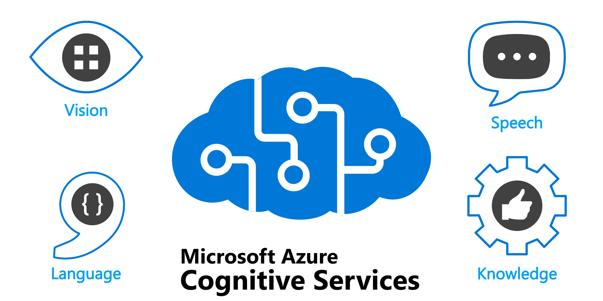](/azure/cognitive-services/what-are-cognitive-services) 
        **[Azure Cognitive Services](/azure/cognitive-services/what-are-cognitive-services)** 
        Cloud-based services with REST APIs and client library SDKs available to help you build cognitive intelligence into your applications. 
        [Try Cognitive Service](https://azure.microsoft.com/services/cognitive-services/)
    :::column-end:::
    :::column:::
        
        **[Learn Azure](/azure/guides/developer/azure-developer-guide)** 
        A complete cloud platform to host your existing apps and streamline new development. Azure services integrate everything you need to develop, test, deploy, and manage your apps. 
        [Set up an Azure account](https://azure.microsoft.com/free/)
    :::column-end:::
:::row-end:::

## Addtional resources

:::row:::
    :::column:::
       [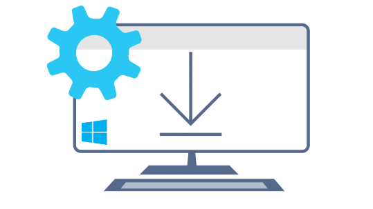](../dev-environment/index.md) 
        **[Set up your development environment on Windows](../dev-environment/index.md)** 
        Get help setting up your development environment to work with Python, NodeJS, C#, C, C++, build Android apps, build Windows desktop apps, build Docker containers, run PowerShell scripts, and more.
         
        [Get started](../dev-environment/index.md)
    :::column-end:::
    :::column:::
       [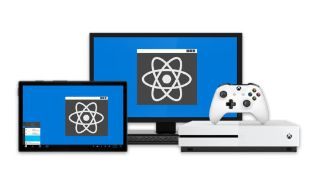](https://microsoft.github.io/react-native-windows/) 
        **[React Native for Windows + macOS](https://microsoft.github.io/react-native-windows/)** 
        Bring React Native support to the Windows SDK and macOS 10.13 SDK. Use JavaScript to build native Windows apps for all devices supported by Windows including PCs, tablets, 2-in-1s, Xbox, Mixed reality devices, etc., as well as the macOS desktop and laptop ecosystems.
         
        [Install React Native for Windows](https://microsoft.github.io/react-native-windows/docs/getting-started) 
        [Install React Native for macOS](https://microsoft.github.io/react-native-windows/docs/rnm-getting-started)
    :::column-end:::
    :::column:::
       [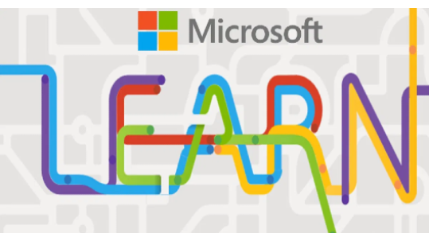](/training/browse/?terms=web) 
        **[Microsoft Learn courses related to web development](/training/browse/?terms=web)** 
        Microsoft Learn offers free online courses to learn a variety of new skills and discover Microsoft products and services with step-by-step guidance.
         
        [Start Learning](/training/browse/?terms=web)
    :::column-end:::
:::row-end:::

## Transitioning between Mac and Windows

Check out our [guide to transitioning between between a Mac and Windows](../dev-environment/mac-to-windows.md) (or Windows Subsystem for Linux) development environment.

- [Keyboard shortcuts](../dev-environment/mac-to-windows.md#keyboard-shortcuts)
- [Trackpad shortcuts](../dev-environment/mac-to-windows.md#trackpad-shortcuts)
- [Terminal and shell tools](../dev-environment/mac-to-windows.md#command-line-shells-and-terminals)
- [Apps and utilities](../dev-environment/mac-to-windows.md#apps-and-utilities)