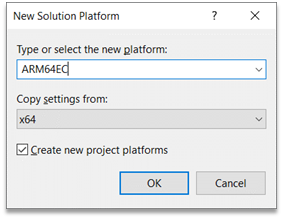

# Get started with Arm64EC

To get started building your app or project using [Arm64EC](./arm64ec.md), you will need to install some prerequisites and add an Arm64EC configuration.

## Prerequisites

- The latest [Windows 11 SDK build](https://developer.microsoft.com/windows/downloads/windows-sdk/). If using the Windows 11 SDK version 22000, the updated version on July 29, 2022 includes key fixes for building Arm64EC apps.
- Visual Studio 2022 version 17.3 or later.
- Arm64EC tools installed with the Visual Studio Installer.

In the Visual Studio Installer, you can add the Arm64EC tools by searching under **Individual components** and selecting the **MSVC v143 - VS 2022 C++ ARM64 build tools** checkbox.

  

> [!IMPORTANT]
> As of Visual Studio 2022 version 17.4, the Arm64EC tools are included when installing the Arm64 tools (**MSVC v143 - VS 2022 C++ ARM64 build tools**). You no longer need to select a separate option for Arm64EC tools.

Once you have installed the prerequisites and tools, you can target Arm64EC in your MSBuild and CMake projects.

## MSBuild Projects

1. With the tools and SDK installed, create a new C++ project or open an existing one.

    > [!NOTE]
    > If your project is using a pre-Windows 11 SDK or a version of MSVC older than VS 17.3, you'll need to retarget the solution to use the latest version of each.

2. To add the Arm64EC platform:
    - In the **Build** menu, select **Configuration Manager**.
    - In the **Active solution platform** box, select **`<New…>`** to create a new platform.
    - Select **ARM64EC**, Copy settings from **x64**, and check the **Create new project platforms** checkbox.

    

    You can choose to leave parts of the solution as x64 as needed. However, the more code built as Arm64EC, the more code that will run with native performance on Windows 11 on Arm. For any external dependencies, ensure that your project links against the x64 or Arm64EC versions of those projects.

3. With the new solution platform in place and selected, select **Build** in Visual Studio to start building Arm64EC binaries.  

By design, not all projects in an Arm64EC solution need to be targeting Arm64EC as they can target x64 instead. For any such projects that you want to remain as x64, ensure that you configure those projects in the configuration manager to target x64 under the ARM64EC solution build.

## CMake Projects

1. Open your "C++ CMake" project or create a new one.

2. Open up the CMakePresets.json file by going to the active configuration dropdown and selecting **Manage Configurations**.

3. Modify the architecture property under the windows configuration you want for Arm64EC.

    ```cpp
     "architecture": { 
        "value": "arm64ec", 
        "strategy": "external"
     }
     ```

    The default generator is Ninja. If using the Visual Studio generator, change the strategy field to **set**.

4. If using the Ninja generator, you'll also need to set some environment variables by adding the environment object to your CMakePresets configuration.

    ```cpp
     "environment": { 
        "CXXFLAGS": "/arm64EC",
        "CFLAGS": "/arm64EC" 
     }
    ```

5. Save the CMakePresets file and make sure the active configuration is set to the Arm64EC configuration. From the menu bar, select **project menu**, then select **Configure [Project Name]** in order to generate your CMake cache.

6. Build your CMake Project targeting Arm64EC like any other CMake project by navigating to the **Build Menu** and selecting **Build All**.

## Developer Command Prompt
  
If you are interested in using the Visual Studio Developer Command Prompt for compiling and linking source files for Arm64EC, you need to use the **Arm64** Developer Command Prompt, and then run your `cl` and `link` commands separately.  Use the `/arm64EC` switch for `cl` and `/MACHINE:ARM64EC` for `link` to build and link Arm64EC code.

```cpp
cl /arm64EC /c <args>

link /MACHINE:ARM64EC <args>
```

Learn more about how to [Use the Microsoft C++ toolset from the command line](/cpp/build/building-on-the-command-line).
