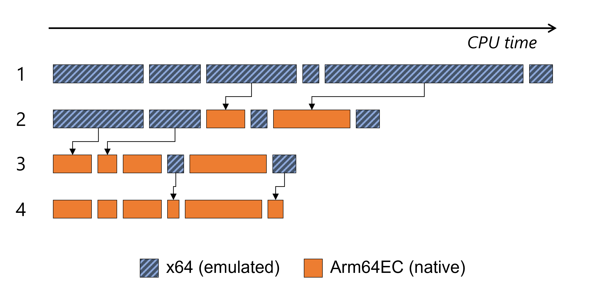
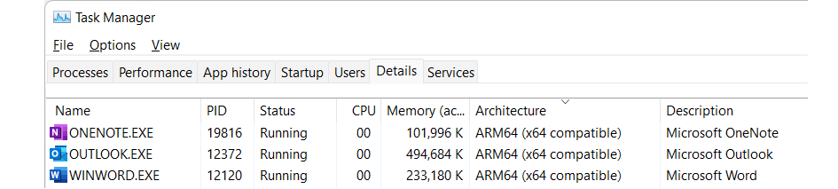

# Arm64EC - Build and port apps for native performance on Arm

Arm64EC ("Emulation Compatible") enables you to build new native apps or incrementally transition existing x64 apps to take advantage of the native speed and performance possible with Arm-powered devices, including better power consumption, battery life, and accelerated AI and ML workloads.

Arm64EC is a new application binary interface (ABI) for apps running on Arm devices with Windows 11. It's a Windows 11 feature that requires the use of the Windows 11 SDK and isn't available on Windows 10 on Arm.

## Interoperability

Code built as Arm64EC interoperates with x64 code running under emulation within the same process. The Arm64EC code in the process runs with native performance, while any x64 code runs by using emulation that comes built-in with Windows 11. Even if your app relies on existing dependencies or plugins that don't yet support Arm, you can start to rebuild parts of your app as Arm64EC to gain the benefits of native performance.

Arm64EC guarantees interoperability with x64 by following x64 software conventions, including calling convention, stack usage, data structure layout, and preprocessor definitions. However, Arm64EC code isn't compatible with code built as Arm64, which uses a different set of software conventions.

The Windows 11 on Arm operating system itself relies heavily on Arm64EC's interoperability to enable running x64 applications. Most operating system code loaded by an x64 app running on Windows 11 on Arm is compiled as Arm64EC, enabling native performance for that code without the application knowing. 

An x64 or Arm64EC process can load and call into both x64 and Arm64EC binaries, whereas an Arm64 process can only load Arm64 binaries.  Both architectures can load [Arm64X binaries](./arm64x-pe.md) as those contain code for both x64 and Arm64.

|Process architecture |x64 binary |Arm64EC binary |Arm64 binary |
|---|---|---|---|
|**x64/Arm64EC** |**Supported** |**Supported** |Not supported |
|**Arm64** |Not supported |Not supported |**Supported** |

Similarly, at build time, Arm64EC binaries can link in both x64 and Arm64EC libs, while Arm64 binaries can only link in Arm64 libs. 

|PE architecture |x64 lib |Arm64EC lib |Arm64 lib |
|---|---|---|---|
|**Arm64EC** |**Supported** |**Supported** |Not supported |
|**Arm64** |Not supported |Not supported |**Supported** |

For more detail about how the Arm64EC ABI enables interoperability, see [Understanding Arm64EC ABI and assembly code](./arm64ec-abi.md).

## Use Arm64EC to make an existing app faster on Windows 11 on Arm

Arm64EC enables you to **incrementally** transition the code in your existing app from emulated to native. At each step along the way, your application continues to run well without the need to be recompiled all at once.



The preceding image shows a simplified example of a fully emulated x64 workload taking some amount of time that is then incrementally improved using Arm64EC:

1. Starting as a fully emulated x64 workload
1. After recompiling the most CPU-intensive parts as Arm64EC
1. After continuing to recompile more x64 modules over time
1. Ending result of a fully native Arm64EC app

By recompiling the modules that take the most time or are the most CPU-intensive from x64 to Arm64EC, you get the most improvement for the least amount of effort at each step.

## App dependencies

When you use Arm64EC to rebuild an application, use Arm64EC versions of dependencies but you can also rely on x64 versions of dependencies. You can't use Arm64 versions of dependencies.

Any x64 code, including code from dependencies, in an Arm64EC process runs under emulation in your app. Prioritize the most CPU-intensive dependencies to transition from x64 to Arm64EC to improve your app's performance.

## Identifying Arm64EC binaries and apps

Apps running on Windows 11 on Arm interact with Arm64EC binaries as though they're x64 binaries. The app doesn't need to know to what extent the code in the binary is recompiled as Arm64EC.  

To identify a final PE image (EXE or DLL), use `link /dump /headers` in a developer command prompt:

```powershell
File Type: EXECUTABLE IMAGE
FILE HEADER VALUES
    8664 machine (x64) (ARM64X)
```

The combination of (x64) and (ARM64X) indicates that some portion of the binary is recompiled as Arm64EC, even though the binary still appears to be x64. A binary with a machine header that contains (ARM64) and (ARM64X) is an [Arm64X PE file](./arm64x-pe.md) that can be loaded into both x64 and Arm64 apps.

> [!NOTE]
> When inspecting **intermediate OBJ or LIB files** produced during the build (rather than a final EXE or DLL), `link /dump /headers` shows `A641 machine (ARM64EC)`. This value (`0xA641`) is an internal MSVC identifier used for Arm64EC object files and is not defined in `winnt.h`. It is not a valid final PE machine type — only the linked EXE or DLL carries the `8664 (x64) (ARM64X)` or `AA64 (ARM64) (ARM64X)` machine value.

You can also use Windows **Task Manager** to identify if an app is compiled as Arm64EC. In the **Details** tab of Task manager, the **Architecture** column shows **ARM64 (x64 compatible)** for applications whose main executable is partially or completely compiled as Arm64EC.



## Next steps

See [Get started with Arm64EC](./arm64ec-build.md) to learn how to build or update Win32 apps using Arm64EC.
