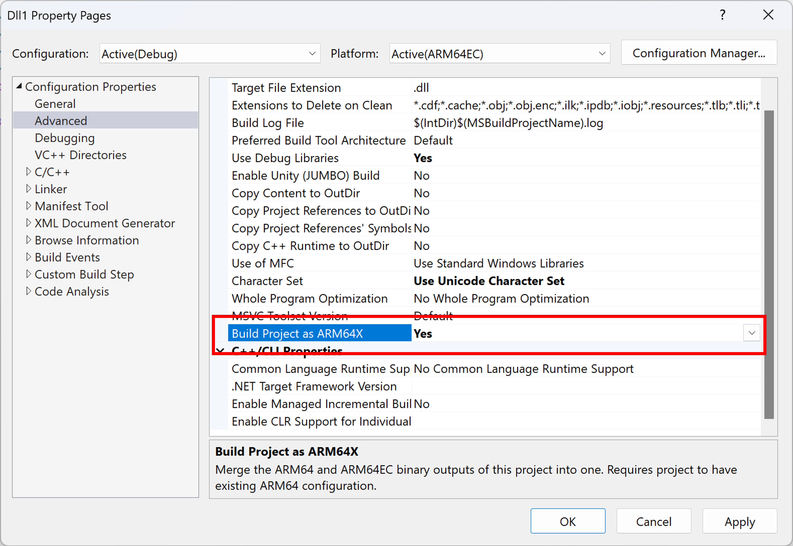

# Build Arm64X binaries

You can build Arm64X binaries, also known as [Arm64X PE files](./arm64x-pe.md), to support loading a single binary into both x64/Arm64EC and Arm64 processes.  

## Building an Arm64X binary from a Visual Studio project

To enable building Arm64X binaries, the property pages of Arm64EC configuration has a new "Build Project as ARM64X" property, known as `BuildAsX` in the project file.



When a user builds a project, Visual Studio would normally compile for Arm64EC and then link the outputs into an Arm64EC binary. When `BuildAsX` is set to `true`, Visual Studio will instead compile for both Arm64EC **and** Arm64. The Arm64EC link step is then used to link both together into a single Arm64X binary. The output directory for this Arm64X binary will be whatever the output directory is set to under the [Arm64EC configuration](./arm64ec-build.md).

For `BuildAsX` to work correctly, the user must have an existing Arm64 configuration, in addition to the Arm64EC configuration. The Arm64 and Arm64EC configurations must have the same C runtime and C++ standard library (e.g., both set [/MT](/cpp/c-runtime-library/crt-library-features)). To avoid build inefficiencies, such as building full Arm64 projects rather than just compilation, all direct and indirect references of the project should have `BuildAsX` set to true.

The build system assumes that the Arm64 and Arm64EC configurations have the same name. If the Arm64 and Arm64EC configurations have different names (such as `Debug|ARM64` and `MyDebug|ARM64EC`), you can manually edit the [vcxproj](/cpp/build/reference/vcxproj-file-structure) or `Directory.Build.props` file to add an `ARM64ConfigurationNameForX` property to the Arm64EC configuration that provides the name of the Arm64 configuration.

If the desired Arm64X binary is a combination of two separate projects, one as Arm64 and one as Arm64EC, you can manually edit the vxcproj of the Arm64EC project to add an `ARM64ProjectForX` property and specify the path to the Arm64 project. The two projects must be in the same solution.

## Building an Arm64X DLL with CMake

To build your CMake project binaries as Arm64X, you can use any version of [CMake](https://cmake.org/documentation/) that supports building as Arm64EC. The process involves initially building the project targeting Arm64 to generate the Arm64 linker inputs. Subsequently, the project should be built again targeting Arm64EC, this time combining the Arm64 and Arm64EC inputs to form Arm64X binaries. The steps below leverage the use of [CMakePresets.json](/cpp/build/cmake-presets-vs).

1. Ensure you have separate configuration presets targeting Arm64 and Arm64EC. For example:

	```JSON
	{
	  "version": 3,
	  "configurePresets": [
	    {
	      "name": "windows-base",
	      "hidden": true,
	      "binaryDir": "${sourceDir}/out/build/${presetName}",
	      "installDir": "${sourceDir}/out/install/${presetName}",
	      "cacheVariables": {
	        "CMAKE_C_COMPILER": "cl.exe",
	        "CMAKE_CXX_COMPILER": "cl.exe"
	      },
		  "generator": "Visual Studio 17 2022",
	    },
	    {
	      "name": "arm64-debug",
	      "displayName": "arm64 Debug",
	      "inherits": "windows-base",
	      "hidden": true,
		  "architecture": {
			 "value": "arm64",
			 "strategy": "set"
		  },
	      "cacheVariables": {
	        "CMAKE_BUILD_TYPE": "Debug"
	      }
	    },
	    {
	      "name": "arm64ec-debug",
	      "displayName": "arm64ec Debug",
	      "inherits": "windows-base",
	      "hidden": true,
	      "architecture": {
	        "value": "arm64ec",
	        "strategy": "set"
	      },
	      "cacheVariables": {
	        "CMAKE_BUILD_TYPE": "Debug"
	      }
	    }
	  ]
	}
	```

2. Add two new configurations that inherit from the Arm64 and Arm64EC presets you have above. Set `BUILD_AS_ARM64X` to `ARM64EC` in the config that inherits from Arm64EC and `BUILD_AS_ARM64X` to `ARM64` in the other. These variables will be used to signify that the builds from these two presets are a part of Arm64X.

	 ```JSON
	    {
	      "name": "arm64-debug-x",
	      "displayName": "arm64 Debug (arm64x)",
	      "inherits": "arm64-debug",
	      "cacheVariables": {
	        "BUILD_AS_ARM64X": "ARM64"
	    },
	 	{
	      "name": "arm64ec-debug-x",
	      "displayName": "arm64ec Debug (arm64x)",
	      "inherits": "arm64ec-debug",
	      "cacheVariables": {
	        "BUILD_AS_ARM64X": "ARM64EC"
	    }
	```

3. Add a new .cmake file to your CMake project called `arm64x.cmake`. Copy the snippet below into the new .cmake file.

	```JSON
	# directory where the link.rsp file generated during arm64 build will be stored
	set(arm64ReproDir "${CMAKE_CURRENT_SOURCE_DIR}/repros")
	
	# This function reads in the content of the rsp file outputted from arm64 build for a target. Then passes the arm64 libs, objs and def file to the linker using /machine:arm64x to combine them with the arm64ec counterparts and create an arm64x binary.
	
	function(set_arm64_dependencies n)
		set(REPRO_FILE "${arm64ReproDir}/${n}.rsp")
		file(STRINGS "${REPRO_FILE}" ARM64_OBJS REGEX obj\"$)
		file(STRINGS "${REPRO_FILE}" ARM64_DEF REGEX def\"$)
		file(STRINGS "${REPRO_FILE}" ARM64_LIBS REGEX lib\"$)
		string(REPLACE "\"" ";" ARM64_OBJS "${ARM64_OBJS}")
		string(REPLACE "\"" ";" ARM64_LIBS "${ARM64_LIBS}")
		string(REPLACE "\"" ";" ARM64_DEF "${ARM64_DEF}")
		string(REPLACE "/def:" "/defArm64Native:" ARM64_DEF "${ARM64_DEF}")
	
		target_sources(${n} PRIVATE ${ARM64_OBJS})
		target_link_options(${n} PRIVATE /machine:arm64x "${ARM64_DEF}" "${ARM64_LIBS}")
	endfunction()
	
	# During the arm64 build, create link.rsp files that containes the absolute path to the inputs passed to the linker (objs, def files, libs).
	
	if("${BUILD_AS_ARM64X}" STREQUAL "ARM64")
		add_custom_target(mkdirs ALL COMMAND cmd /c (if not exist \"${arm64ReproDir}/\" mkdir \"${arm64ReproDir}\" ))
		foreach (n ${ARM64X_TARGETS})
			add_dependencies(${n} mkdirs)
			# tell the linker to produce this special rsp file that has absolute paths to its inputs
			target_link_options(${n} PRIVATE "/LINKREPROFULLPATHRSP:${arm64ReproDir}/${n}.rsp")
		endforeach()
	
	# During the ARM64EC build, modify the link step appropriately to produce an arm64x binary
	elseif("${BUILD_AS_ARM64X}" STREQUAL "ARM64EC")
		foreach (n ${ARM64X_TARGETS})
			set_arm64_dependencies(${n})
		endforeach()
	endif()
	```

[/LINKREPROFULLPATHRSP](/cpp/build/reference/link-repro-full-path-rsp) is only supported if you are building using the MSVC linker from Visual Studio 17.11 or later.

If you need to use an older linker, copy the below snippet instead. This route uses an older flag [/LINK_REPRO](/cpp/build/reference/linkrepro). Using the /LINK_REPRO route will result in a slower overall build time due to the copying of files and has known issues when using Ninja generator.

```JSON
# directory where the link_repro directories for each arm64x target will be created during arm64 build.
set(arm64ReproDir "${CMAKE_CURRENT_SOURCE_DIR}/repros")

# This function globs the linker input files that was copied into a repro_directory for each target during arm64 build. Then it passes the arm64 libs, objs and def file to the linker using /machine:arm64x to combine them with the arm64ec counterparts and create an arm64x binary.

function(set_arm64_dependencies n)
	set(ARM64_LIBS)
	set(ARM64_OBJS)
	set(ARM64_DEF)
	set(REPRO_PATH "${arm64ReproDir}/${n}")
	if(NOT EXISTS "${REPRO_PATH}")
		set(REPRO_PATH "${arm64ReproDir}/${n}_temp")
	endif()
	file(GLOB ARM64_OBJS "${REPRO_PATH}/*.obj")
	file(GLOB ARM64_DEF "${REPRO_PATH}/*.def")
	file(GLOB ARM64_LIBS "${REPRO_PATH}/*.LIB")

	if(NOT "${ARM64_DEF}" STREQUAL "")
		set(ARM64_DEF "/defArm64Native:${ARM64_DEF}")
	endif()
	target_sources(${n} PRIVATE ${ARM64_OBJS})
	target_link_options(${n} PRIVATE /machine:arm64x "${ARM64_DEF}" "${ARM64_LIBS}")
endfunction()

# During the arm64 build, pass the /link_repro flag to linker so it knows to copy into a directory, all the file inputs needed by the linker for arm64 build (objs, def files, libs).
# extra logic added to deal with rebuilds and avoiding overwriting directories.
if("${BUILD_AS_ARM64X}" STREQUAL "ARM64")
	foreach (n ${ARM64X_TARGETS})
		add_custom_target(mkdirs_${n} ALL COMMAND cmd /c (if exist \"${arm64ReproDir}/${n}_temp/\" rmdir /s /q \"${arm64ReproDir}/${n}_temp\") && mkdir \"${arm64ReproDir}/${n}_temp\" )
		add_dependencies(${n} mkdirs_${n})
		target_link_options(${n} PRIVATE "/LINKREPRO:${arm64ReproDir}/${n}_temp")
		add_custom_target(${n}_checkRepro ALL COMMAND cmd /c if exist \"${n}_temp/*.obj\" if exist \"${n}\" rmdir /s /q \"${n}\" 2>nul && if not exist \"${n}\" ren \"${n}_temp\" \"${n}\" WORKING_DIRECTORY ${arm64ReproDir})
		add_dependencies(${n}_checkRepro ${n})
	endforeach()

# During the ARM64EC build, modify the link step appropriately to produce an arm64x binary
elseif("${BUILD_AS_ARM64X}" STREQUAL "ARM64EC")
	foreach (n ${ARM64X_TARGETS})
		set_arm64_dependencies(${n})
	endforeach()
endif()
```

4. In the bottom of the top level `CMakeLists.txt` file in your project, add the snippet below. Be sure to substitute the contents of the angle brackets with actual values. This will consume the `arm64x.cmake` file you just created above.

	```JSON
	if(DEFINED BUILD_AS_ARM64X)
		set(ARM64X_TARGETS <Targets you want to Build as ARM64X>)
		include("<directory location of the arm64x.cmake file>/arm64x.cmake")
	endif()
	```

5. Build your CMake project using the Arm64X enabled Arm64 preset (arm64-debug-x).

6. Build your CMake project using the Arm64X enabled Arm64EC preset (arm64ec-debug-x). The final dll(s) contained in output directory for this build will be Arm64X binaries.

## Building an Arm64X pure forwarder DLL

An **Arm64X pure forwarder DLL** is a small Arm64X DLL that forwards APIs to separate DLLs depending on their type:

- Arm64 APIs are forwarded to an Arm64 DLL.

- x64 APIs are forwarded to an x64 or Arm64EC DLL.

An Arm64X pure forwarder enables the advantages of using an Arm64X binary even if there are challenges with building a merged Arm64X binary containing all of the Arm64EC and Arm64 code. Learn more about Arm64X pure forwarder DLLs in the [Arm64X PE files](./arm64x-pe.md) overview page.

You can build an Arm64X pure forwarder from the Arm64 developer command prompt following the steps below. The resulting Arm64X pure forwarder will route x64 calls to `foo_x64.DLL` and Arm64 calls to `foo_arm64.DLL`.

1. Create empty `OBJ` files that will later be used by the linker to create the pure forwarder. These are empty as the pure forwarder has no code in it. To do this, create an empty file. For the example below, we named the file **empty.cpp**. Empty `OBJ` files are then created using `cl`, with one for Arm64 (`empty_arm64.obj`) and one for Arm64EC (`empty_x64.obj`):

    ```cpp
    cl /c /Foempty_arm64.obj empty.cpp
    cl /c /arm64EC /Foempty_x64.obj empty.cpp
    ```
    
   > If the error message "cl : Command line warning D9002 : ignoring unknown option '-arm64EC'" appears, the incorrect compiler is being used. To resolve that please switch to [the Arm64 Developer Command Prompt](https://devblogs.microsoft.com/cppblog/arm64ec-support-in-visual-studio/#developer-command-prompt).

2. Create `DEF` files for both x64 and Arm64. These files enumerate all of the API exports of the DLL and points the loader to the name of the DLL that can fulfill those API calls.

    `foo_x64.def`:

    ```cpp
    EXPORTS
        MyAPI1  =  foo_x64.MyAPI1
        MyAPI2  =  foo_x64.MyAPI2
    ```

    `foo_arm64.def`:

    ```cpp
    EXPORTS
        MyAPI1  =  foo_arm64.MyAPI1
        MyAPI2  =  foo_arm64.MyAPI2
    ```

3. You can then use `link` to create `LIB` import files for both x64 and Arm64:

    ```cpp
    link /lib /machine:x64 /def:foo_x64.def /out:foo_x64.lib
    link /lib /machine:arm64 /def:foo_arm64.def /out:foo_arm64.lib
    ```

4. Link the empty `OBJ` and import `LIB` files using the flag `/MACHINE:ARM64X` to produce the Arm6X pure forwarder DLL:

    ```cpp
    link /dll /noentry /machine:arm64x /defArm64Native:foo_arm64.def /def:foo_x64.def empty_arm64.obj empty_x64.obj /out:foo.dll foo_arm64.lib foo_x64.lib
    ```

The resulting `foo.dll` can be loaded into either an Arm64 or an x64/Arm64EC process. When an Arm64 process loads `foo.dll`, the operating system will immediately load `foo_arm64.dll` in its place and any API calls will be handled by `foo_arm64.dll`.
