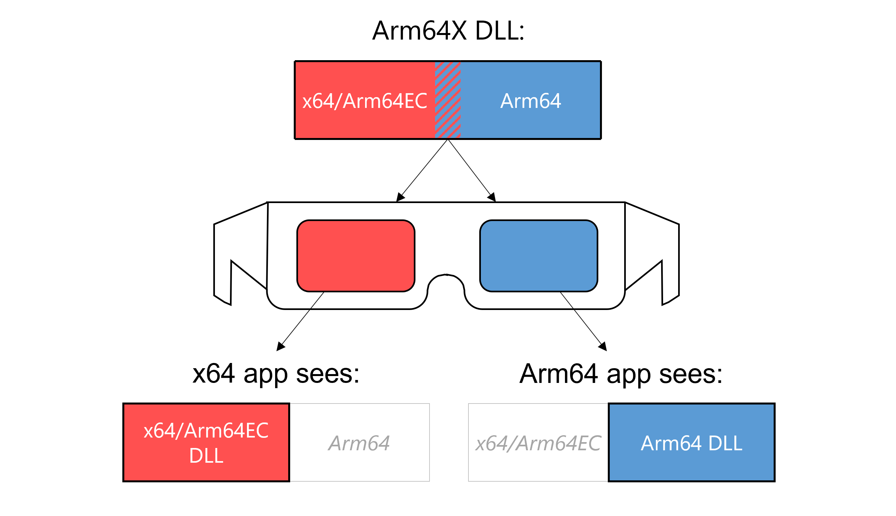
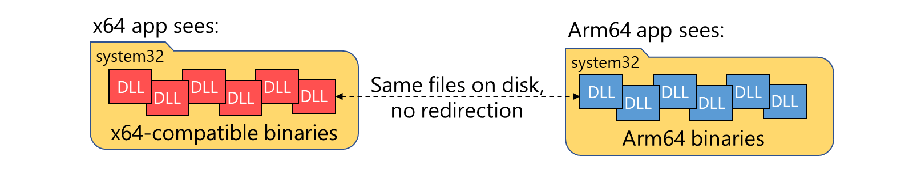
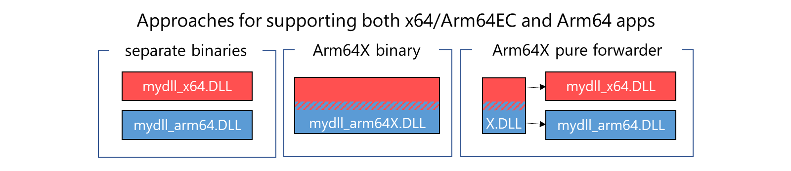

# Arm64X PE files

Arm64X is a new type of binary that can contain both the classic Arm64 code and [Arm64EC code](./arm64ec.md) together. This makes Arm64x compatible for both the classic Arm64 and Arm64EC processes on a Windows on Arm device and a particularly good fit for middleware or plugins that may be used by both ABIs.

Introduced in the Windows 11 SDK, the Arm64X binary is a type of Portable Executable (PE) file that works with both Windows 11 on Arm and Windows 10 on Arm. To build Arm64X binaries, see [Build Arm64X Binaries](./arm64x-build.md).

## How do Arm64X binaries work?

Fundamentally, an Arm64X binary contains all of the content that would be in separate x64/Arm64EC and Arm64 binaries, but merged into one more efficient file on disk. The built Arm64X binary has two sets of code, entry points, etc., while eliminating redundant parts to save space on disk.

When an Arm64X binary is loaded by an application, the operating system applies transformations to expose the correct sections depending on the architecture of the process it is being loaded into. You can think of an Arm64X binary like old 3D images, with both a red and blue image that can be viewed through the red or blue lenses on a pair of 3D glasses. An x64 app will see the DLL as though it is an x64 DLL, while an Arm64 app will see the same DLL as an Arm64 DLL.

The transparent operating system transformations allow both x64 and Arm64 applications to load the same Arm64X binary without ever knowing that it also contains code corresponding to the other architecture. For that reason, Arm64X binaries are nicknamed 'chameleon' as they take on the 'color' of their surroundings.

By default, Arm64X binaries appear to be Arm64 binaries. This allows a system running Windows 10 on Arm, which does not know the Arm64X format or how to apply transformations, to load the Arm64X binary into an Arm64 process successfully.

## How does the operating system use Arm64X binaries?

Windows 11 on Arm introduced the ability to run x64 applications on Arm64. However, unlike [x86 emulation](./apps-on-arm-x86-emulation.md), which includes a `SysWoW64` folder, there is no separate folder of pure x64 operating system binaries. With Windows 11 on Arm, both x64 applications and Arm64 applications are able to load binaries and call APIs using the binaries in `System32`. This flexibility is possible because any binaries in `System32` that an app may need to load have been recompiled as Arm64X binaries.

Both x64 and Arm64 applications can load and interact with the binaries in `System32`, without need for a separate copy of all system binaries like `SysWoW64` for x86.

## Arm64X for use with middleware or plugins

The core function of an Arm64X binary is to enable one file on disk to support both x64/Arm64EC and Arm64 processes. Most app developers will be focused on building their application as either Arm64EC or Arm64, not both, in which case Arm64X likely won't be necessary.

Arm64X should be considered by developers of **middleware** or **plugins**, however, because such code has the potential to be loaded into x64 or Arm64 processes.

You can support both x64 and Arm64 processes without using Arm64X, but you may find that it is easier to allow the operating system to handle loading the correct architecture of binary into a given 64-bit process.

Three conceptual ways to support both architectures on Windows 11 on Arm include:

- **Separate binaries**: Since standard practices today use separate binaries when supporting multiple architectures, you may find that building and shipping separate x64 and Arm64 binaries works better for your solution. You can use your existing mechanisms to ensure that the correct binary is loaded into the associated architecture process.

- **Arm64X binary**: You can build an Arm64X binary that contains all of the x64/Arm64EC and Arm64 code in one binary.  

- **Arm64X pure forwarder**: If you need flexibility of Arm64X but want to avoid putting all of your app code into an Arm64X binary, you can choose to use the pure forwarder approach, where a small Arm64X binary with no code is used to redirect the loader to the correct architecture of DLL.

## Example situations that would require Arm64X

There are some situations that will require using an Arm64X binary to support both x64 and Arm64 apps.  Those include:

- A 64-bit COM server that may be called by both x64 or Arm64 apps
- A plugin that may be loaded into either an x64 or Arm64 app
- A single binary that gets injected into an x64 or Arm64 process

In each of these cases, you can use an Arm64X binary or an Arm64X pure forwarder to enable one binary to support both architectures.

For details on building Arm64X binaries, see [Build Arm64X binaries](./arm64x-build.md).
